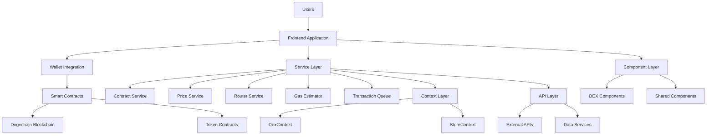
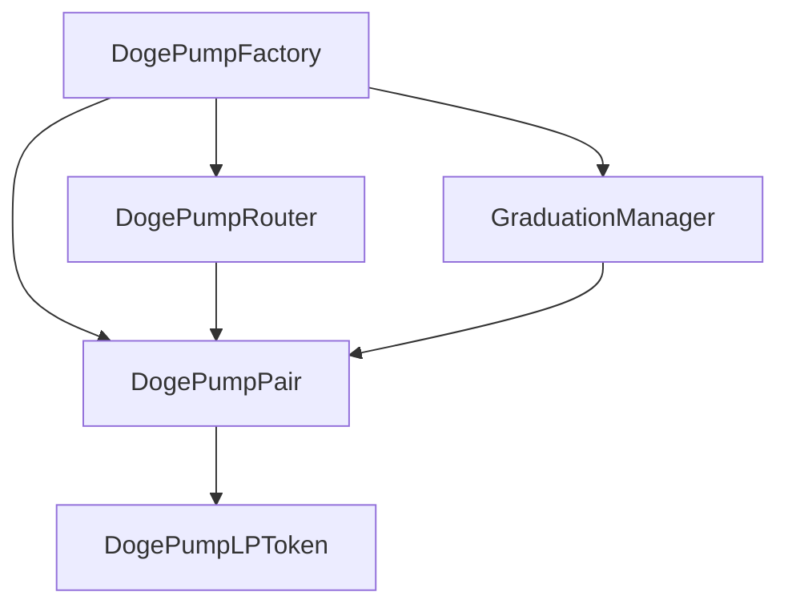
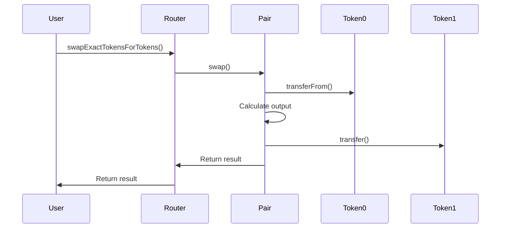
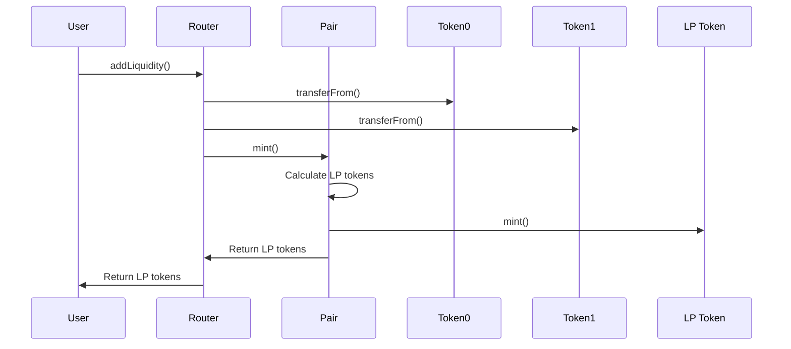
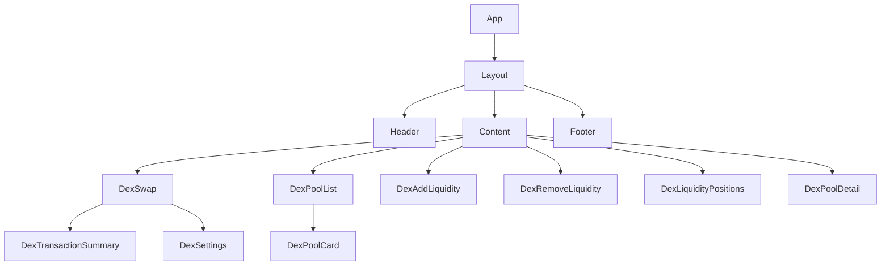
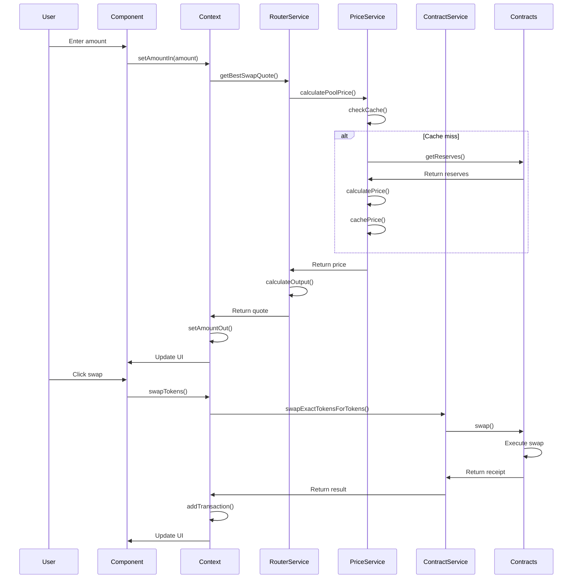
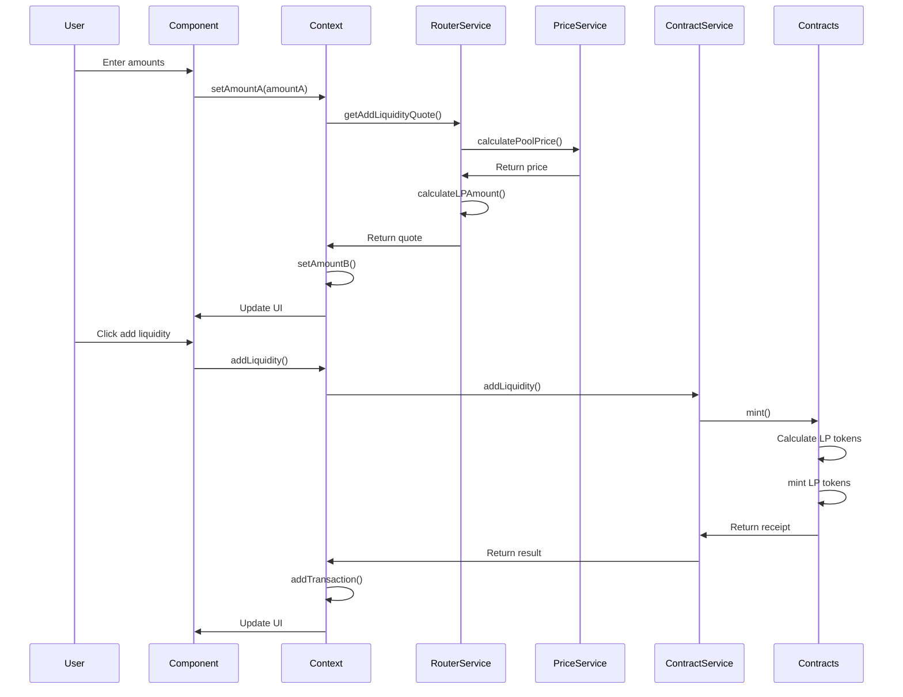
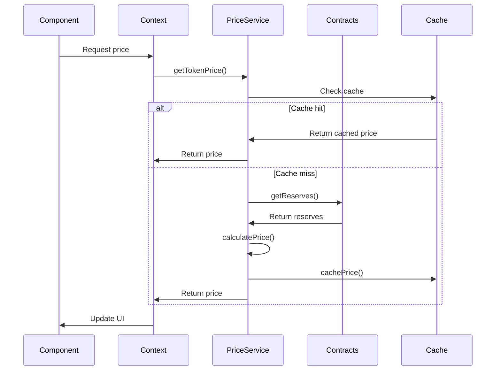
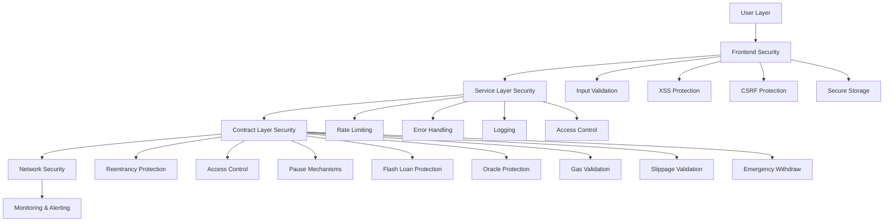

# DEX Architecture

Complete architecture documentation for Dogepump DEX.

## Table of Contents

- [System Architecture](#system-architecture)
- [Smart Contract Architecture](#smart-contract-architecture)
- [Frontend Architecture](#frontend-architecture)
- [Data Flow](#data-flow)
- [Security Architecture](#security-architecture)
- [Performance Architecture](#performance-architecture)
- [Scalability Considerations](#scalability-considerations)

---

## System Architecture

### Overview

The Dogepump DEX is a decentralized exchange built on the Dogechain blockchain. It follows an Automated Market Maker (AMM) model using the constant product formula (x * y = k).

### High-Level Architecture



### Architecture Layers

#### 1. Presentation Layer

The presentation layer handles all user interactions:

- **Components**: React components for UI
- **State Management**: React Context for global state
- **Routing**: React Router for navigation
- **Styling**: Tailwind CSS for styling

#### 2. Service Layer

The service layer handles business logic:

- **ContractService**: Smart contract interactions
- **PriceService**: Price calculations and caching
- **RouterService**: Swap routing and quotes
- **GasEstimator**: Gas estimation and formatting
- **TransactionQueue**: Transaction lifecycle management

#### 3. Data Layer

The data layer manages data access:

- **Blockchain**: Dogechain blockchain
- **Contracts**: Smart contracts
- **Cache**: Price and data caching
- **Storage**: LocalStorage for persistence

#### 4. Integration Layer

The integration layer handles external integrations:

- **Wallet**: Web3 wallet integration
- **RPC**: RPC provider connections
- **API**: External API calls
- **Oracle**: Price oracle integration

### Technology Stack

#### Frontend

- **Framework**: React 18
- **Language**: TypeScript 5
- **Build Tool**: Vite
- **Styling**: Tailwind CSS
- **Routing**: React Router 6
- **State Management**: React Context
- **Blockchain**: Ethers.js 6

#### Smart Contracts

- **Language**: Solidity 0.8.x
- **Framework**: Hardhat
- **Libraries**: OpenZeppelin
- **Testing**: Hardhat Test
- **Deployment**: Hardhat Deploy

#### Infrastructure

- **Blockchain**: Dogechain
- **RPC**: Dogechain RPC
- **Explorer**: Dogechain Explorer
- **API**: Custom API (optional)

---

## Smart Contract Architecture

### Contract Overview

The DEX smart contracts follow a modular architecture:



### Contract Descriptions

#### DogePumpFactory

**Purpose**: Manages pool creation and registry

**Responsibilities**:
- Create new trading pairs
- Track all pairs
- Manage fee recipient
- Manage protocol settings

**Key Functions**:
- `createPair()`: Create new trading pair
- `getPair()`: Get pair address
- `allPairs()`: Get all pairs
- `setFeeTo()`: Set fee recipient
- `setFeeToSetter()`: Set fee setter

**State Variables**:
- `feeTo`: Fee recipient address
- `feeToSetter`: Fee setter address
- `getPair`: Mapping of token pairs to addresses
- `allPairs`: Array of all pair addresses

#### DogePumpPair

**Purpose**: Manages individual trading pairs

**Responsibilities**:
- Manage pool reserves
- Execute swaps
- Mint LP tokens
- Burn LP tokens
- Calculate prices
- Track TWAP oracle

**Key Functions**:
- `swap()`: Execute swap
- `mint()`: Mint LP tokens
- `burn()`: Burn LP tokens
- `skim()`: Skim excess tokens
- `sync()`: Sync reserves

**State Variables**:
- `reserve0`: Token0 reserve
- `reserve1`: Token1 reserve
- `token0`: Token0 address
- `token1`: Token1 address
- `price0CumulativeLast`: TWAP price0
- `price1CumulativeLast`: TWAP price1

#### DogePumpRouter

**Purpose**: Facilitates complex swaps and liquidity operations

**Responsibilities**:
- Route swaps through optimal paths
- Add liquidity to pools
- Remove liquidity from pools
- Calculate optimal amounts
- Handle multi-hop swaps

**Key Functions**:
- `swapExactTokensForTokens()`: Swap exact input
- `swapTokensForExactTokens()`: Swap exact output
- `addLiquidity()`: Add liquidity
- `removeLiquidity()`: Remove liquidity
- `getAmountsOut()`: Calculate output amounts
- `getAmountsIn()`: Calculate input amounts

**State Variables**:
- `factory`: Factory contract address
- `WDOGE`: Wrapped DOGE address

#### DogePumpLPToken

**Purpose**: LP token for liquidity providers

**Responsibilities**:
- Track LP token ownership
- Allow transfers
- Approve spending
- Mint new tokens
- Burn existing tokens

**Key Functions**:
- `transfer()`: Transfer tokens
- `approve()`: Approve spending
- `transferFrom()`: Transfer from approved spender
- `mint()`: Mint new tokens
- `burn()`: Burn existing tokens

**State Variables**:
- `balances`: Token balances
- `allowances`: Spending allowances
- `totalSupply`: Total token supply

#### GraduationManager

**Purpose**: Manage token graduation mechanism

**Responsibilities**:
- Track token graduation status
- Calculate graduation criteria
- Distribute graduation rewards
- Manage graduation events

**Key Functions**:
- `checkGraduation()`: Check if token should graduate
- `graduateToken()`: Graduate token
- `distributeRewards()`: Distribute rewards
- `getGraduationStatus()`: Get graduation status

**State Variables**:
- `graduationCriteria`: Graduation criteria
- `graduatedTokens`: List of graduated tokens
- `rewardsPool`: Rewards pool

### Contract Interactions

#### Swap Flow



#### Add Liquidity Flow



### Gas Optimization

#### Optimizations Implemented

1. **Packing State Variables**
   - Pack small types together
   - Use uint256 for most variables
   - Optimize storage layout

2. **Short Circuiting**
   - Check conditions early
   - Return early when possible
   - Avoid unnecessary computations

3. **Caching**
   - Cache storage reads
   - Use memory variables
   - Batch operations

4. **Minimal External Calls**
   - Reduce external contract calls
   - Batch calls when possible
   - Use view functions for reads

---

## Frontend Architecture

### Component Architecture

The frontend follows a component-based architecture:



### Component Hierarchy

```
App
├── Layout
│   ├── Header
│   │   ├── NetworkStatus
│   │   ├── WalletButton
│   │   └── Navigation
│   ├── Content
│   │   ├── DexSwap
│   │   │   ├── TokenSelector
│   │   │   ├── AmountInput
│   │   │   ├── SwapButton
│   │   │   ├── DexTransactionSummary
│   │   │   └── DexSettings
│   │   ├── DexPoolList
│   │   │   ├── PoolFilters
│   │   │   ├── PoolSort
│   │   │   └── DexPoolCard
│   │   ├── DexAddLiquidity
│   │   │   ├── TokenSelector
│   │   │   ├── AmountInput
│   │   │   └── AddLiquidityButton
│   │   ├── DexRemoveLiquidity
│   │   │   ├── PositionSelector
│   │   │   ├── AmountInput
│   │   │   └── RemoveLiquidityButton
│   │   ├── DexLiquidityPositions
│   │   │   ├── PositionCard
│   │   │   └── PositionActions
│   │   └── DexPoolDetail
│   │       ├── PoolInfo
│   │       ├── PoolChart
│   │       └── PoolActions
│   └── Footer
└── Modals
    ├── AuthModal
    ├── SettingsModal
    └── TransactionModal
```

### State Management

#### DexContext

The DexContext manages all DEX-related state:

```typescript
interface DexContextType {
  // Pools
  pools: Pool[];
  selectedPool: Pool | null;
  setSelectedPool: (pool: Pool | null) => void;
  
  // Tokens
  tokens: Token[];
  selectedTokenA: Token | null;
  selectedTokenB: Token | null;
  setSelectedTokenA: (token: Token | null) => void;
  setSelectedTokenB: (token: Token | null) => void;
  
  // Swap
  amountIn: string;
  amountOut: string;
  setAmountIn: (amount: string) => void;
  setAmountOut: (amount: string) => void;
  slippage: number;
  setSlippage: (slippage: number) => void;
  
  // Liquidity
  liquidityPositions: LiquidityPosition[];
  selectedPosition: LiquidityPosition | null;
  setSelectedPosition: (position: LiquidityPosition | null) => void;
  
  // Transactions
  transactions: Transaction[];
  addTransaction: (tx: Transaction) => void;
  updateTransaction: (id: string, updates: Partial<Transaction>) => void;
  
  // Settings
  settings: DexSettings;
  updateSettings: (settings: Partial<DexSettings>) => void;
  
  // Actions
  swapTokens: (params: SwapParams) => Promise<SwapResult>;
  addLiquidity: (params: AddLiquidityParams) => Promise<LiquidityResult>;
  removeLiquidity: (params: RemoveLiquidityParams) => Promise<LiquidityResult>;
}
```

#### Context Providers

```typescript
// Provider hierarchy
<StoreProvider>
  <DexProvider>
    <App />
  </DexProvider>
</StoreProvider>
```

### Service Layer

#### ContractService

Handles all smart contract interactions:

```typescript
class ContractService {
  private provider: ethers.Provider;
  private signer: ethers.Signer | null;
  private factory: ethers.Contract | null;
  private router: ethers.Contract | null;
  
  // Token operations
  getTokenInfo(address: string): Promise<Token>;
  getTokenBalance(tokenAddress: string, accountAddress: string): Promise<bigint>;
  approveToken(tokenAddress: string, spenderAddress: string, amount: string): Promise<TransactionReceipt>;
  
  // Pool operations
  createPool(tokenA: string, tokenB: string): Promise<string>;
  getPairAddress(tokenA: string, tokenB: string): Promise<string>;
  getPoolInfo(pairAddress: string): Promise<Pool>;
  
  // Swap operations
  swapExactTokensForTokens(params: SwapParams): Promise<TransactionReceipt>;
  swapTokensForExactTokens(params: SwapParams): Promise<TransactionReceipt>;
  
  // Liquidity operations
  addLiquidity(params: AddLiquidityParams): Promise<TransactionReceipt>;
  removeLiquidity(params: RemoveLiquidityParams): Promise<TransactionReceipt>;
}
```

#### PriceService

Handles price calculations and caching:

```typescript
class PriceService {
  private provider: ethers.Provider;
  private priceCache: Map<string, CachedPrice>;
  
  // Price calculations
  calculatePoolPrice(reserve0: string, reserve1: string, decimals0: number, decimals1: number): number;
  calculateTVL(pool: Pool, tokenPrices: Map<string, number>): number;
  calculateAPY(pool: Pool, tokenPrices: Map<string, number>): number;
  calculatePriceImpact(params: PriceImpactParams): number;
  
  // TWAP oracle
  getTWAPPrice(pool: Pool, token: Token): Promise<number>;
  
  // Caching
  cacheTokenPrice(tokenAddress: string, price: number, ttl?: number): void;
  getCachedTokenPrice(tokenAddress: string): number | null;
  clearTokenPriceCache(tokenAddress: string): void;
  clearAllPriceCache(): void;
}
```

#### RouterService

Handles swap routing and quotes:

```typescript
class RouterService {
  private contractService: ContractService;
  private priceService: PriceService;
  private routerAddress: string;
  private dcTokenAddress: string;
  
  // Swap quotes
  getDirectSwapQuote(tokenIn: Token, tokenOut: Token, amountIn: string, pool: Pool): Promise<SwapQuote>;
  getMultiHopSwapQuote(tokenIn: Token, tokenOut: Token, amountIn: string, poolIn: Pool, poolOut: Pool): Promise<SwapQuote>;
  getBestSwapQuote(tokenIn: Token, tokenOut: Token, amountIn: string, pools: Pool[]): Promise<SwapQuote>;
  
  // Liquidity quotes
  getAddLiquidityQuote(tokenA: Token, tokenB: Token, amountA: string, pool: Pool): Promise<LiquidityQuote>;
  getRemoveLiquidityQuote(lpTokenAmount: string, pool: Pool): Promise<LiquidityQuote>;
  
  // Validation
  validateSwapParams(tokenIn: Token, tokenOut: Token, amountIn: string, slippage: number, deadline: number): ValidationResult;
}
```

#### GasEstimator

Handles gas estimation:

```typescript
class GasEstimator {
  private provider: ethers.Provider;
  private gasPriceCache: CachedGasPrice | null;
  
  // Gas prices
  getGasPrice(): Promise<string>;
  getGasPrices(): Promise<GasPrices>;
  
  // Gas estimation
  estimateSwapGas(multiHop: boolean): Promise<GasEstimate>;
  estimateAddLiquidityGas(): Promise<GasEstimate>;
  estimateRemoveLiquidityGas(): Promise<GasEstimate>;
  
  // Formatting
  formatGasCost(gasCost: string): string;
  formatGasCostUSD(gasCostUSD: number): string;
}
```

#### TransactionQueue

Manages transaction lifecycle:

```typescript
class TransactionQueue {
  private provider: ethers.Provider;
  private transactions: Map<string, Transaction>;
  private storageKey: string;
  
  // Transaction management
  addTransaction(params: TransactionParams): Transaction;
  updateTransactionStatus(id: string, status: TransactionStatus, data?: TransactionData): Transaction | null;
  getTransaction(id: string): Transaction | null;
  getPendingTransactions(): Transaction[];
  getAllTransactions(): Transaction[];
  
  // Transaction actions
  speedUpTransaction(id: string, gasPrice: string): Promise<void>;
  cancelTransaction(id: string): Promise<void>;
  
  // Statistics
  getStatistics(): TransactionStatistics;
  
  // Persistence
  saveToStorage(): void;
  loadFromStorage(): void;
  clearStorage(): void;
}
```

### Routing

The application uses React Router for navigation:

```typescript
const router = createBrowserRouter([
  {
    path: '/',
    element: <Layout />,
    children: [
      {
        index: true,
        element: <Home />
      },
      {
        path: 'swap',
        element: <DexSwap />
      },
      {
        path: 'pools',
        element: <DexPoolList />
      },
      {
        path: 'pools/:address',
        element: <DexPoolDetail />
      },
      {
        path: 'liquidity',
        element: <DexLiquidityPositions />
      },
      {
        path: 'add-liquidity',
        element: <DexAddLiquidity />
      },
      {
        path: 'remove-liquidity',
        element: <DexRemoveLiquidity />
      }
    ]
  }
]);
```

---

## Data Flow

### Swap Data Flow



### Liquidity Data Flow



### Price Update Flow



---

## Security Architecture

### Security Layers



### Smart Contract Security

#### Reentrancy Protection

All state-changing functions use `nonReentrant` modifier:

```solidity
function swap(uint amount0Out, uint amount1Out, address to, bytes calldata data) 
    external 
    nonReentrant 
{
    // Swap logic
}
```

#### Access Control

Role-based access control:

```solidity
bytes32 public constant PAUSER_ROLE = keccak256("PAUSER_ROLE");
bytes32 public constant ADMIN_ROLE = keccak256("ADMIN_ROLE");

function pause() external onlyRole(PAUSER_ROLE) {
    _pause();
}
```

#### Pause Mechanisms

Emergency pause functionality:

```solidity
function swap(uint amount0Out, uint amount1Out, address to, bytes calldata data) 
    external 
    whenNotPaused 
{
    // Swap logic
}
```

#### Flash Loan Protection

Balance checks after swaps:

```solidity
uint balance0Before = IERC20(token0).balanceOf(address(this));
uint balance1Before = IERC20(token1).balanceOf(address(this));

// Execute swap

uint balance0After = IERC20(token0).balanceOf(address(this));
uint balance1After = IERC20(token1).balanceOf(address(this));

require(balance0After >= balance0Before - amount0Out, "Flash loan detected");
require(balance1After >= balance1Before - amount1Out, "Flash loan detected");
```

#### Oracle Protection

TWAP oracle for price manipulation resistance:

```solidity
uint public price0CumulativeLast;
uint public price1CumulativeLast;
uint32 public blockTimestampLast;

function _update(uint balance0, uint balance1) private {
    uint32 blockTimestamp = uint32(block.timestamp % 2**32);
    uint32 timeElapsed = blockTimestamp - blockTimestampLast;
    
    if (timeElapsed > 0 && reserves0 > 0 && reserves1 > 0) {
        price0CumulativeLast += uint(reserves1) * timeElapsed / reserves0;
        price1CumulativeLast += uint(reserves0) * timeElapsed / reserves1;
    }
    
    blockTimestampLast = blockTimestamp;
    reserves0 = balance0;
    reserves1 = balance1;
}
```

### Frontend Security

#### Input Validation

All user inputs validated:

```typescript
const validateSwapParams = (
  tokenIn: Token,
  tokenOut: Token,
  amountIn: string,
  slippage: number,
  deadline: number
): ValidationResult => {
  if (tokenIn.address === tokenOut.address) {
    return { valid: false, error: 'Cannot swap same token' };
  }
  
  const amountInBN = parseUnits(amountIn, tokenIn.decimals);
  if (amountInBN.lte(0)) {
    return { valid: false, error: 'Invalid amount' };
  }
  
  if (slippage < 0 || slippage > 50) {
    return { valid: false, error: 'Invalid slippage tolerance' };
  }
  
  if (deadline <= Math.floor(Date.now() / 1000)) {
    return { valid: false, error: 'Invalid deadline' };
  }
  
  return { valid: true };
};
```

#### XSS Protection

React's built-in XSS protection plus sanitization:

```typescript
import DOMPurify from 'dompurify';

const sanitizeInput = (input: string): string => {
  return DOMPurify.sanitize(input);
};
```

#### CSRF Protection

CSRF tokens for state-changing operations:

```typescript
const csrfToken = getCsrfToken();

const swapTokens = async (params: SwapParams) => {
  const response = await fetch('/api/swap', {
    method: 'POST',
    headers: {
      'Content-Type': 'application/json',
      'X-CSRF-Token': csrfToken,
    },
    body: JSON.stringify(params),
  });
};
```

### Monitoring

#### Security Events

All security events logged:

```typescript
const logSecurityEvent = (event: SecurityEvent) => {
  const logEntry = {
    timestamp: new Date().toISOString(),
    type: event.type,
    userId: event.userId,
    ipAddress: event.ipAddress,
    details: event.details,
  };
  
  sendToLoggingService(logEntry);
  storeAuditLog(logEntry);
};
```

#### Alerting

Automated alerts for security events:

```typescript
const alertSecurityTeam = (event: SecurityEvent) => {
  if (event.severity === 'critical') {
    sendImmediateAlert(event);
  } else if (event.severity === 'high') {
    sendPriorityAlert(event);
  } else {
    sendNormalAlert(event);
  }
};
```

---

## Performance Architecture

### Performance Optimization

#### Frontend Optimization

1. **Code Splitting**
   - Lazy load components
   - Route-based splitting
   - Dynamic imports

2. **Memoization**
   - React.memo for components
   - useMemo for expensive calculations
   - useCallback for functions

3. **Virtualization**
   - Virtual lists for large datasets
   - Pagination for pool lists
   - Lazy loading images

4. **Caching**
   - Price caching
   - Pool data caching
   - API response caching

#### Smart Contract Optimization

1. **Gas Optimization**
   - Packed state variables
   - Short circuiting
   - Minimal external calls
   - Efficient algorithms

2. **Storage Optimization**
   - Use memory variables
   - Cache storage reads
   - Batch operations

3. **Event Optimization**
   - Indexed events for filtering
   - Minimal event data
   - Efficient event queries

### Performance Metrics

#### Frontend Metrics

- **Page Load Time**: < 2 seconds
- **Time to Interactive**: < 3 seconds
- **First Contentful Paint**: < 1 second
- **Component Render Time**: < 100ms
- **API Response Time**: < 500ms

#### Smart Contract Metrics

- **Swap Gas**: < 150,000 gas
- **Add Liquidity Gas**: < 200,000 gas
- **Remove Liquidity Gas**: < 150,000 gas
- **Create Pool Gas**: < 2,000,000 gas

### Performance Monitoring

#### Frontend Monitoring

```typescript
// Performance tracking
const trackPerformance = (metric: string, value: number) => {
  sendToAnalytics({
    metric,
    value,
    timestamp: Date.now(),
  });
};

// Track component render time
const trackRenderTime = (componentName: string, renderTime: number) => {
  trackPerformance(`component_render_${componentName}`, renderTime);
};
```

#### Smart Contract Monitoring

```typescript
// Track gas usage
const trackGasUsage = (functionName: string, gasUsed: bigint) => {
  sendToAnalytics({
    metric: `gas_${functionName}`,
    value: Number(gasUsed),
    timestamp: Date.now(),
  });
};
```

---

## Scalability Considerations

### Scaling Strategies

#### Frontend Scaling

1. **Horizontal Scaling**
   - CDN for static assets
   - Load balancing for API
   - Multiple server instances

2. **Vertical Scaling**
   - Optimize database queries
   - Improve caching strategy
   - Use efficient algorithms

3. **Database Scaling**
   - Read replicas
   - Database sharding
   - Connection pooling

#### Smart Contract Scaling

1. **Layer 2 Solutions**
   - Consider rollup solutions
   - Sidechain integration
   - State channels

2. **Optimistic Execution**
   - Optimistic updates
   - Rollback on failure
   - User experience improvements

3. **Batch Operations**
   - Batch multiple swaps
   - Batch liquidity operations
   - Reduce transaction count

### Scalability Challenges

#### Frontend Challenges

- **Large Pool Lists**: Virtualization and pagination
- **Real-time Updates**: Efficient polling and subscriptions
- **Complex Calculations**: Memoization and caching
- **Memory Usage**: Efficient state management

#### Smart Contract Challenges

- **Gas Limits**: Optimize gas usage
- **Block Size**: Batch operations
- **Network Congestion**: Off-peak operations
- **State Growth**: Efficient storage

### Future Scalability

#### Planned Improvements

1. **Layer 2 Integration**
   - Rollup integration
   - Cross-chain bridges
   - Reduced gas costs

2. **Advanced Caching**
   - Redis for caching
   - CDN for static assets
   - Edge computing

3. **Optimized Algorithms**
   - Improved routing algorithms
   - Better price discovery
   - Efficient calculations

---

## Additional Resources

- [Developer Guide](./DEX_DEVELOPER_GUIDE.md)
- [API Reference](./DEX_API_REFERENCE.md)
- [Security Guide](./DEX_SECURITY_GUIDE.md)
- [Contract Documentation](./contracts/CONTRACT_DOCUMENTATION.md)
- [Service Documentation](./services/dex/SERVICE_DOCUMENTATION.md)
- [Component Documentation](./components/dex/COMPONENT_DOCUMENTATION.md)

---

**Last Updated:** December 30, 2025
