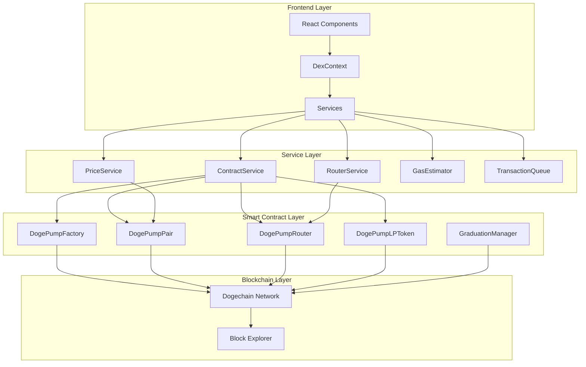
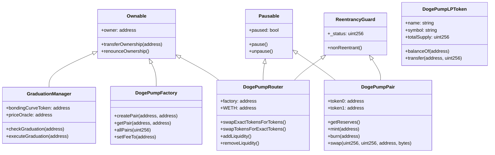
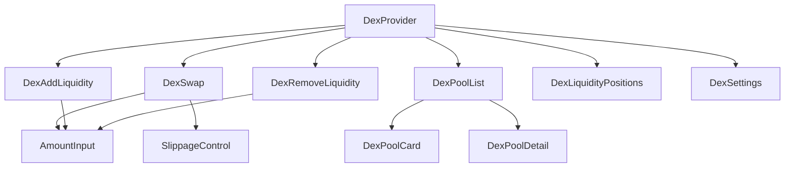
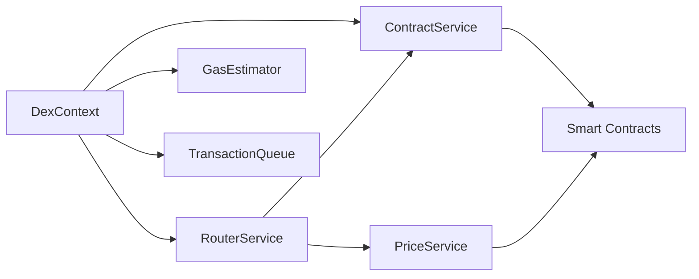

# DEX Developer Guide

Complete developer guide for building on and extending the Dogepump DEX.

## Table of Contents

- [Introduction](#introduction)
- [Architecture Overview](#architecture-overview)
- [Smart Contract Architecture](#smart-contract-architecture)
- [Frontend Architecture](#frontend-architecture)
- [Service Architecture](#service-architecture)
- [Component Architecture](#component-architecture)
- [State Management](#state-management)
- [Integration Points](#integration-points)
- [Development Workflow](#development-workflow)
- [Testing Guide](#testing-guide)
- [Deployment Guide](#deployment-guide)
- [Best Practices](#best-practices)

---

## Introduction

### About This Guide

This guide provides comprehensive information for developers working with the Dogepump DEX, including:

- Understanding the system architecture
- Setting up a development environment
- Extending the DEX functionality
- Testing smart contracts and frontend
- Deploying to production

### Target Audience

This guide is for:
- Smart contract developers
- Frontend developers (React/TypeScript)
- Full-stack developers
- Security auditors
- DevOps engineers

### Prerequisites

Before starting, ensure you have:

- **Node.js 18+** installed
- **npm or yarn** package manager
- **Solidity knowledge** for smart contracts
- **React/TypeScript knowledge** for frontend
- **Git** for version control
- **Basic blockchain understanding**

---

## Architecture Overview

### System Architecture

The Dogepump DEX follows a layered architecture:



### Key Design Principles

1. **Separation of Concerns**: Each layer has a specific responsibility
2. **Type Safety**: TypeScript throughout the stack
3. **Modularity**: Services and components are independent and reusable
4. **Security First**: Multiple layers of security validation
5. **User Experience**: Optimistic updates and error handling

---

## Smart Contract Architecture

### Contract Hierarchy

The smart contracts follow a structured hierarchy:



### Core Contracts

#### DogePumpFactory

**Purpose**: Creates and manages trading pairs

**Key Features**:
- CREATE2 deterministic pair deployment
- Fee collection mechanism
- Pair enumeration
- Ownership control

**Key Functions**:
```solidity
function createPair(address tokenA, address tokenB) external returns (address pair)
function getPair(address tokenA, address tokenB) external view returns (address pair)
function allPairs(uint256) external view returns (address pair)
function allPairsLength() external view returns (uint256)
```

#### DogePumpPair

**Purpose**: Manages liquidity and swaps for a token pair

**Key Features**:
- Constant product AMM (x * y = k)
- Flash loan protection
- Reentrancy protection
- TWAP oracle

**Key Functions**:
```solidity
function getReserves() external view returns (uint112 reserve0, uint112 reserve1, uint32 blockTimestampLast)
function mint(address to) external returns (uint256 liquidity)
function burn(address to) external returns (uint256 amount0, uint256 amount1)
function swap(uint256 amount0Out, uint256 amount1Out, address to, bytes calldata data) external
```

#### DogePumpRouter

**Purpose**: Facilitates swaps and liquidity operations

**Key Features**:
- Multi-hop swaps
- Optimal routing
- Slippage protection
- Deadline enforcement

**Key Functions**:
```solidity
function swapExactTokensForTokens(
    uint256 amountIn,
    uint256 amountOutMin,
    address[] calldata path,
    address to,
    uint256 deadline
) external returns (uint256[] memory amounts)

function addLiquidity(
    address tokenA,
    address tokenB,
    uint256 amountADesired,
    uint256 amountBDesired,
    uint256 amountAMin,
    uint256 amountBMin,
    address to,
    uint256 deadline
) external returns (uint256 amountA, uint256 amountB, uint256 liquidity)
```

#### DogePumpLPToken

**Purpose**: ERC-20 token representing liquidity pool shares

**Key Features**:
- Standard ERC-20 interface
- Mint/burn by pair contract only
- Transfer restrictions

#### GraduationManager

**Purpose**: Manages token graduation from bonding curve to DEX

**Key Features**:
- Price oracle integration
- Market cap validation
- Automatic graduation triggers
- Liquidity migration

---

## Frontend Architecture

### Technology Stack

- **React 18**: UI framework
- **TypeScript 5**: Type safety
- **Vite**: Build tool
- **Tailwind CSS**: Styling
- **Ethers.js**: Blockchain interaction

### Directory Structure

```
components/dex/
├── DexSwap.tsx              # Swap interface
├── DexPoolList.tsx          # Pool browsing
├── DexPoolCard.tsx          # Pool display card
├── DexPoolDetail.tsx         # Pool details page
├── DexAddLiquidity.tsx      # Add liquidity interface
├── DexRemoveLiquidity.tsx   # Remove liquidity interface
├── DexLiquidityPositions.tsx # Position management
├── DexTransactionSummary.tsx  # Transaction display
└── DexSettings.tsx          # Settings management
```

### Component Hierarchy



### State Management

The DEX uses React Context for global state:

```typescript
interface DexContextType {
  // State
  pools: Pool[];
  selectedPool: Pool | null;
  selectedTokenA: Token | null;
  selectedTokenB: Token | null;
  amountIn: string;
  amountOut: string;
  swapRoute: SwapRoute | null;
  priceImpact: number;
  transactions: Transaction[];
  settings: DexSettings;
  isLoading: boolean;
  error: string | null;

  // Actions
  setSelectedPool: (pool: Pool | null) => void;
  setSelectedTokenA: (token: Token | null) => void;
  setSelectedTokenB: (token: Token | null) => void;
  setAmountIn: (amount: string) => void;
  setAmountOut: (amount: string) => void;
  swapTokens: () => Promise<void>;
  addLiquidity: (amountA: string, amountB: string) => Promise<void>;
  removeLiquidity: (lpAmount: string) => Promise<void>;
  updateSettings: (settings: Partial<DexSettings>) => void;
  resetSettings: () => void;
  loadPools: () => Promise<void>;
  loadPoolDetails: (poolAddress: string) => Promise<void>;
  calculateSwapOutput: (amountIn: string, tokenIn: Token, tokenOut: Token) => Promise<SwapRoute>;
  cancelTransaction: (txId: string) => Promise<void>;
  speedUpTransaction: (txId: string) => Promise<void>;
  clearError: () => void;
}
```

---

## Service Architecture

### Service Layer

The service layer handles business logic and blockchain interactions:

```
services/dex/
├── ContractService.ts      # Contract interactions
├── PriceService.ts        # Price calculations
├── RouterService.ts       # Swap routing
├── GasEstimator.ts       # Gas estimation
└── TransactionQueue.ts    # Transaction management
```

### Service Dependencies



### ContractService

**Purpose**: Handles all smart contract interactions

**Key Responsibilities**:
- Contract initialization
- Token approvals
- Pool creation
- Liquidity operations
- Swap execution
- Event listening

**Key Methods**:
```typescript
class ContractService {
  initialize(factoryAddress: string, routerAddress: string): Promise<void>
  getTokenInfo(tokenAddress: string): Promise<Token>
  getTokenBalance(tokenAddress: string, accountAddress: string): Promise<string>
  approveToken(tokenAddress: string, spenderAddress: string, amount: string): Promise<ContractTransactionReceipt>
  createPool(tokenAAddress: string, tokenBAddress: string): Promise<string>
  getPairAddress(tokenAAddress: string, tokenBAddress: string): Promise<string>
  getPoolInfo(pairAddress: string): Promise<Pool>
  addLiquidity(...): Promise<ContractTransactionReceipt>
  removeLiquidity(...): Promise<ContractTransactionReceipt>
  swapExactTokensForTokens(...): Promise<ContractTransactionReceipt>
  swapTokensForExactTokens(...): Promise<ContractTransactionReceipt>
  getAmountsOut(amountIn: string, path: string[]): Promise<string[]>
  listenToSwaps(pairAddress: string, callback: (event: any) => void): void
}
```

### PriceService

**Purpose**: Calculates prices and metrics

**Key Responsibilities**:
- Pool price calculation
- TVL calculation
- APY calculation
- Price impact calculation
- TWAP calculation
- Price caching

**Key Methods**:
```typescript
class PriceService {
  calculatePoolPrice(reserve0: string, reserve1: string, decimals0: number, decimals1: number): number
  calculateTVL(pool: Pool, tokenPrices: Map<string, number>): number
  calculateAPY(pool: Pool, tokenPrices: Map<string, number>): number
  calculatePriceImpact(...): number
  calculateTWAP(...): { price0: number; price1: number }
  getPoolPrice(pool: Pool): Promise<{ price0: number; price1: number; tvl: number; apy: number }>
  getTokenPrice(token: Token, pool: Pool): Promise<number>
  getSwapPriceImpact(...): Promise<number>
  cacheTokenPrice(tokenAddress: string, price: number, ttl?: number): void
  getCachedTokenPrice(tokenAddress: string): number | null
}
```

### RouterService

**Purpose**: Handles swap routing and quotes

**Key Responsibilities**:
- Route calculation
- Swap quotes
- Liquidity quotes
- Parameter validation
- Gas estimation

**Key Methods**:
```typescript
class RouterService {
  getDirectSwapQuote(tokenIn: Token, tokenOut: Token, amountIn: string, pool: Pool): Promise<SwapQuote>
  getMultiHopSwapQuote(tokenIn: Token, tokenOut: Token, amountIn: string, poolIn: Pool, poolOut: Pool): Promise<SwapQuote>
  getBestSwapQuote(tokenIn: Token, tokenOut: Token, amountIn: string, pools: Pool[]): Promise<SwapQuote>
  executeSwap(...): Promise<ContractTransactionReceipt>
  getOptimalLiquidityAmounts(tokenA: Token, tokenB: Token, amountA: string, pool: Pool): Promise<{ amountA: string; amountB: string }>
  getLiquidityQuote(tokenA: Token, tokenB: Token, amountA: string, amountB: string, pool: Pool): Promise<LiquidityQuote>
  getRemoveLiquidityQuote(liquidityAmount: string, pool: Pool): Promise<{ amountA: string; amountB: string }>
  validateSwapParams(...): { valid: boolean; error?: string }
  validateLiquidityParams(...): { valid: boolean; error?: string }
}
```

### GasEstimator

**Purpose**: Estimates gas costs and fees

**Key Responsibilities**:
- Gas price fetching
- Gas limit estimation
- Gas cost calculation
- USD conversion
- Gas caching

**Key Methods**:
```typescript
class GasEstimator {
  getGasPrice(): Promise<string>
  getGasPriceGwei(): Promise<number>
  getGasPrices(): Promise<{ slow: string; average: string; fast: string }>
  estimateSwapGas(multiHop?: boolean): Promise<GasEstimate>
  estimateAddLiquidityGas(): Promise<GasEstimate>
  estimateRemoveLiquidityGas(): Promise<GasEstimate>
  estimateCustomGas(gasLimit: string | bigint): Promise<GasEstimate>
  formatGasCost(gasCost: string | bigint): string
  formatGasCostUSD(gasCostUSD: number): string
  formatGasEstimate(estimate: GasEstimate): { gasLimit: string; gasPrice: string; gasCost: string; gasCostUSD: string; estimatedTime: string }
  isGasPriceHigh(threshold?: number): Promise<boolean>
}
```

### TransactionQueue

**Purpose**: Manages transaction lifecycle

**Key Responsibilities**:
- Transaction queuing
- Status tracking
- Speed up/cancel
- Persistence
- Event notifications

**Key Methods**:
```typescript
class TransactionQueue {
  addTransaction(transaction: Omit<QueuedTransaction, 'id' | 'timestamp' | 'status'>): QueuedTransaction
  updateTransactionStatus(txId: string, status: TransactionStatus, updates?: Partial<QueuedTransaction>): QueuedTransaction | null
  updateTransactionHash(txId: string, hash: string): QueuedTransaction | null
  updateTransactionError(txId: string, error: string): QueuedTransaction | null
  getTransaction(txId: string): QueuedTransaction | null
  getAllTransactions(): QueuedTransaction[]
  getTransactionsByType(type: TransactionType): QueuedTransaction[]
  getTransactionsByStatus(status: TransactionStatus): QueuedTransaction[]
  getPendingTransactions(): QueuedTransaction[]
  speedUpTransaction(txId: string): Promise<QueuedTransaction | null>
  cancelTransaction(txId: string): Promise<QueuedTransaction | null>
  removeTransaction(txId: string): boolean
  clearAllTransactions(): void
  getStatistics(): TransactionStatistics
  addListener(txId: string, callback: (tx: QueuedTransaction) => void): void
}
```

---

## Component Architecture

### Component Design Patterns

#### 1. Container/Presentational Pattern

Components are split into:
- **Container Components**: Handle logic and state
- **Presentational Components**: Handle display only

#### 2. Custom Hooks

Reusable hooks for common logic:
```typescript
// Example: useTokenBalance
function useTokenBalance(tokenAddress: string, accountAddress: string) {
  const [balance, setBalance] = useState<string>('0');
  const [loading, setLoading] = useState(false);
  
  useEffect(() => {
    // Fetch balance logic
  }, [tokenAddress, accountAddress]);
  
  return { balance, loading };
}
```

#### 3. Error Boundaries

Components wrapped in error boundaries:
```typescript
<ErrorBoundary fallback={<ErrorFallback />}>
  <DexSwap />
</ErrorBoundary>
```

### Key Components

#### DexSwap

**Purpose**: Main swap interface

**State**:
- Selected tokens (A and B)
- Input/output amounts
- Swap route
- Price impact
- Loading state

**Props**:
```typescript
interface DexSwapProps {
  className?: string;
}
```

#### DexPoolList

**Purpose**: Browse and filter pools

**State**:
- Search query
- Sort option
- Sort direction
- Current page

**Props**:
```typescript
interface DexPoolListProps {
  pools: Pool[];
  onPoolClick?: (pool: Pool) => void;
  className?: string;
  soundsEnabled?: boolean;
}
```

#### DexAddLiquidity

**Purpose**: Add liquidity to pools

**State**:
- Token amounts
- Optimal amount calculation
- LP token estimate
- Pool share calculation
- Confirmation state

**Props**:
```typescript
interface DexAddLiquidityProps {
  pool?: Pool;
  className?: string;
}
```

#### DexLiquidityPositions

**Purpose**: Manage LP positions

**State**:
- User's positions
- Selected position
- Loading state

**Props**:
```typescript
interface DexLiquidityPositionsProps {
  className?: string;
}
```

---

## State Management

### DexContext

The DEX uses React Context for global state management:

#### State Structure

```typescript
interface DexState {
  // Pools
  pools: Pool[];
  selectedPool: Pool | null;
  
  // Tokens
  selectedTokenA: Token | null;
  selectedTokenB: Token | null;
  
  // Swap
  amountIn: string;
  amountOut: string;
  swapRoute: SwapRoute | null;
  priceImpact: number;
  
  // Transactions
  transactions: Transaction[];
  
  // Settings
  settings: DexSettings;
  
  // UI
  isLoading: boolean;
  error: string | null;
}
```

#### State Persistence

Settings and transactions are persisted to localStorage:
```typescript
useEffect(() => {
  localStorage.setItem('dexSettings', JSON.stringify(settings));
}, [settings]);

useEffect(() => {
  localStorage.setItem('dexTransactions', JSON.stringify(transactions));
}, [transactions]);
```

### Optimistic Updates

UI updates optimistically before blockchain confirmation:
```typescript
const swapTokens = useCallback(async () => {
  const txId = Date.now().toString();
  
  // Optimistic update
  setTransactions(prev => [newTx, ...prev]);
  
  try {
    // Execute transaction
    await contractService.swapExactTokensForTokens(...);
    
    // Confirm update
    setTransactions(prev =>
      prev.map(tx => tx.id === txId ? { ...tx, status: 'confirmed' } : tx)
    );
  } catch (err) {
    // Revert update
    setTransactions(prev =>
      prev.map(tx => tx.id === txId ? { ...tx, status: 'failed' } : tx)
    );
  }
}, [/* dependencies */]);
```

---

## Integration Points

### StoreContext Integration

The DEX integrates with the existing StoreContext:

```typescript
// Access store tokens
const { tokens } = useStore();

// Use in DEX
const availableTokens = tokens.filter(t => t.isListed);
```

### DogeSwap Integration

The DEX extends DogeSwap functionality:

```typescript
// Share token lists
const { allTokens } = useDogeSwap();

// Use in DEX
const tokenOptions = allTokens.map(token => ({
  address: token.address,
  symbol: token.symbol,
  name: token.name,
  decimals: token.decimals,
}));
```

### TokenDetail Integration

DEX pools link to token detail pages:

```typescript
// Navigate to pool from token detail
const handleTradeToken = (token: Token) => {
  navigate(`/dex?tokenA=${token.address}`);
};
```

### App Integration

The DEX is integrated into the main App component:

```typescript
// Wrap app with DexProvider
function App() {
  return (
    <StoreProvider>
      <DexProvider>
        <Router>
          {/* Routes */}
        </Router>
      </DexProvider>
    </StoreProvider>
  );
}
```

---

## Development Workflow

### Setting Up Development Environment

#### 1. Clone Repository

```bash
git clone <repository-url>
cd dogepump-dogechain-memecoin-launcher
```

#### 2. Install Dependencies

```bash
npm install
```

#### 3. Configure Environment

```bash
cp .env.example .env
# Edit .env with your configuration
```

#### 4. Start Development Servers

```bash
# Terminal 1 - Frontend
npm run dev

# Terminal 2 - Backend (if needed)
npm run server
```

### Smart Contract Development

#### 1. Write Contracts

Create contracts in `contracts/` directory:

```solidity
// SPDX-License-Identifier: MIT
pragma solidity ^0.8.0;

import "@openzeppelin/contracts/token/ERC20/ERC20.sol";
import "@openzeppelin/contracts/access/Ownable.sol";

contract MyContract is ERC20, Ownable {
    // Contract logic
}
```

#### 2. Compile Contracts

```bash
cd contracts
npx hardhat compile
```

#### 3. Test Contracts

```bash
npx hardhat test
```

#### 4. Deploy Contracts

```bash
npx hardhat run scripts/deploy.js --network dogechain
```

### Frontend Development

#### 1. Create Components

Create components in `components/dex/`:

```typescript
import React from 'react';
import { useDex } from '../../contexts/DexContext';

const MyComponent: React.FC = () => {
  const { pools, loadPools } = useDex();
  
  useEffect(() => {
    loadPools();
  }, [loadPools]);
  
  return (
    <div>
      {/* Component JSX */}
    </div>
  );
};

export default MyComponent;
```

#### 2. Add Services

Create services in `services/dex/`:

```typescript
export class MyService {
  constructor(provider: ethers.Provider) {
    this.provider = provider;
  }
  
  async myMethod(): Promise<Result> {
    // Service logic
  }
}
```

#### 3. Update Context

Add state and actions to DexContext:

```typescript
const [myState, setMyState] = useState<DataType>(initialValue);

const myAction = useCallback(async () => {
  // Action logic
  setMyState(newValue);
}, [/* dependencies */]);
```

### Code Style

#### TypeScript

- Use strict mode
- Define interfaces for all types
- Use generics where appropriate
- Avoid `any` type

#### React

- Use functional components
- Use hooks for state and effects
- Memoize expensive operations
- Use TypeScript for props

#### Solidity

- Follow Solidity style guide
- Use NatSpec for documentation
- Use OpenZeppelin contracts
- Implement security best practices

---

## Testing Guide

### Smart Contract Testing

#### Unit Tests

Test individual contract functions:

```typescript
import { expect } from 'chai';
import { ethers } from 'hardhat';
import { DogePumpPair } from '../typechain-types';

describe('DogePumpPair', () => {
  it('should create pair correctly', async () => {
    // Test logic
    expect(await pair.token0()).to.equal(token0.address);
  });
  
  it('should calculate swap correctly', async () => {
    // Test logic
    expect(await pair.getReserves()).to.deep.equal([reserve0, reserve1]);
  });
});
```

#### Integration Tests

Test contract interactions:

```typescript
describe('DogePumpRouter Integration', () => {
  it('should execute swap through router', async () => {
    await router.connect(user).swapExactTokensForTokens(
      amountIn,
      amountOutMin,
      path,
      user.address,
      deadline
    );
    
    expect(await tokenB.balanceOf(user.address)).to.equal(expectedOutput);
  });
});
```

### Frontend Testing

#### Unit Tests

Test components in isolation:

```typescript
import { render, screen } from '@testing-library/react';
import DexSwap from '../DexSwap';

describe('DexSwap', () => {
  it('should render swap interface', () => {
    render(<DexSwap />);
    expect(screen.getByText('Swap')).toBeInTheDocument();
  });
  
  it('should handle token selection', () => {
    render(<DexSwap />);
    // Test token selection logic
  });
});
```

#### Integration Tests

Test component interactions:

```typescript
import { render, fireEvent, waitFor } from '@testing-library/react';
import { DexProvider } from '../../contexts/DexContext';
import DexSwap from '../DexSwap';

describe('DexSwap Integration', () => {
  it('should execute swap', async () => {
    render(
      <DexProvider>
        <DexSwap />
      </DexProvider>
    );
    
    // Test swap execution
  });
});
```

### E2E Tests

Test complete user flows:

```typescript
import { test, expect } from '@playwright/test';

test('complete swap flow', async ({ page }) => {
  await page.goto('/dex');
  
  // Connect wallet
  await page.click('[data-testid="connect-wallet"]');
  
  // Select tokens
  await page.click('[data-testid="select-token-a"]');
  await page.click('[data-testid="token-dc"]');
  
  // Enter amount
  await page.fill('[data-testid="amount-in"]', '100');
  
  // Execute swap
  await page.click('[data-testid="swap-button"]');
  
  // Verify result
  await expect(page.locator('[data-testid="success-message"]')).toBeVisible();
});
```

### Running Tests

```bash
# Smart contract tests
cd contracts
npm test

# Frontend unit tests
npm run test:unit

# Frontend E2E tests
npm run test:e2e

# All tests
npm test
```

---

## Deployment Guide

### Smart Contract Deployment

#### 1. Prepare Deployment

```bash
cd contracts
```

#### 2. Configure Network

Edit `hardhat.config.js`:

```javascript
module.exports = {
  networks: {
    dogechain: {
      url: process.env.DOGECHAIN_RPC_URL,
      accounts: [process.env.PRIVATE_KEY],
      chainId: 2000,
    },
  },
};
```

#### 3. Deploy Contracts

```bash
npx hardhat run scripts/deploy-mainnet.js --network dogechain
```

#### 4. Verify Contracts

```bash
npx hardhat verify --network dogechain <CONTRACT_ADDRESS> <CONSTRUCTOR_ARGS>
```

#### 5. Update Frontend

Update contract addresses in `.env`:

```env
NEXT_PUBLIC_FACTORY_ADDRESS=0x...
NEXT_PUBLIC_ROUTER_ADDRESS=0x...
```

### Frontend Deployment

#### 1. Build Frontend

```bash
npm run build
```

#### 2. Deploy to Vercel

```bash
npm install -g vercel
vercel --prod
```

#### 3. Configure Environment

Set environment variables in Vercel dashboard:
- `NEXT_PUBLIC_FACTORY_ADDRESS`
- `NEXT_PUBLIC_ROUTER_ADDRESS`
- `NEXT_PUBLIC_CHAIN_ID`

---

## Best Practices

### Security

#### Smart Contract Security

- Use OpenZeppelin contracts
- Implement reentrancy protection
- Use access control (Ownable)
- Validate all inputs
- Use SafeMath for arithmetic
- Implement pause mechanisms
- Test thoroughly before deployment

#### Frontend Security

- Validate all user inputs
- Sanitize displayed data
- Use HTTPS in production
- Implement rate limiting
- Secure API keys
- Use Content Security Policy

### Performance

#### Smart Contract Optimization

- Use `uint256` for calculations
- Minimize storage operations
- Use events for logging
- Batch operations when possible
- Use view functions for reads

#### Frontend Optimization

- Use React.memo for expensive components
- Implement lazy loading
- Cache API responses
- Use virtual scrolling for lists
- Optimize images
- Minimize bundle size

### User Experience

#### Design Principles

- Provide clear feedback
- Show loading states
- Handle errors gracefully
- Use optimistic updates
- Implement undo/redo where possible
- Provide keyboard shortcuts
- Ensure accessibility

#### Error Handling

- Show user-friendly error messages
- Provide recovery options
- Log errors for debugging
- Implement retry logic
- Show transaction status

---

## Additional Resources

- [DEX API Reference](./DEX_API_REFERENCE.md)
- [DEX Integration Guide](./DEX_INTEGRATION_GUIDE.md)
- [DEX Testing Guide](./DEX_TESTING_GUIDE.md)
- [DEX Security Guide](./DEX_SECURITY_GUIDE.md)
- [Contract Documentation](./contracts/CONTRACT_DOCUMENTATION.md)
- [Service Documentation](./services/dex/SERVICE_DOCUMENTATION.md)
- [Component Documentation](./components/dex/COMPONENT_DOCUMENTATION.md)

---

**Last Updated:** December 30, 2025
