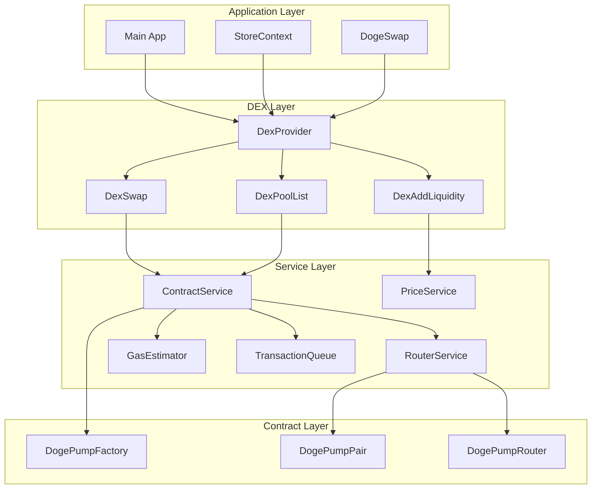

# DEX Integration Guide

Complete guide for integrating DEX into existing code and extending its functionality.

## Table of Contents

- [Introduction](#introduction)
- [Integration Overview](#integration-overview)
- [Integrating DEX into Existing Code](#integrating-dex-into-existing-code)
- [Adding New Tokens](#adding-new-tokens)
- [Creating Custom Pools](#creating-custom-pools)
- [Adding New Features](#adding-new-features)
- [Best Practices](#best-practices)
- [Common Patterns](#common-patterns)
- [Migration Guide](#migration-guide)

---

## Introduction

### About This Guide

This guide provides comprehensive information for:
- Integrating DEX into existing applications
- Adding new tokens to the DEX
- Creating custom liquidity pools
- Extending DEX functionality
- Following best practices and patterns

### Target Audience

This guide is for:
- Frontend developers integrating DEX UI
- Backend developers integrating DEX APIs
- Token developers launching new tokens
- Liquidity providers creating custom pools
- Developers extending DEX features

### Prerequisites

Before integrating, ensure you have:
- **Understanding of React/TypeScript**
- **Knowledge of Web3/blockchain**
- **Familiarity with the existing codebase**
- **Access to DEX smart contracts**
- **Development environment set up**

---

## Integration Overview

### Integration Points

The DEX can be integrated at multiple levels:



### Integration Levels

#### 1. UI Integration
- Add DEX components to existing pages
- Integrate DEX navigation
- Share state between components

#### 2. Service Integration
- Use DEX services in existing code
- Extend service functionality
- Add custom services

#### 3. Smart Contract Integration
- Interact with DEX contracts
- Create custom pools
- Implement custom token logic

---

## Integrating DEX into Existing Code

### Step 1: Install Dependencies

Ensure you have the required dependencies:

```bash
npm install ethers
npm install --save-dev @types/ethers
```

### Step 2: Add DexProvider

Wrap your application with DexProvider:

```typescript
// App.tsx
import React from 'react';
import { DexProvider } from './contexts/DexContext';
import { StoreProvider } from './contexts/StoreContext';

function App() {
  return (
    <StoreProvider>
      <DexProvider>
        {/* Your existing app components */}
      </DexProvider>
    </StoreProvider>
  );
}

export default App;
```

### Step 3: Add DEX Navigation

Integrate DEX navigation into your existing navigation:

```typescript
// components/Navigation.tsx
import React from 'react';
import { Link } from 'react-router-dom';

const Navigation: React.FC = () => {
  return (
    <nav className="navigation">
      {/* Existing navigation items */}
      <Link to="/swap">Swap</Link>
      <Link to="/pools">Pools</Link>
      <Link to="/liquidity">Liquidity</Link>
      <Link to="/positions">Positions</Link>
    </nav>
  );
};

export default Navigation;
```

### Step 4: Add DEX Routes

Add DEX routes to your router:

```typescript
// App.tsx
import { BrowserRouter, Routes, Route } from 'react-router-dom';
import DexSwap from './components/dex/DexSwap';
import DexPoolList from './components/dex/DexPoolList';
import DexAddLiquidity from './components/dex/DexAddLiquidity';
import DexLiquidityPositions from './components/dex/DexLiquidityPositions';

function App() {
  return (
    <BrowserRouter>
      <Routes>
        {/* Existing routes */}
        <Route path="/swap" element={<DexSwap />} />
        <Route path="/pools" element={<DexPoolList />} />
        <Route path="/liquidity" element={<DexAddLiquidity />} />
        <Route path="/positions" element={<DexLiquidityPositions />} />
      </Routes>
    </BrowserRouter>
  );
}
```

### Step 5: Share State

Share state between DEX and existing components:

```typescript
// Use DEX state in existing component
import { useDex } from './contexts/DexContext';

const ExistingComponent: React.FC = () => {
  const { pools, selectedPool } = useDex();
  
  return (
    <div>
      <h1>Existing Page</h1>
      {selectedPool && (
        <div>
          <h2>Selected Pool</h2>
          <p>{selectedPool.tokenA.symbol}/{selectedPool.tokenB.symbol}</p>
        </div>
      )}
    </div>
  );
};
```

### Step 6: Integrate with StoreContext

Access store tokens in DEX components:

```typescript
// components/dex/DexSwap.tsx
import { useDex } from '../../contexts/DexContext';
import { useStore } from '../../contexts/StoreContext';

const DexSwap: React.FC = () => {
  const { allTokens } = useStore();
  const { selectedTokenA, setSelectedTokenA } = useDex();
  
  // Use store tokens in DEX
  const tokenOptions = allTokens.map(token => ({
    address: token.address,
    symbol: token.symbol,
    name: token.name,
    decimals: token.decimals,
  }));
  
  return (
    <div>
      {/* DEX swap UI */}
    </div>
  );
};
```

### Step 7: Add DEX to TokenDetail

Add DEX functionality to token detail pages:

```typescript
// components/TokenDetail.tsx
import React from 'react';
import { useNavigate } from 'react-router-dom';
import { useDex } from '../contexts/DexContext';

const TokenDetail: React.FC<{ token: Token }> = ({ token }) => {
  const navigate = useNavigate();
  const { setSelectedTokenA } = useDex();
  
  const handleTrade = () => {
    setSelectedTokenA(token);
    navigate('/swap');
  };
  
  return (
    <div>
      <h1>{token.name}</h1>
      <button onClick={handleTrade}>Trade on DEX</button>
    </div>
  );
};
```

---

## Adding New Tokens

### Understanding Token Integration

Tokens on the DEX are ERC-20 tokens on Dogechain. To add a new token:

1. **Deploy ERC-20 Token**: Create or use existing token
2. **Create Liquidity Pool**: Add liquidity for the token
3. **Register in UI**: Add token to token list

### Step 1: Deploy ERC-20 Token

Create a standard ERC-20 token:

```solidity
// SPDX-License-Identifier: MIT
pragma solidity ^0.8.0;

import "@openzeppelin/contracts/token/ERC20/ERC20.sol";
import "@openzeppelin/contracts/access/Ownable.sol";

contract MyToken is ERC20, Ownable {
    constructor() ERC20("My Token", "MTK") {}
    
    function mint(address to, uint256 amount) public onlyOwner {
        _mint(to, amount);
    }
    
    function burn(uint256 amount) public {
        _burn(msg.sender, amount);
    }
}
```

Deploy the token:

```bash
npx hardhat run scripts/deploy-token.js --network dogechain
```

### Step 2: Create Liquidity Pool

Add liquidity for the new token:

```typescript
// Using ContractService
import ContractService from './services/dex/ContractService';

async function createTokenPool(tokenAddress: string) {
  const dcTokenAddress = '0x...'; // DC token address
  
  // Create pool with DC
  const poolAddress = await contractService.createPool(
    tokenAddress,
    dcTokenAddress
  );
  
  console.log(`Pool created: ${poolAddress}`);
  
  return poolAddress;
}
```

### Step 3: Add Token to Token List

Add the token to the UI token list:

```typescript
// types.ts
export interface Token {
  address: string;
  symbol: string;
  name: string;
  decimals: number;
  logoURI?: string;
  balance?: string;
  price?: number;
  isListed?: boolean; // Add this property
}

// StoreContext.tsx
const [allTokens, setAllTokens] = useState<Token[]>([]);

// Add new token
const addNewToken = (token: Token) => {
  setAllTokens(prev => [...prev, { ...token, isListed: true }]);
};
```

### Step 4: Update Token Selection

Update DEX components to include new tokens:

```typescript
// components/dex/DexSwap.tsx
const { allTokens } = useStore();
const { selectedTokenA, setSelectedTokenA } = useDex();

const listedTokens = allTokens.filter(t => t.isListed);

return (
  <select
    value={selectedTokenA?.address}
    onChange={(e) => {
      const token = listedTokens.find(t => t.address === e.target.value);
      setSelectedTokenA(token || null);
    }}
  >
    <option value="">Select a token</option>
    {listedTokens.map(token => (
      <option key={token.address} value={token.address}>
        {token.symbol}
      </option>
    ))}
  </select>
);
```

### Step 5: Add Token Metadata

Add token metadata for display:

```typescript
// services/tokenService.ts
export interface TokenMetadata {
  address: string;
  symbol: string;
  name: string;
  decimals: number;
  logoURI?: string;
  description?: string;
  website?: string;
  social?: {
    twitter?: string;
    telegram?: string;
    discord?: string;
  };
}

async function getTokenMetadata(address: string): Promise<TokenMetadata> {
  // Fetch from on-chain or off-chain source
  const contract = new ethers.Contract(address, ERC20_ABI, provider);
  
  const [name, symbol, decimals] = await Promise.all([
    contract.name(),
    contract.symbol(),
    contract.decimals(),
  ]);
  
  return {
    address,
    name,
    symbol,
    decimals: Number(decimals),
  };
}
```

---

## Creating Custom Pools

### Understanding Pool Creation

Pools are created automatically when liquidity is added for a token pair. However, you can:

1. **Pre-create Pools**: Create pools before adding liquidity
2. **Custom Pool Configuration**: Set custom parameters
3. **Pool Management**: Manage existing pools

### Step 1: Calculate Pair Address

Calculate the expected pair address before creation:

```typescript
// services/dex/poolService.ts
import { ethers } from 'ethers';

function calculatePairAddress(
  factoryAddress: string,
  tokenAAddress: string,
  tokenBAddress: string
): string {
  // Sort tokens
  const [token0, token1] = tokenAAddress.toLowerCase() < tokenBAddress.toLowerCase()
    ? [tokenAAddress, tokenBAddress]
    : [tokenBAddress, tokenAAddress];
  
  // Calculate salt
  const salt = ethers.keccak256(
    ethers.AbiCoder.defaultAbiCoder().encode(
      ['address', 'address'],
      [token0, token1]
    )
  );
  
  // Calculate CREATE2 address
  const initCodeHash = ethers.keccak256('0x...'); // Pair bytecode hash
  
  return ethers.getCreate2Address(factoryAddress, salt, initCodeHash);
}
```

### Step 2: Create Pool with Initial Liquidity

Create a pool with initial liquidity:

```typescript
// Using ContractService
async function createPoolWithLiquidity(
  tokenAAddress: string,
  tokenBAddress: string,
  amountA: string,
  amountB: string
) {
  // Approve tokens
  await contractService.approveToken(tokenAAddress, routerAddress, amountA);
  await contractService.approveToken(tokenBAddress, routerAddress, amountB);
  
  // Add liquidity (creates pool if it doesn't exist)
  const { amountA: actualA, amountB: actualB, liquidity } = await contractService.addLiquidity(
    tokenAAddress,
    tokenBAddress,
    amountA,
    amountB,
    amountA,
    amountB,
    userAddress,
    Math.floor(Date.now() / 1000) + 1200
  );
  
  console.log(`Pool created with ${liquidity} LP tokens`);
  
  return liquidity;
}
```

### Step 3: Verify Pool Creation

Verify that the pool was created correctly:

```typescript
async function verifyPoolCreation(
  tokenAAddress: string,
  tokenBAddress: string
): Promise<boolean> {
  // Get pair address from factory
  const pairAddress = await contractService.getPairAddress(tokenAAddress, tokenBAddress);
  
  if (pairAddress === ethers.ZeroAddress) {
    console.error('Pool not created');
    return false;
  }
  
  // Get pool information
  const pool = await contractService.getPoolInfo(pairAddress);
  
  console.log('Pool verified:', pool);
  
  return true;
}
```

### Step 4: Monitor Pool Performance

Monitor the performance of your custom pool:

```typescript
// services/dex/poolMonitor.ts
export interface PoolMetrics {
  address: string;
  tvl: number;
  volume24h: number;
  apy: number;
  fees24h: number;
}

async function getPoolMetrics(pairAddress: string): Promise<PoolMetrics> {
  const pool = await contractService.getPoolInfo(pairAddress);
  
  // Calculate additional metrics
  const tvl = priceService.calculateTVL(pool, tokenPrices);
  const apy = priceService.calculateAPY(pool, tokenPrices);
  
  return {
    address: pairAddress,
    tvl,
    volume24h: pool.volume24h,
    apy,
    fees24h: pool.volume24h * pool.fee,
  };
}
```

---

## Adding New Features

### Extending DEX Functionality

You can extend the DEX with new features:

#### 1. Custom Swap Types

Add support for new swap types:

```typescript
// services/dex/customSwapService.ts
export enum SwapType {
  STANDARD = 'standard',
  LIMIT_ORDER = 'limit_order',
  TWAP = 'twap',
  FLASH_SWAP = 'flash_swap',
}

export interface CustomSwapParams {
  type: SwapType;
  tokenIn: Token;
  tokenOut: Token;
  amountIn: string;
  limitPrice?: string;
  twapDuration?: number;
}

async function executeCustomSwap(params: CustomSwapParams): Promise<ContractTransactionReceipt> {
  switch (params.type) {
    case SwapType.STANDARD:
      return executeStandardSwap(params);
    case SwapType.LIMIT_ORDER:
      return executeLimitOrder(params);
    case SwapType.TWAP:
      return executeTWAPSwap(params);
    case SwapType.FLASH_SWAP:
      return executeFlashSwap(params);
    default:
      throw new Error('Unknown swap type');
  }
}
```

#### 2. Advanced Liquidity Management

Add advanced liquidity management features:

```typescript
// services/dex/advancedLiquidityService.ts
export interface LiquidityStrategy {
  type: 'single_sided' | 'balanced' | 'rebalanced';
  rebalanceThreshold?: number;
  autoRebalance?: boolean;
}

export interface AdvancedLiquidityParams {
  pool: Pool;
  strategy: LiquidityStrategy;
  amountA?: string;
  amountB?: string;
  targetRatio?: number;
}

async function addAdvancedLiquidity(params: AdvancedLiquidityParams): Promise<ContractTransactionReceipt> {
  switch (params.strategy.type) {
    case 'single_sided':
      return addSingleSidedLiquidity(params);
    case 'balanced':
      return addBalancedLiquidity(params);
    case 'rebalanced':
      return addRebalancedLiquidity(params);
  }
}
```

#### 3. Pool Analytics

Add pool analytics and insights:

```typescript
// services/dex/poolAnalyticsService.ts
export interface PoolAnalytics {
  pool: Pool;
  metrics: {
    volumeHistory: number[];
    priceHistory: number[];
    liquidityHistory: number[];
    feeHistory: number[];
  };
  insights: {
    trend: 'increasing' | 'decreasing' | 'stable';
    recommendation: string;
  };
}

async function getPoolAnalytics(pairAddress: string, days: number = 30): Promise<PoolAnalytics> {
  // Fetch historical data
  const [swaps, mints, burns] = await Promise.all([
    fetchSwapHistory(pairAddress, days),
    fetchMintHistory(pairAddress, days),
    fetchBurnHistory(pairAddress, days),
  ]);
  
  // Calculate metrics
  const volumeHistory = calculateVolumeHistory(swaps, days);
  const priceHistory = calculatePriceHistory(swaps, days);
  const liquidityHistory = calculateLiquidityHistory(mints, burns, days);
  const feeHistory = calculateFeeHistory(swaps, days);
  
  // Generate insights
  const trend = analyzeTrend(volumeHistory);
  const recommendation = generateRecommendation(trend, liquidityHistory);
  
  return {
    pool: await contractService.getPoolInfo(pairAddress),
    metrics: {
      volumeHistory,
      priceHistory,
      liquidityHistory,
      feeHistory,
    },
    insights: {
      trend,
      recommendation,
    },
  };
}
```

#### 4. Custom Notifications

Add custom notification systems:

```typescript
// services/dex/notificationService.ts
export enum NotificationType {
  SWAP = 'swap',
  LIQUIDITY = 'liquidity',
  PRICE_ALERT = 'price_alert',
  POOL_EVENT = 'pool_event',
}

export interface Notification {
  id: string;
  type: NotificationType;
  title: string;
  message: string;
  timestamp: number;
  read: boolean;
  action?: {
    label: string;
    callback: () => void;
  };
}

class NotificationService {
  private notifications: Notification[] = [];
  private listeners: ((notification: Notification) => void)[] = [];
  
  addNotification(notification: Omit<Notification, 'id' | 'timestamp' | 'read'>): void {
    const newNotification: Notification = {
      ...notification,
      id: generateId(),
      timestamp: Date.now(),
      read: false,
    };
    
    this.notifications.unshift(newNotification);
    this.notifyListeners(newNotification);
  }
  
  markAsRead(id: string): void {
    const notification = this.notifications.find(n => n.id === id);
    if (notification) {
      notification.read = true;
    }
  }
  
  addListener(callback: (notification: Notification) => void): void {
    this.listeners.push(callback);
  }
  
  removeListener(callback: (notification: Notification) => void): void {
    this.listeners = this.listeners.filter(l => l !== callback);
  }
  
  private notifyListeners(notification: Notification): void {
    this.listeners.forEach(callback => callback(notification));
  }
  
  private generateId(): string {
    return `notif_${Date.now()}_${Math.random().toString(36).substr(2, 9)}`;
  }
}
```

---

## Best Practices

### Security Best Practices

#### 1. Input Validation

Always validate user inputs:

```typescript
function validateSwapInput(amount: string, token: Token): { valid: boolean; error?: string } {
  // Check amount
  const amountNum = parseFloat(amount);
  if (isNaN(amountNum) || amountNum <= 0) {
    return { valid: false, error: 'Invalid amount' };
  }
  
  // Check balance
  if (token.balance && parseFloat(token.balance) < amountNum) {
    return { valid: false, error: 'Insufficient balance' };
  }
  
  // Check decimals
  if (amount.split('.')[1]?.length > token.decimals) {
    return { valid: false, error: 'Too many decimal places' };
  }
  
  return { valid: true };
}
```

#### 2. Error Handling

Implement comprehensive error handling:

```typescript
async function safeExecute<T>(
  operation: () => Promise<T>,
  errorMessage: string
): Promise<T> {
  try {
    return await operation();
  } catch (error) {
    console.error(errorMessage, error);
    
    // User-friendly error message
    const userMessage = getUserFriendlyError(error);
    
    // Log error for debugging
    logError(error);
    
    // Show error to user
    showError(userMessage);
    
    throw error;
  }
}

function getUserFriendlyError(error: any): string {
  if (error.code === 'INSUFFICIENT_FUNDS') {
    return 'Insufficient funds for this transaction';
  }
  if (error.code === 'USER_DENIED') {
    return 'Transaction was rejected';
  }
  if (error.code === 'NETWORK_ERROR') {
    return 'Network error. Please try again';
  }
  return 'An error occurred. Please try again';
}
```

#### 3. Transaction Safety

Implement transaction safety measures:

```typescript
async function safeSwap(
  params: SwapParams
): Promise<ContractTransactionReceipt> {
  // Validate parameters
  const validation = validateSwapParams(params);
  if (!validation.valid) {
    throw new Error(validation.error);
  }
  
  // Estimate gas
  const gasEstimate = await gasEstimator.estimateSwapGas();
  
  // Check if user has enough for gas
  const userBalance = await contractService.getTokenBalance(
    '0x...', // DC token
    userAddress
  );
  
  if (parseFloat(userBalance) < parseFloat(gasEstimate.gasCostUSD)) {
    throw new Error('Insufficient funds for gas');
  }
  
  // Set reasonable deadline
  const deadline = Math.floor(Date.now() / 1000) + 1200; // 20 minutes
  
  // Execute transaction
  return await contractService.swapExactTokensForTokens(
    params.amountIn,
    params.amountOutMin,
    params.path,
    params.to,
    deadline
  );
}
```

### Performance Best Practices

#### 1. Caching

Implement caching for performance:

```typescript
class CachedPriceService {
  private cache: Map<string, { value: number; timestamp: number }> = new Map();
  private ttl: number = 30000; // 30 seconds
  
  async getPrice(tokenAddress: string): Promise<number> {
    const cached = this.cache.get(tokenAddress);
    
    if (cached && Date.now() - cached.timestamp < this.ttl) {
      return cached.value;
    }
    
    const price = await this.fetchPrice(tokenAddress);
    
    this.cache.set(tokenAddress, {
      value: price,
      timestamp: Date.now(),
    });
    
    return price;
  }
  
  clearCache(): void {
    this.cache.clear();
  }
}
```

#### 2. Debouncing

Debounce expensive operations:

```typescript
function useDebounce<T extends (...args: any[]) => any>(
  func: T,
  delay: number
): T {
  const timeoutRef = useRef<NodeJS.Timeout>();
  
  return useCallback((...args: any[]) => {
    if (timeoutRef.current) {
      clearTimeout(timeoutRef.current);
    }
    
    timeoutRef.current = setTimeout(() => {
      func(...args);
    }, delay);
  }, [func, delay]);
}

// Usage
const debouncedSearch = useDebounce((query: string) => {
  searchPools(query);
}, 300);
```

#### 3. Lazy Loading

Implement lazy loading for large lists:

```typescript
import { useCallback, useState, useRef } from 'react';

function useLazyLoading<T>(items: T[], itemsPerPage: number = 20) {
  const [visibleItems, setVisibleItems] = useState<T[]>([]);
  const [page, setPage] = useState(1);
  const observerRef = useRef<IntersectionObserver>();
  const loadMoreRef = useRef<HTMLDivElement>();
  
  const loadMore = useCallback(() => {
    const nextPage = page + 1;
    const newItems = items.slice(0, nextPage * itemsPerPage);
    setVisibleItems(newItems);
    setPage(nextPage);
  }, [items, page, itemsPerPage]);
  
  useEffect(() => {
    const observer = new IntersectionObserver(
      (entries) => {
        if (entries[0].isIntersecting) {
          loadMore();
        }
      },
      { threshold: 0.1 }
    );
    
    if (loadMoreRef.current) {
      observer.observe(loadMoreRef.current);
    }
    
    observerRef.current = observer;
    
    return () => {
      observer.disconnect();
    };
  }, [loadMore]);
  
  return { visibleItems, loadMoreRef };
}
```

### Code Organization

#### 1. Directory Structure

Follow a clear directory structure:

```
integrations/
├── tokens/              # Token integration
│   ├── tokenService.ts
│   └── tokenMetadata.ts
├── pools/               # Pool integration
│   ├── poolService.ts
│   └── poolAnalytics.ts
├── swaps/               # Swap integration
│   ├── swapService.ts
│   └── customSwapService.ts
└── notifications/         # Notification integration
    └── notificationService.ts
```

#### 2. Naming Conventions

Follow consistent naming:

```typescript
// Services: PascalCase, "Service" suffix
class TokenService {}
class PoolService {}
class SwapService {}

// Hooks: camelCase, "use" prefix
function useTokenBalance() {}
function usePoolData() {}
function useSwapQuote() {}

// Components: PascalCase
const TokenSelector: React.FC = () => {};
const PoolCard: React.FC = () => {};
const SwapButton: React.FC = () => {};

// Types: PascalCase, "Interface" or "Type" suffix
interface TokenMetadata {}
interface PoolData {}
type SwapType = {}
```

---

## Common Patterns

### Pattern 1: Service Composition

Compose services for complex operations:

```typescript
class CompositeSwapService {
  constructor(
    private contractService: ContractService,
    private routerService: RouterService,
    private priceService: PriceService,
    private gasEstimator: GasEstimator
  ) {}
  
  async executeSwap(params: SwapParams): Promise<SwapResult> {
    // Get quote
    const quote = await this.routerService.getBestSwapQuote(
      params.tokenIn,
      params.tokenOut,
      params.amountIn,
      params.pools
    );
    
    // Estimate gas
    const gasEstimate = await this.gasEstimator.estimateSwapGas(
      quote.path.length > 2
    );
    
    // Validate
    const validation = this.routerService.validateSwapParams(
      params.tokenIn,
      params.tokenOut,
      params.amountIn,
      params.slippage,
      params.deadline
    );
    
    if (!validation.valid) {
      throw new Error(validation.error);
    }
    
    // Execute
    const receipt = await this.contractService.swapExactTokensForTokens(
      params.amountIn,
      params.amountOutMin,
      quote.path,
      params.to,
      params.deadline
    );
    
    return {
      receipt,
      quote,
      gasEstimate,
    };
  }
}
```

### Pattern 2: Hook Composition

Compose hooks for reusable logic:

```typescript
function useSwap(tokenIn: Token, tokenOut: Token) {
  const [amountIn, setAmountIn] = useState('');
  const [amountOut, setAmountOut] = useState('');
  const [quote, setQuote] = useState<SwapQuote | null>(null);
  const [loading, setLoading] = useState(false);
  const [error, setError] = useState<string | null>(null);
  
  const calculateQuote = useCallback(async () => {
    if (!amountIn || !tokenIn || !tokenOut) return;
    
    setLoading(true);
    setError(null);
    
    try {
      const newQuote = await routerService.getBestSwapQuote(
        tokenIn,
        tokenOut,
        amountIn,
        pools
      );
      setQuote(newQuote);
      setAmountOut(newQuote.amountOut);
    } catch (err) {
      setError(err.message);
    } finally {
      setLoading(false);
    }
  }, [amountIn, tokenIn, tokenOut, pools]);
  
  const executeSwap = useCallback(async () => {
    if (!quote) return;
    
    setLoading(true);
    setError(null);
    
    try {
      await contractService.swapExactTokensForTokens(
        amountIn,
        quote.amountOut,
        quote.path,
        userAddress,
        deadline
      );
      setAmountIn('');
      setAmountOut('');
      setQuote(null);
    } catch (err) {
      setError(err.message);
    } finally {
      setLoading(false);
    }
  }, [amountIn, quote]);
  
  return {
    amountIn,
    setAmountIn,
    amountOut,
    setAmountOut,
    quote,
    loading,
    error,
    calculateQuote,
    executeSwap,
  };
}
```

### Pattern 3: Error Boundary Pattern

Implement error boundaries for graceful degradation:

```typescript
class DexErrorBoundary extends React.Component<
  { children: React.ReactNode },
  { hasError: boolean; error: Error | null; resetError: () => void }
> {
  state = { hasError: false, error: null, resetError: () => this.reset };
  
  static getDerivedStateFromError(error: Error) {
    return { hasError: true, error };
  }
  
  componentDidCatch(error: Error, errorInfo: React.ErrorInfo) {
    console.error('DEX Error:', error, errorInfo);
  }
  
  render() {
    if (this.state.hasError) {
      return (
        <div className="dex-error-boundary">
          <h2>Something went wrong</h2>
          <p>{this.state.error?.message}</p>
          <button onClick={this.state.resetError}>Try Again</button>
        </div>
      );
    }
    
    return this.props.children;
  }
}

// Usage
<DexErrorBoundary>
  <DexSwap />
</DexErrorBoundary>
```

---

## Migration Guide

### Migrating from Previous Versions

If you're migrating from a previous DEX version:

#### 1. Update Contract Addresses

Update contract addresses in your configuration:

```typescript
// config/dex.ts
export const DEX_CONFIG = {
  factoryAddress: process.env.NEXT_PUBLIC_FACTORY_ADDRESS || '0x...',
  routerAddress: process.env.NEXT_PUBLIC_ROUTER_ADDRESS || '0x...',
  // Update these addresses
};
```

#### 2. Update Service Calls

Update service calls to match new API:

```typescript
// Old API
const pool = await contractService.getPoolInfo(pairAddress);

// New API (if changed)
const pool = await contractService.getPoolInfoV2(pairAddress);
```

#### 3. Update Component Props

Update component props if they've changed:

```typescript
// Old props
interface DexSwapProps {
  onSwap: (params: SwapParams) => void;
}

// New props (if changed)
interface DexSwapProps {
  onSwap: (params: SwapParamsV2) => void;
  onQuote: (params: QuoteParams) => void;
}
```

### Data Migration

Migrate existing user data:

```typescript
// services/dex/migrationService.ts
async function migrateUserData() {
  // Migrate settings
  const oldSettings = localStorage.getItem('oldDexSettings');
  if (oldSettings) {
    const newSettings = transformSettings(JSON.parse(oldSettings));
    localStorage.setItem('dexSettings', JSON.stringify(newSettings));
  }
  
  // Migrate transactions
  const oldTransactions = localStorage.getItem('oldDexTransactions');
  if (oldTransactions) {
    const newTransactions = transformTransactions(JSON.parse(oldTransactions));
    localStorage.setItem('dexTransactions', JSON.stringify(newTransactions));
  }
  
  // Clear old data
  localStorage.removeItem('oldDexSettings');
  localStorage.removeItem('oldDexTransactions');
}

function transformSettings(old: any): DexSettings {
  // Transform old settings to new format
  return {
    slippage: old.slippage || 0.5,
    deadline: old.deadline || 20,
    expertMode: old.expertMode || false,
    soundsEnabled: old.soundsEnabled !== false,
    notificationsEnabled: old.notificationsEnabled !== false,
  };
}
```

---

## Additional Resources

- [DEX Developer Guide](./DEX_DEVELOPER_GUIDE.md)
- [DEX API Reference](./DEX_API_REFERENCE.md)
- [DEX Architecture](./DEX_ARCHITECTURE.md)
- [Contract Documentation](./contracts/CONTRACT_DOCUMENTATION.md)
- [Service Documentation](./services/dex/SERVICE_DOCUMENTATION.md)
- [Component Documentation](./components/dex/COMPONENT_DOCUMENTATION.md)

---

**Last Updated:** December 30, 2025
