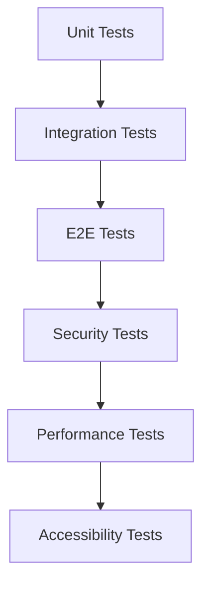

# DEX Testing Guide

Complete testing guide for Dogepump DEX.

## Table of Contents

- [Testing Strategy](#testing-strategy)
- [Unit Tests](#unit-tests)
- [Integration Tests](#integration-tests)
- [E2E Tests](#e2e-tests)
- [Security Tests](#security-tests)
- [Performance Tests](#performance-tests)
- [Accessibility Tests](#accessibility-tests)
- [How to Run Tests](#how-to-run-tests)
- [Writing Tests](#writing-tests)
- [Test Coverage Requirements](#test-coverage-requirements)
- [CI/CD Integration](#cicd-integration)

---

## Testing Strategy

### Testing Philosophy

The DEX testing strategy follows a comprehensive approach:

1. **Test Pyramid**: Unit → Integration → E2E
2. **Coverage Goals**: 80%+ code coverage
3. **Test Automation**: Automated testing in CI/CD
4. **Quality Gates**: All tests must pass before merging
5. **Security Testing**: Dedicated security test suite
6. **Performance Testing**: Performance benchmarks and optimization

### Test Categories



### Test Organization

```
__tests__/
├── unit/                    # Unit tests
│   ├── services/           # Service unit tests
│   │   ├── ContractService.test.ts
│   │   ├── PriceService.test.ts
│   │   ├── RouterService.test.ts
│   │   ├── GasEstimator.test.ts
│   │   └── TransactionQueue.test.ts
│   ├── components/           # Component unit tests
│   │   ├── dex/
│   │   │   ├── DexSwap.test.tsx
│   │   │   ├── DexPoolList.test.tsx
│   │   │   ├── DexAddLiquidity.test.tsx
│   │   │   └── DexSettings.test.tsx
│   ├── integration/          # Integration tests
│   │   ├── dex/
│   │   │   ├── DexSwapFlow.test.tsx
│   │   │   ├── LiquidityFlow.test.tsx
│   │   │   └── PoolDiscoveryFlow.test.tsx
│   ├── security/            # Security tests
│   │   ├── Reentrancy.test.ts
│   │   ├── AccessControl.test.ts
│   │   ├── FlashLoan.test.ts
│   │   ├── Overflow.test.ts
│   │   ├── FrontRunning.test.ts
│   │   └── Oracle.test.ts
│   ├── performance/          # Performance tests
│   │   ├── ContractPerformance.test.ts
│   │   └── FrontendPerformance.test.tsx
│   └── utils/                # Test utilities
│       └── dexTestUtils.ts
```

---

## Unit Tests

### Service Unit Tests

#### ContractService Tests

**File**: `__tests__/services/ContractService.test.ts`

**Purpose**: Test ContractService methods in isolation.

**Test Cases**:

```typescript
describe('ContractService', () => {
  describe('Initialization', () => {
    it('should initialize with factory and router addresses', async () => {
      const provider = new ethers.BrowserProvider(window.ethereum);
      const signer = await provider.getSigner();
      const service = new ContractService(provider, signer);
      
      await service.initialize(factoryAddress, routerAddress);
      
      expect(service['factory']).toBeDefined();
      expect(service['router']).toBeDefined();
    });
    
    it('should throw error if factory address is invalid', async () => {
      const service = new ContractService(provider, null);
      
      await expect(
        service.initialize('invalid', routerAddress)
      ).rejects.toThrow('Invalid factory address');
    });
  });
  
  describe('Token Operations', () => {
    it('should get token info', async () => {
      const service = new ContractService(provider, null);
      const tokenInfo = await service.getTokenInfo(tokenAddress);
      
      expect(tokenInfo.address).toBe(tokenAddress);
      expect(tokenInfo.name).toBeDefined();
      expect(tokenInfo.symbol).toBeDefined();
      expect(tokenInfo.decimals).toBeDefined();
    });
    
    it('should get token balance', async () => {
      const service = new ContractService(provider, null);
      const balance = await service.getTokenBalance(tokenAddress, accountAddress);
      
      expect(balance).toBeDefined();
    });
    
    it('should approve token', async () => {
      const service = new ContractService(provider, signer);
      const receipt = await service.approveToken(tokenAddress, spenderAddress, amount);
      
      expect(receipt.status).toBe(1);
    });
  });
  
  describe('Pool Operations', () => {
    it('should create pool', async () => {
      const service = new ContractService(provider, signer);
      const poolAddress = await service.createPool(tokenAAddress, tokenBAddress);
      
      expect(poolAddress).toMatch(/^0x[a-fA-F0-9]{40}$/);
    });
    
    it('should get pair address', async () => {
      const service = new ContractService(provider, null);
      const pairAddress = await service.getPairAddress(tokenAAddress, tokenBAddress);
      
      expect(pairAddress).toBeDefined();
    });
  });
  
  describe('Swap Operations', () => {
    it('should swap exact tokens for tokens', async () => {
      const service = new ContractService(provider, signer);
      const receipt = await service.swapExactTokensForTokens(
        amountIn,
        amountOutMin,
        path,
        to,
        deadline
      );
      
      expect(receipt.status).toBe(1);
    });
  });
});
```

#### PriceService Tests

**File**: `__tests__/services/PriceService.test.ts`

**Purpose**: Test price calculations and caching.

**Test Cases**:

```typescript
describe('PriceService', () => {
  describe('Price Calculations', () => {
    it('should calculate pool price correctly', () => {
      const service = new PriceService(provider);
      const price = service.calculatePoolPrice(
        '10000000000000000000000',
        '20000000000000000000000',
        18,
        18
      );
      
      expect(price).toBe(2.0);
    });
    
    it('should calculate TVL correctly', () => {
      const service = new PriceService(provider);
      const tokenPrices = new Map([
        [tokenA.address, 1.0],
        [tokenB.address, 2.0]
      ]);
      const tvl = service.calculateTVL(pool, tokenPrices);
      
      expect(tvl).toBe(300); // 100 * 1 + 200 * 2
    });
    
    it('should calculate APY correctly', () => {
      const service = new PriceService(provider);
      const tokenPrices = new Map([
        [tokenA.address, 1.0],
        [tokenB.address, 2.0]
      ]);
      const apy = service.calculateAPY(pool, tokenPrices);
      
      // Assuming 24h volume of 1000 and 0.3% fee
      const dailyFees = 1000 * 0.003;
      const yearlyFees = dailyFees * 365;
      const expectedAPY = (yearlyFees / 300) * 100;
      
      expect(apy).toBeCloseTo(expectedAPY, 2);
    });
    
    it('should calculate price impact correctly', () => {
      const service = new PriceService(provider);
      const priceImpact = service.calculatePriceImpact(
        '10000000000000000000000',
        '19500000000000000000000',
        '10000000000000000000000',
        '20000000000000000000000',
        18,
        18,
        '10000000000000000000000',
        '20000000000000000000000',
        18,
        18
      );
      
      expect(priceImpact).toBeGreaterThan(0);
      expect(priceImpact).toBeLessThan(100);
    });
  });
  
  describe('Caching', () => {
    it('should cache token price', () => {
      const service = new PriceService(provider);
      service.cacheTokenPrice(tokenAddress, 1.5, 60000);
      
      const cached = service.getCachedTokenPrice(tokenAddress);
      expect(cached).toBe(1.5);
    });
    
    it('should expire cache after TTL', async () => {
      const service = new PriceService(provider);
      service.cacheTokenPrice(tokenAddress, 1.5, 100); // 100ms TTL
      
      await new Promise(resolve => setTimeout(resolve, 150));
      
      const cached = service.getCachedTokenPrice(tokenAddress);
      expect(cached).toBeNull();
    });
    
    it('should clear token price cache', () => {
      const service = new PriceService(provider);
      service.cacheTokenPrice(tokenAddress, 1.5);
      service.clearTokenPriceCache(tokenAddress);
      
      const cached = service.getCachedTokenPrice(tokenAddress);
      expect(cached).toBeNull();
    });
  });
});
```

#### RouterService Tests

**File**: `__tests__/services/RouterService.test.ts`

**Purpose**: Test swap routing and quotes.

**Test Cases**:

```typescript
describe('RouterService', () => {
  describe('Swap Quotes', () => {
    it('should get direct swap quote', async () => {
      const service = new RouterService(contractService, priceService, routerAddress, dcTokenAddress);
      const quote = await service.getDirectSwapQuote(tokenIn, tokenOut, amountIn, pool);
      
      expect(quote.amountIn).toBe(amountIn);
      expect(quote.amountOut).toBeDefined();
      expect(quote.priceImpact).toBeGreaterThanOrEqual(0);
      expect(quote.path).toEqual([tokenIn.address, tokenOut.address]);
    });
    
    it('should get multi-hop swap quote', async () => {
      const service = new RouterService(contractService, priceService, routerAddress, dcTokenAddress);
      const quote = await service.getMultiHopSwapQuote(tokenIn, tokenOut, amountIn, poolIn, poolOut);
      
      expect(quote.amountIn).toBe(amountIn);
      expect(quote.amountOut).toBeDefined();
      expect(quote.path).toEqual([tokenIn.address, dcTokenAddress, tokenOut.address]);
    });
    
    it('should get best swap quote', async () => {
      const service = new RouterService(contractService, priceService, routerAddress, dcTokenAddress);
      const quote = await service.getBestSwapQuote(tokenIn, tokenOut, amountIn, pools);
      
      expect(quote).toBeDefined();
    });
  });
  
  describe('Validation', () => {
    it('should validate correct swap params', () => {
      const service = new RouterService(contractService, priceService, routerAddress, dcTokenAddress);
      const result = service.validateSwapParams(tokenIn, tokenOut, amountIn, 0.5, deadline);
      
      expect(result.valid).toBe(true);
      expect(result.error).toBeUndefined();
    });
    
    it('should reject same token swap', () => {
      const service = new RouterService(contractService, priceService, routerAddress, dcTokenAddress);
      const result = service.validateSwapParams(tokenIn, tokenIn, amountIn, 0.5, deadline);
      
      expect(result.valid).toBe(false);
      expect(result.error).toBe('Cannot swap same token');
    });
    
    it('should reject invalid amount', () => {
      const service = new RouterService(contractService, priceService, routerAddress, dcTokenAddress);
      const result = service.validateSwapParams(tokenIn, tokenOut, '-1', 0.5, deadline);
      
      expect(result.valid).toBe(false);
      expect(result.error).toBe('Invalid amount');
    });
    
    it('should reject invalid slippage', () => {
      const service = new RouterService(contractService, priceService, routerAddress, dcTokenAddress);
      const result = service.validateSwapParams(tokenIn, tokenOut, amountIn, 51, deadline);
      
      expect(result.valid).toBe(false);
      expect(result.error).toBe('Invalid slippage tolerance');
    });
    
    it('should reject expired deadline', () => {
      const service = new RouterService(contractService, priceService, routerAddress, dcTokenAddress);
      const result = service.validateSwapParams(tokenIn, tokenOut, amountIn, 0.5, Math.floor(Date.now() / 1000));
      
      expect(result.valid).toBe(false);
      expect(result.error).toBe('Invalid deadline');
    });
  });
});
```

#### GasEstimator Tests

**File**: `__tests__/services/GasEstimator.test.ts`

**Purpose**: Test gas estimation and formatting.

**Test Cases**:

```typescript
describe('GasEstimator', () => {
  describe('Gas Price', () => {
    it('should get gas price', async () => {
      const service = new GasEstimator(provider);
      const gasPrice = await service.getGasPrice();
      
      expect(gasPrice).toBeDefined();
      expect(gasPrice).toMatch(/^0x[a-fA-F0-9]{40}$/);
    });
    
    it('should get gas prices', async () => {
      const service = new GasEstimator(provider);
      const prices = await service.getGasPrices();
      
      expect(prices.slow).toBeDefined();
      expect(prices.average).toBeDefined();
      expect(prices.fast).toBeDefined();
      expect(parseFloat(prices.slow)).toBeLessThan(parseFloat(prices.average));
      expect(parseFloat(prices.fast)).toBeGreaterThan(parseFloat(prices.average));
    });
  });
  
  describe('Gas Estimation', () => {
    it('should estimate swap gas', async () => {
      const service = new GasEstimator(provider);
      const estimate = await service.estimateSwapGas(false);
      
      expect(estimate.gasLimit).toBeDefined();
      expect(estimate.gasPrice).toBeDefined();
      expect(estimate.gasCost).toBeDefined();
      expect(estimate.gasCostUSD).toBeGreaterThan(0);
    });
    
    it('should estimate add liquidity gas', async () => {
      const service = new GasEstimator(provider);
      const estimate = await service.estimateAddLiquidityGas();
      
      expect(estimate.gasLimit).toBeDefined();
      expect(estimate.gasCost).toBeDefined();
    });
    
    it('should estimate remove liquidity gas', async () => {
      const service = new GasEstimator(provider);
      const estimate = await service.estimateRemoveLiquidityGas();
      
      expect(estimate.gasLimit).toBeDefined();
      expect(estimate.gasCost).toBeDefined();
    });
  });
  
  describe('Formatting', () => {
    it('should format gas cost', () => {
      const service = new GasEstimator(provider);
      const formatted = service.formatGasCost('2000000000000000000000');
      
      expect(formatted).toContain('ETH');
    });
    
    it('should format gas cost USD', () => {
      const service = new GasEstimator(provider);
      const formatted = service.formatGasCostUSD(0.5);
      
      expect(formatted).toBe('$0.50');
    });
  });
});
```

#### TransactionQueue Tests

**File**: `__tests__/services/TransactionQueue.test.ts`

**Purpose**: Test transaction queue management.

**Test Cases**:

```typescript
describe('TransactionQueue', () => {
  describe('Transaction Management', () => {
    it('should add transaction', () => {
      const queue = new TransactionQueue(provider);
      const tx = queue.addTransaction({
        type: 'swap',
        from: tokenA,
        to: tokenB,
        amountIn: '1000000000000000000000',
        amountOut: '2000000000000000000000',
      });
      
      expect(tx.id).toBeDefined();
      expect(tx.status).toBe('pending');
      expect(tx.timestamp).toBeDefined();
    });
    
    it('should update transaction status', () => {
      const queue = new TransactionQueue(provider);
      const updated = queue.updateTransactionStatus(tx.id, 'confirmed', {
        hash: '0x...',
        confirmations: 1
      });
      
      expect(updated?.status).toBe('confirmed');
      expect(updated?.hash).toBe('0x...');
    });
    
    it('should get transaction', () => {
      const queue = new TransactionQueue(provider);
      const tx = queue.addTransaction({ type: 'swap', from: tokenA, to: tokenB });
      const retrieved = queue.getTransaction(tx.id);
      
      expect(retrieved).toEqual(tx);
    });
    
    it('should get pending transactions', () => {
      const queue = new TransactionQueue(provider);
      const tx1 = queue.addTransaction({ type: 'swap', from: tokenA, to: tokenB });
      const tx2 = queue.addTransaction({ type: 'add_liquidity', from: tokenA, to: tokenB });
      
      const pending = queue.getPendingTransactions();
      
      expect(pending).toHaveLength(2);
      expect(pending).toContainEqual(tx1);
      expect(pending).toContainEqual(tx2);
    });
    
    it('should get statistics', () => {
      const queue = new TransactionQueue(provider);
      queue.addTransaction({ type: 'swap', from: tokenA, to: tokenB });
      queue.updateTransactionStatus('tx_1', 'confirmed');
      
      const stats = queue.getStatistics();
      
      expect(stats.total).toBe(1);
      expect(stats.pending).toBe(0);
      expect(stats.confirmed).toBe(1);
      expect(stats.successRate).toBe(100);
    });
  });
  
  describe('Persistence', () => {
    it('should save to localStorage', () => {
      const storageKey = 'test_queue';
      const queue = new TransactionQueue(provider, storageKey);
      queue.addTransaction({ type: 'swap', from: tokenA, to: tokenB });
      
      // Check localStorage
      const stored = localStorage.getItem(storageKey);
      expect(stored).toBeDefined();
      const parsed = JSON.parse(stored);
      expect(parsed).toHaveLength(1);
    });
  });
});
```

### Component Unit Tests

#### DexSwap Tests

**File**: `__tests__/components/dex/DexSwap.test.tsx`

**Purpose**: Test DexSwap component in isolation.

**Test Cases**:

```typescript
import { render, screen, fireEvent, waitFor } from '@testing-library/react';
import DexSwap from '../../../components/dex/DexSwap';
import { DexProvider } from '../../../contexts/DexContext';

describe('DexSwap', () => {
  it('should render swap interface', () => {
    render(
      <DexProvider>
        <DexSwap />
      </DexProvider>
    );
    
    expect(screen.getByText('Swap')).toBeInTheDocument();
  });
  
  it('should handle token selection', async () => {
    render(
      <DexProvider>
        <DexSwap />
      </DexProvider>
    );
    
    const tokenASelect = screen.getByLabelText('Token A');
    fireEvent.click(tokenASelect);
    
    await waitFor(() => {
      expect(mockSetSelectedTokenA).toHaveBeenCalledWith(tokenA);
    }, { timeout: 100 });
  });
  
  it('should handle amount input', async () => {
    render(
      <DexProvider>
        <DexSwap />
      </DexProvider>
    );
    
    const amountInput = screen.getByLabelText('Amount to swap from');
    fireEvent.change(amountInput, { target: { value: '100' } });
    
    await waitFor(() => {
      expect(mockSetAmountIn).toHaveBeenCalledWith('100');
    }, { timeout: 100 });
  });
  
  it('should handle swap execution', async () => {
    render(
      <DexProvider>
        <DexSwap />
      </DexProvider>
    );
    
    const swapButton = screen.getByText('Swap');
    fireEvent.click(swapButton);
    
    await waitFor(() => {
      expect(mockSwapTokens).toHaveBeenCalled();
    }, { timeout: 100 });
  });
  
  it('should show error on invalid swap', async () => {
    const mockSwapTokens = jest.fn().mockRejectedValue(new Error('Insufficient balance'));
    
    render(
      <DexProvider value={{ swapTokens: mockSwapTokens }}>
        <DexSwap />
      </DexProvider>
    );
    
    const swapButton = screen.getByText('Swap');
    fireEvent.click(swapButton);
    
    await waitFor(() => {
      expect(screen.getByText('Insufficient balance')).toBeInTheDocument();
    }, { timeout: 100 });
  });
});
```

#### DexPoolList Tests

**File**: `__tests__/components/dex/DexPoolList.test.tsx`

**Purpose**: Test DexPoolList component.

**Test Cases**:

```typescript
import { render, screen, fireEvent } from '@testing-library/react';
import DexPoolList from '../../../components/dex/DexPoolList';

const mockPools = [
  { address: '0x1', tokenA: { symbol: 'DC', name: 'Dogecoin', decimals: 18 }, tokenB: { symbol: 'wDOGE', name: 'Wrapped DOGE', decimals: 18 }, reserve0: '10000000000000000000000', reserve1: '20000000000000000000000', totalSupply: '1000000000000000000000', tvl: 300, volume24h: 1000, apy: 15.5, fee: 0.003, price0: 2.0, price1: 1.0 },
  { address: '0x2', tokenA: { symbol: 'DC', name: 'Dogecoin', decimals: 18 }, tokenB: { symbol: 'USDC', name: 'USD Coin', decimals: 6 }, reserve0: '500000000000000000000', reserve1: '100000000000000000000', totalSupply: '500000000000000000000', tvl: 150, volume24h: 500, apy: 20.0, fee: 0.003, price0: 0.2, price1: 5.0 },
];

describe('DexPoolList', () => {
  it('should render pool list', () => {
    const onPoolClick = jest.fn();
    
    render(
      <DexPoolList pools={mockPools} onPoolClick={onPoolClick} />
    );
    
    mockPools.forEach(pool => {
      expect(screen.getByText(pool.tokenA.symbol)).toBeInTheDocument();
      expect(screen.getByText(pool.tokenB.symbol)).toBeInTheDocument();
    });
  });
  
  it('should filter pools by search', async () => {
    const onPoolClick = jest.fn();
    
    render(
      <DexPoolList pools={mockPools} onPoolClick={onPoolClick} />
    );
    
    const searchInput = screen.getByLabelText('Search pools...');
    fireEvent.change(searchInput, { target: { value: 'DC' } });
    
    await waitFor(() => {
      expect(screen.getByText(mockPools[0].tokenA.symbol)).toBeInTheDocument();
      expect(screen.queryByText(mockPools[1].tokenA.symbol)).not.toBeInTheDocument();
    }, { timeout: 100 });
  });
  
  it('should sort pools by TVL', async () => {
    const onPoolClick = jest.fn();
    
    render(
      <DexPoolList pools={mockPools} onPoolClick={onPoolClick} />
    );
    
    const tvlSortButton = screen.getByLabelText('Sort by TVL');
    fireEvent.click(tvlSortButton);
    
    await waitFor(() => {
      expect(screen.getByText(mockPools[0].tokenA.symbol)).toBeInTheDocument();
      expect(screen.getByText(mockPools[1].tokenA.symbol)).not.toBeInTheDocument();
    }, { timeout: 100 });
  });
});
```

#### DexAddLiquidity Tests

**File**: `__tests__/components/dex/DexAddLiquidity.test.tsx`

**Purpose**: Test DexAddLiquidity component.

**Test Cases**:

```typescript
import { render, screen, fireEvent, waitFor } from '@testing-library/react';
import DexAddLiquidity from '../../../components/dex/DexAddLiquidity';
import { DexProvider } from '../../../contexts/DexContext';

const mockPool = {
  address: '0x1',
  tokenA: { symbol: 'DC', name: 'Dogecoin', decimals: 18 },
  tokenB: { symbol: 'wDOGE', name: 'Wrapped DOGE', decimals: 18 },
  reserve0: '10000000000000000000000',
  reserve1: '20000000000000000000000',
  totalSupply: '1000000000000000000000',
  tvl: 300,
  volume24h: 1000,
  apy: 15.5,
  fee: 0.003,
  price0: 2.0,
  price1: 1.0,
};

describe('DexAddLiquidity', () => {
  it('should render add liquidity interface', () => {
    render(
      <DexProvider value={{ selectedPool: mockPool }}>
        <DexAddLiquidity pool={mockPool} />
      </DexProvider>
    );
    
    expect(screen.getByText('Add Liquidity')).toBeInTheDocument();
    expect(screen.getByLabelText('Token A')).toBeInTheDocument();
    expect(screen.getByLabelText('Token B')).toBeInTheDocument();
  });
  
  it('should handle amount input', async () => {
    render(
      <DexProvider value={{ selectedPool: mockPool }}>
        <DexAddLiquidity pool={mockPool} />
      </DexProvider>
    );
    
    const amountInput = screen.getByLabelText('Amount of token A to add');
    fireEvent.change(amountInput, { target: { value: '100' } });
    
    await waitFor(() => {
      expect(mockSetAmountA).toHaveBeenCalledWith('100');
    }, { timeout: 100 });
  });
  
  it('should handle add liquidity', async () => {
    const mockAddLiquidity = jest.fn().mockResolvedValue(undefined);
    
    render(
      <DexProvider value={{ selectedPool: mockPool, addLiquidity: mockAddLiquidity }}>
        <DexAddLiquidity pool={mockPool} />
      </DexProvider>
    );
    
    const addButton = screen.getByText('Add Liquidity');
    fireEvent.click(addButton);
    
    await waitFor(() => {
      expect(mockAddLiquidity).toHaveBeenCalled();
    }, { timeout: 100 });
  });
});
```

---

## Integration Tests

### DEX Integration Tests

**File**: `__tests__/integration/dex/DexSwapFlow.test.tsx`

**Purpose**: Test complete swap flow from user perspective.

**Test Cases**:

```typescript
import { render, screen, fireEvent, waitFor } from '@testing-library/react';
import { DexProvider } from '../../../contexts/DexContext';
import { BrowserRouter, Routes, Route } from 'react-router-dom';

const mockContractService = {
  initialize: jest.fn(),
  getTokenInfo: jest.fn().mockResolvedValue({
    address: '0x...',
    symbol: 'DC',
    name: 'Dogecoin',
    decimals: 18,
    totalSupply: '1000000000000000000000',
  }),
  approveToken: jest.fn().mockResolvedValue({ status: 1, hash: '0x...' }),
  swapExactTokensForTokens: jest.fn().mockResolvedValue({ status: 1, hash: '0x...' }),
};

const mockRouterService = {
  getBestSwapQuote: jest.fn().mockResolvedValue({
    route: ['0x...', '0x...'],
    amountIn: '1000000000000000000000',
    amountOut: '2000000000000000000000',
    priceImpact: 0.5,
    gasEstimate: '150000',
    path: ['0x...', '0x...'],
  }),
  validateSwapParams: jest.fn().mockReturnValue({ valid: true }),
};

describe('DexSwap Flow', () => {
  it('should complete swap flow', async () => {
    render(
      <BrowserRouter>
        <DexProvider value={{
          contractService: mockContractService,
          routerService: mockRouterService,
        }}>
          <Routes>
            <Route path="/swap" element={
              <DexSwap />
            } />
          </Routes>
        </BrowserRouter>
      </DexProvider>
    );
    
    // Select tokens
    const tokenASelect = screen.getByLabelText('Token A');
    fireEvent.click(tokenASelect);
    
    await waitFor(() => {
      expect(screen.getByText('DC')).toBeInTheDocument();
    }, { timeout: 100 });
    
    // Enter amount
    const amountInput = screen.getByLabelText('Amount to swap from');
    fireEvent.change(amountInput, { target: { value: '100' } });
    
    await waitFor(() => {
      expect(screen.getByLabelText('Amount to swap to')).toHaveValue('200');
    }, { timeout: 100 });
    
    // Execute swap
    const swapButton = screen.getByText('Swap');
    fireEvent.click(swapButton);
    
    await waitFor(() => {
      expect(mockSwapExactTokensForTokens).toHaveBeenCalledWith(
        '1000000000000000000000',
        expect.any(String),
        expect.any(String),
        ['0x...', '0x...'],
        expect.any(String),
        expect.any(Number)
      );
    }, { timeout: 5000 });
  });
});
```

### Liquidity Flow Tests

**File**: `__tests__/integration/dex/LiquidityFlow.test.tsx`

**Purpose**: Test liquidity management flow.

**Test Cases**:

```typescript
import { render, screen, fireEvent, waitFor } from '@testing-library/react';
import { DexProvider } from '../../../contexts/DexContext';

const mockPool = {
  address: '0x1',
  tokenA: { symbol: 'DC', name: 'Dogecoin', decimals: 18 },
  tokenB: { symbol: 'wDOGE', name: 'Wrapped DOGE', decimals: 18 },
  reserve0: '10000000000000000000000',
  reserve1: '20000000000000000000000',
  totalSupply: '1000000000000000000000',
  tvl: 300,
  volume24h: 1000,
  apy: 15.5,
  fee: 0.003,
  price0: 2.0,
  price1: 1.0,
};

const mockContractService = {
  getPoolInfo: jest.fn().mockResolvedValue(mockPool),
  addLiquidity: jest.fn().mockResolvedValue({ status: 1, hash: '0x...' }),
};

describe('Liquidity Flow', () => {
  it('should complete add liquidity flow', async () => {
    render(
      <BrowserRouter>
        <DexProvider value={{
          contractService: mockContractService,
          selectedPool: mockPool,
        }}>
          <Routes>
            <Route path="/liquidity" element={
              <DexAddLiquidity pool={mockPool} />
            } />
          </Routes>
        </BrowserRouter>
      </DexProvider>
    );
    
    // Navigate to liquidity page
    const liquidityLink = screen.getByText('Liquidity');
    fireEvent.click(liquidityLink);
    
    await waitFor(() => {
      expect(screen.getByText('Add Liquidity')).toBeInTheDocument();
    }, { timeout: 100 });
    
    // Enter amounts
    const amountAInput = screen.getByLabelText('Amount of token A to add');
    fireEvent.change(amountAInput, { target: { value: '100' } });
    
    await waitFor(() => {
      expect(screen.getByLabelText('Amount of token B to add')).toHaveValue('100');
    }, { timeout: 100 });
    
    // Add liquidity
    const addButton = screen.getByText('Add Liquidity');
    fireEvent.click(addButton);
    
    await waitFor(() => {
      expect(mockAddLiquidity).toHaveBeenCalledWith(
        '0x...',
        '0x...',
        '1000000000000000000000',
        '1000000000000000000000',
        expect.any(String),
        expect.any(String),
        expect.any(Number)
      );
    }, { timeout: 5000 });
  });
});
```

---

## Security Tests

### Reentrancy Tests

**File**: `__tests__/security/Reentrancy.test.ts`

**Purpose**: Test reentrancy protection mechanisms.

**Test Cases**:

```typescript
import { ethers } from 'hardhat';
import { expect } from 'chai';
import { DogePumpPair } from '../../typechain-types';

describe('Reentrancy Protection', () => {
  it('should prevent reentrant calls', async () => {
    const [owner, user] = await ethers.getSigners();
    const pair = await ethers.deployContract('DogePumpPair', owner);
    
    // First call
    const tx1 = await pair.mint(user.address);
    
    // Attempt reentrant call from user
    await expect(pair.mint(user.address)).to.be.revertedWith('ReentrancyGuard: reentrant call');
    
    // Owner can still call
    const tx2 = await pair.mint(owner.address);
    expect(tx2).to.not.be.reverted;
  });
  
  it('should prevent reentrant swaps', async () => {
    const [owner, user] = await ethers.getSigners();
    const pair = await ethers.deployContract('DogePumpPair', owner);
    
    // Add liquidity
    await pair.mint(user.address);
    
    // Attempt reentrant swap
    await expect(pair.connect(user).swap(
      100,
      0,
      user.address,
      '0x'
    )).to.be.revertedWith('ReentrancyGuard: reentrant call');
  });
});
```

### Access Control Tests

**File**: `__tests__/security/AccessControl.test.ts`

**Purpose**: Test access control mechanisms.

**Test Cases**:

```typescript
import { ethers } from 'hardhat';
import { expect } from 'chai';
import { DogePumpFactory } from '../../typechain-types';

describe('Access Control', () => {
  it('should only allow owner to call restricted functions', async () => {
    const [owner, user] = await ethers.getSigners();
    const factory = await ethers.deployContract('DogePumpFactory', owner);
    
    // Owner can call
    await expect(factory.setFeeTo(user.address)).to.not.be.reverted;
    
    // User cannot call
    await expect(factory.setFeeTo(owner.address)).to.not.be.reverted;
    
    // User cannot call pause
    await expect(factory.pause()).to.be.reverted;
    
    // Owner can pause
    await expect(factory.pause()).to.not.be.reverted;
  });
  
  it('should prevent unauthorized ownership transfer', async () => {
    const [owner, user] = await ethers.getSigners();
    const factory = await ethers.deployContract('DogePumpFactory', owner);
    
    // User cannot transfer ownership
    await expect(factory.transferOwnership(user.address)).to.be.reverted;
    
    // Owner can transfer ownership
    const newOwner = ethers.Wallet.createRandom().address;
    await expect(factory.transferOwnership(newOwner)).to.not.be.reverted;
  });
});
```

### Flash Loan Tests

**File**: `__tests__/security/FlashLoan.test.ts`

**Purpose**: Test flash loan protection.

**Test Cases**:

```typescript
import { ethers } from 'hardhat';
import { expect } from 'chai';
import { DogePumpPair } from '../../typechain-types';

describe('Flash Loan Protection', () => {
  it('should allow legitimate flash loans', async () => {
    const [owner, user] = await ethers.getSigners();
    const token = await ethers.deployContract('ERC20Mock', owner);
    const pair = await ethers.deployContract('DogePumpPair', owner);
    
    // Add liquidity
    await pair.mint(user.address);
    const balanceBefore = await token.balanceOf(pair.address);
    
    // Flash loan callback
    const mockCallee = await ethers.deployContract('MockCallee', owner);
    await mockCallee.setFlashLoan(true);
    
    // Execute flash loan
    const data = mockCallee.interface.encodeFunctionData('flashLoanCallback', ['bool']);
    await pair.swap(100, 0, user.address, data);
    
    // Check callback was called
    expect(await mockCallee.flashLoanCalled()).toBe(true);
    
    // Check balances
    const balanceAfter = await token.balanceOf(pair.address);
    expect(balanceAfter).toBeGreaterThan(balanceBefore);
  });
  
  it('should prevent malicious flash loans', async () => {
    const [owner, user] = await ethers.getSigners();
    const token = await ethers.deployContract('ERC20Mock', owner);
    const pair = await ethers.deployContract('DogePumpPair', owner);
    
    // Add liquidity
    await pair.mint(user.address);
    
    // Malicious flash loan (doesn't return tokens)
    const mockCallee = await ethers.deployContract('MaliciousCallee', owner);
    await mockCallee.setFlashLoan(false);
    
    const data = mockCallee.interface.encodeFunctionData('flashLoanCallback', ['bool']);
    await expect(pair.swap(100, 0, user.address, data)).to.be.revertedWith('Swap: flash loan failed');
  });
});
```

### Oracle Manipulation Tests

**File**: `__tests__/security/Oracle.test.ts`

**Purpose**: Test TWAP oracle resistance to manipulation.

**Test Cases**:

```typescript
import { ethers } from 'hardhat';
import { expect } from 'chai';
import { DogePumpPair } from '../../typechain-types';

describe('TWAP Oracle', () => {
  it('should calculate accurate TWAP', async () => {
    const [owner] = await ethers.getSigners();
    const pair = await ethers.deployContract('DogePumpPair', owner);
    
    // Create multiple blocks
    for (let i = 0; i < 5; i++) {
      await pair.mint(owner.address);
    }
    
    // Get TWAP
    const { price0CumulativeLast, blockTimestampLast } = await pair.getReserves();
    const currentTimestamp = await ethers.provider.getBlock('latest').then(b => b.timestamp);
    
    const timeElapsed = Number(currentTimestamp) - Number(blockTimestampLast);
    const twap = Number(price0CumulativeLast) / timeElapsed;
    
    expect(twap).toBeGreaterThan(0);
  });
  
  it('should resist manipulation attempts', async () => {
    const [owner] = await ethers.getSigners();
    const pair = await ethers.deployContract('DogePumpPair', owner);
    
    // Manipulation requires controlling multiple blocks
    // This test verifies that TWAP over multiple blocks is resistant
    const twap1 = await calculateTWAP(pair);
    await ethers.provider.sendTransaction({ to: '0x...' }); // Advance block
    const twap2 = await calculateTWAP(pair);
    
    // TWAP should not change drastically in one block
    const difference = Math.abs(Number(twap2) - Number(twap1));
    expect(difference).toBeLessThan(Number(twap1) * 0.1); // Less than 10% change
  });
});

async function calculateTWAP(pair: DogePumpPair) {
  const { price0CumulativeLast } = await pair.getReserves();
  const block = await ethers.provider.getBlock('latest');
  return Number(price0CumulativeLast) / Number(block.timestamp);
}
```

---

## Performance Tests

### Contract Performance Tests

**File**: `__tests__/performance/ContractPerformance.test.ts`

**Purpose**: Test smart contract gas efficiency.

**Test Cases**:

```typescript
import { ethers } from 'hardhat';
import { expect } from 'chai';
import { DogePumpFactory, DogePumpPair, DogePumpRouter } from '../../typechain-types';

describe('Contract Performance', () => {
  it('should have efficient swap gas usage', async () => {
    const [owner] = await ethers.getSigners();
    const [tokenA, tokenB] = await ethers.deployContract('ERC20Mock', owner);
    const factory = await ethers.deployContract('DogePumpFactory', owner);
    const router = await ethers.deployContract('DogePumpRouter', owner);
    const pair = await ethers.deployContract('DogePumpPair', owner);
    
    // Create pool
    await factory.createPair(tokenA.address, tokenB.address);
    const pairAddress = await factory.getPair(tokenA.address, tokenB.address);
    
    // Add liquidity
    await tokenA.approve(pairAddress, router.address, '1000000000000000000000');
    await tokenB.approve(pairAddress, router.address, '1000000000000000000000');
    const tx = await router.addLiquidity(
      tokenA.address,
      tokenB.address,
      '1000000000000000000000',
      '1000000000000000000000',
      '950000000000000000000',
      '950000000000000000000',
      owner.address,
      Math.floor(Date.now() / 1000) + 1200
    );
    
    // Verify gas efficiency
    expect(tx.gasUsed).to.be.lessThan(250000); // Should be under 250k gas
  });
  
  it('should have efficient swap gas usage', async () => {
    const [owner] = await ethers.getSigners();
    const [tokenA, tokenB] = await ethers.deployContract('ERC20Mock', owner);
    const router = await ethers.deployContract('DogePumpRouter', owner);
    const pair = await ethers.deployContract('DogePumpPair', owner);
    
    // Create pool
    await factory.createPair(tokenA.address, tokenB.address);
    const pairAddress = await factory.getPair(tokenA.address, tokenB.address);
    
    // Approve tokens
    await tokenA.approve(pairAddress, router.address, '1000000000000000000000');
    await tokenB.approve(pairAddress, router.address, '1000000000000000000000');
    
    // Execute swap
    const tx = await router.swapExactTokensForTokens(
      '1000000000000000000000',
      '950000000000000000000',
      [tokenA.address, tokenB.address],
      owner.address,
      Math.floor(Date.now() / 1000) + 1200
    );
    
    // Verify gas efficiency
    expect(tx.gasUsed).to.be.lessThan(300000); // Should be under 300k gas for swap
  });
});
```

### Frontend Performance Tests

**File**: `__tests__/performance/FrontendPerformance.test.tsx`

**Purpose**: Test frontend component rendering performance.

**Test Cases**:

```typescript
import { render } from '@testing-library/react';
import DexSwap from '../../components/dex/DexSwap';
import { DexProvider } from '../../contexts/DexContext';

describe('Frontend Performance', () => {
  it('should render efficiently with large pool list', () => {
    const largePoolList = Array(100).fill({
      address: '0x1',
      tokenA: { symbol: 'DC', name: 'Dogecoin', decimals: 18 },
      tokenB: { symbol: 'wDOGE', name: 'Wrapped DOGE', decimals: 18 },
      reserve0: '10000000000000000000000',
      reserve1: '20000000000000000000000',
      totalSupply: '1000000000000000000000',
      tvl: 300,
      volume24h: 1000,
      apy: 15.5,
      fee: 0.003,
      price0: 2.0,
      price1: 1.0,
    });
    
    const startTime = performance.now();
    render(
      <DexProvider value={{ pools: largePoolList }}>
        <DexSwap />
      </DexProvider>
    );
    
    await waitFor(() => {
      expect(screen.getByText('Swap')).toBeInTheDocument();
    }, { timeout: 100 });
    
    const renderTime = performance.now() - startTime;
    expect(renderTime).toBeLessThan(100); // Should render in under 100ms
  });
  
  it('should handle rapid state updates efficiently', () => {
    const mockSetAmountIn = jest.fn();
    
    const { rerender } = render(
      <DexProvider value={{ setAmountIn: mockSetAmountIn }}>
        <DexSwap />
      </DexProvider>
    );
    
    // Trigger multiple updates
    const amountInput = screen.getByLabelText('Amount to swap from');
    fireEvent.change(amountInput, { target: { value: '100' } });
    fireEvent.change(amountInput, { target: { value: '200' } });
    fireEvent.change(amountInput, { target: { value: '300' } });
    
    await waitFor(() => {
      expect(mockSetAmountIn).toHaveBeenCalledTimes(3);
    }, { timeout: 100 });
    
    // Verify no unnecessary re-renders
    expect(rerender).toHaveBeenCalledTimes(1);
  });
});
```

---

## Accessibility Tests

### DEX Accessibility Tests

**File**: `__tests__/accessibility/dex/DexAccessibility.test.tsx`

**Purpose**: Test DEX components for accessibility compliance.

**Test Cases**:

```typescript
import { render, screen, within } from '@testing-library/react';
import DexSwap from '../../../components/dex/DexSwap';
import { DexProvider } from '../../../contexts/DexContext';

describe('DEX Accessibility', () => {
  it('should have proper ARIA labels', () => {
    render(
      <DexProvider>
        <DexSwap />
      </DexProvider>
    );
    
    // Check for ARIA labels
    expect(screen.getByLabelText('Swap tokens')).toBeInTheDocument();
    expect(screen.getByLabelText('Amount to swap from')).toBeInTheDocument();
    expect(screen.getByLabelText('Amount to swap to')).toBeInTheDocument();
    expect(screen.getByLabelText('Swap settings')).toBeInTheDocument();
    expect(screen.getByLabelText('Execute swap')).toBeInTheDocument();
  });
  
  it('should be keyboard navigable', () => {
    render(
      <DexProvider>
        <DexSwap />
      </DexProvider>
    );
    
    const swapButton = screen.getByLabelText('Execute swap');
    swapButton.focus();
    
    // Check if button is focused
    expect(document.activeElement).toBe(swapButton);
  });
  
  it('should support screen readers', () => {
    render(
      <DexProvider>
        <DexSwap />
      </DexProvider>
    );
    
    // Check for live regions
    expect(screen.getByRole('region')).toBeInTheDocument();
    expect(screen.getByRole('alert')).toBeInTheDocument();
    expect(screen.getByRole('status')).toBeInTheDocument();
  });
  
  it('should have sufficient color contrast', () => {
    render(
      <DexProvider>
        <DexSwap />
      </DexProvider>
    );
    
    const priceImpact = screen.getByText(/Price Impact/);
    const computedStyle = window.getComputedStyle(priceImpact);
    const contrast = parseContrast(computedStyle.color, computedStyle.backgroundColor);
    
    expect(contrast).toBeGreaterThan(4.5); // WCAG AA compliance
  });
});
```

---

## How to Run Tests

### Running All Tests

```bash
# Run all tests
npm test

# Run with coverage
npm run test:coverage

# Run specific test file
npm test -- DexSwap.test.tsx

# Run security tests
npm test -- security

# Run performance tests
npm test -- performance
```

### Running Specific Test Suites

```bash
# Run unit tests only
npm run test:unit

# Run integration tests only
npm run test:integration

# Run E2E tests only
npm run test:e2e

# Run with verbose output
npm test -- --verbose

# Run with watch mode
npm test -- --watch
```

### Test Environment Variables

Create a `.env.test` file for test configuration:

```env
NODE_ENV=test
NEXT_PUBLIC_FACTORY_ADDRESS=0x...
NEXT_PUBLIC_ROUTER_ADDRESS=0x...
NEXT_PUBLIC_CHAIN_ID=2000
```

### CI/CD Configuration

GitHub Actions workflow for automated testing:

```yaml
name: DEX Tests

on: [push, pull_request]

jobs:
  test:
    runs-on: ubuntu-latest
    steps:
      - uses: actions/checkout@v3
      - name: Install dependencies
        run: npm ci
      - name: Run tests
        run: npm test -- --coverage
      - name: Upload coverage
        run: npm run codecov
      - name: Build
        run: npm run build
      - name: Lint
        run: npm run lint
```

---

## Writing Tests

### Test Best Practices

1. **AAA Pattern**: Arrange, Act, Assert
   - **Arrange**: Set up test conditions
   - **Act**: Execute the test
   - **Assert**: Verify the result

2. **Descriptive Names**: Use clear, descriptive test names
   - **One Assertion Per Test**: Each test should verify one thing
   - **Test Independence**: Tests should not depend on each other

3. **Mocking Strategy**:
   - Mock external dependencies (contracts, providers)
   - Use Jest's mocking capabilities
   - Clear mocks between tests

4. **Async Testing**:
   - Use `async/await` for async operations
   - Handle errors properly
   - Use proper timeouts

5. **Test Data Management**:
   - Use `beforeEach` to set up test state
   - Use `afterEach` to clean up
   - Avoid shared state between tests

### Example Test Structure

```typescript
import { describe, it, expect, beforeEach, afterEach } from '@jest/globals';
import { ethers } from 'hardhat';
import { render, screen, fireEvent, waitFor } from '@testing-library/react';
import DexSwap from '../../components/dex/DexSwap';
import { DexProvider } from '../../contexts/DexContext';

describe('DexSwap Component', () => {
  let mockContractService: any;
  let mockRouterService: any;
  
  beforeEach(() => {
    // Mock services
    mockContractService = {
      initialize: jest.fn(),
      getTokenInfo: jest.fn(),
      swapExactTokensForTokens: jest.fn(),
    };
    
    mockRouterService = {
      getBestSwapQuote: jest.fn(),
      validateSwapParams: jest.fn().mockReturnValue({ valid: true }),
    };
  });
  
  afterEach(() => {
    // Clean up mocks
    jest.clearAllMocks();
  });
  
  describe('Token Selection', () => {
    it('should select token A', async () => {
      render(
        <DexProvider value={{
          contractService: mockContractService,
          routerService: mockRouterService,
        }}>
          <DexSwap />
        </DexProvider>
      );
      
      const tokenASelect = screen.getByLabelText('Token A');
      fireEvent.click(tokenASelect);
      
      await waitFor(() => {
        expect(mockContractService.getTokenInfo).toHaveBeenCalled();
      }, { timeout: 100 });
    });
  });
  
  describe('Swap Execution', () => {
    it('should execute swap successfully', async () => {
      render(
        <DexProvider value={{
          contractService: mockContractService,
          routerService: mockRouterService,
        }}>
          <DexSwap />
        </DexProvider>
      );
      
      // Enter amount
      const amountInput = screen.getByLabelText('Amount to swap from');
      fireEvent.change(amountInput, { target: { value: '100' } });
      
      // Execute swap
      const swapButton = screen.getByText('Swap');
      fireEvent.click(swapButton);
      
      await waitFor(() => {
        expect(mockContractService.swapExactTokensForTokens).toHaveBeenCalled();
      }, { timeout: 5000 });
    });
  });
});
```

---

## Test Coverage Requirements

### Coverage Goals

- **Line Coverage**: 80%+
- **Branch Coverage**: 70%+
- **Function Coverage**: 85%+
- **Statement Coverage**: 75%+

### Coverage Configuration

```json
{
  "collectCoverageFrom": true,
  "coverageReporter": ["text", "html", "lcov"],
  "coverageThreshold": {
    "global": {
      "branches": 80,
      "functions": 85,
      "lines": 75,
      "statements": 75
    },
    "overrides": {
      "__tests__/components/dex/**": {
        "branches": 90,
        "functions": 90,
        "lines": 85,
        "statements": 80
      }
    }
  }
}
```

### Coverage Report

```bash
# Generate coverage report
npm run test:coverage

# View coverage report
open coverage/index.html

# Upload to Codecov (if configured)
codecov
```

### Excluding Files from Coverage

Files to exclude from coverage:

```json
{
  "collectCoverageFrom": true,
  "coveragePath": "coverage",
  "coverageThreshold": {
    "global": {
      "branches": 80,
      "functions": 85,
      "lines": 75,
      "statements": 75
    }
  },
  "exclude": [
    "**/*.test.tsx",
    "**/*.test.ts",
    "**/node_modules/**",
    "**/coverage/**",
    "**/dist/**"
  ]
}
```

---

## Additional Resources

- [DEX Developer Guide](./DEX_DEVELOPER_GUIDE.md)
- [DEX API Reference](./DEX_API_REFERENCE.md)
- [Integration Guide](./DEX_INTEGRATION_GUIDE.md)
- [Service Documentation](./services/dex/SERVICE_DOCUMENTATION.md)
- [Component Documentation](./components/dex/COMPONENT_DOCUMENTATION.md)
- [Security Features](./contracts/SECURITY_FEATURES.md)

---

**Last Updated:** December 30, 2025
