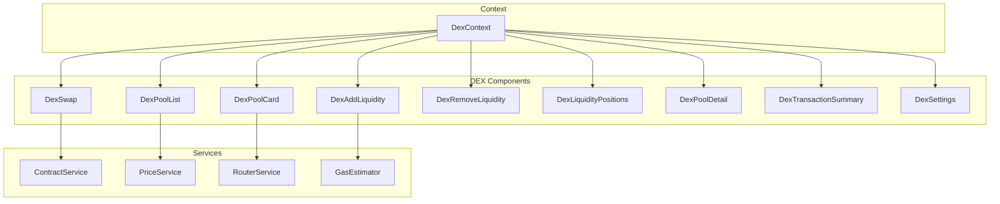

# Component Documentation

Complete documentation for DEX React components.

## Table of Contents

- [Overview](#overview)
- [DexSwap](#dexswap)
- [DexPoolList](#dexpoollist)
- [DexPoolCard](#dexpoolcard)
- [DexAddLiquidity](#dexaddliquidity)
- [DexRemoveLiquidity](#dexremoveliquidity)
- [DexLiquidityPositions](#dexliquiditypositions)
- [DexPoolDetail](#dexpooldetail)
- [DexTransactionSummary](#dextransactionsummary)
- [DexSettings](#dexsettings)

---

## Overview

### Component Architecture

The DEX components follow a hierarchical structure:



### Design Principles

1. **Component Composition**: Small, reusable components
2. **State Management**: Uses DexContext for global state
3. **Props Interface**: Clear, typed interfaces
4. **Error Handling**: Graceful error handling and user feedback
5. **Accessibility**: ARIA labels and keyboard navigation
6. **Responsive Design**: Mobile-first approach
7. **Performance**: Optimized rendering with memoization

---

## DexSwap

Main swap interface component.

**File**: [`DexSwap.tsx`](DexSwap.tsx)

### Purpose

Provides the primary interface for swapping tokens on the DEX.

### Props

```typescript
interface DexSwapProps {
  className?: string;
}
```

**Properties:**
- `className` (optional): CSS class name for custom styling

### State

The component uses DexContext for state management:

```typescript
// From DexContext
const {
  selectedTokenA,
  selectedTokenB,
  amountIn,
  amountOut,
  swapRoute,
  priceImpact,
  settings,
  isLoading,
  error,
  setSelectedTokenA,
  setSelectedTokenB,
  setAmountIn,
  setAmountOut,
  swapTokens,
  calculateSwapOutput,
  clearError,
} = useDex();
```

### Internal State

```typescript
const [isSwapped, setIsSwapped] = useState(false);
const [showSettings, setShowSettings] = useState(false);
```

### Methods

#### playSound

Plays a sound effect based on settings.

```typescript
const playSound = useCallback((sound: 'click' | 'success' | 'error') => {
  if (!settings.soundsEnabled) return;

  const audio = new Audio(`/sounds/${sound}.mp3`);
  audio.volume = 0.3;
  audio.play().catch(() => {
    // Ignore autoplay errors
  });
}, [settings.soundsEnabled]);
```

#### showToast

Shows a toast notification.

```typescript
const showToast = useCallback((message: string, type: 'success' | 'error' | 'info') => {
  if (!settings.notificationsEnabled) return;

  // This would use a toast library like react-hot-toast
  console.log(`[${type.toUpperCase()}] ${message}`);
}, [settings.notificationsEnabled]);
```

#### handleSwapDirection

Swaps the direction of the swap (token A ↔ token B).

```typescript
const handleSwapDirection = useCallback(() => {
  setIsSwapped(true);
  playSound('click');

  const tempToken = selectedTokenA;
  setSelectedTokenA(selectedTokenB);
  setSelectedTokenB(tempToken);

  const tempAmount = amountIn;
  setAmountIn(amountOut);
  setAmountOut(tempAmount);

  setTimeout(() => setIsSwapped(false), 300);
}, [selectedTokenA, selectedTokenB, amountIn, amountOut, setSelectedTokenA, setSelectedTokenB, setAmountIn, setAmountOut, playSound]);
```

#### handleSwap

Executes the token swap.

```typescript
const handleSwap = useCallback(async () => {
  if (!selectedTokenA || !selectedTokenB || !amountIn) {
    showToast('Please select tokens and enter amount', 'error');
    return;
  }

  try {
    playSound('click');
    await swapTokens();
    playSound('success');
    showToast('Swap successful!', 'success');
    setAmountIn('');
    setAmountOut('');
  } catch (err) {
    playSound('error');
    showToast('Swap failed. Please try again.', 'error');
  }
}, [selectedTokenA, selectedTokenB, amountIn, swapTokens, playSound, showToast]);
```

#### getPrice

Calculates the exchange rate for display.

```typescript
const getPrice = useCallback(() => {
  if (!selectedTokenA || !selectedTokenB || !amountIn || !amountOut) {
    return null;
  }

  const amountInNum = parseFloat(amountIn);
  const amountOutNum = parseFloat(amountOut);
  if (amountInNum === 0) return null;

  return `1 ${selectedTokenA.symbol} = ${(amountOutNum / amountInNum).toFixed(6)} ${selectedTokenB.symbol}`;
}, [selectedTokenA, selectedTokenB, amountIn, amountOut]);
```

#### isHighPriceImpact

Checks if the price impact is considered high (> 5%).

```typescript
const isHighPriceImpact = useCallback(() => {
  return priceImpact > 5;
}, [priceImpact]);
```

#### isSwapEnabled

Checks if the swap button should be enabled.

```typescript
const isSwapEnabled = useCallback(() => {
  return selectedTokenA && selectedTokenB && amountIn && !isLoading && !isHighPriceImpact();
}, [selectedTokenA, selectedTokenB, amountIn, isLoading, isHighPriceImpact]);
```

### Render

```typescript
return (
  <div className={`dex-swap ${className}`} role="region" aria-label="Swap tokens">
    {/* Header */}
    <div className="dex-swap-header">
      <h2>Swap</h2>
      <button
        className="settings-button"
        onClick={() => {
          playSound('click');
          setShowSettings(!showSettings);
        }}
        aria-label="Swap settings"
        aria-expanded={showSettings}
      >
        ⚙️
      </button>
    </div>

    {/* Settings */}
    {showSettings && (
      <div className="dex-swap-settings">
        <SlippageControl
          value={settings.slippage}
          onChange={(value) => {
            // Update slippage in settings
          }}
        />
      </div>
    )}

    {/* Error */}
    {error && (
      <div className="dex-swap-error" role="alert" aria-live="polite">
        {error}
      </div>
    )}

    {/* Inputs */}
    <div className="dex-swap-inputs">
      <div className="dex-swap-input">
        <AmountInput
          value={amountIn}
          onChange={handleAmountInChange}
          placeholder="0.0"
          label="From"
          token={selectedTokenA}
          onTokenSelect={handleTokenASelect}
          disabled={isLoading}
          aria-label="Amount to swap from"
        />
        {selectedTokenA && (
          <div className="dex-swap-balance">
            Balance: {selectedTokenA.balance || '0'}
          </div>
        )}
      </div>

      <button
        className={`dex-swap-direction ${isSwapped ? 'swapped' : ''}`}
        onClick={handleSwapDirection}
        disabled={isLoading}
        aria-label="Swap direction"
      >
        ↓
      </button>

      <div className="dex-swap-input">
        <AmountInput
          value={amountOut}
          onChange={handleAmountOutChange}
          placeholder="0.0"
          label="To"
          token={selectedTokenB}
          onTokenSelect={handleTokenBSelect}
          disabled={isLoading}
          aria-label="Amount to swap to"
        />
        {selectedTokenB && (
          <div className="dex-swap-balance">
            Balance: {selectedTokenB.balance || '0'}
          </div>
        )}
      </div>
    </div>

    {/* Price */}
    {getPrice() && (
      <div className="dex-swap-price" aria-live="polite">
        {getPrice()}
      </div>
    )}

    {/* Price Impact */}
    {priceImpact > 0 && (
      <div
        className={`dex-swap-price-impact ${isHighPriceImpact() ? 'high' : ''}`}
        role="alert"
        aria-live="polite"
      >
        Price Impact: {priceImpact.toFixed(2)}%
        {isHighPriceImpact() && (
          <span className="warning">High price impact!</span>
        )}
      </div>
    )}

    {/* Route */}
    {swapRoute && (
      <div className="dex-swap-route" aria-live="polite">
        Route: {swapRoute.path.join(' → ')}
      </div>
    )}

    {/* Swap Button */}
    <Button
      className="dex-swap-button"
      onClick={handleSwap}
      disabled={!isSwapEnabled()}
      loading={isLoading}
      aria-label="Execute swap"
    >
      {isLoading ? 'Swapping...' : 'Swap'}
    </Button>

    {/* Warning */}
    {isHighPriceImpact() && (
      <div className="dex-swap-warning" role="alert" aria-live="assertive">
        Warning: High price impact. You may receive less than expected.
      </div>
    )}
  </div>
);
```

### Usage Example

```typescript
import DexSwap from '../components/dex/DexSwap';

function SwapPage() {
  return (
    <div className="swap-page">
      <DexSwap />
    </div>
  );
}

export default SwapPage;
```

---

## DexPoolList

Pool browsing and filtering component.

**File**: [`DexPoolList.tsx`](DexPoolList.tsx)

### Purpose

Provides a browsable list of all liquidity pools with filtering and sorting capabilities.

### Props

```typescript
interface DexPoolListProps {
  pools: Pool[];
  onPoolClick?: (pool: Pool) => void;
  className?: string;
  soundsEnabled?: boolean;
}
```

**Properties:**
- `pools` (required): Array of pools to display
- `onPoolClick` (optional): Callback when a pool is clicked
- `className` (optional): CSS class name for custom styling
- `soundsEnabled` (optional): Whether sound effects are enabled (default: true)

### State

```typescript
const [searchQuery, setSearchQuery] = useState('');
const [sortBy, setSortBy] = useState<SortOption>('tvl');
const [sortDirection, setSortDirection] = useState<SortDirection>('desc');
const [currentPage, setCurrentPage] = useState(1);
const [itemsPerPage] = useState(10);
```

### Methods

#### playSound

Plays a sound effect.

```typescript
const playSound = useCallback((sound: 'click' | 'hover') => {
  if (!soundsEnabled) return;

  const audio = new Audio(`/sounds/${sound}.mp3`);
  audio.volume = 0.2;
  audio.play().catch(() => {
    // Ignore autoplay errors
  });
}, [soundsEnabled]);
```

#### filterPools

Filters pools by search query.

```typescript
const filteredPools = pools.filter(pool => {
  const query = searchQuery.toLowerCase();
  return (
    pool.tokenA.symbol.toLowerCase().includes(query) ||
    pool.tokenB.symbol.toLowerCase().includes(query) ||
    pool.tokenA.name.toLowerCase().includes(query) ||
    pool.tokenB.name.toLowerCase().includes(query)
  );
});
```

#### sortPools

Sorts pools by selected criteria.

```typescript
const sortedPools = [...filteredPools].sort((a, b) => {
  let comparison = 0;

  switch (sortBy) {
    case 'tvl':
      comparison = a.tvl - b.tvl;
      break;
    case 'volume':
      comparison = a.volume24h - b.volume24h;
      break;
    case 'apy':
      comparison = a.apy - b.apy;
      break;
  }

  return sortDirection === 'asc' ? comparison : -comparison;
});
```

#### paginatedPools

Returns pools for the current page.

```typescript
const totalPages = Math.ceil(sortedPools.length / itemsPerPage);
const paginatedPools = sortedPools.slice(
  (currentPage - 1) * itemsPerPage,
  currentPage * itemsPerPage
);
```

#### handleSearchChange

Handles search input changes.

```typescript
const handleSearchChange = useCallback((e: React.ChangeEvent<HTMLInputElement>) => {
  playSound('click');
  setSearchQuery(e.target.value);
}, [playSound]);
```

#### handleSortChange

Handles sort criteria changes.

```typescript
const handleSortChange = useCallback((newSortBy: SortOption) => {
  playSound('click');
  if (sortBy === newSortBy) {
    setSortDirection(prev => prev === 'asc' ? 'desc' : 'asc');
  } else {
    setSortBy(newSortBy);
    setSortDirection('desc');
  }
}, [sortBy, sortDirection, playSound]);
```

#### handlePageChange

Handles pagination page changes.

```typescript
const handlePageChange = useCallback((newPage: number) => {
  playSound('click');
  setCurrentPage(newPage);
}, [playSound]);
```

#### handlePoolClick

Handles pool card clicks.

```typescript
const handlePoolClick = useCallback((pool: Pool) => {
  playSound('click');
  onPoolClick?.(pool);
}, [onPoolClick, playSound]);
```

### Render

```typescript
return (
  <div className={`dex-pool-list ${className}`} role="region" aria-label="Pool list">
    {/* Header */}
    <div className="dex-pool-list-header">
      <h2>Pools</h2>
      <div className="dex-pool-list-search">
        <input
          type="text"
          placeholder="Search pools..."
          value={searchQuery}
          onChange={handleSearchChange}
          aria-label="Search pools"
        />
      </div>
    </div>

    {/* Sort Buttons */}
    <div className="dex-pool-list-sort" role="group" aria-label="Sort pools">
      <button
        className={`sort-button ${sortBy === 'tvl' ? 'active' : ''}`}
        onClick={() => handleSortChange('tvl')}
        aria-label={`Sort by TVL ${sortDirection === 'asc' ? 'ascending' : 'descending'}`}
      >
        TVL {sortBy === 'tvl' && (sortDirection === 'asc' ? '↑' : '↓')}
      </button>
      <button
        className={`sort-button ${sortBy === 'volume' ? 'active' : ''}`}
        onClick={() => handleSortChange('volume')}
        aria-label={`Sort by Volume ${sortDirection === 'asc' ? 'ascending' : 'descending'}`}
      >
        Volume {sortBy === 'volume' && (sortDirection === 'asc' ? '↑' : '↓')}
      </button>
      <button
        className={`sort-button ${sortBy === 'apy' ? 'active' : ''}`}
        onClick={() => handleSortChange('apy')}
        aria-label={`Sort by APY ${sortDirection === 'asc' ? 'ascending' : 'descending'}`}
      >
        APY {sortBy === 'apy' && (sortDirection === 'asc' ? '↑' : '↓')}
      </button>
    </div>

    {/* Empty State */}
    {paginatedPools.length === 0 ? (
      <div className="dex-pool-list-empty" role="status">
        {searchQuery ? 'No pools found matching your search.' : 'No pools available.'}
      </div>
    ) : (
      <>
        {/* Pool Cards */}
        <div className="dex-pool-list-items">
          {paginatedPools.map(pool => (
            <DexPoolCard
              key={pool.address}
              pool={pool}
              onClick={handlePoolClick}
              soundsEnabled={soundsEnabled}
            />
          ))}
        </div>

        {/* Pagination */}
        {totalPages > 1 && (
          <div className="dex-pool-list-pagination" role="navigation" aria-label="Pagination">
            <button
              className="pagination-button"
              onClick={() => handlePageChange(currentPage - 1)}
              disabled={currentPage === 1}
              aria-label="Previous page"
            >
              Previous
            </button>
            <div className="pagination-info" aria-live="polite">
              Page {currentPage} of {totalPages}
            </div>
            <button
              className="pagination-button"
              onClick={() => handlePageChange(currentPage + 1)}
              disabled={currentPage === totalPages}
              aria-label="Next page"
            >
              Next
            </button>
          </div>
        )}
      </>
    )}
  </div>
);
```

### Usage Example

```typescript
import DexPoolList from '../components/dex/DexPoolList';

function PoolsPage() {
  const [pools] = useState<Pool[]>([]);

  const handlePoolClick = useCallback((pool: Pool) => {
    navigate(`/dex/pool/${pool.address}`);
  }, []);

  return (
    <div className="pools-page">
      <DexPoolList
        pools={pools}
        onPoolClick={handlePoolClick}
        soundsEnabled={true}
      />
    </div>
  );
}

export default PoolsPage;
```

---

## DexPoolCard

Pool display card component.

**File**: [`DexPoolCard.tsx`](DexPoolCard.tsx)

### Purpose

Displays a single liquidity pool with key metrics and interactive elements.

### Props

```typescript
interface DexPoolCardProps {
  pool: Pool;
  onClick?: (pool: Pool) => void;
  className?: string;
  soundsEnabled?: boolean;
}
```

**Properties:**
- `pool` (required): Pool information to display
- `onClick` (optional): Callback when card is clicked
- `className` (optional): CSS class name for custom styling
- `soundsEnabled` (optional): Whether sound effects are enabled (default: true)

### Methods

#### playSound

Plays a sound effect on interaction.

```typescript
const playSound = useCallback((sound: 'click' | 'hover') => {
  if (!soundsEnabled) return;

  const audio = new Audio(`/sounds/${sound}.mp3`);
  audio.volume = 0.2;
  audio.play().catch(() => {
    // Ignore autoplay errors
  });
}, [soundsEnabled]);
```

#### formatTVL

Formats TVL for display.

```typescript
const formatTVL = useCallback((tvl: number) => {
  if (tvl === 0) return '$0';
  if (tvl < 1000) return `$${tvl.toFixed(2)}`;
  if (tvl < 1000000) return `$${(tvl / 1000).toFixed(2)}K`;
  if (tvl < 1000000000) return `$${(tvl / 1000000).toFixed(2)}M`;
  return `$${(tvl / 1000000000).toFixed(2)}B`;
}, []);
```

#### formatAPY

Formats APY for display.

```typescript
const formatAPY = useCallback((apy: number) => {
  return `${apy.toFixed(2)}%`;
}, []);
```

### Render

```typescript
return (
  <div
    className={`dex-pool-card ${className}`}
    onClick={() => {
      playSound('click');
      onClick?.(pool);
    }}
    role="button"
    tabIndex={0}
  >
    {/* Token Pair */}
    <div className="dex-pool-card-tokens">
      
      
      <span className="token-pair">
        {pool.tokenA.symbol}/{pool.tokenB.symbol}
      </span>
    </div>

    {/* Metrics */}
    <div className="dex-pool-card-metrics">
      <div className="metric">
        <label>TVL</label>
        <span className="value">{formatTVL(pool.tvl)}</span>
      </div>
      <div className="metric">
        <label>24h Volume</label>
        <span className="value">{formatVolume(pool.volume24h)}</span>
      </div>
      <div className="metric">
        <label>APY</label>
        <span className="value">{formatAPY(pool.apy)}</span>
      </div>
    </div>

    {/* Price */}
    <div className="dex-pool-card-price">
      <span className="price0">
        1 {pool.tokenA.symbol} = {pool.price0.toFixed(6)} {pool.tokenB.symbol}
      </span>
      <span className="price1">
        1 {pool.tokenB.symbol} = {(1 / pool.price0).toFixed(6)} {pool.tokenA.symbol}
      </span>
    </div>
  </div>
);
```

### Usage Example

```typescript
import DexPoolCard from '../components/dex/DexPoolCard';

function PoolsPage() {
  const [pools] = useState<Pool[]>([]);

  const handlePoolClick = useCallback((pool: Pool) => {
    navigate(`/dex/pool/${pool.address}`);
  }, []);

  return (
    <div className="pools-page">
      {pools.map(pool => (
        <DexPoolCard
          key={pool.address}
          pool={pool}
          onClick={handlePoolClick}
        />
      ))}
    </div>
  );
}

export default PoolsPage;
```

---

## DexAddLiquidity

Add liquidity interface component.

**File**: [`DexAddLiquidity.tsx`](DexAddLiquidity.tsx)

### Purpose

Provides interface for adding liquidity to trading pairs.

### Props

```typescript
interface DexAddLiquidityProps {
  pool?: Pool;
  className?: string;
}
```

**Properties:**
- `pool` (optional): Pool to add liquidity to
- `className` (optional): CSS class name for custom styling

### State

```typescript
const [amountA, setAmountA] = useState('');
const [amountB, setAmountB] = useState('');
const [optimalAmountB, setOptimalAmountB] = useState('');
const [lpTokens, setLpTokens] = useState('');
const [poolShare, setPoolShare] = useState(0);
const [showConfirmation, setShowConfirmation] = useState(false);
```

### Methods

#### playSound

Plays a sound effect.

```typescript
const playSound = useCallback((sound: 'click' | 'success' | 'error') => {
  if (!settings.soundsEnabled) return;

  const audio = new Audio(`/sounds/${sound}.mp3`);
  audio.volume = 0.3;
  audio.play().catch(() => {
    // Ignore autoplay errors
  });
}, [settings.soundsEnabled]);
```

#### showToast

Shows a toast notification.

```typescript
const showToast = useCallback((message: string, type: 'success' | 'error' | 'info') => {
  if (!settings.notificationsEnabled) return;

  console.log(`[${type.toUpperCase()}] ${message}`);
}, [settings.notificationsEnabled]);
```

#### handleAmountAChange

Handles amount A input changes.

```typescript
const handleAmountAChange = useCallback((value: string) => {
  clearError();
  setAmountA(value);
}, [clearError, setAmountA]);
```

#### handleAmountBChange

Handles amount B input changes.

```typescript
const handleAmountBChange = useCallback((value: string) => {
  clearError();
  setAmountB(value);
}, [clearError, setAmountB]);
```

#### handleTokenASelect

Handles token A selection.

```typescript
const handleTokenASelect = useCallback((token: Token) => {
  playSound('click');
  setSelectedTokenA(token);
}, [playSound, setSelectedTokenA]);
```

#### handleTokenBSelect

Handles token B selection.

```typescript
const handleTokenBSelect = useCallback((token: Token) => {
  playSound('click');
  setSelectedTokenB(token);
}, [playSound, setSelectedTokenB]);
```

#### handleMaxClick

Handles max button clicks.

```typescript
const handleMaxClick = useCallback((token: 'A' | 'B') => {
  playSound('click');
  if (token === 'A' && selectedTokenA?.balance) {
    setAmountA(selectedTokenA.balance);
  } else if (token === 'B' && selectedTokenB?.balance) {
    setAmountB(selectedTokenB.balance);
  }
}, [selectedTokenA, selectedTokenB, playSound]);
```

#### handleAddLiquidity

Executes the add liquidity operation.

```typescript
const handleAddLiquidity = useCallback(async () => {
  if (!selectedTokenA || !selectedTokenB || !amountA || !amountB) {
    showToast('Please select tokens and enter amounts', 'error');
    return;
  }

  try {
    playSound('click');
    await addLiquidity(amountA, amountB);
    playSound('success');
    showToast('Liquidity added successfully!', 'success');
    setAmountA('');
    setAmountB('');
    setLpTokens('');
    setPoolShare(0);
  } catch (err) {
    playSound('error');
    showToast('Failed to add liquidity. Please try again.', 'error');
  }
}, [selectedTokenA, selectedTokenB, amountA, amountB, addLiquidity, playSound, showToast]);
```

#### handleConfirmAddLiquidity

Confirms the add liquidity operation.

```typescript
const handleConfirmAddLiquidity = useCallback(async () => {
  setShowConfirmation(false);
  await handleAddLiquidity();
}, [handleAddLiquidity]);
```

#### getPriceRatio

Calculates the price ratio for display.

```typescript
const getPriceRatio = useCallback(() => {
  if (!pool || !amountA || !amountB) return null;

  const amountANum = parseFloat(amountA);
  const amountBNum = parseFloat(amountB);
  if (amountANum === 0) return null;

  return `1 ${selectedTokenA?.symbol} = ${(amountBNum / amountANum).toFixed(6)} ${selectedTokenB?.symbol}`;
}, [pool, amountA, amountB, selectedTokenA, selectedTokenB]);
```

#### isAddEnabled

Checks if the add button should be enabled.

```typescript
const isAddEnabled = useCallback(() => {
  return selectedTokenA && selectedTokenB && amountA && amountB && !isLoading;
}, [selectedTokenA, selectedTokenB, amountA, amountB, isLoading]);
```

### Render

```typescript
return (
  <div className={`dex-add-liquidity ${className}`} role="region" aria-label="Add liquidity">
    {/* Header */}
    <div className="dex-add-liquidity-header">
      <h2>Add Liquidity</h2>
    </div>

    {/* Error */}
    {error && (
      <div className="dex-add-liquidity-error" role="alert" aria-live="polite">
        {error}
      </div>
    )}

    {/* Inputs */}
    <div className="dex-add-liquidity-inputs">
      <div className="dex-add-liquidity-input">
        <AmountInput
          value={amountA}
          onChange={handleAmountAChange}
          placeholder="0.0"
          label="Token A"
          token={selectedTokenA}
          onTokenSelect={handleTokenASelect}
          disabled={isLoading}
          onMax={() => handleMaxClick('A')}
          aria-label="Amount of token A to add"
        />
        {selectedTokenA && (
          <div className="dex-add-liquidity-balance">
            Balance: {selectedTokenA.balance || '0'}
          </div>
        )}
      </div>

      <div className="dex-add-liquidity-plus">+</div>

      <div className="dex-add-liquidity-input">
        <AmountInput
          value={amountB}
          onChange={handleAmountBChange}
          placeholder="0.0"
          label="Token B"
          token={selectedTokenB}
          onTokenSelect={handleTokenBSelect}
          disabled={isLoading}
          onMax={() => handleMaxClick('B')}
          aria-label="Amount of token B to add"
        />
        {selectedTokenB && (
          <div className="dex-add-liquidity-balance">
            Balance: {selectedTokenB.balance || '0'}
          </div>
        )}
      </div>
    </div>

    {/* Price Ratio */}
    {getPriceRatio() && (
      <div className="dex-add-liquidity-price-ratio" aria-live="polite">
        {getPriceRatio()}
      </div>
    )}

    {/* Optimal Amount Warning */}
    {optimalAmountB && amountB !== optimalAmountB && (
      <div className="dex-add-liquidity-optimal" role="alert" aria-live="polite">
        Optimal amount for {selectedTokenB?.symbol}: {optimalAmountB}
      </div>
    )}

    {/* Preview */}
    {lpTokens && (
      <div className="dex-add-liquidity-preview">
        <div className="dex-add-liquidity-lp-tokens">
          You will receive: <strong>{lpTokens} LP tokens</strong>
        </div>
        <div className="dex-add-liquidity-pool-share" aria-live="polite">
          Pool share: <strong>{poolShare.toFixed(2)}%</strong>
        </div>
      </div>
    )}

    {/* Add Button */}
    <Button
      className="dex-add-liquidity-button"
      onClick={() => {
        playSound('click');
        setShowConfirmation(true);
      }}
      disabled={!isAddEnabled()}
      loading={isLoading}
      aria-label="Add liquidity"
    >
      {isLoading ? 'Adding...' : 'Add Liquidity'}
    </Button>

    {/* Confirmation Modal */}
    {showConfirmation && (
      <div className="dex-add-liquidity-confirmation" role="dialog" aria-modal="true" aria-labelledby="confirmation-title">
        <div className="confirmation-content">
          <h3 id="confirmation-title">Confirm Add Liquidity</h3>
          <div className="confirmation-details">
            <div>Token A: {amountA} {selectedTokenA?.symbol}</div>
            <div>Token B: {amountB} {selectedTokenB?.symbol}</div>
            <div>LP Tokens: {lpTokens}</div>
            <div>Pool Share: {poolShare.toFixed(2)}%</div>
          </div>
          <div className="confirmation-actions">
            <Button
              className="confirmation-cancel"
              onClick={() => {
                playSound('click');
                setShowConfirmation(false);
              }}
              variant="secondary"
            >
              Cancel
            </Button>
            <Button
              className="confirmation-confirm"
              onClick={handleConfirmAddLiquidity}
              loading={isLoading}
            >
              Confirm
            </Button>
          </div>
        </div>
      </div>
    )}
  </div>
);
```

### Usage Example

```typescript
import DexAddLiquidity from '../components/dex/DexAddLiquidity';

function AddLiquidityPage() {
  const [pool] = useState<Pool | null>(null);

  return (
    <div className="add-liquidity-page">
      <DexAddLiquidity pool={pool} />
    </div>
  );
}

export default AddLiquidityPage;
```

---

## DexRemoveLiquidity

Remove liquidity interface component.

**File**: [`DexRemoveLiquidity.tsx`](DexRemoveLiquidity.tsx)

### Purpose

Provides interface for removing liquidity from trading pairs.

### Props

```typescript
interface DexRemoveLiquidityProps {
  pool: Pool;
  className?: string;
}
```

**Properties:**
- `pool` (required): Pool to remove liquidity from
- `className` (optional): CSS class name for custom styling

### State

```typescript
const [lpAmount, setLpAmount] = useState('');
const [amountA, setAmountA] = useState('');
const [amountB, setAmountB] = useState('');
const [showConfirmation, setShowConfirmation] = useState(false);
```

### Methods

#### playSound

Plays a sound effect.

```typescript
const playSound = useCallback((sound: 'click' | 'success' | 'error') => {
  if (!settings.soundsEnabled) return;

  const audio = new Audio(`/sounds/${sound}.mp3`);
  audio.volume = 0.3;
  audio.play().catch(() => {
    // Ignore autoplay errors
  });
}, [settings.soundsEnabled]);
```

#### showToast

Shows a toast notification.

```typescript
const showToast = useCallback((message: string, type: 'success' | 'error' | 'info') => {
  if (!settings.notificationsEnabled) return;

  console.log(`[${type.toUpperCase()}] ${message}`);
}, [settings.notificationsEnabled]);
```

#### handleLpAmountChange

Handles LP token amount input changes.

```typescript
const handleLpAmountChange = useCallback((value: string) => {
  clearError();
  setLpAmount(value);
}, [clearError, setLpAmount]);
```

#### handleMaxClick

Handles max button click.

```typescript
const handleMaxClick = useCallback(() => {
  playSound('click');
  const userLpBalance = await getUserLpBalance(pool.address);
  if (userLpBalance) {
    setLpAmount(userLpBalance);
  }
}, [pool, playSound]);
```

#### handleRemoveLiquidity

Executes the remove liquidity operation.

```typescript
const handleRemoveLiquidity = useCallback(async () => {
  if (!lpAmount) {
    showToast('Please enter LP token amount', 'error');
    return;
  }

  try {
    playSound('click');
    await removeLiquidity(lpAmount);
    playSound('success');
    showToast('Liquidity removed successfully!', 'success');
    setLpAmount('');
  } catch (err) {
    playSound('error');
    showToast('Failed to remove liquidity. Please try again.', 'error');
  }
}, [lpAmount, removeLiquidity, playSound, showToast]);
```

#### handleConfirmRemoveLiquidity

Confirms the remove liquidity operation.

```typescript
const handleConfirmRemoveLiquidity = useCallback(async () => {
  setShowConfirmation(false);
  await handleRemoveLiquidity();
}, [handleRemoveLiquidity]);
```

### Render

```typescript
return (
  <div className={`dex-remove-liquidity ${className}`} role="region" aria-label="Remove liquidity">
    {/* Header */}
    <div className="dex-remove-liquidity-header">
      <h2>Remove Liquidity</h2>
    </div>

    {/* Error */}
    {error && (
      <div className="dex-remove-liquidity-error" role="alert" aria-live="polite">
        {error}
      </div>
    )}

    {/* Pool Info */}
    <div className="dex-remove-liquidity-pool-info">
      <div className="token-pair">
        {pool.tokenA.symbol}/{pool.tokenB.symbol}
      </div>
      <div className="your-lp-balance">
        Your LP Balance: {userLpBalance}
      </div>
    </div>

    {/* Input */}
    <div className="dex-remove-liquidity-input">
      <label htmlFor="lp-amount">LP Tokens to Remove</label>
      <AmountInput
        id="lp-amount"
        value={lpAmount}
        onChange={handleLpAmountChange}
        placeholder="0.0"
        disabled={isLoading}
        onMax={handleMaxClick}
        aria-label="Amount of LP tokens to remove"
      />
    </div>

    {/* Preview */}
    {lpAmount && (
      <div className="dex-remove-liquidity-preview">
        <div>You will receive:</div>
        <div className="preview-amounts">
          <div>
            <span className="token-symbol">{pool.tokenA.symbol}</span>
            <span className="token-amount">{amountA}</span>
          </div>
          <div>
            <span className="token-symbol">{pool.tokenB.symbol}</span>
            <span className="token-amount">{amountB}</span>
          </div>
        </div>
      </div>
    )}

    {/* Remove Button */}
    <Button
      className="dex-remove-liquidity-button"
      onClick={() => {
        playSound('click');
        setShowConfirmation(true);
      }}
      disabled={!lpAmount || isLoading}
      loading={isLoading}
      aria-label="Remove liquidity"
    >
      {isLoading ? 'Removing...' : 'Remove Liquidity'}
    </Button>

    {/* Confirmation Modal */}
    {showConfirmation && (
      <div className="dex-remove-liquidity-confirmation" role="dialog" aria-modal="true" aria-labelledby="confirmation-title">
        <div className="confirmation-content">
          <h3 id="confirmation-title">Confirm Remove Liquidity</h3>
          <div className="confirmation-details">
            <div>LP Tokens: {lpAmount}</div>
            <div>You will receive:</div>
            <div>
              <span className="token-symbol">{pool.tokenA.symbol}</span>
              <span className="token-amount">{amountA}</span>
            </div>
            <div>
              <span className="token-symbol">{pool.tokenB.symbol}</span>
              <span className="token-amount">{amountB}</span>
            </div>
          </div>
          <div className="confirmation-actions">
            <Button
              className="confirmation-cancel"
              onClick={() => {
                playSound('click');
                setShowConfirmation(false);
              }}
              variant="secondary"
            >
              Cancel
            </Button>
            <Button
              className="confirmation-confirm"
              onClick={handleConfirmRemoveLiquidity}
              loading={isLoading}
            >
              Confirm
            </Button>
          </div>
        </div>
      </div>
    )}
  </div>
);
```

### Usage Example

```typescript
import DexRemoveLiquidity from '../components/dex/DexRemoveLiquidity';

function RemoveLiquidityPage() {
  const [pool] = useState<Pool | null>(null);

  return (
    <div className="remove-liquidity-page">
      <DexRemoveLiquidity pool={pool} />
    </div>
  );
}

export default RemoveLiquidityPage;
```

---

## DexLiquidityPositions

Liquidity position management component.

**File**: [`DexLiquidityPositions.tsx`](DexLiquidityPositions.tsx)

### Purpose

Displays all user's liquidity positions with management capabilities.

### Props

```typescript
interface DexLiquidityPositionsProps {
  className?: string;
}
```

**Properties:**
- `className` (optional): CSS class name for custom styling

### State

```typescript
const [positions, setPositions] = useState<Position[]>([]);
const [loading, setLoading] = useState(false);
const [error, setError] = useState<string | null>(null);
```

### Methods

#### loadPositions

Loads user's liquidity positions.

```typescript
const loadPositions = useCallback(async () => {
  setLoading(true);
  setError(null);

  try {
    const userPositions = await getUserPositions();
    setPositions(userPositions);
  } catch (err) {
    setError(err.message);
  } finally {
    setLoading(false);
  }
}, []);
```

#### handleAddMoreLiquidity

Handles adding more liquidity to a position.

```typescript
const handleAddMoreLiquidity = useCallback((position: Position) => {
  navigate(`/dex/add-liquidity?pool=${position.poolAddress}`);
}, []);
```

#### handleRemoveLiquidity

Handles removing liquidity from a position.

```typescript
const handleRemoveLiquidity = useCallback((position: Position) => {
  navigate(`/dex/remove-liquidity?pool=${position.poolAddress}`);
}, []);
```

### Render

```typescript
return (
  <div className={`dex-liquidity-positions ${className}`} role="region" aria-label="Liquidity positions">
    {/* Header */}
    <div className="dex-liquidity-positions-header">
      <h2>Your Positions</h2>
    </div>

    {/* Error */}
    {error && (
      <div className="dex-liquidity-positions-error" role="alert" aria-live="polite">
        {error}
      </div>
    )}

    {/* Loading State */}
    {loading ? (
      <div className="dex-liquidity-positions-loading" role="status">
        Loading positions...
      </div>
    ) : positions.length === 0 ? (
      <div className="dex-liquidity-positions-empty" role="status">
        No liquidity positions found.
        <button onClick={loadPositions}>Refresh</button>
      </div>
    ) : (
      <div className="dex-liquidity-positions-list">
        {positions.map(position => (
          <div key={position.id} className="position-card">
            <div className="position-pair">
              {position.tokenA.symbol}/{position.tokenB.symbol}
            </div>
            <div className="position-lp-balance">
              LP Tokens: {position.lpBalance}
            </div>
            <div className="position-pool-share">
              Pool Share: {position.poolShare.toFixed(2)}%
            </div>
            <div className="position-value">
              Value: ${formatUSD(position.value)}
            </div>
            <div className="position-apy">
              APY: {position.apy.toFixed(2)}%
            </div>
            <div className="position-actions">
              <button onClick={() => handleAddMoreLiquidity(position)}>
                Add More
              </button>
              <button onClick={() => handleRemoveLiquidity(position)}>
                Remove
              </button>
            </div>
          </div>
        ))}
      </div>
    )}
  </div>
);
```

### Usage Example

```typescript
import DexLiquidityPositions from '../components/dex/DexLiquidityPositions';

function PositionsPage() {
  return (
    <div className="positions-page">
      <DexLiquidityPositions />
    </div>
  );
}

export default PositionsPage;
```

---

## DexPoolDetail

Pool detail view component.

**File**: [`DexPoolDetail.tsx`](DexPoolDetail.tsx)

### Purpose

Displays detailed information about a specific liquidity pool.

### Props

```typescript
interface DexPoolDetailProps {
  pool: Pool;
  className?: string;
}
```

**Properties:**
- `pool` (required): Pool information to display
- `className` (optional): CSS class name for custom styling

### State

```typescript
const [loading, setLoading] = useState(false);
const [error, setError] = useState<string | null>(null);
const [historicalData, setHistoricalData] = useState<ChartDataPoint[]>([]);
```

### Methods

#### loadPoolDetails

Loads detailed pool information.

```typescript
const loadPoolDetails = useCallback(async () => {
  setLoading(true);
  setError(null);

  try {
    const details = await getPoolDetailedInfo(pool.address);
    setHistoricalData(details.historicalData);
  } catch (err) {
    setError(err.message);
  } finally {
    setLoading(false);
  }
}, [pool.address]);
```

### Render

```typescript
return (
  <div className={`dex-pool-detail ${className}`} role="region" aria-label="Pool details">
    {/* Header */}
    <div className="dex-pool-detail-header">
      <h2>{pool.tokenA.symbol}/{pool.tokenB.symbol} Pool</h2>
    </div>

    {/* Error */}
    {error && (
      <div className="dex-pool-detail-error" role="alert" aria-live="polite">
        {error}
      </div>
    )}

    {/* Loading */}
    {loading && (
      <div className="dex-pool-detail-loading" role="status">
        Loading pool details...
      </div>
    )}

    {/* Pool Metrics */}
    <div className="dex-pool-detail-metrics">
      <div className="metric">
        <label>TVL</label>
        <span className="value">{formatUSD(pool.tvl)}</span>
      </div>
      <div className="metric">
        <label>24h Volume</label>
        <span className="value">{formatUSD(pool.volume24h)}</span>
      </div>
      <div className="metric">
        <label>APY</label>
        <span className="value">{pool.apy.toFixed(2)}%</span>
      </div>
      <div className="metric">
        <label>Fee</label>
        <span className="value">{(pool.fee * 100).toFixed(2)}%</span>
      </div>
    </div>

    {/* Price Chart */}
    <div className="dex-pool-detail-chart">
      <CandleChart
        data={historicalData}
        token={pool.tokenA}
      />
    </div>

    {/* Recent Transactions */}
    <div className="dex-pool-detail-transactions">
      <h3>Recent Transactions</h3>
      {/* Transaction list */}
    </div>
  </div>
);
```

### Usage Example

```typescript
import DexPoolDetail from '../components/dex/DexPoolDetail';

function PoolDetailPage() {
  const { pool } = useParams();

  return (
    <div className="pool-detail-page">
      <DexPoolDetail pool={pool} />
    </div>
  );
}

export default PoolDetailPage;
```

---

## DexTransactionSummary

Transaction display component.

**File**: [`DexTransactionSummary.tsx`](DexTransactionSummary.tsx)

### Purpose

Displays a summary of a transaction with key details.

### Props

```typescript
interface DexTransactionSummaryProps {
  transaction: Transaction;
  className?: string;
}
```

**Properties:**
- `transaction` (required): Transaction to display
- `className` (optional): CSS class name for custom styling

### Methods

#### getStatusIcon

Returns an icon based on transaction status.

```typescript
const getStatusIcon = useCallback(() => {
  switch (transaction.status) {
    case 'pending':
      return '⏳';
    case 'confirmed':
      return '✅';
    case 'failed':
      return '❌';
    case 'cancelled':
      return '🚫';
    default:
      return '⚠️';
  }
}, [transaction.status]);
```

#### getStatusColor

Returns a color class based on transaction status.

```typescript
const getStatusColor = useCallback(() => {
  switch (transaction.status) {
    case 'pending':
      return 'yellow';
    case 'confirmed':
      return 'green';
    case 'failed':
      return 'red';
    case 'cancelled':
      return 'gray';
    default:
      return 'blue';
  }
}, [transaction.status]);
```

### Render

```typescript
return (
  <div className={`dex-transaction-summary ${className}`}>
    {/* Header */}
    <div className="transaction-header">
      <span className="status-icon">{getStatusIcon()}</span>
      <span className={`status ${getStatusColor()}`}>
        {transaction.status.toUpperCase()}
      </span>
      <span className="type">
        {transaction.type === 'swap' ? 'Swap' :
         transaction.type === 'add_liquidity' ? 'Add Liquidity' :
         transaction.type === 'remove_liquidity' ? 'Remove Liquidity' :
         transaction.type}
      </span>
    </div>

    {/* Details */}
    <div className="transaction-details">
      <div className="detail">
        <label>From:</label>
        <span>{transaction.from?.symbol}</span>
        <span className="amount">{transaction.amountIn}</span>
      </div>
      <div className="detail">
        <label>To:</label>
        <span>{transaction.to?.symbol}</span>
        <span className="amount">{transaction.amountOut}</span>
      </div>
      <div className="detail">
        <label>Hash:</label>
        <span className="hash">{transaction.hash?.slice(0, 10)}...</span>
      </div>
      <div className="detail">
        <label>Gas Used:</label>
        <span>{transaction.gasUsed}</span>
      </div>
      <div className="detail">
        <label>Gas Price:</label>
        <span>{transaction.gasPrice}</span>
      </div>
    </div>

    {/* Timestamp */}
    <div className="transaction-timestamp">
      {formatTimestamp(transaction.timestamp)}
    </div>
  </div>
);
```

### Usage Example

```typescript
import DexTransactionSummary from '../components/dex/DexTransactionSummary';

function TransactionSummary() {
  const [transaction] = useState<Transaction | null>(null);

  return (
    <div className="transaction-page">
      {transaction && (
        <DexTransactionSummary transaction={transaction} />
      )}
    </div>
  );
}

export default TransactionSummary;
```

---

## DexSettings

Settings management component.

**File**: [`DexSettings.tsx`](DexSettings.tsx)

### Purpose

Provides interface for managing DEX settings.

### Props

```typescript
interface DexSettingsProps {
  className?: string;
}
```

**Properties:**
- `className` (optional): CSS class name for custom styling

### State

The component uses DexContext for settings:

```typescript
const { settings, updateSettings, resetSettings } = useDex();
```

### Methods

#### handleSlippageChange

Handles slippage tolerance changes.

```typescript
const handleSlippageChange = useCallback((value: number) => {
  updateSettings({ slippage: value });
}, [updateSettings]);
```

#### handleDeadlineChange

Handles deadline changes.

```typescript
const handleDeadlineChange = useCallback((value: number) => {
  updateSettings({ deadline: value });
}, [updateSettings]);
```

#### handleExpertModeToggle

Toggles expert mode.

```typescript
const handleExpertModeToggle = useCallback(() => {
  updateSettings({ expertMode: !settings.expertMode });
}, [settings.expertMode, updateSettings]);
```

#### handleSoundsEnabledToggle

Toggles sound effects.

```typescript
const handleSoundsEnabledToggle = useCallback(() => {
  updateSettings({ soundsEnabled: !settings.soundsEnabled });
}, [settings.soundsEnabled, updateSettings]);
```

#### handleNotificationsEnabledToggle

Toggles notifications.

```typescript
const handleNotificationsEnabledToggle = useCallback(() => {
  updateSettings({ notificationsEnabled: !settings.notificationsEnabled });
}, [settings.notificationsEnabled, updateSettings]);
```

#### handleReset

Resets settings to defaults.

```typescript
const handleReset = useCallback(() => {
  resetSettings();
}, [resetSettings]);
```

### Render

```typescript
return (
  <div className={`dex-settings ${className}`}>
    {/* Header */}
    <div className="dex-settings-header">
      <h2>Settings</h2>
      <button onClick={handleReset} className="reset-button">
        Reset to Defaults
      </button>
    </div>

    {/* Slippage */}
    <div className="settings-section">
      <h3>Slippage Tolerance</h3>
      <div className="settings-description">
        The maximum price slippage you're willing to accept
      </div>
      <div className="settings-presets">
        <button
          className={settings.slippage === 0.1 ? 'active' : ''}
          onClick={() => handleSlippageChange(0.1)}
        >
          0.1%
        </button>
        <button
          className={settings.slippage === 0.5 ? 'active' : ''}
          onClick={() => handleSlippageChange(0.5)}
        >
          0.5%
        </button>
        <button
          className={settings.slippage === 1.0 ? 'active' : ''}
          onClick={() => handleSlippageChange(1.0)}
        >
          1.0%
        </button>
      </div>
      <div className="settings-custom">
        <input
          type="number"
          step="0.1"
          min="0"
          max="50"
          value={settings.slippage}
          onChange={(e) => handleSlippageChange(parseFloat(e.target.value))}
          aria-label="Custom slippage"
        />
        <span>%</span>
      </div>
    </div>

    {/* Deadline */}
    <div className="settings-section">
      <h3>Transaction Deadline</h3>
      <div className="settings-description">
        The time limit for your transaction to be confirmed
      </div>
      <div className="settings-presets">
        <button
          className={settings.deadline === 5 ? 'active' : ''}
          onClick={() => handleDeadlineChange(5)}
        >
          5 minutes
        </button>
        <button
          className={settings.deadline === 20 ? 'active' : ''}
          onClick={() => handleDeadlineChange(20)}
        >
          20 minutes
        </button>
        <button
          className={settings.deadline === 30 ? 'active' : ''}
          onClick={() => handleDeadlineChange(30)}
        >
          30 minutes
        </button>
      </div>
    </div>

    {/* Expert Mode */}
    <div className="settings-section">
      <h3>Expert Mode</h3>
      <div className="settings-description">
        Advanced features for experienced users
      </div>
      <label className="toggle-switch">
        <input
          type="checkbox"
          checked={settings.expertMode}
          onChange={handleExpertModeToggle}
          aria-label="Enable expert mode"
        />
        <span className="toggle-label">Expert Mode</span>
      </label>
    </div>

    {/* Sounds */}
    <div className="settings-section">
      <h3>Sound Effects</h3>
      <label className="toggle-switch">
        <input
          type="checkbox"
          checked={settings.soundsEnabled}
          onChange={handleSoundsEnabledToggle}
          aria-label="Enable sound effects"
        />
        <span className="toggle-label">Sound Effects</span>
      </label>
    </div>

    {/* Notifications */}
    <div className="settings-section">
      <h3>Notifications</h3>
      <label className="toggle-switch">
        <input
          type="checkbox"
          checked={settings.notificationsEnabled}
          onChange={handleNotificationsEnabledToggle}
          aria-label="Enable notifications"
        />
        <span className="toggle-label">Notifications</span>
      </label>
    </div>
  </div>
);
```

### Usage Example

```typescript
import DexSettings from '../components/dex/DexSettings';

function SettingsPage() {
  return (
    <div className="settings-page">
      <DexSettings />
    </div>
  );
}

export default SettingsPage;
```

---

## Additional Resources

- [DEX API Reference](../../DEX_API_REFERENCE.md)
- [DEX Developer Guide](../../DEX_DEVELOPER_GUIDE.md)
- [Service Documentation](../../services/dex/SERVICE_DOCUMENTATION.md)

---

**Last Updated:** December 30, 2025
