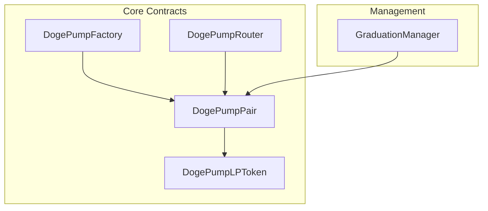

# Contract Documentation

Complete documentation for Dogepump DEX smart contracts.

## Table of Contents

- [Overview](#overview)
- [DogePumpFactory](#dogepumpfactory)
- [DogePumpPair](#dogepumppair)
- [DogePumpRouter](#dogepumprouter)
- [DogePumpLPToken](#dogepumplptoken)
- [GraduationManager](#graduationmanager)
- [Contract Addresses](#contract-addresses)
- [Deployment Instructions](#deployment-instructions)

---

## Overview

### Contract Architecture

The Dogepump DEX consists of five main smart contracts:



### Contract Relationships

- **Factory**: Creates and manages pairs
- **Pair**: Manages liquidity and swaps for a token pair
- **Router**: Facilitates swaps and liquidity operations
- **LP Token**: ERC-20 token representing pool shares
- **Graduation Manager**: Manages token graduation from bonding curve

### Design Principles

1. **Security First**: Reentrancy protection, access control, pause mechanisms
2. **Gas Optimization**: Efficient storage and computation
3. **Upgradability**: Owner-controlled critical functions
4. **Composability**: Uses OpenZeppelin contracts
5. **Event Logging**: Comprehensive event emission for tracking

---

## DogePumpFactory

Factory contract for creating and managing trading pairs.

**File**: [`DogePumpFactory.sol`](DogePumpFactory.sol)

### Contract Details

- **Inherits**: `Ownable`, `Pausable`
- **Solidity Version**: ^0.8.0
- **License**: MIT

### State Variables

```solidity
address public feeTo;
address public factoryAddress;
mapping(address => mapping(address => address)) public getPair;
address[] public allPairs;
```

### Functions

#### createPair

Creates a new trading pair for two tokens.

```solidity
function createPair(address tokenA, address tokenB) external whenNotPaused returns (address pair)
```

**Parameters:**
- `tokenA` (address): Address of the first token
- `tokenB` (address): Address of the second token

**Returns:**
- `pair` (address): Address of the created pair

**Access Control:** None (when not paused)

**Emits:** `PairCreated(address indexed token0, address indexed token1, address pair, uint256)`

**Gas Estimate:** ~150,000 gas

**Logic:**
1. Sort token addresses (token0 < token1)
2. Calculate CREATE2 address using sorted addresses as salt
3. Deploy new pair contract with sorted tokens
4. Store pair address in mapping
5. Add to allPairs array
6. Emit PairCreated event

**Usage Example:**
```typescript
const pairAddress = await factory.createPair(
  tokenA.address,
  tokenB.address
);
console.log('Pair created at:', pairAddress);
```

#### getPair

Returns the address of the pair for two tokens, or zero address if it doesn't exist.

```solidity
function getPair(address tokenA, address tokenB) external view returns (address pair)
```

**Parameters:**
- `tokenA` (address): Address of the first token
- `tokenB` (address): Address of the second token

**Returns:**
- `pair` (address): Address of the pair, or `address(0)` if not exists

**Access Control:** View function (no restrictions)

**Gas Estimate:** ~2,500 gas

**Logic:**
1. Sort token addresses
2. Look up pair address in mapping
3. Return address (or zero if not found)

**Usage Example:**
```typescript
const pairAddress = await factory.getPair(
  tokenA.address,
  tokenB.address
);

if (pairAddress === ethers.ZeroAddress) {
  console.log('Pair does not exist');
} else {
  console.log('Pair exists at:', pairAddress);
}
```

#### allPairs

Returns the address of the pair at the given index.

```solidity
function allPairs(uint256 index) external view returns (address pair)
```

**Parameters:**
- `index` (uint256): Index of the pair to retrieve

**Returns:**
- `pair` (address): Address of the pair at the index

**Access Control:** View function (no restrictions)

**Gas Estimate:** ~2,500 gas

**Logic:**
1. Access allPairs array at index
2. Return pair address

**Usage Example:**
```typescript
const totalPairs = await factory.allPairsLength();
for (let i = 0; i < totalPairs; i++) {
  const pairAddress = await factory.allPairs(i);
  console.log(`Pair ${i}: ${pairAddress}`);
}
```

#### allPairsLength

Returns the total number of pairs created by the factory.

```solidity
function allPairsLength() external view returns (uint256)
```

**Returns:**
- `length` (uint256): Total number of pairs

**Access Control:** View function (no restrictions)

**Gas Estimate:** ~2,500 gas

**Logic:**
1. Return length of allPairs array

**Usage Example:**
```typescript
const totalPairs = await factory.allPairsLength();
console.log('Total pairs:', totalPairs);
```

#### setFeeTo

Sets the address that receives trading fees.

```solidity
function setFeeTo(address _feeTo) external onlyOwner
```

**Parameters:**
- `_feeTo` (address): Address to receive trading fees

**Access Control:** Owner only

**Emits:** `FeeToChanged(address indexed oldFeeTo, address indexed newFeeTo)`

**Gas Estimate:** ~25,000 gas

**Logic:**
1. Check caller is owner
2. Update feeTo variable
3. Emit FeeToChanged event

**Usage Example:**
```typescript
await factory.setFeeTo(feeRecipient.address);
console.log('Fee recipient updated');
```

#### feeTo

Returns the address that receives trading fees.

```solidity
function feeTo() external view returns (address)
```

**Returns:**
- `feeTo` (address): Address receiving trading fees

**Access Control:** View function (no restrictions)

**Gas Estimate:** ~2,500 gas

**Usage Example:**
```typescript
const feeRecipient = await factory.feeTo();
console.log('Fee recipient:', feeRecipient);
```

#### pause

Pauses the factory, preventing new pair creation.

```solidity
function pause() external onlyOwner
```

**Access Control:** Owner only

**Emits:** `Paused(address account)`

**Gas Estimate:** ~25,000 gas

**Usage Example:**
```typescript
await factory.pause();
console.log('Factory paused');
```

#### unpause

Unpauses the factory, allowing new pair creation.

```solidity
function unpause() external onlyOwner
```

**Access Control:** Owner only

**Emits:** `Unpaused(address account)`

**Gas Estimate:** ~25,000 gas

**Usage Example:**
```typescript
await factory.unpause();
console.log('Factory unpaused');
```

### Events

#### PairCreated

Emitted when a new pair is created.

```solidity
event PairCreated(address indexed token0, address indexed token1, address pair, uint256)
```

**Parameters:**
- `token0` (address): Address of the first token (sorted)
- `token1` (address): Address of the second token (sorted)
- `pair` (address): Address of the created pair
- `uint256`: Total number of pairs after creation

**Usage Example:**
```typescript
factory.on('PairCreated', (token0, token1, pair, allPairsLength) => {
  console.log('New pair created:');
  console.log('Token0:', token0);
  console.log('Token1:', token1);
  console.log('Pair:', pair);
  console.log('Total pairs:', allPairsLength);
});
```

#### FeeToChanged

Emitted when the fee recipient is changed.

```solidity
event FeeToChanged(address indexed oldFeeTo, address indexed newFeeTo)
```

**Parameters:**
- `oldFeeTo` (address): Previous fee recipient
- `newFeeTo` (address): New fee recipient

**Usage Example:**
```typescript
factory.on('FeeToChanged', (oldFeeTo, newFeeTo) => {
  console.log('Fee recipient changed:');
  console.log('Old:', oldFeeTo);
  console.log('New:', newFeeTo);
});
```

---

## DogePumpPair

Pair contract for managing liquidity and swaps using constant product AMM.

**File**: [`DogePumpPair.sol`](DogePumpPair.sol)

### Contract Details

- **Inherits**: `Ownable`, `Pausable`, `ReentrancyGuard`
- **Solidity Version**: ^0.8.0
- **License**: MIT

### State Variables

```solidity
address public token0;
address public token1;
uint112 public reserve0;
uint112 public reserve1;
uint32 public blockTimestampLast;
uint256 public price0CumulativeLast;
uint256 public price1CumulativeLast;
address public factory;
```

### Functions

#### getReserves

Returns the reserves of the pair and the timestamp of the last update.

```solidity
function getReserves() external view returns (uint112 reserve0, uint112 reserve1, uint32 blockTimestampLast)
```

**Returns:**
- `reserve0` (uint112): Reserve of token0
- `reserve1` (uint112): Reserve of token1
- `blockTimestampLast` (uint32): Timestamp of the last reserve update

**Access Control:** View function (no restrictions)

**Gas Estimate:** ~2,500 gas

**Usage Example:**
```typescript
const { reserve0, reserve1, blockTimestampLast } = await pair.getReserves();
console.log('Reserves:', { reserve0, reserve1 });
console.log('Last update:', new Date(blockTimestampLast * 1000));
```

#### mint

Mints liquidity tokens to the provided address.

```solidity
function mint(address to) external nonReentrant returns (uint256 liquidity)
```

**Parameters:**
- `to` (address): Address to receive liquidity tokens

**Returns:**
- `liquidity` (uint256): Amount of liquidity tokens minted

**Access Control:** Non-reentrant

**Emits:** `Mint(address indexed sender, uint256 amount0, uint256 amount1)`

**Gas Estimate:** ~100,000 gas

**Logic:**
1. Calculate liquidity to mint based on token amounts
2. Update reserves with new token amounts
3. Mint LP tokens to recipient
4. Update cumulative prices
5. Emit Mint event

**Formula:**
```
liquidity = min((amount0 * totalSupply) / reserve0, (amount1 * totalSupply) / reserve1)
```

**Usage Example:**
```typescript
const liquidity = await pair.mint(userAddress);
console.log('Minted liquidity:', liquidity);
```

#### burn

Burns liquidity tokens and returns the underlying tokens.

```solidity
function burn(address to) external nonReentrant returns (uint256 amount0, uint256 amount1)
```

**Parameters:**
- `to` (address): Address to receive the underlying tokens

**Returns:**
- `amount0` (uint256): Amount of token0 returned
- `amount1` (uint256): Amount of token1 returned

**Access Control:** Non-reentrant

**Emits:** `Burn(address indexed sender, uint256 amount0, uint256 amount1, address indexed to)`

**Gas Estimate:** ~100,000 gas

**Logic:**
1. Calculate token amounts to return based on LP tokens burned
2. Update reserves by removing tokens
3. Burn LP tokens from sender
4. Transfer tokens to recipient
5. Emit Burn event

**Formula:**
```
amount0 = (liquidity * reserve0) / totalSupply
amount1 = (liquidity * reserve1) / totalSupply
```

**Usage Example:**
```typescript
const { amount0, amount1 } = await pair.burn(userAddress);
console.log('Received tokens:', { amount0, amount1 });
```

#### swap

Executes a token swap.

```solidity
function swap(uint256 amount0Out, uint256 amount1Out, address to, bytes calldata data) external nonReentrant
```

**Parameters:**
- `amount0Out` (uint256): Amount of token0 to receive (0 if not receiving)
- `amount1Out` (uint256): Amount of token1 to receive (0 if not receiving)
- `to` (address): Address to receive the output tokens
- `data` (bytes): Arbitrary data for flash loans

**Access Control:** Non-reentrant

**Emits:** `Swap(address indexed sender, uint256 amount0In, uint256 amount1In, uint256 amount0Out, uint256 amount1Out, address indexed to)`

**Gas Estimate:** ~100,000 gas

**Logic:**
1. Calculate input amounts based on output amounts and reserves
2. Transfer input tokens from sender
3. Calculate output amounts using constant product formula
4. Transfer output tokens to recipient
5. Update reserves
6. Update cumulative prices
7. Emit Swap event

**Formula:**
```
amount0In = (amount0Out * reserve1) / (reserve0 - amount0Out)
amount1In = (amount1Out * reserve0) / (reserve1 - amount1Out)
```

**Flash Loan Support:**
If `data` is provided, the contract will call back to the sender before completing the swap, enabling flash loans.

**Usage Example:**
```typescript
await pair.swap(
  ethers.parseUnits('100', 18), // amount0Out
  0, // amount1Out (not receiving token1)
  recipientAddress,
  '0x' // No flash loan
);
```

#### skim

Skims excess tokens in the pair (if any).

```solidity
function skim(address to) external
```

**Parameters:**
- `to` (address): Address to receive the skimmed tokens

**Access Control:** None

**Gas Estimate:** ~50,000 gas

**Logic:**
1. Calculate actual token balances
2. Calculate excess tokens (balance - reserve)
3. Transfer excess tokens to recipient
4. Update reserves to match balances

**Usage Example:**
```typescript
await pair.skim(recipientAddress);
console.log('Skimmed excess tokens');
```

#### sync

Updates the reserves to the current balances.

```solidity
function sync() external
```

**Access Control:** None

**Gas Estimate:** ~50,000 gas

**Logic:**
1. Get current token balances
2. Update reserves to match balances
3. Emit Sync event

**Usage Example:**
```typescript
await pair.sync();
console.log('Reserves synced');
```

#### initialize

Initializes the pair (called once during deployment).

```solidity
function initialize(address _token0, address _token1) external
```

**Parameters:**
- `_token0` (address): Address of the first token
- `_token1` (address): Address of the second token

**Access Control:** Can only be called once

**Emits:** None

**Gas Estimate:** ~100,000 gas

**Logic:**
1. Store token addresses
2. Set initial reserves to 0
3. Set initial cumulative prices to 0
4. Set initial block timestamp

**Usage Example:**
```typescript
// Called automatically during deployment
// Not callable after initialization
```

### Events

#### Mint

Emitted when liquidity is added.

```solidity
event Mint(address indexed sender, uint256 amount0, uint256 amount1)
```

**Parameters:**
- `sender` (address): Address that added liquidity
- `amount0` (uint256): Amount of token0 added
- `amount1` (uint256): Amount of token1 added

**Usage Example:**
```typescript
pair.on('Mint', (sender, amount0, amount1) => {
  console.log('Liquidity added:');
  console.log('Provider:', sender);
  console.log('Token0:', amount0);
  console.log('Token1:', amount1);
});
```

#### Burn

Emitted when liquidity is removed.

```solidity
event Burn(address indexed sender, uint256 amount0, uint256 amount1, address indexed to)
```

**Parameters:**
- `sender` (address): Address that removed liquidity
- `amount0` (uint256): Amount of token0 removed
- `amount1` (uint256): Amount of token1 removed
- `to` (address): Address that received the tokens

**Usage Example:**
```typescript
pair.on('Burn', (sender, amount0, amount1, to) => {
  console.log('Liquidity removed:');
  console.log('Provider:', sender);
  console.log('Token0:', amount0);
  console.log('Token1:', amount1);
  console.log('Recipient:', to);
});
```

#### Swap

Emitted when a swap occurs.

```solidity
event Swap(address indexed sender, uint256 amount0In, uint256 amount1In, uint256 amount0Out, uint256 amount1Out, address indexed to)
```

**Parameters:**
- `sender` (address): Address that initiated the swap
- `amount0In` (uint256): Amount of token0 sent
- `amount1In` (uint256): Amount of token1 sent
- `amount0Out` (uint256): Amount of token0 received
- `amount1Out` (uint256): Amount of token1 received
- `to` (address): Address that received the output tokens

**Usage Example:**
```typescript
pair.on('Swap', (sender, amount0In, amount1In, amount0Out, amount1Out, to) => {
  console.log('Swap executed:');
  console.log('From:', sender);
  console.log('Token0 In:', amount0In);
  console.log('Token1 In:', amount1In);
  console.log('Token0 Out:', amount0Out);
  console.log('Token1 Out:', amount1Out);
  console.log('To:', to);
});
```

#### Sync

Emitted when reserves are synced.

```solidity
event Sync(uint112 reserve0, uint112 reserve1)
```

**Parameters:**
- `reserve0` (uint112): New reserve0 value
- `reserve1` (uint112): New reserve1 value

**Usage Example:**
```typescript
pair.on('Sync', (reserve0, reserve1) => {
  console.log('Reserves synced:');
  console.log('Reserve0:', reserve0);
  console.log('Reserve1:', reserve1);
});
```

---

## DogePumpRouter

Router contract for facilitating swaps and liquidity operations.

**File**: [`DogePumpRouter.sol`](DogePumpRouter.sol)

### Contract Details

- **Inherits**: `Ownable`, `Pausable`, `ReentrancyGuard`
- **Solidity Version**: ^0.8.0
- **License**: MIT

### State Variables

```solidity
address public factory;
address public WETH;
```

### Functions

#### factory

Returns the factory contract address.

```solidity
function factory() external view returns (address)
```

**Returns:**
- `factory` (address): Address of the factory contract

**Access Control:** View function (no restrictions)

**Gas Estimate:** ~2,500 gas

**Usage Example:**
```typescript
const factoryAddress = await router.factory();
console.log('Factory address:', factoryAddress);
```

#### WETH

Returns the WETH (or WDC) address.

```solidity
function WETH() external view returns (address)
```

**Returns:**
- `WETH` (address): Address of the wrapped native token

**Access Control:** View function (no restrictions)

**Gas Estimate:** ~2,500 gas

**Usage Example:**
```typescript
const wethAddress = await router.WETH();
console.log('WETH address:', wethAddress);
```

#### swapExactTokensForTokens

Swaps an exact amount of input tokens for as many output tokens as possible.

```solidity
function swapExactTokensForTokens(
    uint256 amountIn,
    uint256 amountOutMin,
    address[] calldata path,
    address to,
    uint256 deadline
) external whenNotPaused nonReentrant returns (uint256[] memory amounts)
```

**Parameters:**
- `amountIn` (uint256): Exact amount of input tokens to swap
- `amountOutMin` (uint256): Minimum amount of output tokens to receive
- `path` (address[]): Array of token addresses for the swap route
- `to` (address): Address to receive the output tokens
- `deadline` (uint256): Unix timestamp after which the transaction will revert

**Returns:**
- `amounts` (uint256[]): Array of token amounts for each step in the path

**Access Control:** Non-reentrant, when not paused

**Emits:** `Swap` events from pairs

**Gas Estimate:** ~150,000 - 300,000 gas (depends on path length)

**Logic:**
1. Validate deadline
2. For each hop in path:
   a. Get pair contract
   b. Calculate optimal output amount
   c. Execute swap on pair
   d. Update amounts array
3. Return final amounts

**Usage Example:**
```typescript
const amounts = await router.swapExactTokensForTokens(
  ethers.parseUnits('100', 18),
  ethers.parseUnits('95', 18),
  [tokenA.address, tokenB.address],
  userAddress,
  Math.floor(Date.now() / 1000) + 1200 // 20 minutes from now
);
console.log('Received:', amounts[amounts.length - 1]);
```

#### swapTokensForExactTokens

Swaps as few input tokens as possible for an exact amount of output tokens.

```solidity
function swapTokensForExactTokens(
    uint256 amountOut,
    uint256 amountInMax,
    address[] calldata path,
    address to,
    uint256 deadline
) external whenNotPaused nonReentrant returns (uint256[] memory amounts)
```

**Parameters:**
- `amountOut` (uint256): Exact amount of output tokens to receive
- `amountInMax` (uint256): Maximum amount of input tokens to spend
- `path` (address[]): Array of token addresses for the swap route
- `to` (address): Address to receive the output tokens
- `deadline` (uint256): Unix timestamp after which the transaction will revert

**Returns:**
- `amounts` (uint256[]): Array of token amounts for each step in the path

**Access Control:** Non-reentrant, when not paused

**Emits:** `Swap` events from pairs

**Gas Estimate:** ~150,000 - 300,000 gas

**Usage Example:**
```typescript
const amounts = await router.swapTokensForExactTokens(
  ethers.parseUnits('100', 18),
  ethers.parseUnits('105', 18),
  [tokenA.address, tokenB.address],
  userAddress,
  Math.floor(Date.now() / 1000) + 1200
);
console.log('Spent:', amounts[0]);
```

#### addLiquidity

Adds liquidity to a token pair.

```solidity
function addLiquidity(
    address tokenA,
    address tokenB,
    uint256 amountADesired,
    uint256 amountBDesired,
    uint256 amountAMin,
    uint256 amountBMin,
    address to,
    uint256 deadline
) external whenNotPaused nonReentrant returns (uint256 amountA, uint256 amountB, uint256 liquidity)
```

**Parameters:**
- `tokenA` (address): Address of the first token
- `tokenB` (address): Address of the second token
- `amountADesired` (uint256): Desired amount of tokenA to add
- `amountBDesired` (uint256): Desired amount of tokenB to add
- `amountAMin` (uint256): Minimum amount of tokenA to add
- `amountBMin` (uint256): Minimum amount of tokenB to add
- `to` (address): Address to receive the liquidity tokens
- `deadline` (uint256): Unix timestamp after which the transaction will revert

**Returns:**
- `amountA` (uint256): Actual amount of tokenA added
- `amountB` (uint256): Actual amount of tokenB added
- `liquidity` (uint256): Amount of liquidity tokens minted

**Access Control:** Non-reentrant, when not paused

**Emits:** `Mint` event from pair

**Gas Estimate:** ~200,000 - 250,000 gas

**Logic:**
1. Validate deadline
2. Transfer tokens from sender to pair
3. Mint LP tokens in pair
4. Transfer LP tokens to recipient
5. Return actual amounts and liquidity

**Usage Example:**
```typescript
const { amountA, amountB, liquidity } = await router.addLiquidity(
  tokenA.address,
  tokenB.address,
  ethers.parseUnits('100', 18),
  ethers.parseUnits('100', 18),
  ethers.parseUnits('95', 18),
  ethers.parseUnits('95', 18),
  userAddress,
  Math.floor(Date.now() / 1000) + 1200
);
console.log('Added:', { amountA, amountB, liquidity });
```

#### removeLiquidity

Removes liquidity from a token pair.

```solidity
function removeLiquidity(
    address tokenA,
    address tokenB,
    uint256 liquidity,
    uint256 amountAMin,
    uint256 amountBMin,
    address to,
    uint256 deadline
) external whenNotPaused nonReentrant returns (uint256 amountA, uint256 amountB)
```

**Parameters:**
- `tokenA` (address): Address of the first token
- `tokenB` (address): Address of the second token
- `liquidity` (uint256): Amount of LP tokens to burn
- `amountAMin` (uint256): Minimum amount of tokenA to receive
- `amountBMin` (uint256): Minimum amount of tokenB to receive
- `to` (address): Address to receive the underlying tokens
- `deadline` (uint256): Unix timestamp after which the transaction will revert

**Returns:**
- `amountA` (uint256): Amount of tokenA received
- `amountB` (uint256): Amount of tokenB received

**Access Control:** Non-reentrant, when not paused

**Emits:** `Burn` event from pair

**Gas Estimate:** ~150,000 - 200,000 gas

**Logic:**
1. Validate deadline
2. Transfer LP tokens from sender to pair
3. Burn LP tokens in pair
4. Transfer underlying tokens from pair to recipient
5. Return token amounts

**Usage Example:**
```typescript
const { amountA, amountB } = await router.removeLiquidity(
  tokenA.address,
  tokenB.address,
  ethers.parseUnits('10', 18),
  ethers.parseUnits('9', 18),
  ethers.parseUnits('9', 18),
  userAddress,
  Math.floor(Date.now() / 1000) + 1200
);
console.log('Received:', { amountA, amountB });
```

#### getAmountsOut

Calculates the output amounts for a given input amount and path.

```solidity
function getAmountsOut(uint256 amountIn, address[] calldata path) external view returns (uint256[] memory amounts)
```

**Parameters:**
- `amountIn` (uint256): Amount of input tokens
- `path` (address[]): Array of token addresses for the swap route

**Returns:**
- `amounts` (uint256[]): Array of output amounts for each step in the path

**Access Control:** View function (no restrictions)

**Gas Estimate:** ~10,000 gas per hop

**Logic:**
1. For each hop in path:
   a. Get pair reserves
   b. Calculate output using constant product formula
   c. Store in amounts array
2. Return amounts array

**Usage Example:**
```typescript
const amounts = await router.getAmountsOut(
  ethers.parseUnits('100', 18),
  [tokenA.address, tokenB.address]
);
console.log('Output:', amounts[amounts.length - 1]);
```

#### getAmountsIn

Calculates the input amounts for a given output amount and path.

```solidity
function getAmountsIn(uint256 amountOut, address[] calldata path) external view returns (uint256[] memory amounts)
```

**Parameters:**
- `amountOut` (uint256): Desired amount of output tokens
- `path` (address[]): Array of token addresses for the swap route

**Returns:**
- `amounts` (uint256[]): Array of input amounts for each step in the path

**Access Control:** View function (no restrictions)

**Gas Estimate:** ~10,000 gas per hop

**Logic:**
1. For each hop in path:
   a. Get pair reserves
   b. Calculate input using constant product formula
   c. Store in amounts array
2. Return amounts array

**Usage Example:**
```typescript
const amounts = await router.getAmountsIn(
  ethers.parseUnits('100', 18),
  [tokenA.address, tokenB.address]
);
console.log('Input:', amounts[0]);
```

#### quote

Calculates the output amount for a given input amount based on reserves.

```solidity
function quote(uint256 amountA, uint256 reserveA, uint256 reserveB) external pure returns (uint256 amountB)
```

**Parameters:**
- `amountA` (uint256): Input amount
- `reserveA` (uint256): Reserve of the input token
- `reserveB` (uint256): Reserve of the output token

**Returns:**
- `amountB` (uint256): Calculated output amount

**Access Control:** Pure function (no restrictions)

**Gas Estimate:** ~2,500 gas

**Formula:**
```
amountB = (amountA * reserveB) / (reserveA + amountA)
```

**Usage Example:**
```typescript
const amountB = await router.quote(
  ethers.parseUnits('100', 18),
  ethers.parseUnits('1000', 18),
  ethers.parseUnits('1000', 18)
);
console.log('Output:', amountB);
```

---

## DogePumpLPToken

ERC-20 token representing liquidity pool shares.

**File**: [`DogePumpLPToken.sol`](DogePumpLPToken.sol)

### Contract Details

- **Inherits**: `ERC20`, `Ownable`
- **Solidity Version**: ^0.8.0
- **License**: MIT

### State Variables

```solidity
string public name;
string public symbol;
uint8 public decimals;
uint256 public totalSupply;
mapping(address => uint256) public balanceOf;
mapping(address => mapping(address => uint256)) public allowance;
address public factory;
address public pair;
```

### Functions

#### name

Returns the token name.

```solidity
function name() external view returns (string)
```

**Returns:**
- `name` (string): Token name (e.g., "DogePump LP Token")

**Access Control:** View function (no restrictions)

**Gas Estimate:** ~2,500 gas

#### symbol

Returns the token symbol.

```solidity
function symbol() external view returns (string)
```

**Returns:**
- `symbol` (string): Token symbol (e.g., "DPLP")

**Access Control:** View function (no restrictions)

**Gas Estimate:** ~2,500 gas

#### decimals

Returns the number of decimals.

```solidity
function decimals() external view returns (uint8)
```

**Returns:**
- `decimals` (uint8): Number of decimals (usually 18)

**Access Control:** View function (no restrictions)

**Gas Estimate:** ~2,500 gas

#### totalSupply

Returns the total supply of tokens.

```solidity
function totalSupply() external view returns (uint256)
```

**Returns:**
- `totalSupply` (uint256): Total supply of LP tokens

**Access Control:** View function (no restrictions)

**Gas Estimate:** ~2,500 gas

#### balanceOf

Returns the balance of an address.

```solidity
function balanceOf(address account) external view returns (uint256)
```

**Parameters:**
- `account` (address): Address to query

**Returns:**
- `balance` (uint256): Token balance of the address

**Access Control:** View function (no restrictions)

**Gas Estimate:** ~2,500 gas

#### allowance

Returns the amount a spender is allowed to spend.

```solidity
function allowance(address owner, address spender) external view returns (uint256)
```

**Parameters:**
- `owner` (address): Token owner
- `spender` (address): Address to check allowance for

**Returns:**
- `allowance` (uint256): Amount the spender can spend

**Access Control:** View function (no restrictions)

**Gas Estimate:** ~2,500 gas

#### approve

Sets the amount a spender is allowed to spend.

```solidity
function approve(address spender, uint256 amount) external returns (bool)
```

**Parameters:**
- `spender` (address): Address to approve
- `amount` (uint256): Amount to approve

**Returns:**
- `success` (bool): Whether the approval was successful

**Access Control:** None

**Emits:** `Approval(address indexed owner, address indexed spender, uint256 value)`

**Gas Estimate:** ~45,000 gas

#### transfer

Transfers tokens to an address.

```solidity
function transfer(address to, uint256 amount) external returns (bool)
```

**Parameters:**
- `to` (address): Recipient address
- `amount` (uint256): Amount to transfer

**Returns:**
- `success` (bool): Whether the transfer was successful

**Access Control:** None

**Emits:** `Transfer(address indexed from, address indexed to, uint256 value)`

**Gas Estimate:** ~50,000 gas

#### transferFrom

Transfers tokens from one address to another.

```solidity
function transferFrom(address from, address to, uint256 amount) external returns (bool)
```

**Parameters:**
- `from` (address): Sender address
- `to` (address): Recipient address
- `amount` (uint256): Amount to transfer

**Returns:**
- `success` (bool): Whether the transfer was successful

**Access Control:** None

**Emits:** `Transfer(address indexed from, address indexed to, uint256 value)`

**Gas Estimate:** ~60,000 gas

#### mint

Mints LP tokens (only callable by pair contract).

```solidity
function mint(address to, uint256 amount) external onlyFactory returns (bool)
```

**Parameters:**
- `to` (address): Address to receive LP tokens
- `amount` (uint256): Amount to mint

**Access Control:** Factory only

**Emits:** `Transfer(address indexed from, address indexed to, uint256 value)`

**Gas Estimate:** ~50,000 gas

#### burn

Burns LP tokens (only callable by pair contract).

```solidity
function burn(address from, uint256 amount) external onlyFactory returns (bool)
```

**Parameters:**
- `from` (address): Address to burn LP tokens from
- `amount` (uint256): Amount to burn

**Access Control:** Factory only

**Emits:** `Transfer(address indexed from, address indexed to, uint256 value)`

**Gas Estimate:** ~50,000 gas

---

## GraduationManager

Manages token graduation from bonding curve to DEX.

**File**: [`GraduationManager.sol`](GraduationManager.sol)

### Contract Details

- **Inherits**: `Ownable`
- **Solidity Version**: ^0.8.0
- **License**: MIT

### State Variables

```solidity
address public bondingCurveToken;
address public priceOracle;
address public dexFactory;
uint256 public graduationMarketCap;
uint256 public graduationPriceThreshold;
```

### Functions

#### checkGraduation

Checks if a token should graduate to the DEX.

```solidity
function checkGraduation(address token) external view returns (bool shouldGraduate, uint256 currentMarketCap)
```

**Parameters:**
- `token` (address): Address of the token to check

**Returns:**
- `shouldGraduate` (bool): Whether the token should graduate
- `currentMarketCap` (uint256): Current market cap of the token

**Access Control:** View function (no restrictions)

**Gas Estimate:** ~25,000 gas

**Logic:**
1. Get token price from oracle
2. Calculate current market cap
3. Compare to graduation threshold
4. Return result

**Usage Example:**
```typescript
const { shouldGraduate, currentMarketCap } = await graduationManager.checkGraduation(tokenAddress);
if (shouldGraduate) {
  console.log('Token should graduate. Market cap:', currentMarketCap);
}
```

#### executeGraduation

Executes the graduation of a token to the DEX.

```solidity
function executeGraduation(address token) external onlyOwner
```

**Parameters:**
- `token` (address): Address of the token to graduate

**Access Control:** Owner only

**Emits:** `TokenGraduated(address indexed token, uint256 marketCap)`

**Gas Estimate:** ~300,000 gas

**Logic:**
1. Validate token is a bonding curve token
2. Check graduation criteria
3. Create DEX pool for token
4. Transfer initial liquidity to DEX
5. Update token status
6. Emit event

**Usage Example:**
```typescript
await graduationManager.executeGraduation(tokenAddress);
console.log('Token graduated to DEX');
```

#### setGraduationMarketCap

Sets the market cap threshold for graduation.

```solidity
function setGraduationMarketCap(uint256 _marketCap) external onlyOwner
```

**Parameters:**
- `_marketCap` (uint256): New market cap threshold

**Access Control:** Owner only

**Emits:** `GraduationMarketCapUpdated(uint256 oldMarketCap, uint256 newMarketCap)`

**Gas Estimate:** ~25,000 gas

**Usage Example:**
```typescript
await graduationManager.setGraduationMarketCap(
  ethers.parseUnits('6900', 18)
);
console.log('Graduation market cap updated');
```

#### setPriceOracle

Sets the price oracle address.

```solidity
function setPriceOracle(address _oracle) external onlyOwner
```

**Parameters:**
- `_oracle` (address): Address of the new price oracle

**Access Control:** Owner only

**Emits:** `PriceOracleUpdated(address indexed oldOracle, address indexed newOracle)`

**Gas Estimate:** ~25,000 gas

**Usage Example:**
```typescript
await graduationManager.setPriceOracle(oracleAddress);
console.log('Price oracle updated');
```

### Events

#### TokenGraduated

Emitted when a token graduates to the DEX.

```solidity
event TokenGraduated(address indexed token, uint256 marketCap)
```

**Parameters:**
- `token` (address): Address of the graduated token
- `marketCap` (uint256): Market cap at graduation

#### GraduationMarketCapUpdated

Emitted when the graduation market cap is updated.

```solidity
event GraduationMarketCapUpdated(uint256 oldMarketCap, uint256 newMarketCap)
```

#### PriceOracleUpdated

Emitted when the price oracle is updated.

```solidity
event PriceOracleUpdated(address indexed oldOracle, address indexed newOracle)
```

---

## Contract Addresses

### Mainnet Addresses

**Note**: These addresses will be filled after deployment.

| Contract | Address |
|----------|---------|
| DogePumpFactory | `0x...` (to be filled) |
| DogePumpRouter | `0x...` (to be filled) |
| GraduationManager | `0x...` (to be filled) |

### Testnet Addresses

| Contract | Address |
|----------|---------|
| DogePumpFactory | `0x...` (to be filled) |
| DogePumpRouter | `0x...` (to be filled) |
| GraduationManager | `0x...` (to be filled) |

### Pair Addresses

Pair addresses are deterministically calculated using CREATE2:
- Each token pair has a unique address
- Address can be calculated before deployment
- See [`calculatePairAddress()`](../services/dex/ContractService.ts:230) in ContractService

---

## Deployment Instructions

### Prerequisites

Before deploying, ensure you have:
- **Node.js 18+** installed
- **Hardhat** installed
- **Private key** for deployment account
- **Sufficient funds** for gas fees
- **Verified contracts** (recommended)

### Step 1: Compile Contracts

```bash
cd contracts
npx hardhat compile
```

### Step 2: Run Tests

```bash
npx hardhat test
```

### Step 3: Deploy to Testnet

```bash
npx hardhat run scripts/deploy-testnet.js --network dogechain-testnet
```

### Step 4: Verify Contracts

```bash
npx hardhat verify --network dogechain <CONTRACT_ADDRESS> <CONSTRUCTOR_ARGS>
```

### Step 5: Deploy to Mainnet

```bash
npx hardhat run scripts/deploy-mainnet.js --network dogechain
```

### Step 6: Update Frontend Configuration

Update `.env` file with deployed addresses:

```env
NEXT_PUBLIC_FACTORY_ADDRESS=0x...
NEXT_PUBLIC_ROUTER_ADDRESS=0x...
NEXT_PUBLIC_GRADUATION_MANAGER_ADDRESS=0x...
```

### Gas Estimates

| Operation | Gas Limit | Gas Price (gwei) | Est. Cost (DC) |
|-----------|-------------|---------------------|------------------|
| Create Pair | 150,000 | 10 | 0.0015 |
| Swap (Direct) | 150,000 | 10 | 0.0015 |
| Swap (Multi-hop) | 300,000 | 10 | 0.003 |
| Add Liquidity | 250,000 | 10 | 0.0025 |
| Remove Liquidity | 200,000 | 10 | 0.002 |

---

**Last Updated:** December 30, 2025
