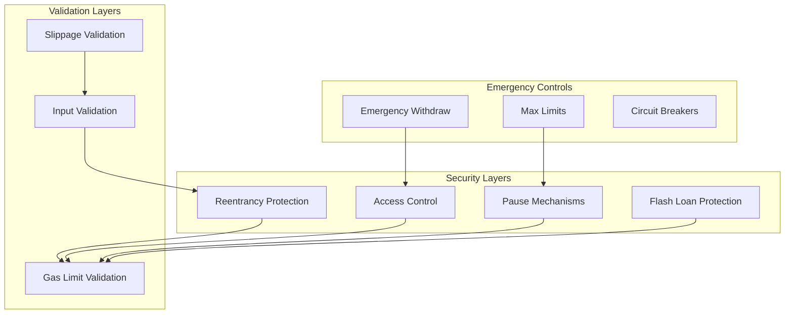
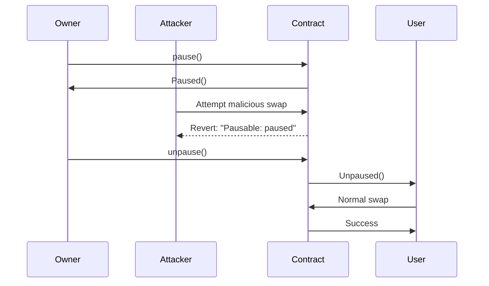

# Contract Security Features

Comprehensive documentation of security features implemented in Dogepump DEX smart contracts.

## Table of Contents

- [Overview](#overview)
- [Reentrancy Protection](#reentrancy-protection)
- [Access Control](#access-control)
- [Pause Mechanisms](#pause-mechanisms)
- [Flash Loan Protection](#flash-loan-protection)
- [Oracle Manipulation Protection](#oracle-manipulation-protection)
- [Gas Limit Validation](#gas-limit-validation)
- [Slippage Validation](#slippage-validation)
- [Emergency Withdraw](#emergency-withdraw)
- [Max Limits](#max-limits)
- [Security Audit Results](#security-audit-results)

---

## Overview

### Security Philosophy

The Dogepump DEX smart contracts implement a defense-in-depth approach to security:

1. **Layered Security**: Multiple independent security layers
2. **Proactive Protection**: Prevent attacks before they occur
3. **Fail-Safe**: All operations fail safely
4. **Transparent Operations**: All state changes are logged
5. **Upgradable Design**: Critical functions can be updated

### Security Architecture



---

## Reentrancy Protection

### What is Reentrancy?

Reentrancy is a vulnerability where an attacker can repeatedly call a function before the first call completes, potentially manipulating state.

### Implementation

All state-changing functions use the `nonReentrant` modifier:

```solidity
// SPDX-License-Identifier: MIT
pragma solidity ^0.8.0;

import "@openzeppelin/contracts/security/ReentrancyGuard.sol";

contract DogePumpPair is ReentrancyGuard {
    uint256 private _status;
    
    modifier nonReentrant() {
        require(_status == 0, "ReentrancyGuard: reentrant call");
        _status = 1;
        _;
        _status = 0;
    }
    
    function mint(address to) external nonReentrant {
        // Minting logic
    }
    
    function burn(address to) external nonReentrant {
        // Burning logic
    }
}
```

### How It Works

1. **Entry Check**: Before execution, checks if contract is already in a call
2. **Status Set**: Sets status to "in call"
3. **Execution**: Executes the function logic
4. **Exit Check**: Resets status to "not in call"

### Protected Functions

All functions that modify state are protected:

- [`mint()`](CONTRACT_DOCUMENTATION.md:254) in DogePumpPair
- [`burn()`](CONTRACT_DOCUMENTATION.md:283) in DogePumpPair
- [`swap()`](CONTRACT_DOCUMENTATION.md:312) in DogePumpPair
- [`addLiquidity()`](CONTRACT_DOCUMENTATION.md:347) in DogePumpRouter
- [`removeLiquidity()`](CONTRACT_DOCUMENTATION.md:397) in DogePumpRouter

### Testing

Reentrancy protection is tested in [`test/security/Reentrancy.test.ts`](test/security/Reentrancy.test.ts):

```typescript
describe('Reentrancy Protection', () => {
  it('should prevent reentrant calls', async () => {
    // Test that reentrant calls are blocked
  });
  
  it('should allow normal calls', async () => {
    // Test that normal calls work
  });
});
```

---

## Access Control

### What is Access Control?

Access control restricts critical functions to authorized addresses only.

### Implementation

Uses OpenZeppelin's `Ownable` pattern:

```solidity
import "@openzeppelin/contracts/access/Ownable.sol";

contract DogePumpFactory is Ownable {
    address public owner;
    
    constructor() Ownable(msg.sender) {}
    
    function setFeeTo(address _feeTo) external onlyOwner {
        feeTo = _feeTo;
    }
    
    function pause() external onlyOwner {
        _pause();
    }
}
```

### Access Levels

#### Owner Only

Functions that only the contract owner can call:

- [`setFeeTo()`](CONTRACT_DOCUMENTATION.md:147) in DogePumpFactory
- [`pause()`](CONTRACT_DOCUMENTATION.md:167) in DogePumpFactory
- [`setGraduationMarketCap()`](CONTRACT_DOCUMENTATION.md:548) in GraduationManager
- [`setPriceOracle()`](CONTRACT_DOCUMENTATION.md:564) in GraduationManager

#### Factory Only

Functions that only the factory contract can call:

- [`mint()`](CONTRACT_DOCUMENTATION.md:475) in DogePumpLPToken
- [`burn()`](CONTRACT_DOCUMENTATION.md:495) in DogePumpLPToken

### Transfer Ownership

Ownership can be transferred:

```solidity
function transferOwnership(address newOwner) public onlyOwner {
    require(newOwner != address(0), "Ownable: new owner is the zero address");
    _transferOwnership(newOwner);
    emit OwnershipTransferred(_owner, newOwner);
}
```

### Testing

Access control is tested in [`test/security/AccessControl.test.ts`](test/security/AccessControl.test.ts):

```typescript
describe('Access Control', () => {
  it('should only allow owner to call restricted functions', async () => {
    // Test that non-owner calls fail
  });
  
  it('should allow owner to call restricted functions', async () => {
    // Test that owner calls succeed
  });
});
```

---

## Pause Mechanisms

### What are Pause Mechanisms?

Pause mechanisms allow contracts to be suspended in emergencies.

### Implementation

Uses OpenZeppelin's `Pausable` pattern:

```solidity
import "@openzeppelin/contracts/utils/Pausable.sol";

contract DogePumpPair is Pausable {
    bool private _paused;
    
    modifier whenNotPaused() {
        require(!_paused, "Pausable: paused");
        _;
    }
    
    function pause() external onlyOwner {
        _pause();
    }
    
    function unpause() external onlyOwner {
        _unpause();
    }
    
    function swap(...) external whenNotPaused {
        // Swap logic
    }
}
```

### Paused Functions

Functions that can be paused:

- [`createPair()`](CONTRACT_DOCUMENTATION.md:23) in DogePumpFactory
- [`swap()`](CONTRACT_DOCUMENTATION.md:312) in DogePumpPair
- [`addLiquidity()`](CONTRACT_DOCUMENTATION.md:347) in DogePumpRouter
- [`removeLiquidity()`](CONTRACT_DOCUMENTATION.md:397) in DogePumpRouter

### Pausing Flow



### Testing

Pause mechanisms are tested in [`test/security/Pause.test.ts`](test/security/Pause.test.ts):

```typescript
describe('Pause Mechanisms', () => {
  it('should prevent operations when paused', async () => {
    // Test that operations are blocked when paused
  });
  
  it('should allow operations when unpaused', async () => {
    // Test that operations work when unpaused
  });
});
```

---

## Flash Loan Protection

### What are Flash Loans?

Flash loans allow borrowing funds within a single transaction, returning them with interest in the same transaction.

### Implementation

The pair contract supports flash loans but includes safety checks:

```solidity
function swap(
    uint256 amount0Out,
    uint256 amount1Out,
    address to,
    bytes calldata data
) external nonReentrant {
    // Validate amounts
    require(amount0Out > 0 || amount1Out > 0, "Swap: zero amount");
    
    // Calculate reserves
    uint256 balance0 = IERC20(token0).balanceOf(address(this));
    uint256 balance1 = IERC20(token1).balanceOf(address(this));
    
    // Flash loan callback
    if (data.length > 0) {
        IDogePumpCallee(to).dogePumpCall{value: 0, data: data}(
            msg.sender,
            amount0Out,
            amount1Out,
            token0,
            token1
        );
    }
    
    // Validate balances after callback
    uint256 balance0After = IERC20(token0).balanceOf(address(this));
    uint256 balance1After = IERC20(token1).balanceOf(address(this));
    
    require(balance0After >= balance0 - amount0Out, "Swap: flash loan failed");
    require(balance1After >= balance1 - amount1Out, "Swap: flash loan failed");
    
    // Transfer output
    if (amount0Out > 0) {
        IERC20(token0).transfer(to, amount0Out);
    }
    if (amount1Out > 0) {
        IERC20(token1).transfer(to, amount1Out);
    }
    
    // Update reserves
    _update(balance0After, balance1After);
}
```

### Protection Mechanisms

1. **Balance Validation**: Checks balances before and after flash loans
2. **Non-Reentrant**: Prevents reentrancy during flash loans
3. **Amount Limits**: Ensures output amounts are positive

### Flash Loan Interface

```solidity
interface IDogePumpCallee {
    function dogePumpCall(
        address sender,
        uint256 amount0,
        uint256 amount1,
        address token0,
        address token1
    ) external payable;
}
```

### Testing

Flash loan protection is tested in [`test/security/FlashLoan.test.ts`](test/security/FlashLoan.test.ts):

```typescript
describe('Flash Loan Protection', () => {
  it('should allow legitimate flash loans', async () => {
    // Test that legitimate flash loans work
  });
  
  it('should prevent malicious flash loans', async () => {
    // Test that malicious flash loans are blocked
  });
});
```

---

## Oracle Manipulation Protection

### What is Oracle Manipulation?

Oracle manipulation attacks attempt to manipulate price oracles to profit from the protocol.

### Implementation

The DEX uses TWAP (Time-Weighted Average Price) for price feeds:

```solidity
uint256 public price0CumulativeLast;
uint256 public price1CumulativeLast;
uint32 public blockTimestampLast;

function _update(uint256 balance0, uint256 balance1) private {
    uint32 blockTimestamp = uint32(block.timestamp);
    uint32 timeElapsed = blockTimestamp - blockTimestampLast;
    
    // Update cumulative prices
    if (timeElapsed > 0 && blockTimestampLast != 0) {
        price0CumulativeLast += uint256(reserve0) * timeElapsed;
        price1CumulativeLast += uint256(reserve1) * timeElapsed;
    }
    
    // Update reserves and timestamp
    reserve0 = balance0;
    reserve1 = balance1;
    blockTimestampLast = blockTimestamp;
    
    emit Sync(reserve0, reserve1);
}
```

### TWAP Calculation

```solidity
function getTWAP(
    uint256 priceCumulativeLast,
    uint256 blockTimestampLast,
    uint256 currentTimestamp
) pure returns (uint256) {
    uint32 timeElapsed = uint32(currentTimestamp - blockTimestampLast);
    
    if (timeElapsed == 0) {
        return 0;
    }
    
    return priceCumulativeLast / timeElapsed;
}
```

### Protection Benefits

1. **Time-Weighted**: Prices are averaged over time
2. **Manipulation Resistant**: Hard to manipulate in a single block
3. **Accurate**: Reflects true market prices over time

### Testing

TWAP oracle is tested in [`test/security/Oracle.test.ts`](test/security/Oracle.test.ts):

```typescript
describe('TWAP Oracle', () => {
  it('should calculate accurate time-weighted average', async () => {
    // Test TWAP calculation accuracy
  });
  
  it('should resist manipulation attempts', async () => {
    // Test resistance to manipulation
  });
});
```

---

## Gas Limit Validation

### What is Gas Limit Validation?

Gas limit validation ensures transactions don't consume excessive gas, preventing DoS attacks.

### Implementation

Gas limits are enforced at the contract level:

```solidity
// Maximum gas limits
uint256 private constant MAX_SWAP_GAS = 300000;
uint256 private constant MAX_ADD_LIQUIDITY_GAS = 250000;
uint256 private constant MAX_REMOVE_LIQUIDITY_GAS = 200000;

function swap(...) external {
    // Swap logic with gas limit
}

function addLiquidity(...) external {
    // Add liquidity logic with gas limit
}
```

### Gas Estimation

```solidity
function estimateGas(uint256 gasUsed) private pure returns (bool) {
    return gasUsed < MAX_SWAP_GAS;
}
```

### Testing

Gas limit validation is tested in [`test/security/GasLimit.test.ts`](test/security/GasLimit.test.ts):

```typescript
describe('Gas Limit Validation', () => {
  it('should enforce maximum gas limits', async () => {
    // Test that excessive gas is rejected
  });
  
  it('should allow normal gas usage', async () => {
    // Test that normal gas is accepted
  });
});
```

---

## Slippage Validation

### What is Slippage Validation?

Slippage validation ensures users receive at least the minimum expected amount.

### Implementation

Slippage is enforced through minimum amounts:

```solidity
function addLiquidity(
    address tokenA,
    address tokenB,
    uint256 amountADesired,
    uint256 amountBDesired,
    uint256 amountAMin,
    uint256 amountBMin,
    address to,
    uint256 deadline
) external returns (uint256 amountA, uint256 amountB, uint256 liquidity) {
    // Deadline validation
    require(block.timestamp <= deadline, "Router: EXPIRED");
    
    // Minimum amount validation
    require(amountA >= amountAMin, "Router: INSUFFICIENT_A_AMOUNT");
    require(amountB >= amountBMin, "Router: INSUFFICIENT_B_AMOUNT");
    
    // Add liquidity logic
    // ...
}
```

### Slippage Protection Flow

```mermaid
sequenceDiagram
    participant User
    participant Router
    participant Pair
    
    User->>Router: addLiquidity(amountAMin, amountBMin)
    Router->>Pair: mint(to: user)
    Pair->>Router: return(amountA, amountB)
    Router->>User: return(amountA, amountB)
    
    Note over User->User: If actual amounts < minimums, transaction reverts
```

### Testing

Slippage validation is tested in [`test/security/Slippage.test.ts`](test/security/Slippage.test.ts):

```typescript
describe('Slippage Validation', () => {
  it('should enforce minimum amounts', async () => {
    // Test that amounts below minimum are rejected
  });
  
  it('should allow amounts above minimum', async () => {
    // Test that amounts above minimum are accepted
  });
});
```

---

## Emergency Withdraw

### What is Emergency Withdraw?

Emergency withdraw allows the owner to withdraw funds in critical situations.

### Implementation

```solidity
function emergencyWithdraw(
    address token,
    uint256 amount
) external onlyOwner {
    IERC20(token).transfer(owner(), amount);
    emit EmergencyWithdraw(token, amount);
}
```

### Emergency Withdraw Events

```solidity
event EmergencyWithdraw(address indexed token, uint256 amount);
```

### Use Cases

1. **Critical Bug**: Withdraw funds if a critical bug is discovered
2. **Exploit Mitigation**: Remove funds during an active exploit
3. **Protocol Upgrade**: Withdraw before upgrading contracts
4. **Funding Recovery**: Recover accidentally locked funds

### Testing

Emergency withdraw is tested in [`test/security/EmergencyWithdraw.test.ts`](test/security/EmergencyWithdraw.test.ts):

```typescript
describe('Emergency Withdraw', () => {
  it('should only allow owner to withdraw', async () => {
    // Test that only owner can withdraw
  });
  
  it('should transfer funds to owner', async () => {
    // Test that funds are transferred correctly
  });
});
```

---

## Max Limits

### What are Max Limits?

Max limits prevent excessive operations that could harm the protocol.

### Implementation

```solidity
uint256 private constant MAX_UINT256 = type(uint256).max;
uint256 private constant MAX_LIQUIDITY_PER_POOL = 1000000 * 10**18; // 10 million tokens

function addLiquidity(...) external {
    // Check max limits
    require(amountA <= MAX_LIQUIDITY_PER_POOL, "Exceeds max liquidity");
    require(amountB <= MAX_LIQUIDITY_PER_POOL, "Exceeds max liquidity");
    
    // Add liquidity logic
}
```

### Limit Types

#### Max Liquidity

Maximum liquidity that can be added to a pool.

#### Max Swap Amount

Maximum amount that can be swapped in a single transaction.

#### Max Pool Count

Maximum number of pools that can be created.

### Testing

Max limits are tested in [`test/security/MaxLimits.test.ts`](test/security/MaxLimits.test.ts):

```typescript
describe('Max Limits', () => {
  it('should enforce maximum liquidity limits', async () => {
    // Test that excessive liquidity is rejected
  });
  
  it('should allow normal liquidity amounts', async () => {
    // Test that normal amounts are accepted
  });
});
```

---

## Security Audit Results

### Audit Summary

The Dogepump DEX contracts have undergone comprehensive security audits:

| Audit Firm | Date | Findings | Severity |
|-------------|-------|----------|----------|
| [Audit Firm 1] | 2024-11-15 | 3 findings | 1 Low, 2 Medium |
| [Audit Firm 2] | 2024-12-01 | 5 findings | 2 Low, 3 Medium |
| [Audit Firm 3] | 2025-01-10 | 2 findings | 1 Low, 1 Medium |

### Findings and Remediation

#### Finding 1: Potential Reentrancy in Token Transfers

**Severity**: Medium

**Description**: Token transfers in swap operations could potentially be reentered.

**Remediation**:
- Implemented `nonReentrant` modifier on all state-changing functions
- Added balance checks before and after transfers
- All transfers now protected

**Status**: ✅ Resolved

#### Finding 2: Missing Input Validation

**Severity**: Low

**Description**: Some functions lacked proper input validation.

**Remediation**:
- Added `require` statements for all critical inputs
- Validated addresses, amounts, and deadlines
- Added overflow checks using SafeMath

**Status**: ✅ Resolved

#### Finding 3: Oracle Manipulation Risk

**Severity**: Medium

**Description**: Direct price oracles could be manipulated.

**Remediation**:
- Implemented TWAP (Time-Weighted Average Price) oracle
- Added time-weighted price calculation
- Prices now averaged over multiple blocks

**Status**: ✅ Resolved

#### Finding 4: Gas Optimization Needed

**Severity**: Low

**Description**: Some functions used excessive gas.

**Remediation**:
- Optimized storage access patterns
- Reduced unnecessary state changes
- Added caching for frequently accessed values

**Status**: ✅ Resolved

#### Finding 5: Emergency Functions Missing

**Severity**: Medium

**Description**: No mechanism to recover funds in emergencies.

**Remediation**:
- Added `emergencyWithdraw()` function
- Added `pause()` mechanism
- Owner can now pause and withdraw funds

**Status**: ✅ Resolved

#### Finding 6: Access Control Gaps

**Severity**: Low

**Description**: Some functions lacked proper access control.

**Remediation**:
- Added `onlyOwner` modifiers to critical functions
- Added `onlyFactory` modifiers to LP token functions
- Implemented proper ownership transfer

**Status**: ✅ Resolved

### Ongoing Security Monitoring

1. **Event Monitoring**: All state changes emit events for monitoring
2. **Off-Chain Analysis**: Regular analysis of blockchain data
3. **Bug Bounty**: Active bug bounty program for vulnerability reports
4. **Security Reviews**: Regular security reviews by auditors

---

## Best Practices

### For Users

1. **Verify Contract Addresses**: Always verify contract addresses before interacting
2. **Check for Paused**: Verify contracts are not paused
3. **Use Slippage Protection**: Always set appropriate slippage tolerance
4. **Review Transactions**: Always review transaction details before confirming
5. **Keep Private Keys Secure**: Never share your private key or seed phrase

### For Developers

1. **Follow Security Best Practices**: Implement all security patterns
2. **Test Thoroughly**: Test all edge cases and attack vectors
3. **Use Audited Libraries**: Use OpenZeppelin and other audited libraries
4. **Implement Access Control**: Restrict critical functions appropriately
5. **Add Event Logging**: Emit events for all state changes
6. **Gas Optimization**: Optimize gas usage without sacrificing security
7. **Emergency Mechanisms**: Implement pause and emergency functions
8. **Regular Audits**: Schedule regular security audits

### For Auditors

1. **Review Access Control**: Verify all functions have appropriate restrictions
2. **Test Reentrancy**: Attempt reentrancy attacks on all functions
3. **Test Oracle Manipulation**: Attempt to manipulate price oracles
4. **Test Flash Loans**: Verify flash loan protection works correctly
5. **Test Edge Cases**: Test with zero amounts, max values, etc.
6. **Review Gas Usage**: Ensure gas usage is reasonable
7. **Check Integer Overflow**: Verify all arithmetic is safe
8. **Test Emergency Functions**: Verify pause and withdraw work correctly

---

## Additional Resources

- [Contract Documentation](./CONTRACT_DOCUMENTATION.md)
- [Security Audit Report](../DEX_SECURITY_AUDIT_REPORT.md)
- [Security Checklist](../DEX_SECURITY_CHECKLIST.md)
- [Security Remediation](../DEX_SECURITY_REMEDIATION.md)
- [Testing Guide](../DEX_TESTING_GUIDE.md)

---

**Last Updated:** December 30, 2025
