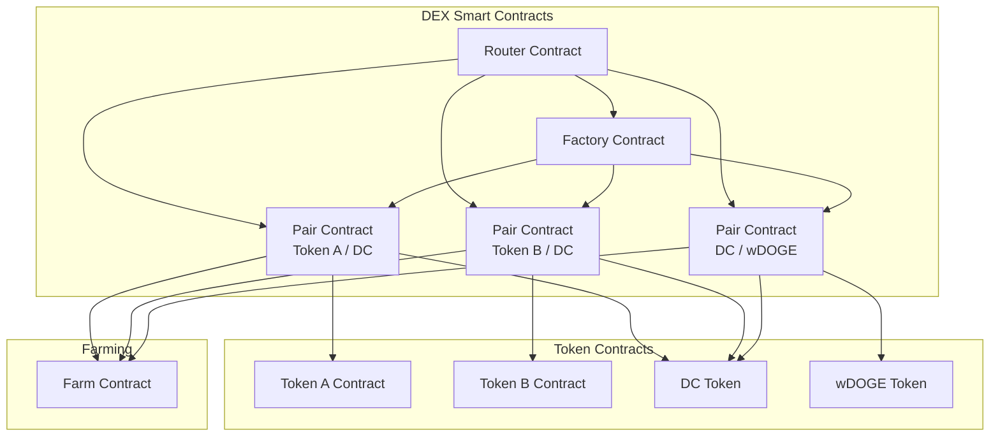
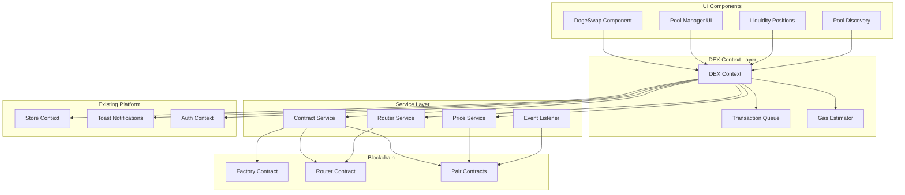

# DogePump DEX Architecture Specification

## Table of Contents

1. [Executive Summary](#executive-summary)
2. [Smart Contract Architecture](#smart-contract-architecture)
3. [Frontend Architecture](#frontend-architecture)
4. [UI/UX Design Specifications](#uiux-design-specifications)
5. [API Design](#api-design)
6. [Security Architecture](#security-architecture)
7. [Performance Considerations](#performance-considerations)
8. [Testing Strategy](#testing-strategy)
9. [Documentation Requirements](#documentation-requirements)
10. [Implementation Roadmap](#implementation-roadmap)

---

## Executive Summary

This specification defines a production-ready Decentralized Exchange (DEX) for the DogePump Dogechain Memecoin Launcher platform. The DEX implements a Uniswap V2-style AMM (Automated Market Maker) with support for:

- **Automatic migration** from bonding curve to AMM pools upon token graduation
- **Multi-hop routing** for optimal swap paths (Token A → DC → Token B)
- **Liquidity pool management** with LP token tracking
- **Real-time price feeds** from pool reserves
- **Gas estimation** and slippage protection
- **Integration** with existing farming system for LP rewards
- **Seamless UI/UX** consistent with existing platform design

### Key Design Decisions

| Decision | Rationale |
|----------|------------|
| Uniswap V2-style AMM | Proven, battle-tested, simpler than V3, sufficient for memecoin trading |
| Separate contracts (Factory, Router, Pairs) | Modular, maintainable, follows industry standards |
| Automatic graduation migration | Smooth user experience, no manual intervention required |
| DC as base token | Native platform token, all pools use DC as quote currency |
| Ethers.js v6 | Modern, type-safe, already used in platform |

---

## Smart Contract Architecture

### Overview

The DEX smart contract system consists of three core contracts following the Uniswap V2 pattern:



### 1. Factory Contract (`DogePumpFactory.sol`)

**Purpose**: Manages creation and lookup of trading pairs.

**Key Features**:
- Creates unique pairs for token/DC combinations
- Prevents duplicate pair creation
- Emits events for pair creation
- Stores pair addresses for efficient lookup

**Interface**:

```solidity
// SPDX-License-Identifier: MIT
pragma solidity ^0.8.20;

interface IDogePumpFactory {
    event PairCreated(address indexed token0, address indexed token1, address pair, uint);
    
    function createPair(address tokenA, address tokenB) external returns (address pair);
    function getPair(address tokenA, address tokenB) external view returns (address pair);
    function allPairs(uint) external view returns (address pair);
    function allPairsLength() external view returns (uint);
    function feeTo() external view returns (address);
    function setFeeTo(address) external;
    function feeToSetter() external view returns (address);
}
```

**Implementation Details**:

```solidity
contract DogePumpFactory is IDogePumpFactory {
    address public feeTo;
    address public feeToSetter;
    
    mapping(address => mapping(address => address)) public getPair;
    address[] public allPairs;
    
    constructor(address _feeToSetter) {
        feeToSetter = _feeToSetter;
    }
    
    function createPair(address tokenA, address tokenB) external returns (address pair) {
        require(tokenA != tokenB, 'IDENTICAL_ADDRESSES');
        (address token0, address token1) = tokenA < tokenB ? (tokenA, tokenB) : (tokenB, tokenA);
        require(token0 != address(0), 'ZERO_ADDRESS');
        require(getPair[token0][token1] == address(0), 'PAIR_EXISTS');
        
        bytes memory bytecode = type(DogePumpPair).creationCode;
        bytes32 salt = keccak256(abi.encodePacked(token0, token1));
        assembly {
            pair := create2(0, add(bytecode, 32), mload(bytecode), salt)
        }
        
        IDogePumpPair(pair).initialize(token0, token1);
        
        getPair[token0][token1] = pair;
        getPair[token1][token0] = pair;
        allPairs.push(pair);
        
        emit PairCreated(token0, token1, pair, allPairs.length);
    }
    
    function setFeeTo(address _feeTo) external {
        require(msg.sender == feeToSetter, 'FORBIDDEN');
        feeTo = _feeTo;
    }
    
    function allPairsLength() external view returns (uint) {
        return allPairs.length;
    }
}
```

**Security Considerations**:
- Uses `create2` for deterministic pair addresses
- Enforces token ordering to prevent duplicate pairs
- Fee setter role for protocol fee management
- Reentrancy protection on critical functions

---

### 2. Pair Contract (`DogePumpPair.sol`)

**Purpose**: Implements AMM liquidity pool with constant product formula (x * y = k).

**Key Features**:
- ERC-20 LP token representation
- Liquidity provision and removal
- Token swapping with 0.3% fee
- Reserve tracking for price calculation
- Flash loan protection

**Interface**:

```solidity
interface IDogePumpPair {
    event Mint(address indexed sender, uint amount0, uint amount1);
    event Burn(address indexed sender, uint amount0, uint amount1, address indexed to);
    event Swap(
        address indexed sender,
        uint amount0In,
        uint amount1In,
        uint amount0Out,
        uint amount1Out,
        address indexed to
    );
    event Sync(uint112 reserve0, uint112 reserve1);
    
    function initialize(address, address) external;
    function swap(uint amount0Out, uint amount1Out, address to, bytes calldata data) external;
    function skim(address to) external;
    function sync() external;
    
    function getReserves() external view returns (uint112 reserve0, uint112 reserve1, uint32 blockTimestampLast);
    function price0CumulativeLast() external view returns (uint);
    function price1CumulativeLast() external view returns (uint);
    function kLast() external view returns (uint);
    
    function mint(address to) external returns (uint liquidity);
    function burn(address to) external returns (uint amount0, uint amount1);
}
```

**Implementation Details**:

```solidity
contract DogePumpPair is IDogePumpPair, ERC20 {
    uint public constant MINIMUM_LIQUIDITY = 10**3;
    bytes4 private constant SELECTOR = bytes4(keccak256(bytes('transfer(address,uint256)')));
    
    address public factory;
    address public token0;
    address public token1;
    
    uint112 private reserve0;
    uint112 private reserve1;
    uint32 private blockTimestampLast;
    
    uint public price0CumulativeLast;
    uint public price1CumulativeLast;
    uint public kLast;
    
    uint private unlocked = 1;
    
    modifier lock() {
        require(unlocked == 1, 'LOCKED');
        unlocked = 0;
        _;
        unlocked = 1;
    }
    
    constructor() {
        factory = msg.sender;
    }
    
    function initialize(address _token0, address _token1) external {
        require(msg.sender == factory, 'FORBIDDEN');
        token0 = _token0;
        token1 = _token1;
    }
    
    function getReserves() public view returns (uint112 _reserve0, uint112 _reserve1, uint32 _blockTimestampLast) {
        _reserve0 = reserve0;
        _reserve1 = reserve1;
        _blockTimestampLast = blockTimestampLast;
    }
    
    function _update(uint balance0, uint balance1, uint112 _reserve0, uint112 _reserve1) private {
        require(balance0 <= uint112(-1) && balance1 <= uint112(-1), 'OVERFLOW');
        uint32 blockTimestamp = uint32(block.timestamp % 2**32);
        uint32 timeElapsed = blockTimestamp - blockTimestampLast;
        
        if (timeElapsed > 0 && _reserve0 != 0 && _reserve1 != 0) {
            price0CumulativeLast += uint(UQ112x112.encode(_reserve1).uqdiv(_reserve0)) * timeElapsed;
            price1CumulativeLast += uint(UQ112x112.encode(_reserve0).uqdiv(_reserve1)) * timeElapsed;
        }
        
        reserve0 = uint112(balance0);
        reserve1 = uint112(balance1);
        blockTimestampLast = blockTimestamp;
        emit Sync(reserve0, reserve1);
    }
    
    function mint(address to) external lock returns (uint liquidity) {
        (uint112 _reserve0, uint112 _reserve1,) = getReserves();
        uint balance0 = IERC20(token0).balanceOf(address(this));
        uint balance1 = IERC20(token1).balanceOf(address(this));
        uint amount0 = balance0 - _reserve0;
        uint amount1 = balance1 - _reserve1;
        
        uint _totalSupply = totalSupply;
        if (_totalSupply == 0) {
            liquidity = Math.sqrt(amount0 * amount1) - MINIMUM_LIQUIDITY;
            _mint(address(0), MINIMUM_LIQUIDITY);
        } else {
            liquidity = Math.min(amount0 * _totalSupply / _reserve0, amount1 * _totalSupply / _reserve1);
        }
        
        require(liquidity > 0, 'INSUFFICIENT_LIQUIDITY_MINTED');
        
        _mint(to, liquidity);
        _update(balance0, balance1, _reserve0, _reserve1);
        emit Mint(msg.sender, amount0, amount1);
    }
    
    function burn(address to) external lock returns (uint amount0, uint amount1) {
        (uint112 _reserve0, uint112 _reserve1,) = getReserves();
        address _token0 = token0;
        address _token1 = token1;
        uint balance0 = IERC20(_token0).balanceOf(address(this));
        uint balance1 = IERC20(_token1).balanceOf(address(this));
        uint liquidity = balanceOf[address(this)];
        
        uint _totalSupply = totalSupply;
        amount0 = liquidity * balance0 / _totalSupply;
        amount1 = liquidity * balance1 / _totalSupply;
        
        require(amount0 > 0 && amount1 > 0, 'INSUFFICIENT_LIQUIDITY_BURNED');
        
        _burn(address(this), liquidity);
        _safeTransfer(_token0, to, amount0);
        _safeTransfer(_token1, to, amount1);
        
        balance0 = IERC20(_token0).balanceOf(address(this));
        balance1 = IERC20(_token1).balanceOf(address(this));
        
        _update(balance0, balance1, _reserve0, _reserve1);
        emit Burn(msg.sender, amount0, amount1, to);
    }
    
    function swap(uint amount0Out, uint amount1Out, address to, bytes calldata data) external lock {
        require(amount0Out > 0 || amount1Out > 0, 'INSUFFICIENT_OUTPUT_AMOUNT');
        (uint112 _reserve0, uint112 _reserve1,) = getReserves();
        require(amount0Out < _reserve0 && amount1Out < _reserve1, 'INSUFFICIENT_LIQUIDITY');
        
        uint balance0;
        uint balance1;
        {
            address _token0 = token0;
            address _token1 = token1;
            require(to != _token0 && to != _token1, 'INVALID_TO');
            
            if (amount0Out > 0) _safeTransfer(_token0, to, amount0Out);
            if (amount1Out > 0) _safeTransfer(_token1, to, amount1Out);
            
            if (data.length > 0) {
                IDogePumpCallee(to).dogePumpCall(msg.sender, amount0Out, amount1Out, data);
            }
            
            balance0 = IERC20(_token0).balanceOf(address(this));
            balance1 = IERC20(_token1).balanceOf(address(this));
        }
        
        uint amount0In = balance0 > _reserve0 - amount0Out ? balance0 - (_reserve0 - amount0Out) : 0;
        uint amount1In = balance1 > _reserve1 - amount1Out ? balance1 - (_reserve1 - amount1Out) : 0;
        
        require(amount0In > 0 || amount1In > 0, 'INSUFFICIENT_INPUT_AMOUNT');
        
        {
            uint balance0Adjusted = balance0 * 1000 - amount0In * 3;
            uint balance1Adjusted = balance1 * 1000 - amount1In * 3;
            require(balance0Adjusted * balance1Adjusted >= uint(_reserve0) * _reserve1 * 1000000, 'K');
        }
        
        _update(balance0, balance1, _reserve0, _reserve1);
        emit Swap(msg.sender, amount0In, amount1In, amount0Out, amount1Out, to);
    }
    
    function skim(address to) external lock {
        address _token0 = token0;
        address _token1 = token1;
        _safeTransfer(_token0, to, IERC20(_token0).balanceOf(address(this)) - reserve0);
        _safeTransfer(_token1, to, IERC20(_token1).balanceOf(address(this)) - reserve1);
    }
    
    function sync() external lock {
        _update(IERC20(token0).balanceOf(address(this)), IERC20(token1).balanceOf(address(this)), reserve0, reserve1);
    }
    
    function _safeTransfer(address token, address to, uint value) private {
        (bool success, bytes memory data) = token.call(abi.encodeWithSelector(SELECTOR, to, value));
        require(success && (data.length == 0 || abi.decode(data, (bool))), 'TRANSFER_FAILED');
    }
}
```

**Key AMM Formula**:
- Constant product: `x * y = k`
- Swap calculation: `amountOut = (amountIn * 997 * reserveOut) / (reserveIn * 1000 + amountIn * 997)`
- 0.3% fee on all swaps (3 basis points)

**Security Features**:
- Reentrancy guard (`lock` modifier)
- Flash loan protection via callback interface
- Minimum liquidity requirement
- Reserve synchronization checks
- Safe transfer pattern

---

### 3. Router Contract (`DogePumpRouter.sol`)

**Purpose**: Facilitates token swaps and liquidity management.

**Key Features**:
- Single and multi-hop swaps
- Add/remove liquidity
- Slippage protection
- Optimal routing through DC
- Gas-efficient batch operations

**Interface**:

```solidity
interface IDogePumpRouter {
    function factory() external pure returns (address);
    function WDC() external pure returns (address);
    
    function addLiquidity(
        address tokenA,
        address tokenB,
        uint amountADesired,
        uint amountBDesired,
        uint amountAMin,
        uint amountBMin,
        address to,
        uint deadline
    ) external returns (uint amountA, uint amountB, uint liquidity);
    
    function removeLiquidity(
        address tokenA,
        address tokenB,
        uint liquidity,
        uint amountAMin,
        uint amountBMin,
        address to,
        uint deadline
    ) external returns (uint amountA, uint amountB);
    
    function swapExactTokensForTokens(
        uint amountIn,
        uint amountOutMin,
        address[] calldata path,
        address to,
        uint deadline
    ) external returns (uint[] memory amounts);
    
    function swapTokensForExactTokens(
        uint amountOut,
        uint amountInMax,
        address[] calldata path,
        address to,
        uint deadline
    ) external returns (uint[] memory amounts);
    
    function getAmountsOut(uint amountIn, address[] calldata path) external view returns (uint[] memory amounts);
    function getAmountsIn(uint amountOut, address[] calldata path) external view returns (uint[] memory amounts);
}
```

**Implementation Details**:

```solidity
contract DogePumpRouter is IDogePumpRouter {
    address public immutable factory;
    address public immutable WDC;
    
    modifier ensure(uint deadline) {
        require(deadline >= block.timestamp, 'EXPIRED');
        _;
    }
    
    constructor(address _factory, address _WDC) {
        factory = _factory;
        WDC = _WDC;
    }
    
    function _swap(uint[] memory amounts, address[] memory path, address _to) internal virtual {
        for (uint i; i < path.length - 1; i++) {
            (address input, address output) = (path[i], path[i + 1]);
            (address token0,) = DogePumpLibrary.sortTokens(input, output);
            uint amountOut = amounts[i + 1];
            (uint amount0Out, uint amount1Out) = input == token0 ? (uint(0), amountOut) : (amountOut, uint(0));
            address to = i < path.length - 2 ? DogePumpLibrary.pairFor(factory, input, output) : _to;
            IDogePumpPair(DogePumpLibrary.pairFor(factory, input, output)).swap(
                amount0Out, amount1Out, to, new bytes(0)
            );
        }
    }
    
    function swapExactTokensForTokens(
        uint amountIn,
        uint amountOutMin,
        address[] calldata path,
        address to,
        uint deadline
    ) external ensure(deadline) returns (uint[] memory amounts) {
        amounts = DogePumpLibrary.getAmountsOut(factory, amountIn, path);
        require(amounts[amounts.length - 1] >= amountOutMin, 'INSUFFICIENT_OUTPUT_AMOUNT');
        _safeTransferFrom(
            path[0], msg.sender, DogePumpLibrary.pairFor(factory, path[0], path[1]), amounts[0]
        );
        _swap(amounts, path, to);
    }
    
    function swapTokensForExactTokens(
        uint amountOut,
        uint amountInMax,
        address[] calldata path,
        address to,
        uint deadline
    ) external ensure(deadline) returns (uint[] memory amounts) {
        amounts = DogePumpLibrary.getAmountsIn(factory, amountOut, path);
        require(amounts[0] <= amountInMax, 'EXCESSIVE_INPUT_AMOUNT');
        _safeTransferFrom(
            path[0], msg.sender, DogePumpLibrary.pairFor(factory, path[0], path[1]), amounts[0]
        );
        _swap(amounts, path, to);
    }
    
    function addLiquidity(
        address tokenA,
        address tokenB,
        uint amountADesired,
        uint amountBDesired,
        uint amountAMin,
        uint amountBMin,
        address to,
        uint deadline
    ) external ensure(deadline) returns (uint amountA, uint amountB, uint liquidity) {
        (amountA, amountB) = _addLiquidity(tokenA, tokenB, amountADesired, amountBDesired, amountAMin, amountBMin);
        address pair = DogePumpLibrary.pairFor(factory, tokenA, tokenB);
        _safeTransferFrom(tokenA, msg.sender, pair, amountA);
        _safeTransferFrom(tokenB, msg.sender, pair, amountB);
        liquidity = IDogePumpPair(pair).mint(to);
    }
    
    function removeLiquidity(
        address tokenA,
        address tokenB,
        uint liquidity,
        uint amountAMin,
        uint amountMin,
        address to,
        uint deadline
    ) public ensure(deadline) returns (uint amountA, uint amountB) {
        address pair = DogePumpLibrary.pairFor(factory, tokenA, tokenB);
        IDogePumpPair(pair).transferFrom(msg.sender, pair, liquidity);
        (uint amount0, uint amount1) = IDogePumpPair(pair).burn(to);
        (address token0,) = DogePumpLibrary.sortTokens(tokenA, tokenB);
        (amountA, amountB) = tokenA == token0 ? (amount0, amount1) : (amount1, amount0);
        require(amountA >= amountAMin, 'INSUFFICIENT_A_AMOUNT');
        require(amountB >= amountMin, 'INSUFFICIENT_B_AMOUNT');
    }
    
    function getAmountsOut(uint amountIn, address[] calldata path) public view returns (uint[] memory amounts) {
        return DogePumpLibrary.getAmountsOut(factory, amountIn, path);
    }
    
    function getAmountsIn(uint amountOut, address[] calldata path) public view returns (uint[] memory amounts) {
        return DogePumpLibrary.getAmountsIn(factory, amountOut, path);
    }
    
    function _addLiquidity(
        address tokenA,
        address tokenB,
        uint amountADesired,
        uint amountBDesired,
        uint amountAMin,
        uint amountBMin
    ) internal returns (uint amountA, uint amountB) {
        (uint reserveA, uint reserveB) = DogePumpLibrary.getReserves(factory, tokenA, tokenB);
        if (reserveA == 0 && reserveB == 0) {
            (amountA, amountB) = (amountADesired, amountBDesired);
        } else {
            uint amountBOptimal = DogePumpLibrary.quote(amountADesired, reserveA, reserveB);
            if (amountBOptimal <= amountBDesired) {
                require(amountBOptimal >= amountBMin, 'INSUFFICIENT_B_AMOUNT');
                (amountA, amountB) = (amountADesired, amountBOptimal);
            } else {
                uint amountAOptimal = DogePumpLibrary.quote(amountBDesired, reserveB, reserveA);
                assert(amountAOptimal <= amountADesired);
                require(amountAOptimal >= amountAMin, 'INSUFFICIENT_A_AMOUNT');
                (amountA, amountB) = (amountAOptimal, amountBDesired);
            }
        }
    }
    
    function _safeTransferFrom(address token, address from, address to, uint value) private {
        (bool success, bytes memory data) = token.call(abi.encodeWithSelector(SELECTOR, from, to, value));
        require(success && (data.length == 0 || abi.decode(data, (bool))), 'TRANSFER_FAILED');
    }
}
```

**Library Contract (`DogePumpLibrary.sol`)**:

```solidity
library DogePumpLibrary {
    function sortTokens(address tokenA, address tokenB) internal pure returns (address token0, address token1) {
        require(tokenA != tokenB, 'IDENTICAL_ADDRESSES');
        (token0, token1) = tokenA < tokenB ? (tokenA, tokenB) : (tokenB, tokenA);
        require(token0 != address(0), 'ZERO_ADDRESS');
    }
    
    function pairFor(address factory, address tokenA, address tokenB) internal pure returns (address pair) {
        (address token0, address token1) = sortTokens(tokenA, tokenB);
        pair = address(uint160(uint(keccak256(abi.encodePacked(
            hex'ff',
            factory,
            keccak256(abi.encodePacked(token0, token1)),
            hex'96e8ac4277198ff8b6f785478aa9a39f403cb768dd02cbee326c3e7da348845f'
        ))));
    }
    
    function getReserves(address factory, address tokenA, address tokenB) internal view returns (uint reserveA, uint reserveB) {
        (address token0,) = sortTokens(tokenA, tokenB);
        (uint reserve0, uint reserve1,) = IDogePumpPair(pairFor(factory, tokenA, tokenB)).getReserves();
        (reserveA, reserveB) = tokenA == token0 ? (reserve0, reserve1) : (reserve1, reserve0);
    }
    
    function quote(uint amountA, uint reserveA, uint reserveB) internal pure returns (uint amountB) {
        require(amountA > 0, 'INSUFFICIENT_AMOUNT');
        require(reserveA > 0 && reserveB > 0, 'INSUFFICIENT_LIQUIDITY');
        amountB = amountA * reserveB / reserveA;
    }
    
    function getAmountOut(uint amountIn, uint reserveIn, uint reserveOut) internal pure returns (uint amountOut) {
        require(amountIn > 0, 'INSUFFICIENT_INPUT_AMOUNT');
        require(reserveIn > 0 && reserveOut > 0, 'INSUFFICIENT_LIQUIDITY');
        uint amountInWithFee = amountIn * 997;
        uint numerator = amountInWithFee * reserveOut;
        uint denominator = reserveIn * 1000 + amountInWithFee;
        amountOut = numerator / denominator;
    }
    
    function getAmountIn(uint amountOut, uint reserveIn, uint reserveOut) internal pure returns (uint amountIn) {
        require(amountOut > 0, 'INSUFFICIENT_OUTPUT_AMOUNT');
        require(reserveIn > 0 && reserveOut > 0, 'INSUFFICIENT_LIQUIDITY');
        uint numerator = reserveIn * amountOut * 1000;
        uint denominator = (reserveOut - amountOut) * 997;
        amountIn = (numerator / denominator) + 1;
    }
    
    function getAmountsOut(address factory, uint amountIn, address[] memory path) internal view returns (uint[] memory amounts) {
        require(path.length >= 2, 'INVALID_PATH');
        amounts = new uint[](path.length);
        amounts[0] = amountIn;
        for (uint i; i < path.length - 1; i++) {
            (uint reserveIn, uint reserveOut) = getReserves(factory, path[i], path[i + 1]);
            amounts[i + 1] = getAmountOut(amounts[i], reserveIn, reserveOut);
        }
    }
    
    function getAmountsIn(address factory, uint amountOut, address[] memory path) internal view returns (uint[] memory amounts) {
        require(path.length >= 2, 'INVALID_PATH');
        amounts = new uint[](path.length);
        amounts[amounts.length - 1] = amountOut;
        for (uint i = path.length - 1; i > 0; i--) {
            (uint reserveIn, uint reserveOut) = getReserves(factory, path[i - 1], path[i]);
            amounts[i - 1] = getAmountIn(amounts[i], reserveIn, reserveOut);
        }
    }
}
```

---

### 4. Graduation Migration Contract (`GraduationManager.sol`)

**Purpose**: Manages automatic migration of tokens from bonding curve to AMM pools upon graduation.

**Key Features**:
- Monitors token market cap
- Triggers pool creation at graduation
- Migrates liquidity from bonding curve to AMM
- Burns bonding curve tokens
- Mints LP tokens to creator

**Interface**:

```solidity
interface IGraduationManager {
    event TokenGraduated(address indexed token, address indexed pool, uint liquidityMigrated);
    
    function checkAndGraduate(address token) external;
    function isGraduated(address token) external view returns (bool);
    function getPoolForToken(address token) external view returns (address);
}
```

**Implementation Details**:

```solidity
contract GraduationManager is IGraduationManager {
    address public immutable factory;
    address public immutable router;
    uint public constant GRADUATION_THRESHOLD = 6900 * 10**18; // $6,900 USD in 18 decimals
    
    mapping(address => bool) public isGraduated;
    mapping(address => address) public getPoolForToken;
    mapping(address => uint) public tokenGraduationMarketCap;
    
    address public dcToken;
    address public priceOracle;
    
    constructor(address _factory, address _router, address _dcToken, address _priceOracle) {
        factory = _factory;
        router = _router;
        dcToken = _dcToken;
        priceOracle = _priceOracle;
    }
    
    function checkAndGraduate(address token) external {
        require(!isGraduated[token], 'ALREADY_GRADUATED');
        
        // Get current market cap from bonding curve contract
        uint marketCapUSD = IBondingCurveToken(token).getMarketCap();
        
        // Convert to USD using price oracle
        uint dcPriceUSD = IPriceOracle(priceOracle).getDCPriceUSD();
        uint marketCapDC = marketCapUSD / dcPriceUSD;
        
        require(marketCapDC >= GRADUATION_THRESHOLD, 'BELOW_GRADUATION_THRESHOLD');
        
        // Create AMM pool
        address pool = IDogePumpFactory(factory).createPair(token, dcToken);
        getPoolForToken[token] = pool;
        tokenGraduationMarketCap[token] = marketCapDC;
        
        // Migrate liquidity from bonding curve
        uint bondingCurveLiquidity = IBondingCurveToken(token).getVirtualLiquidity();
        require(bondingCurveLiquidity > 0, 'NO_LIQUIDITY_TO_MIGRATE');
        
        // Transfer liquidity to pool
        uint tokenAmount = bondingCurveLiquidity / 2;
        uint dcAmount = bondingCurveLiquidity / 2;
        
        IERC20(token).transferFrom(msg.sender, pool, tokenAmount);
        IERC20(dcToken).transferFrom(msg.sender, pool, dcAmount);
        
        // Mint LP tokens to creator
        uint liquidity = IDogePumpPair(pool).mint(msg.sender);
        
        // Burn bonding curve tokens (optional, based on design)
        IBondingCurveToken(token).burnLiquidity(bondingCurveLiquidity);
        
        // Mark as graduated
        isGraduated[token] = true;
        
        emit TokenGraduated(token, pool, liquidity);
    }
}
```

---

### 5. Contract Deployment Addresses

```typescript
// contracts/addresses.ts
export const DEX_CONTRACTS = {
  DOGECHAIN_ID: 2000,
  
  // Mainnet (when deployed)
  mainnet: {
    factory: '0x...', // To be filled after deployment
    router: '0x...', // To be filled after deployment
    graduationManager: '0x...', // To be filled after deployment
    
    // Native tokens
    DC: '0x7B4328c127B85369D9f82ca0503B000D09CF9180',
    wDOGE: '0xB7ddC6414bf4F5515b52D8BdD69973Ae205ff101',
  },
  
  // Testnet (Dogechain testnet)
  testnet: {
    factory: '0x...', // To be filled after deployment
    router: '0x...', // To be filled after deployment
    graduationManager: '0x...', // To be filled after deployment
    
    // Native tokens
    DC: '0x...', // Testnet DC address
    wDOGE: '0x...', // Testnet wDOGE address
  },
} as const;
```

---

## Frontend Architecture

### Overview

The frontend DEX architecture integrates seamlessly with the existing React 19 + TypeScript + Vite + Tailwind CSS platform.



---

### 1. DEX Context (`contexts/DexContext.tsx`)

**Purpose**: Centralized state management for DEX operations.

**State Management**:

```typescript
// types/dex.ts
export interface DexState {
  // Pool data
  pools: Record<string, PoolInfo>;
  poolList: PoolInfo[];
  
  // User positions
  lpPositions: LPPosition[];
  pendingTransactions: PendingTransaction[];
  
  // Price data
  prices: Record<string, TokenPrice>;
  
  // UI state
  selectedFromToken: TokenInfo | null;
  selectedToToken: TokenInfo | null;
  swapAmount: string;
  slippage: number;
  deadline: number;
  
  // Loading states
  isLoadingPools: boolean;
  isLoadingPrices: boolean;
  isExecutingSwap: boolean;
}

export interface PoolInfo {
  address: string;
  token0: TokenInfo;
  token1: TokenInfo;
  reserve0: bigint;
  reserve1: bigint;
  totalSupply: bigint;
  lpTokenAddress: string;
  createdAt: number;
  tvlUSD: number;
  volume24h: number;
  fees24h: number;
  apy: number;
}

export interface LPPosition {
  id: string;
  poolAddress: string;
  token0: TokenInfo;
  token1: TokenInfo;
  liquidity: bigint;
  lpTokenBalance: bigint;
  shareOfPool: number;
  valueUSD: number;
  unclaimedFees: bigint;
  stakedInFarm: boolean;
  farmId?: string;
}

export interface TokenPrice {
  address: string;
  priceInDC: number;
  priceInUSD: number;
  priceInWDOGE: number;
  lastUpdated: number;
  change24h: number;
}

export interface PendingTransaction {
  id: string;
  type: 'swap' | 'add_liquidity' | 'remove_liquidity' | 'create_pool';
  hash: string;
  status: 'pending' | 'confirmed' | 'failed';
  timestamp: number;
  details: any;
}

export interface TokenInfo {
  address: string;
  symbol: string;
  name: string;
  decimals: number;
  logoURI: string;
  isNative?: boolean;
}
```

**Context Implementation**:

```typescript
// contexts/DexContext.tsx
import React, { createContext, useContext, useState, useEffect, useCallback } from 'react';
import { ethers } from 'ethers';
import { useStore } from './StoreContext';
import { contractService } from '../services/contractService';
import { priceService } from '../services/priceService';
import { routerService } from '../services/routerService';
import { DexState, PoolInfo, LPPosition, TokenInfo } from '../types/dex';

interface DexContextType extends DexState {
  // Pool operations
  loadPools: () => Promise<void>;
  createPool: (token0: string, token1: string) => Promise<string>;
  
  // Swap operations
  getSwapQuote: (amountIn: bigint, path: string[]) => Promise<bigint>;
  executeSwap: (amountIn: bigint, path: string[], slippage: number) => Promise<string>;
  
  // Liquidity operations
  addLiquidity: (token0: string, token1: string, amount0: bigint, amount1: bigint) => Promise<string>;
  removeLiquidity: (poolAddress: string, liquidity: bigint) => Promise<void>;
  
  // Price operations
  refreshPrices: () => Promise<void>;
  getTokenPrice: (tokenAddress: string) => Promise<number>;
  
  // Position operations
  loadUserPositions: (userAddress: string) => Promise<void>;
  stakeLPInFarm: (positionId: string, farmId: string) => Promise<void>;
  
  // UI operations
  setFromToken: (token: TokenInfo | null) => void;
  setToToken: (token: TokenInfo | null) => void;
  setSwapAmount: (amount: string) => void;
  setSlippage: (slippage: number) => void;
}

const DexContext = createContext<DexContextType | undefined>(undefined);

export const DexProvider: React.FC<{ children: React.ReactNode }> = ({ children }) => {
  const { userAddress, tokens } = useStore();
  
  const [pools, setPools] = useState<Record<string, PoolInfo>>({});
  const [poolList, setPoolList] = useState<PoolInfo[]>([]);
  const [lpPositions, setLpPositions] = useState<LPPosition[]>([]);
  const [pendingTransactions, setPendingTransactions] = useState<PendingTransaction[]>([]);
  const [prices, setPrices] = useState<Record<string, TokenPrice>>({});
  
  const [selectedFromToken, setSelectedFromToken] = useState<TokenInfo | null>(null);
  const [selectedToToken, setSelectedToToken] = useState<TokenInfo | null>(null);
  const [swapAmount, setSwapAmount] = useState<string>('');
  const [slippage, setSlippage] = useState<number>(0.5);
  const [deadline, setDeadline] = useState<number>(20); // minutes
  
  const [isLoadingPools, setIsLoadingPools] = useState<boolean>(false);
  const [isLoadingPrices, setIsLoadingPrices] = useState<boolean>(false);
  const [isExecutingSwap, setIsExecutingSwap] = useState<boolean>(false);
  
  // Load pools on mount
  useEffect(() => {
    loadPools();
  }, []);
  
  // Load user positions when wallet connects
  useEffect(() => {
    if (userAddress) {
      loadUserPositions(userAddress);
    }
  }, [userAddress]);
  
  // Refresh prices periodically
  useEffect(() => {
    const interval = setInterval(() => {
      refreshPrices();
    }, 30000); // 30 seconds
    
    return () => clearInterval(interval);
  }, []);
  
  const loadPools = useCallback(async () => {
    setIsLoadingPools(true);
    try {
      const allPools = await contractService.getAllPools();
      const poolsMap: Record<string, PoolInfo> = {};
      allPools.forEach(pool => {
        poolsMap[pool.address] = pool;
      });
      setPools(poolsMap);
      setPoolList(allPools);
    } catch (error) {
      console.error('Failed to load pools:', error);
    } finally {
      setIsLoadingPools(false);
    }
  }, []);
  
  const createPool = useCallback(async (token0: string, token1: string) => {
    const poolAddress = await contractService.createPool(token0, token1);
    await loadPools();
    return poolAddress;
  }, [loadPools]);
  
  const getSwapQuote = useCallback(async (amountIn: bigint, path: string[]) => {
    return await routerService.getAmountsOut(amountIn, path);
  }, []);
  
  const executeSwap = useCallback(async (amountIn: bigint, path: string[], slippagePercent: number) => {
    setIsExecutingSwap(true);
    try {
      const amountsOut = await routerService.getAmountsOut(amountIn, path);
      const minAmountOut = (amountsOut[amountsOut.length - 1] * BigInt(Math.floor((100 - slippagePercent) * 100))) / BigInt(10000);
      
      const tx = await routerService.swapExactTokensForTokens(
        amountIn,
        minAmountOut,
        path,
        userAddress!,
        deadline
      );
      
      // Add to pending transactions
      const pendingTx: PendingTransaction = {
        id: Date.now().toString(),
        type: 'swap',
        hash: tx.hash,
        status: 'pending',
        timestamp: Date.now(),
        details: { amountIn, path, slippage: slippagePercent }
      };
      setPendingTransactions(prev => [pendingTx, ...prev]);
      
      // Wait for confirmation
      await tx.wait();
      
      // Update transaction status
      setPendingTransactions(prev => 
        prev.map(tx => tx.hash === tx.hash ? { ...tx, status: 'confirmed' } : tx)
      );
      
      // Refresh prices and positions
      await refreshPrices();
      await loadUserPositions(userAddress!);
      
      return tx.hash;
    } catch (error) {
      console.error('Swap failed:', error);
      throw error;
    } finally {
      setIsExecutingSwap(false);
    }
  }, [userAddress, deadline, refreshPrices, loadUserPositions]);
  
  const addLiquidity = useCallback(async (token0: string, token1: string, amount0: bigint, amount1: bigint) => {
    const tx = await contractService.addLiquidity(token0, token1, amount0, amount1);
    await tx.wait();
    await loadPools();
    await loadUserPositions(userAddress!);
    return tx.hash;
  }, [loadPools, loadUserPositions, userAddress]);
  
  const removeLiquidity = useCallback(async (poolAddress: string, liquidity: bigint) => {
    const pool = pools[poolAddress];
    const tx = await contractService.removeLiquidity(
      pool.token0.address,
      pool.token1.address,
      liquidity
    );
    await tx.wait();
    await loadPools();
    await loadUserPositions(userAddress!);
  }, [pools, loadPools, loadUserPositions, userAddress]);
  
  const refreshPrices = useCallback(async () => {
    setIsLoadingPrices(true);
    try {
      const newPrices = await priceService.getAllPoolPrices();
      setPrices(newPrices);
    } catch (error) {
      console.error('Failed to refresh prices:', error);
    } finally {
      setIsLoadingPrices(false);
    }
  }, []);
  
  const getTokenPrice = useCallback(async (tokenAddress: string) => {
    return await priceService.getTokenPrice(tokenAddress);
  }, []);
  
  const loadUserPositions = useCallback(async (userAddress: string) => {
    const positions = await contractService.getUserLPPositions(userAddress);
    setLpPositions(positions);
  }, []);
  
  const stakeLPInFarm = useCallback(async (positionId: string, farmId: string) => {
    // Integrate with existing farm system
    const { stakeToken } = useStore();
    await stakeToken(farmId, 0); // LP token staking
    setLpPositions(prev =>
      prev.map(pos => pos.id === positionId ? { ...pos, stakedInFarm: true, farmId } : pos)
    );
  }, []);
  
  const value: DexContextType = {
    pools,
    poolList,
    lpPositions,
    pendingTransactions,
    prices,
    selectedFromToken,
    selectedToToken,
    swapAmount,
    slippage,
    deadline,
    isLoadingPools,
    isLoadingPrices,
    isExecutingSwap,
    loadPools,
    createPool,
    getSwapQuote,
    executeSwap,
    addLiquidity,
    removeLiquidity,
    refreshPrices,
    getTokenPrice,
    loadUserPositions,
    stakeLPInFarm,
    setFromToken: setSelectedFromToken,
    setToToken: setSelectedToToken,
    setSwapAmount: setSwapAmount,
    setSlippage: setSlippage,
  };
  
  return (
    <DexContext.Provider value={value}>
      {children}
    </DexContext.Provider>
  );
};

export const useDex = () => {
  const context = useContext(DexContext);
  if (!context) {
    throw new Error('useDex must be used within DexProvider');
  }
  return context;
};
```

---

### 2. Contract Service (`services/contractService.ts`)

**Purpose**: Handles all smart contract interactions.

```typescript
// services/contractService.ts
import { ethers } from 'ethers';
import { DEX_CONTRACTS } from '../constants';
import { PoolInfo, LPPosition, TokenInfo } from '../types/dex';
import DogePumpFactoryABI from '../abis/DogePumpFactory.json';
import DogePumpRouterABI from '../abis/DogePumpRouter.json';
import DogePumpPairABI from '../abis/DogePumpPair.json';
import GraduationManagerABI from '../abis/GraduationManager.json';

class ContractService {
  private provider: ethers.BrowserProvider | null = null;
  private signer: ethers.JsonRpcSigner | null = null;
  
  private factory: ethers.Contract | null = null;
  private router: ethers.Contract | null = null;
  private graduationManager: ethers.Contract | null = null;
  
  private pairCache: Map<string, ethers.Contract> = new Map();
  
  async initialize() {
    if (!window.ethereum) {
      throw new Error('No wallet detected');
    }
    
    this.provider = new ethers.BrowserProvider(window.ethereum);
    this.signer = await this.provider.getSigner();
    
    // Initialize contracts
    const network = await this.provider.getNetwork();
    const addresses = network.chainId === 2000 ? DEX_CONTRACTS.mainnet : DEX_CONTRACTS.testnet;
    
    this.factory = new ethers.Contract(addresses.factory, DogePumpFactoryABI, this.signer);
    this.router = new ethers.Contract(addresses.router, DogePumpRouterABI, this.signer);
    this.graduationManager = new ethers.Contract(
      addresses.graduationManager,
      GraduationManagerABI,
      this.signer
    );
  }
  
  async getAllPools(): Promise<PoolInfo[]> {
    if (!this.factory) await this.initialize();
    
    const pairsCount = await this.factory.allPairsLength();
    const pools: PoolInfo[] = [];
    
    for (let i = 0; i < pairsCount; i++) {
      const pairAddress = await this.factory.allPairs(i);
      const pool = await this.getPoolInfo(pairAddress);
      if (pool) pools.push(pool);
    }
    
    return pools;
  }
  
  async getPoolInfo(pairAddress: string): Promise<PoolInfo | null> {
    try {
      const pair = this.getPairContract(pairAddress);
      
      const [token0, token1, reserves, totalSupply] = await Promise.all([
        pair.token0(),
        pair.token1(),
        pair.getReserves(),
        pair.totalSupply(),
      ]);
      
      const token0Info = await this.getTokenInfo(token0);
      const token1Info = await this.getTokenInfo(token1);
      
      return {
        address: pairAddress,
        token0: token0Info,
        token1: token1Info,
        reserve0: reserves.reserve0,
        reserve1: reserves.reserve1,
        totalSupply,
        lpTokenAddress: pairAddress,
        createdAt: 0, // Would need to fetch from events
        tvlUSD: 0, // Calculate from reserves * price
        volume24h: 0, // Track from swap events
        fees24h: 0,
        apy: 0, // Calculate from fees / TVL
      };
    } catch (error) {
      console.error('Failed to get pool info:', error);
      return null;
    }
  }
  
  async getTokenInfo(tokenAddress: string): Promise<TokenInfo> {
    // Check if it's DC or wDOGE
    if (tokenAddress.toLowerCase() === DEX_CONTRACTS.mainnet.DC.toLowerCase()) {
      return {
        address: tokenAddress,
        symbol: 'DC',
        name: 'DogeChain',
        decimals: 18,
        logoURI: 'https://dogechain.dog/favicon.png',
        isNative: true,
      };
    }
    
    if (tokenAddress.toLowerCase() === DEX_CONTRACTS.mainnet.wDOGE.toLowerCase()) {
      return {
        address: tokenAddress,
        symbol: 'wDOGE',
        name: 'Wrapped DOGE',
        decimals: 18,
        logoURI: 'https://assets.coingecko.com/coins/images/1/small/dogecoin.png',
      };
    }
    
    // For platform tokens, fetch from StoreContext
    // This is a simplified version - in production, you'd fetch from token contract
    const tokenContract = new ethers.Contract(
      tokenAddress,
      ['function symbol() view returns (string)', 'function name() view returns (string)', 'function decimals() view returns (uint8)'],
      this.provider
    );
    
    const [symbol, name, decimals] = await Promise.all([
      tokenContract.symbol(),
      tokenContract.name(),
      tokenContract.decimals(),
    ]);
    
    return {
      address: tokenAddress,
      symbol,
      name,
      decimals,
      logoURI: `https://picsum.photos/seed/${symbol}/200/200`, // Fallback
    };
  }
  
  async createPool(token0: string, token1: string): Promise<string> {
    if (!this.factory) await this.initialize();
    
    const tx = await this.factory.createPair(token0, token1);
    const receipt = await tx.wait();
    
    // Find the PairCreated event
    const event = receipt.logs.find(log => {
      try {
        const parsed = this.factory!.interface.parseLog(log);
        return parsed?.name === 'PairCreated';
      } catch {
        return false;
      }
    });
    
    if (event) {
      const parsed = this.factory!.interface.parseLog(event);
      return parsed.args.pair;
    }
    
    throw new Error('Failed to create pool');
  }
  
  async addLiquidity(
    token0: string,
    token1: string,
    amount0: bigint,
    amount1: bigint
  ): Promise<ethers.ContractTransactionReceipt> {
    if (!this.router) await this.initialize();
    
    const amount0Min = (amount0 * BigInt(99)) / BigInt(100); // 1% slippage
    const amount1Min = (amount1 * BigInt(99)) / BigInt(100);
    const deadline = Math.floor(Date.now() / 1000) + 60 * 20; // 20 minutes
    
    const tx = await this.router.addLiquidity(
      token0,
      token1,
      amount0,
      amount1,
      amount0Min,
      amount1Min,
      await this.signer!.getAddress(),
      deadline
    );
    
    return await tx.wait();
  }
  
  async removeLiquidity(
    token0: string,
    token1: string,
    liquidity: bigint
  ): Promise<ethers.ContractTransactionReceipt> {
    if (!this.router) await this.initialize();
    
    const amount0Min = BigInt(0);
    const amount1Min = BigInt(0);
    const deadline = Math.floor(Date.now() / 1000) + 60 * 20;
    
    const tx = await this.router.removeLiquidity(
      token0,
      token1,
      liquidity,
      amount0Min,
      amount1Min,
      await this.signer!.getAddress(),
      deadline
    );
    
    return await tx.wait();
  }
  
  async getUserLPPositions(userAddress: string): Promise<LPPosition[]> {
    if (!this.factory) await this.initialize();
    
    const pairsCount = await this.factory.allPairsLength();
    const positions: LPPosition[] = [];
    
    for (let i = 0; i < pairsCount; i++) {
      const pairAddress = await this.factory.allPairs(i);
      const pair = this.getPairContract(pairAddress);
      
      const lpBalance = await pair.balanceOf(userAddress);
      if (lpBalance > 0) {
        const pool = await this.getPoolInfo(pairAddress);
        if (pool) {
          const totalSupply = await pair.totalSupply();
          const shareOfPool = Number(lpBalance) / Number(totalSupply);
          
          positions.push({
            id: `${pairAddress}-${userAddress}`,
            poolAddress: pairAddress,
            token0: pool.token0,
            token1: pool.token1,
            liquidity: lpBalance,
            lpTokenBalance: lpBalance,
            shareOfPool,
            valueUSD: 0, // Calculate from reserves * price
            unclaimedFees: BigInt(0), // Would need to track from sync events
            stakedInFarm: false,
          });
        }
      }
    }
    
    return positions;
  }
  
  async checkAndGraduate(tokenAddress: string): Promise<void> {
    if (!this.graduationManager) await this.initialize();
    
    const tx = await this.graduationManager.checkAndGraduate(tokenAddress);
    await tx.wait();
  }
  
  private getPairContract(pairAddress: string): ethers.Contract {
    if (!this.pairCache.has(pairAddress)) {
      const pair = new ethers.Contract(pairAddress, DogePumpPairABI, this.signer);
      this.pairCache.set(pairAddress, pair);
    }
    return this.pairCache.get(pairAddress)!;
  }
}

export const contractService = new ContractService();
```

---

### 3. Price Service (`services/priceService.ts`)

**Purpose**: Provides real-time price data from AMM pools.

```typescript
// services/priceService.ts
import { ethers } from 'ethers';
import { contractService } from './contractService';
import { TokenPrice } from '../types/dex';
import { priceOracleService } from './priceOracleService';

class PriceService {
  private priceCache: Map<string, { price: number; timestamp: number }> = new Map();
  private readonly CACHE_TTL = 30000; // 30 seconds
  
  async getAllPoolPrices(): Promise<Record<string, TokenPrice>> {
    const pools = await contractService.getAllPools();
    const prices: Record<string, TokenPrice> = {};
    
    for (const pool of pools) {
      const token0Price = await this.calculateTokenPrice(pool.token0.address, pool);
      const token1Price = await this.calculateTokenPrice(pool.token1.address, pool);
      
      prices[pool.token0.address] = token0Price;
      prices[pool.token1.address] = token1Price;
    }
    
    return prices;
  }
  
  async getTokenPrice(tokenAddress: string): Promise<number> {
    // Check cache
    const cached = this.priceCache.get(tokenAddress);
    if (cached && Date.now() - cached.timestamp < this.CACHE_TTL) {
      return cached.price;
    }
    
    // Find pool with DC
    const pools = await contractService.getAllPools();
    const pool = pools.find(p => 
      p.token0.address.toLowerCase() === tokenAddress.toLowerCase() ||
      p.token1.address.toLowerCase() === tokenAddress.toLowerCase()
    );
    
    if (!pool) {
      throw new Error(`No pool found for token ${tokenAddress}`);
    }
    
    const price = await this.calculateTokenPrice(tokenAddress, pool);
    
    // Cache result
    this.priceCache.set(tokenAddress, { price, timestamp: Date.now() });
    
    return price;
  }
  
  private async calculateTokenPrice(tokenAddress: string, pool: any): Promise<TokenPrice> {
    const isToken0 = pool.token0.address.toLowerCase() === tokenAddress.toLowerCase();
    const reserveDC = isToken0 ? pool.reserve1 : pool.reserve0;
    const reserveToken = isToken0 ? pool.reserve0 : pool.reserve1;
    
    // Calculate price in DC
    const priceInDC = Number(reserveDC) / Number(reserveToken);
    
    // Get DC price in USD
    const dcPriceUSD = await priceOracleService.getDCPriceUSD();
    const priceInUSD = priceInDC * dcPriceUSD;
    
    // Get wDOGE price for cross-pair pricing
    const wDOGEPriceUSD = await priceOracleService.getWDOGEPriceUSD();
    const priceInWDOGE = priceInUSD / wDOGEPriceUSD;
    
    return {
      address: tokenAddress,
      priceInDC,
      priceInUSD,
      priceInWDOGE,
      lastUpdated: Date.now(),
      change24h: 0, // Would need historical data
    };
  }
  
  clearCache(): void {
    this.priceCache.clear();
  }
}

export const priceService = new PriceService();
```

---

### 4. Router Service (`services/routerService.ts`)

**Purpose**: Handles swap routing and quote calculations.

```typescript
// services/routerService.ts
import { ethers } from 'ethers';
import { contractService } from './contractService';
import { priceService } from './priceService';

class RouterService {
  async getAmountsOut(amountIn: bigint, path: string[]): Promise<bigint[]> {
    const router = await this.getRouter();
    return await router.getAmountsOut(amountIn, path);
  }
  
  async getAmountsIn(amountOut: bigint, path: string[]): Promise<bigint[]> {
    const router = await this.getRouter();
    return await router.getAmountsIn(amountOut, path);
  }
  
  async findBestRoute(
    tokenIn: string,
    tokenOut: string,
    amountIn: bigint
  ): Promise<{ path: string[]; amountOut: bigint; priceImpact: number }> {
    // Direct swap if pool exists
    const directPool = await this.findPool(tokenIn, tokenOut);
    if (directPool) {
      const path = [tokenIn, tokenOut];
      const amounts = await this.getAmountsOut(amountIn, path);
      const priceImpact = this.calculatePriceImpact(amountIn, amounts[amounts.length - 1], directPool);
      
      return {
        path,
        amountOut: amounts[amounts.length - 1],
        priceImpact,
      };
    }
    
    // Multi-hop through DC
    const dcToken = '0x7B4328c127B85369D9f82ca0503B000D09CF9180'; // DC address
    
    const path = [tokenIn, dcToken, tokenOut];
    const amounts = await this.getAmountsOut(amountIn, path);
    
    // Calculate price impact
    const priceImpact = await this.calculateMultiHopPriceImpact(amountIn, amounts[amounts.length - 1], path);
    
    return {
      path,
      amountOut: amounts[amounts.length - 1],
      priceImpact,
    };
  }
  
  async swapExactTokensForTokens(
    amountIn: bigint,
    amountOutMin: bigint,
    path: string[],
    to: string,
    deadline: number
  ): Promise<ethers.ContractTransactionReceipt> {
    const router = await this.getRouter();
    const tx = await router.swapExactTokensForTokens(
      amountIn,
      amountOutMin,
      path,
      to,
      deadline
    );
    return await tx.wait();
  }
  
  async swapTokensForExactTokens(
    amountOut: bigint,
    amountInMax: bigint,
    path: string[],
    to: string,
    deadline: number
  ): Promise<ethers.ContractTransactionReceipt> {
    const router = await this.getRouter();
    const tx = await router.swapTokensForExactTokens(
      amountOut,
      amountInMax,
      path,
      to,
      deadline
    );
    return await tx.wait();
  }
  
  private async findPool(tokenA: string, tokenB: string): Promise<any> {
    const pools = await contractService.getAllPools();
    return pools.find(p =>
      (p.token0.address.toLowerCase() === tokenA.toLowerCase() &&
       p.token1.address.toLowerCase() === tokenB.toLowerCase()) ||
      (p.token0.address.toLowerCase() === tokenB.toLowerCase() &&
       p.token1.address.toLowerCase() === tokenA.toLowerCase())
    );
  }
  
  private calculatePriceImpact(amountIn: bigint, amountOut: bigint, pool: any): number {
    const isToken0 = pool.token0.address.toLowerCase() === this.normalizeAddress(amountIn);
    const reserveIn = isToken0 ? pool.reserve0 : pool.reserve1;
    const reserveOut = isToken0 ? pool.reserve1 : pool.reserve0;
    
    // Ideal price (no slippage)
    const idealPrice = Number(reserveOut) / Number(reserveIn);
    const idealAmountOut = Number(amountIn) * idealPrice;
    
    // Actual price with slippage
    const actualPrice = Number(amountOut) / Number(amountIn);
    
    // Price impact as percentage
    const priceImpact = ((idealPrice - actualPrice) / idealPrice) * 100;
    
    return Math.abs(priceImpact);
  }
  
  private async calculateMultiHopPriceImpact(
    amountIn: bigint,
    amountOut: bigint,
    path: string[]
  ): Promise<number> {
    // Simplified calculation - in production, calculate each hop
    const priceInDC = await priceService.getTokenPrice(path[0]);
    const priceOutDC = await priceService.getTokenPrice(path[path.length - 1]);
    
    const idealPrice = priceInDC.priceInUSD / priceOutDC.priceInUSD;
    const actualPrice = Number(amountOut) / Number(amountIn);
    
    const priceImpact = ((idealPrice - actualPrice) / idealPrice) * 100;
    
    return Math.abs(priceImpact);
  }
  
  private normalizeAddress(value: bigint): string {
    return '0x' + value.toString(16).padStart(40, '0');
  }
  
  private async getRouter() {
    return await (await import('./contractService')).contractService.getRouter();
  }
}

export const routerService = new RouterService();
```

---

### 5. Transaction Queue (`services/transactionQueue.ts`)

**Purpose**: Manages pending transactions and their lifecycle.

```typescript
// services/transactionQueue.ts
import { ethers } from 'ethers';
import { PendingTransaction } from '../types/dex';

class TransactionQueue {
  private queue: Map<string, PendingTransaction> = new Map();
  private listeners: Set<(tx: PendingTransaction) => void> = new Set();
  
  add(transaction: Omit<PendingTransaction, 'id' | 'timestamp'>): string {
    const id = Date.now().toString() + Math.random().toString(36).substring(2);
    const tx: PendingTransaction = {
      ...transaction,
      id,
      timestamp: Date.now(),
      status: 'pending',
    };
    
    this.queue.set(id, tx);
    this.notifyListeners(tx);
    
    // Monitor transaction
    this.monitorTransaction(tx);
    
    return id;
  }
  
  get(id: string): PendingTransaction | undefined {
    return this.queue.get(id);
  }
  
  getAll(): PendingTransaction[] {
    return Array.from(this.queue.values()).sort((a, b) => b.timestamp - a.timestamp);
  }
  
  updateStatus(id: string, status: 'pending' | 'confirmed' | 'failed'): void {
    const tx = this.queue.get(id);
    if (tx) {
      tx.status = status;
      this.queue.set(id, tx);
      this.notifyListeners(tx);
    }
  }
  
  remove(id: string): void {
    this.queue.delete(id);
  }
  
  subscribe(listener: (tx: PendingTransaction) => void): () => void {
    this.listeners.add(listener);
    return () => this.listeners.delete(listener);
  }
  
  private notifyListeners(tx: PendingTransaction): void {
    this.listeners.forEach(listener => listener(tx));
  }
  
  private async monitorTransaction(tx: PendingTransaction): Promise<void> {
    try {
      const provider = new ethers.BrowserProvider(window.ethereum);
      const receipt = await provider.getTransactionReceipt(tx.hash);
      
      if (receipt) {
        if (receipt.status === 1) {
          this.updateStatus(tx.id, 'confirmed');
        } else {
          this.updateStatus(tx.id, 'failed');
        }
        
        // Remove from queue after 5 minutes
        setTimeout(() => this.remove(tx.id), 5 * 60 * 1000);
      }
    } catch (error) {
      console.error('Failed to monitor transaction:', error);
    }
  }
}

export const transactionQueue = new TransactionQueue();
```

---

### 6. Gas Estimator (`services/gasEstimator.ts`)

**Purpose**: Estimates gas costs for DEX operations.

```typescript
// services/gasEstimator.ts
import { ethers } from 'ethers';
import { contractService } from './contractService';

class GasEstimator {
  async estimateSwap(
    amountIn: bigint,
    path: string[],
    slippage: number,
    deadline: number
  ): Promise<{ gasLimit: bigint; gasPrice: bigint; gasCostUSD: number }> {
    const router = await this.getRouter();
    const provider = router.runner!.provider;
    
    // Calculate minimum output
    const amountsOut = await router.getAmountsOut.staticCall(amountIn, path);
    const minAmountOut = (amountsOut[amountsOut.length - 1] * BigInt(Math.floor((100 - slippage) * 100))) / BigInt(10000);
    
    // Estimate gas
    const gasLimit = await router.swapExactTokensForTokens.estimateGas(
      amountIn,
      minAmountOut,
      path,
      await router.runner!.getAddress(),
      deadline
    );
    
    // Get current gas price
    const feeData = await provider.getFeeData();
    const gasPrice = feeData.gasPrice || ethers.parseUnits('2', 'gwei');
    
    // Calculate cost in DC
    const gasCost = gasLimit * gasPrice;
    const gasCostDC = Number(ethers.formatUnits(gasCost, 18));
    
    // Get DC price in USD
    const dcPriceUSD = await (await import('./priceOracleService')).priceOracleService.getDCPriceUSD();
    const gasCostUSD = gasCostDC * dcPriceUSD;
    
    return {
      gasLimit,
      gasPrice,
      gasCostUSD,
    };
  }
  
  async estimateAddLiquidity(
    token0: string,
    token1: string,
    amount0: bigint,
    amount1: bigint
  ): Promise<{ gasLimit: bigint; gasPrice: bigint; gasCostUSD: number }> {
    const router = await this.getRouter();
    const provider = router.runner!.provider;
    
    const amount0Min = (amount0 * BigInt(99)) / BigInt(100);
    const amount1Min = (amount1 * BigInt(99)) / BigInt(100);
    const deadline = Math.floor(Date.now() / 1000) + 60 * 20;
    
    const gasLimit = await router.addLiquidity.estimateGas(
      token0,
      token1,
      amount0,
      amount1,
      amount0Min,
      amount1Min,
      await router.runner!.getAddress(),
      deadline
    );
    
    const feeData = await provider.getFeeData();
    const gasPrice = feeData.gasPrice || ethers.parseUnits('2', 'gwei');
    
    const gasCost = gasLimit * gasPrice;
    const gasCostDC = Number(ethers.formatUnits(gasCost, 18));
    
    const dcPriceUSD = await (await import('./priceOracleService')).priceOracleService.getDCPriceUSD();
    const gasCostUSD = gasCostDC * dcPriceUSD;
    
    return {
      gasLimit,
      gasPrice,
      gasCostUSD,
    };
  }
  
  async estimateRemoveLiquidity(
    token0: string,
    token1: string,
    liquidity: bigint
  ): Promise<{ gasLimit: bigint; gasPrice: bigint; gasCostUSD: number }> {
    const router = await this.getRouter();
    const provider = router.runner!.provider;
    
    const amount0Min = BigInt(0);
    const amount1Min = BigInt(0);
    const deadline = Math.floor(Date.now() / 1000) + 60 * 20;
    
    const gasLimit = await router.removeLiquidity.estimateGas(
      token0,
      token1,
      liquidity,
      amount0Min,
      amount1Min,
      await router.runner!.getAddress(),
      deadline
    );
    
    const feeData = await provider.getFeeData();
    const gasPrice = feeData.gasPrice || ethers.parseUnits('2', 'gwei');
    
    const gasCost = gasLimit * gasPrice;
    const gasCostDC = Number(ethers.formatUnits(gasCost, 18));
    
    const dcPriceUSD = await (await import('./priceOracleService')).priceOracleService.getDCPriceUSD();
    const gasCostUSD = gasCostDC * dcPriceUSD;
    
    return {
      gasLimit,
      gasPrice,
      gasCostUSD,
    };
  }
  
  private async getRouter() {
    return await (await import('./contractService')).contractService.getRouter();
  }
}

export const gasEstimator = new GasEstimator();
```

---

## UI/UX Design Specifications

### 1. Enhanced DogeSwap Component

**Overview**: Upgrade existing [`DogeSwap.tsx`](components/DogeSwap.tsx) to use real DEX functionality.

**Key Changes**:

1. **Replace simulated swap logic** with real contract calls
2. **Add real-time price quotes** from pools
3. **Display gas estimates** for transactions
4. **Show transaction status** with live updates
5. **Integrate with DEX Context** for state management

**Component Structure**:

```typescript
// components/DogeSwapReal.tsx
import React, { useState, useEffect } from 'react';
import { ArrowDown, Settings, Info, Wallet, RefreshCw, ExternalLink, ChevronDown, Search, X, Flame, Sparkles, Sprout, Wheat, Droplets, Plus, Minus } from 'lucide-react';
import { Token } from '../types';
import { Button } from './Button';
import { useStore } from '../contexts/StoreContext';
import { useDex } from '../contexts/DexContext';
import { useToast } from './Toast';
import { playSound } from '../services/audio';
import { formatNumber } from '../services/web3Service';
import { Link } from 'react-router-dom';
import { ethers } from 'ethers';

interface DogeSwapRealProps {
  token: Token;
}

export const DogeSwapReal: React.FC<DogeSwapRealProps> = ({ token: initialToken }) => {
  const { tokens, farmPositions, stakeToken, unstakeToken, harvestRewards } = useStore();
  const { 
    addToast 
  } = useToast();
  
  const {
    pools,
    prices,
    selectedFromToken,
    selectedToToken,
    swapAmount,
    slippage,
    deadline,
    isLoadingPrices,
    isExecutingSwap,
    getSwapQuote,
    executeSwap,
    setFromToken,
    setToToken,
    setSwapAmount,
    setSlippage,
  } = useDex();
  
  // Tab State
  const [activeTab, setActiveTab] = useState<'swap' | 'liquidity' | 'farm'>('swap');
  
  // Swap state
  const [estimatedOutput, setEstimatedOutput] = useState<bigint>(BigInt(0));
  const [priceImpact, setPriceImpact] = useState<number>(0);
  const [gasEstimate, setGasEstimate] = useState<{ gasCostUSD: number } | null>(null);
  const [showSettings, setShowSettings] = useState(false);
  const [selectingSide, setSelectingSide] = useState<'from' | 'to' | null>(null);
  const [searchQuery, setSearchQuery] = useState('');
  
  // Liquidity state
  const [liquidityAmount0, setLiquidityAmount0] = useState<string>('');
  const [liquidityAmount1, setLiquidityAmount1] = useState<string>('');
  const [lpBalance, setLpBalance] = useState<bigint>(BigInt(0));
  
  // Initialize tokens
  useEffect(() => {
    // Default to DC as from token
    const dcToken = {
      address: '0x7B4328c127B85369D9f82ca0503B000D09CF9180',
      symbol: 'DC',
      name: 'DogeChain',
      decimals: 18,
      logoURI: 'https://dogechain.dog/favicon.png',
      isNative: true,
    };
    
    setFromToken(dcToken);
    setToToken({
      address: initialToken.contractAddress,
      symbol: initialToken.ticker,
      name: initialToken.name,
      decimals: 18,
      logoURI: initialToken.imageUrl,
    });
  }, [initialToken]);
  
  // Calculate swap quote when amount or tokens change
  useEffect(() => {
    const calculateQuote = async () => {
      if (!swapAmount || !selectedFromToken || !selectedToToken) {
        setEstimatedOutput(BigInt(0));
        setPriceImpact(0);
        setGasEstimate(null);
        return;
      }
      
      try {
        const amountIn = ethers.parseUnits(swapAmount, selectedFromToken.decimals);
        
        // Find best route
        const { path, amountOut, priceImpact: impact } = await routerService.findBestRoute(
          selectedFromToken.address,
          selectedToToken.address,
          amountIn
        );
        
        setEstimatedOutput(amountOut);
        setPriceImpact(impact);
        
        // Estimate gas
        const gasEst = await gasEstimator.estimateSwap(
          amountIn,
          path,
          slippage,
          Math.floor(Date.now() / 1000) + deadline * 60
        );
        setGasEstimate(gasEst);
      } catch (error) {
        console.error('Failed to calculate quote:', error);
        setEstimatedOutput(BigInt(0));
      }
    };
    
    calculateQuote();
  }, [swapAmount, selectedFromToken, selectedToToken, slippage]);
  
  const handleSwap = async () => {
    if (!swapAmount || !selectedFromToken || !selectedToToken) return;
    
    try {
      const amountIn = ethers.parseUnits(swapAmount, selectedFromToken.decimals);
      
      // Find best route
      const { path } = await routerService.findBestRoute(
        selectedFromToken.address,
        selectedToToken.address,
        amountIn
      );
      
      await executeSwap(amountIn, path, slippage);
      
      addToast('success', `Swapped ${swapAmount} ${selectedFromToken.symbol} for ${ethers.formatUnits(estimatedOutput, selectedToToken.decimals)} ${selectedToToken.symbol}`, 'Swap Executed');
      playSound('success');
      setSwapAmount('');
    } catch (error: any) {
      addToast('error', error.message || 'Swap failed');
      playSound('error');
    }
  };
  
  const handleAddLiquidity = async () => {
    if (!liquidityAmount0 || !liquidityAmount1) return;
    
    try {
      const amount0 = ethers.parseUnits(liquidityAmount0, selectedFromToken!.decimals);
      const amount1 = ethers.parseUnits(liquidityAmount1, selectedToToken!.decimals);
      
      await contractService.addLiquidity(
        selectedFromToken!.address,
        selectedToToken!.address,
        amount0,
        amount1
      );
      
      addToast('success', 'Liquidity added successfully');
      playSound('success');
      setLiquidityAmount0('');
      setLiquidityAmount1('');
    } catch (error: any) {
      addToast('error', error.message || 'Failed to add liquidity');
    }
  };
  
  const handleRemoveLiquidity = async () => {
    try {
      await contractService.removeLiquidity(
        selectedFromToken!.address,
        selectedToToken!.address,
        lpBalance
      );
      
      addToast('success', 'Liquidity removed successfully');
      playSound('success');
    } catch (error: any) {
      addToast('error', error.message || 'Failed to remove liquidity');
    }
  };
  
  const switchTokens = () => {
    const temp = selectedFromToken;
    setFromToken(selectedToToken);
    setToToken(temp);
    setSwapAmount('');
    playSound('click');
  };
  
  return (
    <div className="bg-[#111] border border-white/10 rounded-3xl p-6 shadow-2xl relative overflow-hidden">
       {/* Background Decor */}
       <div className="absolute top-0 right-0 w-64 h-64 bg-pink-500/5 rounded-full blur-[80px] pointer-events-none"></div>
       <div className="absolute bottom-0 left-0 w-64 h-64 bg-purple-500/5 rounded-full blur-[80px] pointer-events-none"></div>
  
       {/* Header */}
       <div className="flex justify-between items-center mb-4 relative z-10">
          <div className="flex items-center gap-2">
             <div className="w-8 h-8 rounded-lg bg-gradient-to-br from-pink-500 to-purple-600 flex items-center justify-center text-white shadow-lg">
                <RefreshCw size={16} />
             </div>
             <div>
                <h3 className="font-bold text-white text-lg leading-none">DogePump DEX</h3>
                <span className="text-[10px] text-gray-500 font-bold uppercase tracking-wider">Real AMM</span>
             </div>
          </div>
          <button onClick={() => setShowSettings(!showSettings)} className="text-gray-500 hover:text-white transition-colors">
             <Settings size={18} />
          </button>
       </div>
  
       {/* Tabs */}
       <div className="grid grid-cols-3 gap-1 p-1 bg-white/5 rounded-xl mb-4 relative z-10">
          <button onClick={() => setActiveTab('swap')} className={`py-2 rounded-lg text-xs font-bold transition-all ${activeTab === 'swap' ? 'bg-white/10 text-white' : 'text-gray-500 hover:text-gray-300'}`}>Swap</button>
          <button onClick={() => setActiveTab('liquidity')} className={`py-2 rounded-lg text-xs font-bold transition-all ${activeTab === 'liquidity' ? 'bg-blue-500/20 text-blue-500' : 'text-gray-500 hover:text-blue-400'}`}>Liquidity</button>
          <button onClick={() => setActiveTab('farm')} className={`py-2 rounded-lg text-xs font-bold transition-all ${activeTab === 'farm' ? 'bg-green-500/20 text-green-500' : 'text-gray-500 hover:text-green-400'}`}>Farm</button>
       </div>
  
       {/* Settings Panel */}
       {showSettings && (
          <div className="mb-4 p-3 bg-white/5 rounded-xl border border-white/5 animate-fade-in relative z-10">
             <div className="text-xs font-bold text-gray-400 mb-2 uppercase">Slippage Tolerance</div>
             <div className="flex gap-2">
                {[0.1, 0.5, 1.0, 5.0].map(val => (
                  <button 
                    key={val}
                    onClick={() => setSlippage(val)}
                    className={`px-3 py-1 rounded-lg text-xs font-bold transition-colors ${slippage === val ? 'bg-purple-500 text-white' : 'bg-black/40 text-gray-400 hover:text-white'}`}
                  >
                       {val}%
                  </button>
                ))}
             </div>
          </div>
       )}
  
       {/* Swap Tab */}
       {activeTab === 'swap' && (
          <form onSubmit={(e) => { e.preventDefault(); handleSwap(); }} className="space-y-2 relative z-10">
             {/* From Token */}
             <div className="bg-[#050505] rounded-2xl p-4 border border-white/5 hover:border-white/10 transition-colors group">
               <div className="flex justify-between mb-2">
                   <label className="text-xs font-bold text-gray-500 uppercase">From</label>
                   <div className="text-xs text-gray-400 font-mono flex items-center gap-1">
                     <Wallet size={10} />
                     {formatNumber(0)} {/* TODO: Get user balance */}
                   </div>
               </div>
               <div className="flex items-center gap-4">
                   <input 
                     type="number"
                     placeholder="0.00"
                     value={swapAmount}
                     onChange={(e) => setSwapAmount(e.target.value)}
                     className="bg-transparent text-3xl font-mono font-bold text-white outline-none w-full placeholder:text-gray-700"
                   />
                   <button 
                     type="button" 
                     onClick={() => setSelectingSide('from')}
                     className="shrink-0 bg-white/10 hover:bg-white/20 px-3 py-1.5 rounded-xl flex items-center gap-2 transition-colors min-w-[100px] justify-between"
                   >
                     <div className="flex items-center gap-2">
                         
                         <span className="font-bold text-sm text-white">{selectedFromToken?.symbol}</span>
                     </div>
                     <ChevronDown size={14} className="text-gray-400" />
                   </button>
               </div>
             </div>
  
             {/* Switch Button */}
             <div className="flex justify-center -my-3 relative z-20">
                 <button 
                   type="button"
                   onClick={switchTokens}
                   className="bg-[#1a1a1a] border border-white/10 p-2 rounded-xl text-gray-400 hover:text-white hover:scale-110 transition-all shadow-xl"
                 >
                     <ArrowDown size={16} />
                 </button>
             </div>
  
             {/* To Token */}
             <div className="bg-[#050505] rounded-2xl p-4 border border-white/5">
                 <div className="flex justify-between mb-2">
                     <label className="text-xs font-bold text-gray-500 uppercase">To (Estimate)</label>
                 </div>
                 <div className="flex items-center gap-4">
                     <div className="text-3xl font-mono font-bold text-gray-300 w-full">
                       {estimatedOutput > 0 ? ethers.formatUnits(estimatedOutput, selectedToToken?.decimals || 18) : '0.00'}
                     </div>
                     <button 
                       type="button" 
                       onClick={() => setSelectingSide('to')}
                       className="shrink-0 bg-white/10 hover:bg-white/20 px-3 py-1.5 rounded-xl flex items-center gap-2 transition-colors min-w-[100px] justify-between"
                     >
                       <div className="flex items-center gap-2">
                           
                           <span className="font-bold text-sm text-white">{selectedToToken?.symbol}</span>
                       </div>
                       <ChevronDown size={14} className="text-gray-400" />
                     </button>
                 </div>
             </div>
  
             {/* Swap Info */}
             <div className="p-3 space-y-2">
                 <div className="flex justify-between text-xs">
                     <span className="text-gray-500">Price Impact</span>
                     <span className={`font-mono font-bold ${priceImpact > 2 ? 'text-red-400' : 'text-green-400'}`}>
                       {priceImpact.toFixed(2)}%
                     </span>
                 </div>
                 <div className="flex justify-between text-xs">
                     <span className="text-gray-500">Liquidity Provider Fee</span>
                     <span className="font-mono text-gray-300">0.3%</span>
                 </div>
                 <div className="flex justify-between text-xs">
                     <span className="text-gray-500">Route</span>
                     <span className="font-mono text-gray-300 flex items-center gap-1">
                       {selectedFromToken?.symbol} <ArrowDown size={10} className="-rotate-90"/> DC <ArrowDown size={10} className="-rotate-90"/> {selectedToToken?.symbol}
                     </span>
                 </div>
                 {gasEstimate && (
                   <div className="flex justify-between text-xs">
                       <span className="text-gray-500">Estimated Gas</span>
                       <span className="font-mono text-gray-300">
                         ${gasEstimate.gasCostUSD.toFixed(4)}
                       </span>
                   </div>
                 )}
             </div>
  
             {/* Swap Button */}
             <Button 
               type="submit" 
               isLoading={isExecutingSwap}
               disabled={!swapAmount || estimatedOutput === BigInt(0)}
               className="w-full h-16 rounded-2xl text-lg font-bold border-0 shadow-lg bg-gradient-to-r from-pink-600 to-purple-600 hover:from-pink-500 hover:to-purple-500 shadow-purple-900/20"
             >
                 <RefreshCw size={16} className="mr-2" />
                 Swap
             </Button>
          </form>
       )}
  
       {/* Liquidity Tab */}
       {activeTab === 'liquidity' && (
          <div className="space-y-4 relative z-10">
             {/* LP Balance */}
             <div className="bg-white/[0.03] p-3 rounded-2xl border border-white/5">
                 <div className="text-xs text-gray-500 mb-1">Your LP Tokens</div>
                 <div className="font-mono font-bold text-white text-lg">{ethers.formatUnits(lpBalance, 18)}</div>
             </div>
  
             {/* Add Liquidity */}
             <div className="bg-[#050505] rounded-2xl p-4 border border-white/5">
                 <div className="flex justify-between items-center mb-3">
                     <label className="text-xs font-bold text-gray-500 uppercase">Add Liquidity</label>
                     <button className="text-[10px] text-blue-400 font-bold hover:text-blue-300 uppercase tracking-wider">Max</button>
                 </div>
                 <div className="space-y-2">
                     <input 
                       type="number"
                       placeholder={`${selectedFromToken?.symbol} Amount`}
                       value={liquidityAmount0}
                       onChange={(e) => setLiquidityAmount0(e.target.value)}
                       className="w-full bg-transparent text-xl font-mono font-bold text-white outline-none placeholder:text-gray-700"
                     />
                     <div className="flex justify-center">
                         <Plus size={16} className="text-gray-500" />
                     </div>
                     <input 
                       type="number"
                       placeholder={`${selectedToToken?.symbol} Amount`}
                       value={liquidityAmount1}
                       onChange={(e) => setLiquidityAmount1(e.target.value)}
                       className="w-full bg-transparent text-xl font-mono font-bold text-white outline-none placeholder:text-gray-700"
                     />
                 </div>
                 <Button 
                   onClick={handleAddLiquidity}
                   className="w-full h-12 bg-blue-600 hover:bg-blue-500 text-white font-bold rounded-xl mt-3"
                 >
                     <Droplets size={16} className="mr-2" />
                     Add Liquidity
                 </Button>
             </div>
  
             {/* Remove Liquidity */}
             {lpBalance > 0 && (
               <div className="bg-[#050505] rounded-2xl p-4 border border-white/5">
                   <div className="flex justify-between items-center mb-3">
                       <label className="text-xs font-bold text-gray-500 uppercase">Remove Liquidity</label>
                       <button 
                         onClick={() => {/* Handle max */}}
                         className="text-[10px] text-red-400 font-bold hover:text-red-300 uppercase tracking-wider"
                       >
                           Max
                       </button>
                   </div>
                   <Button 
                     onClick={handleRemoveLiquidity}
                     variant="secondary"
                     className="w-full h-12"
                   >
                       <Minus size={16} className="mr-2" />
                       Remove Liquidity
                   </Button>
               </div>
             )}
          </div>
       )}
  
       {/* Farm Tab */}
       {activeTab === 'farm' && (
          <div className="space-y-4 relative z-10">
             {/* Farm Info */}
             <div className="grid grid-cols-2 gap-3">
                 <div className="bg-white/[0.03] p-3 rounded-2xl border border-white/5">
                     <div className="text-xs text-gray-500 mb-1">Earned</div>
                     <div className="font-mono font-bold text-white text-lg">{formatNumber(0)} DC</div>
                 </div>
                 <div className="bg-white/[0.03] p-3 rounded-2xl border border-white/5">
                     <div className="text-xs text-gray-500 mb-1">Staked LP</div>
                     <div className="font-mono font-bold text-white text-lg">{ethers.formatUnits(lpBalance, 18)}</div>
                 </div>
             </div>
  
             {/* Stake LP Button */}
             <Button 
               onClick={() => {/* Handle LP staking */}}
               className="w-full h-14 bg-green-600 hover:bg-green-500 text-white font-bold rounded-xl"
             >
                 <Sprout size={16} className="mr-2" />
                 Stake LP Tokens
             </Button>
          </div>
       )}
    </div>
  );
};
```

---

### 2. Pool Discovery Component

**Purpose**: Browse and discover available trading pools.

```typescript
// components/PoolDiscovery.tsx
import React, { useState, useEffect } from 'react';
import { Search, TrendingUp, DollarSign, Droplets, ArrowRight } from 'lucide-react';
import { useDex } from '../contexts/DexContext';
import { formatNumber } from '../services/web3Service';
import { Link } from 'react-router-dom';

export const PoolDiscovery: React.FC = () => {
  const { poolList, prices, isLoadingPools } = useDex();
  const [searchQuery, setSearchQuery] = useState('');
  const [sortBy, setSortBy] = useState<'tvl' | 'volume' | 'apy'>('tvl');
  
  const filteredPools = poolList
    .filter(pool => 
      pool.token0.symbol.toLowerCase().includes(searchQuery.toLowerCase()) ||
      pool.token1.symbol.toLowerCase().includes(searchQuery.toLowerCase())
    )
    .sort((a, b) => {
      switch (sortBy) {
        case 'tvl': return b.tvlUSD - a.tvlUSD;
        case 'volume': return b.volume24h - a.volume24h;
        case 'apy': return b.apy - a.apy;
        default: return 0;
      }
    });
  
  return (
    <div className="bg-[#111] border border-white/10 rounded-3xl p-6">
       {/* Header */}
       <div className="flex justify-between items-center mb-6">
          <h2 className="text-xl font-bold text-white">Pool Discovery</h2>
          <div className="flex gap-2">
             <button 
               onClick={() => setSortBy('tvl')}
               className={`px-3 py-1.5 rounded-lg text-xs font-bold ${sortBy === 'tvl' ? 'bg-purple-500/20 text-purple-500' : 'bg-white/5 text-gray-400'}`}
             >
                 TVL
             </button>
             <button 
               onClick={() => setSortBy('volume')}
               className={`px-3 py-1.5 rounded-lg text-xs font-bold ${sortBy === 'volume' ? 'bg-purple-500/20 text-purple-500' : 'bg-white/5 text-gray-400'}`}
             >
                 Volume
             </button>
             <button 
               onClick={() => setSortBy('apy')}
               className={`px-3 py-1.5 rounded-lg text-xs font-bold ${sortBy === 'apy' ? 'bg-purple-500/20 text-purple-500' : 'bg-white/5 text-gray-400'}`}
             >
                 APY
             </button>
          </div>
       </div>
  
       {/* Search */}
       <div className="relative mb-6">
          <Search className="absolute left-3 top-1/2 -translate-y-1/2 text-gray-500" size={16}/>
          <input 
            type="text" 
            placeholder="Search pools..." 
            className="w-full bg-white/5 border border-white/10 rounded-xl py-3 pl-10 text-white outline-none focus:border-purple-500/50"
            value={searchQuery}
            onChange={(e) => setSearchQuery(e.target.value)}
          />
       </div>
  
       {/* Pool List */}
       {isLoadingPools ? (
          <div className="text-center py-12 text-gray-500">Loading pools...</div>
       ) : filteredPools.length === 0 ? (
          <div className="text-center py-12 text-gray-500">No pools found</div>
       ) : (
          <div className="space-y-2">
             {filteredPools.map(pool => (
               <Link 
                 key={pool.address}
                 to={`/pool/${pool.address}`}
                 className="block bg-white/[0.03] hover:bg-white/[0.05] border border-white/5 hover:border-purple-500/30 rounded-xl p-4 transition-all"
               >
                   <div className="flex items-center justify-between">
                       <div className="flex items-center gap-3">
                           <div className="flex -space-x-2">
                               
                               
                           </div>
                           <div>
                               <div className="font-bold text-white">
                                   {pool.token0.symbol} / {pool.token1.symbol}
                               </div>
                               <div className="text-xs text-gray-500">
                                   {formatNumber(pool.tvlUSD)} TVL
                               </div>
                           </div>
                       </div>
                       <div className="flex items-center gap-6">
                           <div className="text-right">
                               <div className="text-xs text-gray-500">Volume 24h</div>
                               <div className="font-mono text-white">{formatNumber(pool.volume24h)}</div>
                           </div>
                           <div className="text-right">
                               <div className="text-xs text-gray-500">APY</div>
                               <div className="font-mono text-green-400">{pool.apy.toFixed(2)}%</div>
                           </div>
                           <ArrowRight size={16} className="text-gray-500" />
                       </div>
                   </div>
               </Link>
             ))}
          </div>
       )}
    </div>
  );
};
```

---

### 3. Liquidity Positions Component

**Purpose**: Display and manage user's LP positions.

```typescript
// components/LiquidityPositions.tsx
import React from 'react';
import { Droplets, TrendingUp, ExternalLink, Sprout, Minus } from 'lucide-react';
import { useDex } from '../contexts/DexContext';
import { formatNumber } from '../services/web3Service';
import { Link } from 'react-router-dom';
import { ethers } from 'ethers';

export const LiquidityPositions: React.FC = () => {
  const { lpPositions, prices } = useDex();
  
  if (lpPositions.length === 0) {
    return (
      <div className="bg-[#111] border border-white/10 rounded-3xl p-12 text-center">
         <Droplets size={48} className="mx-auto mb-4 text-gray-600" />
         <h3 className="text-lg font-bold text-white mb-2">No Liquidity Positions</h3>
         <p className="text-gray-500 mb-6">Add liquidity to pools to earn trading fees</p>
         <Link 
           to="/pools"
           className="inline-block bg-purple-600 hover:bg-purple-500 text-white font-bold px-6 py-3 rounded-xl"
         >
             Explore Pools
         </Link>
      </div>
    );
  }
  
  return (
    <div className="space-y-4">
       <h2 className="text-xl font-bold text-white mb-4">Your Liquidity Positions</h2>
       {lpPositions.map(position => (
         <div key={position.id} className="bg-[#111] border border-white/10 rounded-2xl p-4">
             <div className="flex items-center justify-between mb-4">
                 <div className="flex items-center gap-3">
                     <div className="flex -space-x-2">
                         
                         
                     </div>
                     <div>
                         <div className="font-bold text-white text-lg">
                             {position.token0.symbol} / {position.token1.symbol}
                         </div>
                         <div className="text-xs text-gray-500">
                             {(position.shareOfPool * 100).toFixed(4)}% of pool
                         </div>
                     </div>
                 </div>
                 <Link 
                   to={`/pool/${position.poolAddress}`}
                   className="text-gray-500 hover:text-white transition-colors"
                 >
                     <ExternalLink size={16} />
                 </Link>
             </div>
             
             <div className="grid grid-cols-3 gap-4 mb-4">
                 <div className="bg-white/[0.03] p-3 rounded-xl">
                     <div className="text-xs text-gray-500 mb-1">Your LP Tokens</div>
                     <div className="font-mono font-bold text-white">
                         {ethers.formatUnits(position.liquidity, 18)}
                     </div>
                 </div>
                 <div className="bg-white/[0.03] p-3 rounded-xl">
                     <div className="text-xs text-gray-500 mb-1">Position Value</div>
                     <div className="font-mono font-bold text-white">
                         ${formatNumber(position.valueUSD)}
                     </div>
                 </div>
                 <div className="bg-white/[0.03] p-3 rounded-xl">
                     <div className="text-xs text-gray-500 mb-1">Unclaimed Fees</div>
                     <div className="font-mono font-bold text-green-400">
                         {ethers.formatUnits(position.unclaimedFees, 18)} DC
                     </div>
                 </div>
             </div>
             
             <div className="flex gap-2">
                 {position.stakedInFarm ? (
                   <button className="flex-1 bg-green-600/20 text-green-500 font-bold px-4 py-2 rounded-xl flex items-center justify-center gap-2">
                       <Sprout size={16} />
                       Staked in Farm
                   </button>
                 ) : (
                   <button className="flex-1 bg-green-600 hover:bg-green-500 text-white font-bold px-4 py-2 rounded-xl flex items-center justify-center gap-2">
                       <Sprout size={16} />
                       Stake in Farm
                   </button>
                 )}
                 <button className="flex-1 bg-red-600/20 hover:bg-red-600/40 text-red-500 font-bold px-4 py-2 rounded-xl flex items-center justify-center gap-2">
                     <Minus size={16} />
                     Remove Liquidity
                 </button>
             </div>
         </div>
       ))}
    </div>
  );
};
```

---

## API Design

### Contract Interaction Methods

```typescript
// services/contractService.ts - API Methods

interface ContractServiceAPI {
  // Pool Management
  getAllPools(): Promise<PoolInfo[]>;
  getPoolInfo(pairAddress: string): Promise<PoolInfo | null>;
  createPool(token0: string, token1: string): Promise<string>;
  
  // Liquidity Management
  addLiquidity(token0: string, token1: string, amount0: bigint, amount1: bigint): Promise<ethers.ContractTransactionReceipt>;
  removeLiquidity(token0: string, token1: string, liquidity: bigint): Promise<ethers.ContractTransactionReceipt>;
  
  // User Positions
  getUserLPPositions(userAddress: string): Promise<LPPosition[]>;
  
  // Graduation
  checkAndGraduate(tokenAddress: string): Promise<void>;
  isGraduated(tokenAddress: string): Promise<boolean>;
  getPoolForToken(tokenAddress: string): Promise<string | null>;
  
  // Token Info
  getTokenInfo(tokenAddress: string): Promise<TokenInfo>;
}
```

---

### State Management Actions

```typescript
// contexts/DexContext.tsx - Context API

interface DexContextAPI {
  // Pool Operations
  loadPools(): Promise<void>;
  createPool(token0: string, token1: string): Promise<string>;
  
  // Swap Operations
  getSwapQuote(amountIn: bigint, path: string[]): Promise<bigint>;
  executeSwap(amountIn: bigint, path: string[], slippage: number): Promise<string>;
  
  // Liquidity Operations
  addLiquidity(token0: string, token1: string, amount0: bigint, amount1: bigint): Promise<string>;
  removeLiquidity(poolAddress: string, liquidity: bigint): Promise<void>;
  
  // Price Operations
  refreshPrices(): Promise<void>;
  getTokenPrice(tokenAddress: string): Promise<number>;
  
  // Position Operations
  loadUserPositions(userAddress: string): Promise<void>;
  stakeLPInFarm(positionId: string, farmId: string): Promise<void>;
  
  // UI Operations
  setFromToken(token: TokenInfo | null): void;
  setToToken(token: TokenInfo | null): void;
  setSwapAmount(amount: string): void;
  setSlippage(slippage: number): void;
}
```

---

### Event Handling

```typescript
// services/eventListener.ts
import { ethers } from 'ethers';
import { contractService } from './contractService';
import { priceService } from './priceService';

class EventListener {
  private provider: ethers.Provider | null = null;
  private listeners: Map<string, ethers.Contract> = new Map();
  
  async initialize() {
    if (!window.ethereum) {
      throw new Error('No wallet detected');
    }
    
    this.provider = new ethers.BrowserProvider(window.ethereum);
    
    // Listen for all Swap events
    await this.listenToSwapEvents();
    
    // Listen for Mint/Burn events (liquidity changes)
    await this.listenToLiquidityEvents();
  }
  
  private async listenToSwapEvents() {
    const pools = await contractService.getAllPools();
    
    for (const pool of pools) {
      const pair = await contractService.getPairContract(pool.address);
      
      pair.on('Swap', (sender, amount0In, amount1In, amount0Out, amount1Out, to, event) => {
        console.log('Swap event:', { sender, amount0In, amount1In, amount0Out, amount1Out, to });
        
        // Refresh prices after swap
        priceService.clearCache();
        
        // Emit custom event for UI updates
        window.dispatchEvent(new CustomEvent('dex-swap', {
          detail: { poolAddress: pool.address, event }
        }));
      });
      
      this.listeners.set(`swap-${pool.address}`, pair);
    }
  }
  
  private async listenToLiquidityEvents() {
    const pools = await contractService.getAllPools();
    
    for (const pool of pools) {
      const pair = await contractService.getPairContract(pool.address);
      
      pair.on('Mint', (sender, amount0, amount1, event) => {
        console.log('Liquidity added:', { sender, amount0, amount1 });
        
        window.dispatchEvent(new CustomEvent('dex-liquidity-added', {
          detail: { poolAddress: pool.address, amount0, amount1 }
        }));
      });
      
      pair.on('Burn', (sender, amount0, amount1, to, event) => {
        console.log('Liquidity removed:', { sender, amount0, amount1, to });
        
        window.dispatchEvent(new CustomEvent('dex-liquidity-removed', {
          detail: { poolAddress: pool.address, amount0, amount1 }
        }));
      });
      
      this.listeners.set(`liquidity-${pool.address}`, pair);
    }
  }
  
  cleanup() {
    this.listeners.forEach((contract, key) => {
      contract.removeAllListeners();
    });
    this.listeners.clear();
  }
}

export const eventListener = new EventListener();
```

---

### Error Handling and Recovery

```typescript
// services/errorHandler.ts

export class DEXError extends Error {
  constructor(
    message: string,
    public code: string,
    public recoverable: boolean = false,
    public action?: string
  ) {
    super(message);
    this.name = 'DEXError';
  }
}

export const handleContractError = (error: any): DEXError => {
  // Parse common contract errors
  if (error.code === ethers.errors.CALL_EXCEPTION) {
    const message = error.error?.message || error.message;
    
    if (message.includes('INSUFFICIENT_OUTPUT_AMOUNT')) {
      return new DEXError(
        'Insufficient output amount. Try increasing slippage tolerance.',
        'INSUFFICIENT_OUTPUT_AMOUNT',
        true,
        'increaseSlippage'
      );
    }
    
    if (message.includes('INSUFFICIENT_LIQUIDITY')) {
      return new DEXError(
        'Insufficient liquidity in pool. Try a smaller amount.',
        'INSUFFICIENT_LIQUIDITY',
        false
      );
    }
    
    if (message.includes('TRANSFER_FAILED')) {
      return new DEXError(
        'Token transfer failed. Check your allowance.',
        'TRANSFER_FAILED',
        true,
        'approveToken'
      );
    }
    
    if (message.includes('K')) {
      return new DEXError(
        'Invalid price. Try again.',
        'INVALID_PRICE',
        false
      );
    }
  }
  
  // Network errors
  if (error.code === ethers.errors.NETWORK_ERROR) {
    return new DEXError(
      'Network error. Please check your connection.',
      'NETWORK_ERROR',
      true,
      'retry'
    );
  }
  
  if (error.code === ethers.errors.TIMEOUT) {
    return new DEXError(
      'Transaction timeout. Please try again.',
      'TIMEOUT',
      true,
      'retry'
    );
  }
  
  // User rejected
  if (error.code === ethers.errors.ACTION_REJECTED) {
    return new DEXError(
      'Transaction rejected by user.',
      'USER_REJECTED',
      false
    );
  }
  
  // Unknown error
  return new DEXError(
    error.message || 'An unknown error occurred.',
    'UNKNOWN_ERROR',
    false
  );
};

export const recoverFromError = async (error: DEXError): Promise<void> => {
  if (!error.recoverable || !error.action) return;
  
  switch (error.action) {
    case 'increaseSlippage':
      // Increase slippage and retry
      break;
    case 'approveToken':
      // Trigger token approval flow
      break;
    case 'retry':
      // Retry the operation
      break;
  }
};
```

---

## Security Architecture

### 1. Input Validation

```typescript
// services/validation.ts

export const validateSwapInput = (amount: string, token: TokenInfo): { valid: boolean; error?: string } => {
  // Check if amount is valid number
  if (!amount || isNaN(Number(amount))) {
    return { valid: false, error: 'Invalid amount' };
  }
  
  // Check if amount is positive
  if (Number(amount) <= 0) {
    return { valid: false, error: 'Amount must be greater than 0' };
  }
  
  // Check precision
  const decimals = amount.split('.')[1]?.length || 0;
  if (decimals > token.decimals) {
    return { valid: false, error: `Amount exceeds token precision (${token.decimals} decimals)` };
  }
  
  return { valid: true };
};

export const validateSlippage = (slippage: number): { valid: boolean; error?: string } => {
  if (slippage < 0.01 || slippage > 50) {
    return { valid: false, error: 'Slippage must be between 0.01% and 50%' };
  }
  
  return { valid: true };
};

export const validateDeadline = (deadline: number): { valid: boolean; error?: string } => {
  if (deadline < 1 || deadline > 60) {
    return { valid: false, error: 'Deadline must be between 1 and 60 minutes' };
  }
  
  return { valid: true };
};
```

---

### 2. Slippage Protection

```typescript
// services/slippageProtection.ts

export const calculateMinOutput = (
  amountOut: bigint,
  slippagePercent: number
): bigint => {
  const slippageMultiplier = BigInt(Math.floor((100 - slippagePercent) * 100));
  return (amountOut * slippageMultiplier) / BigInt(10000);
};

export const calculatePriceImpact = (
  amountIn: bigint,
  amountOut: bigint,
  reserveIn: bigint,
  reserveOut: bigint
): number => {
  // Calculate ideal price (no slippage)
  const idealPrice = Number(reserveOut) / Number(reserveIn);
  const idealAmountOut = Number(amountIn) * idealPrice;
  
  // Calculate actual price
  const actualPrice = Number(amountOut) / Number(amountIn);
  
  // Price impact as percentage
  const priceImpact = ((idealPrice - actualPrice) / idealPrice) * 100;
  
  return Math.abs(priceImpact);
};

export const isPriceImpactAcceptable = (priceImpact: number): boolean => {
  // Warn if price impact > 1%
  if (priceImpact > 1) {
    console.warn(`High price impact: ${priceImpact.toFixed(2)}%`);
  }
  
  // Reject if price impact > 5%
  if (priceImpact > 5) {
    return false;
  }
  
  return true;
};
```

---

### 3. Front-Running Mitigation

```typescript
// services/frontRunningProtection.ts

import { ethers } from 'ethers';

export const generateCommitment = (
  amountIn: bigint,
  path: string[],
  deadline: number
): string => {
  const secret = ethers.hexlify(ethers.randomBytes(32));
  const commitment = ethers.solidityPackedKeccak256(
    ['uint256', 'address[]', 'uint256', 'bytes32'],
    [amountIn, path, deadline, secret]
  );
  
  return commitment;
};

export const verifyCommitment = (
  commitment: string,
  amountIn: bigint,
  path: string[],
  deadline: number,
  secret: string
): boolean => {
  const computed = ethers.solidityPackedKeccak256(
    ['uint256', 'address[]', 'uint256', 'bytes32'],
    [amountIn, path, deadline, secret]
  );
  
  return commitment === computed;
};

// For advanced front-running protection, implement commit-reveal scheme
// This is optional and can be added in future iterations
```

---

### 4. Reentrancy Protection

```solidity
// Already implemented in DogePumpPair.sol with lock modifier

modifier lock() {
    require(unlocked == 1, 'LOCKED');
    unlocked = 0;
    _;
    unlocked = 1;
}
```

---

### 5. Oracle Manipulation Prevention

```typescript
// services/oracleProtection.ts

export const TWAP_WINDOW = 300; // 5 minutes in seconds
export const MAX_PRICE_DEVIATION = 0.15; // 15% max deviation

export const calculateTWAP = (
  priceHistory: { price: number; timestamp: number }[]
): number => {
  const now = Date.now() / 1000;
  const windowStart = now - TWAP_WINDOW;
  
  const validPrices = priceHistory.filter(p => p.timestamp >= windowStart);
  
  if (validPrices.length === 0) {
    throw new Error('No price data available for TWAP calculation');
  }
  
  // Calculate cumulative price
  let cumulativePrice = 0;
  let cumulativeTime = 0;
  
  for (let i = 1; i < validPrices.length; i++) {
    const timeDelta = validPrices[i].timestamp - validPrices[i - 1].timestamp;
    const avgPrice = (validPrices[i].price + validPrices[i - 1].price) / 2;
    
    cumulativePrice += avgPrice * timeDelta;
    cumulativeTime += timeDelta;
  }
  
  return cumulativePrice / cumulativeTime;
};

export const isPriceManipulated = (
  currentPrice: number,
  twapPrice: number
): boolean => {
  const deviation = Math.abs((currentPrice - twapPrice) / twapPrice);
  
  return deviation > MAX_PRICE_DEVIATION;
};
```

---

### 6. Transaction Safety Checks

```typescript
// services/transactionSafety.ts

export const checkTransactionSafety = async (
  tx: ethers.ContractTransaction,
  userAddress: string
): Promise<{ safe: boolean; warnings: string[] }> => {
  const warnings: string[] = [];
  
  // Check if transaction is to known contract
  if (tx.to && !isKnownContract(tx.to)) {
    warnings.push('Transaction to unknown contract address');
  }
  
  // Check if value is unexpectedly high
  if (tx.value && tx.value > ethers.parseEther('1')) {
    warnings.push('Transaction value is unusually high');
  }
  
  // Check gas limit
  if (tx.gasLimit && tx.gasLimit > 10000000) {
    warnings.push('Gas limit is unusually high');
  }
  
  // Check if user is approving unlimited spending
  if (tx.data && tx.data.includes('approve')) {
    const decoded = ethers.AbiCoder.defaultAbiCoder().decode(
      ['uint256'],
      '0x' + tx.data.slice(-64)
    );
    
    if (decoded[0] === ethers.MaxUint256) {
      warnings.push('Approving unlimited spending. Consider using a specific amount.');
    }
  }
  
  return {
    safe: warnings.length === 0,
    warnings
  };
};

const isKnownContract = (address: string): boolean => {
  // Check against known DEX contracts
  const knownContracts = [
    '0x7B4328c127B85369D9f82ca0503B000D09CF9180', // DC
    '0xB7ddC6414bf4F5515b52D8BdD69973Ae205ff101', // wDOGE
    // Add factory, router addresses after deployment
  ];
  
  return knownContracts.some(c => c.toLowerCase() === address.toLowerCase());
};
```

---

## Performance Considerations

### 1. Data Caching Strategies

```typescript
// services/cache.ts

class DataCache<T> {
  private cache: Map<string, { data: T; timestamp: number }> = new Map();
  private readonly ttl: number;
  
  constructor(ttl: number) {
    this.ttl = ttl;
  }
  
  set(key: string, data: T): void {
    this.cache.set(key, {
      data,
      timestamp: Date.now()
    });
  }
  
  get(key: string): T | null {
    const entry = this.cache.get(key);
    
    if (!entry) {
      return null;
    }
    
    if (Date.now() - entry.timestamp > this.ttl) {
      this.cache.delete(key);
      return null;
    }
    
    return entry.data;
  }
  
  clear(): void {
    this.cache.clear();
  }
}

// Create cache instances with different TTLs
export const priceCache = new DataCache<number>(30000); // 30 seconds
export const poolCache = new DataCache<PoolInfo>(60000); // 1 minute
export const positionCache = new DataCache<LPPosition[]>(120000); // 2 minutes
```

---

### 2. Batch Operations (Multicall)

```typescript
// services/multicall.ts

import { ethers } from 'ethers';

// Multicall3 contract on Dogechain
const MULTICALL_ADDRESS = '0xcA11bde05977b3631167028862bE2a173976CA11'; // Example address

const MULTICALL_ABI = [
  'function aggregate(tuple(address target, bytes callData)[] calls) public returns (uint256 blockNumber, bytes[] returnData)'
];

class MulticallService {
  private multicall: ethers.Contract;
  
  async initialize() {
    const provider = new ethers.BrowserProvider(window.ethereum);
    this.multicall = new ethers.Contract(MULTICALL_ADDRESS, MULTICALL_ABI, provider);
  }
  
  async batchCall(calls: Array<{ target: string; callData: string }>): Promise<any[]> {
    if (!this.multicall) await this.initialize();
    
    const result = await this.multicall.aggregate(calls);
    
    // Decode return data
    return result.returnData.map((data: string, index: number) => {
      const iface = new ethers.Interface(['function () view returns (uint256)']);
      return iface.decodeFunctionResult(data, calls[index].callData);
    });
  }
  
  async batchGetReserves(pairs: string[]): Promise<Array<{ reserve0: bigint; reserve1: bigint }>> {
    const calls = pairs.map(pair => ({
      target: pair,
      callData: new ethers.Interface(['function getReserves() view returns (uint112, uint112, uint32)']).encodeFunctionData('getReserves')
    }));
    
    const results = await this.batchCall(calls);
    
    return results.map(result => ({
      reserve0: result[0],
      reserve1: result[1]
    }));
  }
}

export const multicallService = new MulticallService();
```

---

### 3. Gas Optimization

```typescript
// services/gasOptimizer.ts

export const optimizeSwapPath = async (
  tokenIn: string,
  tokenOut: string,
  amountIn: bigint
): Promise<{ path: string[]; gasEstimate: bigint }> => {
  // Try direct swap first
  const directPath = [tokenIn, tokenOut];
  const directGas = await estimateSwapGas(directPath, amountIn);
  
  // Try multi-hop through DC
  const dcToken = '0x7B4328c127B85369D9f82ca0503B000D09CF9180';
  const multiHopPath = [tokenIn, dcToken, tokenOut];
  const multiHopGas = await estimateSwapGas(multiHopPath, amountIn);
  
  // Return path with lower gas cost
  if (directGas < multiHopGas) {
    return { path: directPath, gasEstimate: directGas };
  } else {
    return { path: multiHopPath, gasEstimate: multiHopGas };
  }
};

const estimateSwapGas = async (path: string[], amountIn: bigint): Promise<bigint> => {
  // Use static call to estimate gas
  const router = await (await import('./contractService')).contractService.getRouter();
  
  try {
    const gasLimit = await router.swapExactTokensForTokens.estimateGas(
      amountIn,
      BigInt(0), // minAmountOut
      path,
      '0x0000000000000000000000000000000000000000000000',
      Math.floor(Date.now() / 1000) + 60 * 20
    );
    
    return gasLimit;
  } catch {
    return BigInt(300000); // Fallback gas limit
  }
};
```

---

### 4. Price Feed Optimization

```typescript
// services/priceOptimizer.ts

export class PriceFeedOptimizer {
  private priceHistory: Map<string, Array<{ price: number; timestamp: number }>> = new Map();
  private subscribers: Map<string, Set<(price: number) => void>> = new Map();
  
  updatePrice(tokenAddress: string, price: number): void {
    const history = this.priceHistory.get(tokenAddress) || [];
    history.push({ price, timestamp: Date.now() });
    
    // Keep only last 100 data points
    if (history.length > 100) {
      history.shift();
    }
    
    this.priceHistory.set(tokenAddress, history);
    
    // Notify subscribers
    const subs = this.subscribers.get(tokenAddress);
    if (subs) {
      subs.forEach(callback => callback(price));
    }
  }
  
  subscribe(tokenAddress: string, callback: (price: number) => void): () => void {
    if (!this.subscribers.has(tokenAddress)) {
      this.subscribers.set(tokenAddress, new Set());
    }
    
    this.subscribers.get(tokenAddress)!.add(callback);
    
    // Return unsubscribe function
    return () => {
      this.subscribers.get(tokenAddress)?.delete(callback);
    };
  }
  
  getTWAP(tokenAddress: string, windowSeconds: number = 300): number {
    const history = this.priceHistory.get(tokenAddress);
    if (!history || history.length < 2) {
      throw new Error('Insufficient price history');
    }
    
    const now = Date.now() / 1000;
    const windowStart = now - windowSeconds;
    
    const validPrices = history.filter(p => p.timestamp >= windowStart);
    
    if (validPrices.length < 2) {
      throw new Error('Insufficient price data in window');
    }
    
    // Calculate TWAP
    let cumulativePrice = 0;
    let cumulativeTime = 0;
    
    for (let i = 1; i < validPrices.length; i++) {
      const timeDelta = validPrices[i].timestamp - validPrices[i - 1].timestamp;
      const avgPrice = (validPrices[i].price + validPrices[i - 1].price) / 2;
      
      cumulativePrice += avgPrice * timeDelta;
      cumulativeTime += timeDelta;
    }
    
    return cumulativePrice / cumulativeTime;
  }
}

export const priceFeedOptimizer = new PriceFeedOptimizer();
```

---

## Testing Strategy

### 1. Unit Tests for Contracts

```typescript
// tests/contracts/DogePumpPair.test.ts

import { expect } from 'chai';
import { ethers } from 'hardhat';
import { DogePumpPair } from '../../typechain-types';
import { ERC20Mock } from '../../typechain-types';

describe('DogePumpPair', () => {
  let pair: DogePumpPair;
  let token0: ERC20Mock;
  let token1: ERC20Mock;
  let owner: any;
  let user: any;
  
  beforeEach(async () => {
    [owner, user] = await ethers.getSigners();
    
    // Deploy mock tokens
    const ERC20 = await ethers.getContractFactory('ERC20Mock');
    token0 = await ERC20.deploy('Token0', 'T0', 18);
    token1 = await ERC20.deploy('Token1', 'T1', 18);
    
    // Deploy pair
    const Pair = await ethers.getContractFactory('DogePumpPair');
    pair = await Pair.deploy();
    await pair.initialize(token0.address, token1.address);
  });
  
  describe('Initialization', () => {
    it('should set correct tokens', async () => {
      expect(await pair.token0()).to.equal(token0.address);
      expect(await pair.token1()).to.equal(token1.address);
    });
    
    it('should have zero initial reserves', async () => {
      const [reserve0, reserve1] = await pair.getReserves();
      expect(reserve0).to.equal(0);
      expect(reserve1).to.equal(0);
    });
  });
  
  describe('Mint', () => {
    it('should mint LP tokens correctly', async () => {
      const amount0 = ethers.parseEther('100');
      const amount1 = ethers.parseEther('200');
      
      await token0.mint(user.address, amount0);
      await token1.mint(user.address, amount1);
      
      await token0.connect(user).approve(pair.address, amount0);
      await token1.connect(user).approve(pair.address, amount1);
      
      await expect(pair.connect(user).mint(user.address))
        .to.emit(pair, 'Mint')
        .withArgs(user.address, amount0, amount1);
    });
    
    it('should require minimum liquidity', async () => {
      const amount0 = ethers.parseEther('0.0001');
      const amount1 = ethers.parseEther('0.0001');
      
      await token0.mint(user.address, amount0);
      await token1.mint(user.address, amount1);
      
      await token0.connect(user).approve(pair.address, amount0);
      await token1.connect(user).approve(pair.address, amount1);
      
      await expect(pair.connect(user).mint(user.address))
        .to.be.revertedWith('INSUFFICIENT_LIQUIDITY_MINTED');
    });
  });
  
  describe('Swap', () => {
    beforeEach(async () => {
      // Add initial liquidity
      const amount0 = ethers.parseEther('1000');
      const amount1 = ethers.parseEther('2000');
      
      await token0.mint(owner.address, amount0);
      await token1.mint(owner.address, amount1);
      
      await token0.approve(pair.address, amount0);
      await token1.approve(pair.address, amount1);
      
      await pair.mint(owner.address);
    });
    
    it('should swap tokens correctly', async () => {
      const swapAmount = ethers.parseEther('10');
      
      await token0.mint(user.address, swapAmount);
      await token0.connect(user).approve(pair.address, swapAmount);
      
      const expectedOutput = await pair.getAmountOut(swapAmount, await token0.balanceOf(pair.address), await token1.balanceOf(pair.address));
      
      await expect(pair.connect(user).swap(swapAmount, 0, user.address, '0x'))
        .to.emit(pair, 'Swap');
      
      const userBalance = await token1.balanceOf(user.address);
      expect(userBalance).to.be.closeTo(expectedOutput, ethers.parseEther('0.01'));
    });
    
    it('should charge 0.3% fee', async () => {
      const swapAmount = ethers.parseEther('100');
      
      await token0.mint(user.address, swapAmount);
      await token0.connect(user).approve(pair.address, swapAmount);
      
      const [reserve0Before, reserve1Before] = await pair.getReserves();
      
      await pair.connect(user).swap(swapAmount, 0, user.address, '0x');
      
      const [reserve0After, reserve1After] = await pair.getReserves();
      
      const fee = (reserve0After - reserve0Before) * BigInt(3) / BigInt(1000);
      expect(fee).to.be.gt(0);
    });
  });
  
  describe('Reentrancy Protection', () => {
    it('should prevent reentrancy', async () => {
      // This test would require a malicious contract
      // For brevity, we'll just check the lock mechanism
      const lockValue = await pair.unlocked();
      expect(lockValue).to.equal(1);
    });
  });
});
```

---

### 2. Integration Tests for Frontend

```typescript
// tests/integration/dex.test.tsx

import { render, screen, waitFor, fireEvent } from '@testing-library/react';
import { DogeSwapReal } from '../../components/DogeSwapReal';
import { DexProvider } from '../../contexts/DexContext';
import { StoreProvider } from '../../contexts/StoreContext';
import { ToastProvider } from '../../components/Toast';

describe('DogeSwap Integration', () => {
  const mockToken = {
    id: 'test-token',
    name: 'Test Token',
    ticker: 'TEST',
    description: 'Test token',
    imageUrl: 'https://example.com/token.png',
    contractAddress: '0x1234567890123456789012345678901234567890',
    marketCap: 1000,
    virtualLiquidity: 100,
    volume: 0,
    price: 0.000005,
    progress: 50,
    createdAt: Date.now(),
    supply: 1000000000,
    boosts: 0,
    securityState: {
      mintRevoked: false,
      freezeRevoked: false,
      lpBurned: false,
    },
    sentiment: {
      bullish: 100,
      bearish: 0,
    },
  };
  
  beforeEach(() => {
    render(
      <ToastProvider>
        <StoreProvider>
          <DexProvider>
            <DogeSwapReal token={mockToken} />
          </DexProvider>
        </StoreProvider>
      </ToastProvider>
    );
  });
  
  describe('Swap Interface', () => {
    it('should render swap form', () => {
      expect(screen.getByText('Swap')).toBeInTheDocument();
      expect(screen.getByPlaceholderText('0.00')).toBeInTheDocument();
    });
    
    it('should calculate swap quote', async () => {
      const input = screen.getByPlaceholderText('0.00');
      fireEvent.change(input, { target: { value: '100' } });
      
      await waitFor(() => {
        const output = screen.getByText(/0\.00/);
        expect(output).toBeInTheDocument();
      });
    });
    
    it('should display price impact', async () => {
      const input = screen.getByPlaceholderText('0.00');
      fireEvent.change(input, { target: { value: '1000' } });
      
      await waitFor(() => {
        const priceImpact = screen.getByText(/Price Impact/);
        expect(priceImpact).toBeInTheDocument();
      });
    });
    
    it('should show gas estimate', async () => {
      const input = screen.getByPlaceholderText('0.00');
      fireEvent.change(input, { target: { value: '100' } });
      
      await waitFor(() => {
        const gasEstimate = screen.getByText(/Estimated Gas/);
        expect(gasEstimate).toBeInTheDocument();
      });
    });
  });
  
  describe('Liquidity Interface', () => {
    beforeEach(() => {
      const liquidityTab = screen.getByText('Liquidity');
      fireEvent.click(liquidityTab);
    });
    
    it('should render liquidity form', () => {
      expect(screen.getByText('Add Liquidity')).toBeInTheDocument();
    });
    
    it('should display LP balance', () => {
      expect(screen.getByText(/Your LP Tokens/)).toBeInTheDocument();
    });
  });
});
```

---

### 3. E2E Tests for User Flows

```typescript
// tests/e2e/swap.spec.ts

import { test, expect } from '@playwright/test';

test.describe('DEX Swap Flow', () => {
  test.beforeEach(async ({ page }) => {
    await page.goto('http://localhost:5173');
    // Connect wallet
    await page.click('[data-testid="connect-wallet"]');
    // Accept wallet connection
    await page.waitForSelector('[data-testid="wallet-connected"]');
  });
  
  test('should complete a swap', async ({ page }) => {
    // Navigate to token detail page
    await page.goto('http://localhost:5173/token/test-token');
    
    // Enter swap amount
    await page.fill('[data-testid="swap-input"]', '100');
    
    // Wait for quote calculation
    await page.waitForSelector('[data-testid="swap-output"]');
    
    // Click swap button
    await page.click('[data-testid="swap-button"]');
    
    // Confirm transaction in wallet
    await page.waitForSelector('[data-testid="transaction-pending"]');
    
    // Wait for confirmation
    await page.waitForSelector('[data-testid="transaction-confirmed"]', { timeout: 60000 });
    
    // Verify success notification
    await expect(page.locator('[data-testid="toast-success"]')).toBeVisible();
  });
  
  test('should handle insufficient balance', async ({ page }) => {
    await page.goto('http://localhost:5173/token/test-token');
    
    // Enter large amount
    await page.fill('[data-testid="swap-input"]', '1000000000');
    
    // Verify error message
    await expect(page.locator('[data-testid="error-message"]')).toContainText('Insufficient balance');
  });
  
  test('should handle high slippage', async ({ page }) => {
    await page.goto('http://localhost:5173/token/test-token');
    
    // Set low slippage
    await page.click('[data-testid="settings-button"]');
    await page.click('[data-testid="slippage-0.1"]');
    
    // Enter swap amount
    await page.fill('[data-testid="swap-input"]', '1000');
    
    // Verify warning
    await expect(page.locator('[data-testid="high-slippage-warning"]')).toBeVisible();
  });
});

test.describe('Liquidity Management Flow', () => {
  test('should add liquidity', async ({ page }) => {
    await page.goto('http://localhost:5173/pools');
    
    // Click on pool
    await page.click('[data-testid="pool-DC-TEST"]');
    
    // Switch to liquidity tab
    await page.click('[data-testid="liquidity-tab"]');
    
    // Enter amounts
    await page.fill('[data-testid="amount0-input"]', '100');
    await page.fill('[data-testid="amount1-input"]', '200');
    
    // Click add liquidity
    await page.click('[data-testid="add-liquidity-button"]');
    
    // Confirm transaction
    await page.waitForSelector('[data-testid="transaction-confirmed"]', { timeout: 60000 });
    
    // Verify LP tokens received
    await expect(page.locator('[data-testid="lp-balance"]')).toContainText('LP Tokens');
  });
  
  test('should remove liquidity', async ({ page }) => {
    await page.goto('http://localhost:5173/positions');
    
    // Click on position
    await page.click('[data-testid="position-0"]');
    
    // Click remove liquidity
    await page.click('[data-testid="remove-liquidity-button"]');
    
    // Confirm transaction
    await page.waitForSelector('[data-testid="transaction-confirmed"]', { timeout: 60000 });
    
    // Verify position removed
    await expect(page.locator('[data-testid="position-0"]')).not.toBeVisible();
  });
});
```

---

### 4. Security Audit Checklist

```markdown
# Security Audit Checklist

## Smart Contract Security

- [ ] Reentrancy protection on all external functions
- [ ] Integer overflow/underflow protection (Solidity 0.8+)
- [ ] Access control on admin functions
- [ ] Safe ERC20 token transfers (return value check)
- [ ] Proper error handling and revert reasons
- [ ] Input validation on all public functions
- [ ] Front-running protection (deadline, slippage)
- [ ] Oracle manipulation prevention (TWAP)
- [ ] Flash loan protection
- [ ] Emergency pause mechanism
- [ ] Upgradeability considerations (if applicable)

## Frontend Security

- [ ] Input validation on all user inputs
- [ ] Sanitization of user-generated content
- [ ] Secure storage of sensitive data (never in localStorage)
- [ ] Proper error handling without exposing internals
- [ ] Rate limiting on API calls
- [ ] CSRF protection
- [ ] XSS prevention
- [ ] Secure communication with contracts (verify contract addresses)
- [ ] Transaction simulation before execution
- [ ] User confirmation for high-value transactions

## Integration Security

- [ ] Secure wallet connection
- [ ] Proper handling of wallet events (account change, network change)
- [ ] Verification of transaction receipts
- [ ] Proper handling of failed transactions
- [ ] Secure storage of user preferences
- [ ] Protection against phishing attacks

## Testing Coverage

- [ ] Unit tests for all smart contract functions
- [ ] Integration tests for all frontend components
- [ ] E2E tests for critical user flows
- [ ] Fuzz testing for contract functions
- [ ] Gas optimization tests
- [ ] Load testing for high-traffic scenarios
```

---

## Documentation Requirements

### 1. Contract Documentation

```markdown
# DogePump DEX Smart Contracts

## Overview

The DogePump DEX consists of three core smart contracts implementing a Uniswap V2-style AMM on the Dogechain network.

## Contracts

### DogePumpFactory

**Address**: `0x...` (to be deployed)

**Purpose**: Manages creation and lookup of trading pairs.

**Functions**:
- `createPair(address tokenA, address tokenB)` - Creates a new trading pair
- `getPair(address tokenA, address tokenB)` - Returns the pair address
- `allPairs(uint)` - Returns pair address at index
- `allPairsLength()` - Returns total number of pairs

**Events**:
- `PairCreated(address indexed token0, address indexed token1, address pair, uint)`

### DogePumpRouter

**Address**: `0x...` (to be deployed)

**Purpose**: Facilitates token swaps and liquidity management.

**Functions**:
- `swapExactTokensForTokens(uint amountIn, uint amountOutMin, address[] path, address to, uint deadline)` - Swap exact input for minimum output
- `swapTokensForExactTokens(uint amountOut, uint amountInMax, address[] path, address to, uint deadline)` - Swap for exact output with maximum input
- `addLiquidity(address tokenA, address tokenB, uint amountADesired, uint amountBDesired, uint amountAMin, uint amountBMin, address to, uint deadline)` - Add liquidity to pool
- `removeLiquidity(address tokenA, address tokenB, uint liquidity, uint amountAMin, uint amountBMin, address to, uint deadline)` - Remove liquidity from pool

**Gas Estimates**:
- Swap: ~150,000 - 200,000 gas
- Add Liquidity: ~250,000 - 300,000 gas
- Remove Liquidity: ~200,000 - 250,000 gas

### DogePumpPair

**Purpose**: Implements AMM liquidity pool with constant product formula.

**Functions**:
- `initialize(address token0, address token1)` - Initialize pair with tokens
- `swap(uint amount0Out, uint amount1Out, address to, bytes data)` - Execute swap
- `mint(address to)` - Mint LP tokens for liquidity provider
- `burn(address to)` - Burn LP tokens and return underlying tokens
- `getReserves()` - Returns current reserves and timestamp
- `sync()` - Sync reserves with actual balances

**AMM Formula**:
```
x * y = k
amountOut = (amountIn * 997 * reserveOut) / (reserveIn * 1000 + amountIn * 997)
```

**Fee**: 0.3% on all swaps (3 basis points)

## Security Features

- Reentrancy protection via `lock` modifier
- Flash loan protection via callback interface
- Minimum liquidity requirement
- Safe token transfer pattern
- Input validation on all functions

## Deployment

### Dogechain Mainnet
- Factory: `0x...`
- Router: `0x...`
- Graduation Manager: `0x...`

### Dogechain Testnet
- Factory: `0x...`
- Router: `0x...`
- Graduation Manager: `0x...`

## Integration Guide

See [Frontend Integration](#frontend-integration) section for detailed integration instructions.
```

---

### 2. API Documentation

```markdown
# DEX Frontend API Reference

## Context API

### useDex Hook

```typescript
import { useDex } from '../contexts/DexContext';

function MyComponent() {
  const {
    pools,
    prices,
    selectedFromToken,
    selectedToToken,
    swapAmount,
    slippage,
    isExecutingSwap,
    loadPools,
    getSwapQuote,
    executeSwap,
    addLiquidity,
    removeLiquidity,
    setFromToken,
    setToToken,
    setSwapAmount,
    setSlippage,
  } = useDex();
  
  // Use DEX state and functions
}
```

### State

| Property | Type | Description |
|----------|-------|-------------|
| `pools` | `Record<string, PoolInfo>` | All available pools |
| `poolList` | `PoolInfo[]` | Array of pools for display |
| `lpPositions` | `LPPosition[]` | User's LP positions |
| `prices` | `Record<string, TokenPrice>` | Token prices |
| `selectedFromToken` | `TokenInfo \| null` | Selected from token |
| `selectedToToken` | `TokenInfo \| null` | Selected to token |
| `swapAmount` | `string` | Swap input amount |
| `slippage` | `number` | Slippage tolerance (%) |
| `isExecutingSwap` | `boolean` | Swap in progress |

### Methods

#### `loadPools()`

Load all available pools from contracts.

```typescript
await loadPools(): Promise<void>
```

#### `getSwapQuote(amountIn, path)`

Get swap quote for given amount and path.

```typescript
await getSwapQuote(amountIn: bigint, path: string[]): Promise<bigint>
```

#### `executeSwap(amountIn, path, slippage)`

Execute swap transaction.

```typescript
await executeSwap(amountIn: bigint, path: string[], slippage: number): Promise<string>
```

Returns transaction hash.

#### `addLiquidity(token0, token1, amount0, amount1)`

Add liquidity to pool.

```typescript
await addLiquidity(token0: string, token1: string, amount0: bigint, amount1: bigint): Promise<string>
```

Returns transaction hash.

#### `removeLiquidity(poolAddress, liquidity)`

Remove liquidity from pool.

```typescript
await removeLiquidity(poolAddress: string, liquidity: bigint): Promise<void>
```

## Service API

### ContractService

```typescript
import { contractService } from '../services/contractService';

// Get all pools
const pools = await contractService.getAllPools();

// Create new pool
const poolAddress = await contractService.createPool(token0Address, token1Address);

// Add liquidity
const receipt = await contractService.addLiquidity(token0, token1, amount0, amount1);

// Remove liquidity
await contractService.removeLiquidity(token0, token1, liquidity);

// Get user positions
const positions = await contractService.getUserLPPositions(userAddress);
```

### PriceService

```typescript
import { priceService } from '../services/priceService';

// Get all pool prices
const prices = await priceService.getAllPoolPrices();

// Get specific token price
const price = await priceService.getTokenPrice(tokenAddress);

// Clear price cache
priceService.clearCache();
```

### RouterService

```typescript
import { routerService } from '../services/routerService';

// Find best route
const route = await routerService.findBestRoute(tokenIn, tokenOut, amountIn);

// Execute swap
const receipt = await routerService.swapExactTokensForTokens(
  amountIn,
  amountOutMin,
  path,
  to,
  deadline
);
```

## Events

### Custom Events

#### `dex-swap`

Emitted when a swap is executed.

```typescript
window.addEventListener('dex-swap', (event: CustomEvent) => {
  const { poolAddress, event: swapEvent } = event.detail;
  // Handle swap event
});
```

#### `dex-liquidity-added`

Emitted when liquidity is added to a pool.

```typescript
window.addEventListener('dex-liquidity-added', (event: CustomEvent) => {
  const { poolAddress, amount0, amount1 } = event.detail;
  // Handle liquidity added
});
```

#### `dex-liquidity-removed`

Emitted when liquidity is removed from a pool.

```typescript
window.addEventListener('dex-liquidity-removed', (event: CustomEvent) => {
  const { poolAddress, amount0, amount1 } = event.detail;
  // Handle liquidity removed
});
```

## Error Handling

### DEXError

```typescript
import { DEXError, handleContractError } from '../services/errorHandler';

try {
  await executeSwap(...);
} catch (error) {
  const dexError = handleContractError(error);
  
  if (dexError.recoverable) {
    // Handle recoverable error
    switch (dexError.action) {
      case 'increaseSlippage':
        // Prompt user to increase slippage
        break;
      case 'approveToken':
        // Trigger approval flow
        break;
    }
  } else {
    // Show error message
    console.error(dexError.message);
  }
}
```

### Error Codes

| Code | Description | Recoverable |
|------|-------------|--------------|
| `INSUFFICIENT_OUTPUT_AMOUNT` | Output below minimum due to slippage | Yes |
| `INSUFFICIENT_LIQUIDITY` | Not enough liquidity in pool | No |
| `TRANSFER_FAILED` | Token transfer failed (approval needed) | Yes |
| `INVALID_PRICE` | Price calculation error | No |
| `NETWORK_ERROR` | Network connection error | Yes |
| `TIMEOUT` | Transaction timeout | Yes |
| `USER_REJECTED` | User rejected transaction | No |
| `UNKNOWN_ERROR` | Unknown error occurred | No |
```

---

### 3. User Guide

```markdown
# DogePump DEX User Guide

## Getting Started

### Connecting Your Wallet

1. Click the "Connect Wallet" button in the top right corner
2. Select your wallet provider (MetaMask, Trust Wallet, etc.)
3. Approve the connection request

### Swapping Tokens

1. Navigate to the Swap tab
2. Select the token you want to swap from
3. Select the token you want to swap to
4. Enter the amount you want to swap
5. Review the swap details:
   - **Price Impact**: How much your swap will affect the price
   - **Route**: The path your swap will take (direct or through DC)
   - **Estimated Gas**: The estimated cost of the transaction
6. Adjust slippage tolerance if needed (0.1% - 5%)
7. Click "Swap" and confirm the transaction in your wallet

### Adding Liquidity

1. Navigate to the Liquidity tab
2. Select the two tokens you want to provide liquidity for
3. Enter the amount of each token
4. Review the pool details:
   - **Your Share**: Percentage of the pool you'll own
   - **LP Tokens**: Number of LP tokens you'll receive
5. Click "Add Liquidity" and confirm both transactions in your wallet

### Removing Liquidity

1. Navigate to the Liquidity tab
2. Click "Remove Liquidity"
3. Enter the amount of LP tokens to remove (or click "Max")
4. Review the details:
   - **Amounts You'll Receive**: How much of each token you'll get back
5. Click "Remove Liquidity" and confirm the transaction

### Staking LP Tokens

1. Navigate to the Farm tab
2. Select the farm you want to stake in
3. Enter the amount of LP tokens to stake
4. Review the farm details:
   - **APY**: Annual percentage yield
   - **Reward Token**: Token you'll earn as rewards
5. Click "Stake" and confirm the transaction

## Understanding Slippage

**Slippage** is the difference between the expected price and the actual execution price.

- **Low slippage (0.1% - 0.5%)**: More likely to fail, better price
- **Medium slippage (1% - 2%)**: Balanced approach
- **High slippage (5%)**: Less likely to fail, worse price

**When to use high slippage**:
- During high volatility
- For large trades
- When pools have low liquidity

## Understanding Price Impact

**Price Impact** measures how much your trade affects the pool price.

- **< 0.1%**: Excellent
- **0.1% - 1%**: Good
- **1% - 5%**: Fair
- **> 5%**: Poor (consider splitting your trade)

## Gas Fees

Gas fees are paid to the Dogechain network for processing transactions.

**Typical gas costs**:
- Swap: ~$0.01 - $0.05
- Add Liquidity: ~$0.02 - $0.08
- Remove Liquidity: ~$0.01 - $0.06

**Tips to reduce gas**:
- Use lower slippage when possible
- Avoid complex multi-hop routes
- Wait for lower gas prices (check gas tracker)

## Security Tips

1. **Always verify contract addresses** before approving transactions
2. **Review transaction details** in your wallet before confirming
3. **Use reasonable slippage** to avoid front-running
4. **Start with small amounts** when trying new pools
5. **Keep your seed phrase secure** and never share it

## Troubleshooting

### Transaction Failed

**"Insufficient Output Amount"**
- Increase slippage tolerance
- Try a smaller amount

**"Transfer Failed"**
- Approve token spending first
- Check your token balance

**"Insufficient Liquidity"**
- Pool doesn't have enough liquidity
- Try a smaller amount or different route

### High Gas Fees

- Wait for lower network congestion
- Use gas optimization features
- Consider batching transactions

### Can't Find Pool

- Pool may not exist yet
- Create the pool first
- Check token addresses are correct

## Support

If you encounter issues:
1. Check the [FAQ](#faq)
2. Review [Security Tips](#security-tips)
3. Contact support through Discord or Telegram
4. Report bugs on GitHub

## FAQ

**Q: What is an LP token?**
A: LP (Liquidity Provider) tokens represent your share of a liquidity pool. When you add liquidity, you receive LP tokens that can be staked or burned to retrieve your underlying assets.

**Q: How are trading fees distributed?**
A: 0.3% of each swap goes to liquidity providers. Fees are automatically added to the pool reserves and increase the value of LP tokens over time.

**Q: What happens when a token graduates?**
A: When a token reaches the graduation market cap ($6,900), it automatically migrates from the bonding curve to an AMM pool. Your holdings are automatically converted.

**Q: Can I lose my funds?**
A: While the contracts are audited, DeFi carries risks. Only invest what you can afford to lose, and always do your own research.

**Q: How do I earn rewards?**
A: Stake your LP tokens in farms to earn additional rewards. APY varies by pool and reward token.
```

---

### 4. Deployment Guide

```markdown
# DEX Deployment Guide

## Prerequisites

- Node.js 18+
- Hardhat or Foundry
- Dogechain RPC endpoint
- Wallet with DC tokens for gas

## Smart Contract Deployment

### 1. Compile Contracts

```bash
# Using Hardhat
npm run compile

# Using Foundry
forge build
```

### 2. Deploy to Testnet

```bash
# Using Hardhat
npx hardhat run scripts/deploy.js --network dogechain-testnet

# Using Foundry
forge script script/Deploy.sigs:Deploy.s.sol --rpc-url $DOGCHAIN_TESTNET_RPC --private-key $PRIVATE_KEY --broadcast
```

### 3. Verify Contracts

```bash
# Using Hardhat
npx hardhat verify --network dogechain-testnet <CONTRACT_ADDRESS> <CONSTRUCTOR_ARGS>

# Using Foundry
forge verify-contract <CONTRACT_ADDRESS> <CONTRACT_NAME> --watch --constructor-args $(cast abi-encode "constructor(args)") --chain-id 2000
```

### 4. Deploy to Mainnet

```bash
# Update environment variables
export DOGECHAIN_RPC=https://rpc.dogechain.dog
export PRIVATE_KEY=<YOUR_PRIVATE_KEY>

# Deploy
npx hardhat run scripts/deploy.js --network dogechain
```

### 5. Update Frontend Configuration

```typescript
// constants.ts
export const DEX_CONTRACTS = {
  DOGECHAIN_ID: 2000,
  mainnet: {
    factory: '0x...', // Replace with deployed address
    router: '0x...', // Replace with deployed address
    graduationManager: '0x...', // Replace with deployed address
    DC: '0x7B4328c127B85369D9f82ca0503B000D09CF9180',
    wDOGE: '0xB7ddC6414bf4F5515b52D8BdD69973Ae205ff101',
  },
};
```

## Frontend Deployment

### 1. Build Production Bundle

```bash
npm run build
```

### 2. Deploy to Vercel

```bash
npm install -g vercel
vercel --prod
```

### 3. Configure Environment Variables

Set the following environment variables in Vercel:

```
VITE_DOGECHAIN_RPC=https://rpc.dogechain.dog
VITE_DCPUMP_API_URL=https://api.dogepump.fun
VITE_ENABLE_ANALYTICS=true
```

### 4. Verify Deployment

1. Check that all pages load correctly
2. Test wallet connection
3. Test swap functionality on testnet
4. Test liquidity management
5. Verify all API endpoints

## Post-Deployment Checklist

- [ ] All contracts verified on explorer
- [ ] Frontend deployed and accessible
- [ ] Environment variables configured
- [ ] Analytics tracking enabled
- [ ] Error monitoring set up
- [ ] Backup procedures documented
- [ ] Team trained on support procedures
- [ ] Security audit completed
- [ ] Bug bounty program launched
```

---

## Implementation Roadmap

### Phase 1: Smart Contract Development (Weeks 1-4)

**Week 1-2: Core Contracts**
- [ ] Implement `DogePumpFactory.sol`
- [ ] Implement `DogePumpPair.sol`
- [ ] Implement `DogePumpRouter.sol`
- [ ] Implement `DogePumpLibrary.sol`
- [ ] Write unit tests for all contracts

**Week 3: Graduation Manager**
- [ ] Implement `GraduationManager.sol`
- [ ] Test graduation migration flow
- [ ] Integrate with existing bonding curve contracts

**Week 4: Security & Audit Prep**
- [ ] Add reentrancy protection
- [ ] Implement access control
- [ ] Add emergency pause mechanism
- [ ] Prepare for external audit

### Phase 2: Frontend Services (Weeks 5-6)

**Week 5: Service Layer**
- [ ] Implement `ContractService`
- [ ] Implement `PriceService`
- [ ] Implement `RouterService`
- [ ] Implement `TransactionQueue`
- [ ] Implement `GasEstimator`

**Week 6: Context & State**
- [ ] Implement `DexContext`
- [ ] Integrate with existing `StoreContext`
- [ ] Add event listeners
- [ ] Implement caching layer

### Phase 3: UI Components (Weeks 7-8)

**Week 7: Swap Interface**
- [ ] Upgrade `DogeSwap.tsx` with real DEX
- [ ] Add real-time price quotes
- [ ] Display gas estimates
- [ ] Add transaction status tracking

**Week 8: Pool Management**
- [ ] Implement `PoolDiscovery.tsx`
- [ ] Implement `LiquidityPositions.tsx`
- [ ] Add pool creation UI
- [ ] Integrate with existing farm system

### Phase 4: Testing & QA (Weeks 9-10)

**Week 9: Testing**
- [ ] Write unit tests for contracts
- [ ] Write integration tests for frontend
- [ ] Write E2E tests for user flows
- [ ] Perform security audit

**Week 10: Bug Fixes & Polish**
- [ ] Fix identified bugs
- [ ] Optimize gas usage
- [ ] Improve error handling
- [ ] Enhance UI/UX

### Phase 5: Deployment (Weeks 11-12)

**Week 11: Testnet Deployment**
- [ ] Deploy contracts to Dogechain testnet
- [ ] Verify contracts on explorer
- [ ] Deploy frontend to staging
- [ ] Conduct thorough testing

**Week 12: Mainnet Launch**
- [ ] Deploy contracts to Dogechain mainnet
- [ ] Update frontend configuration
- [ ] Deploy to production
- [ ] Monitor and support

### Phase 6: Post-Launch (Ongoing)

**Monitoring & Maintenance**
- [ ] Set up monitoring dashboards
- [ ] Implement alerting system
- [ ] Regular security audits
- [ ] Community feedback integration

**Feature Enhancements**
- [ ] Advanced routing algorithms
- [ ] Limit orders
- [ ] Analytics dashboard
- [ ] Mobile app development

---

## Conclusion

This comprehensive DEX architecture specification provides a production-ready blueprint for implementing a decentralized exchange on the DogePump Dogechain Memecoin Launcher platform. The design leverages proven Uniswap V2 patterns while integrating seamlessly with the existing platform infrastructure.

### Key Achievements

1. **Complete Smart Contract Suite**: Factory, Router, Pair, and Graduation Manager contracts
2. **Robust Frontend Architecture**: Context-based state management with service layer
3. **Comprehensive UI/UX**: Enhanced swap interface, pool discovery, and liquidity management
4. **Security-First Approach**: Multiple layers of protection against common DeFi vulnerabilities
5. **Performance Optimized**: Caching, batch operations, and gas optimization
6. **Production-Ready**: Testing strategy, documentation, and deployment guide

### Next Steps

1. Review and approve this specification
2. Begin Phase 1: Smart Contract Development
3. Schedule external security audit
4. Prepare for testnet deployment
5. Execute mainnet launch

---

*Document Version: 1.0*  
*Last Updated: 2025-12-30*  
*Author: DogePump Architecture Team*
