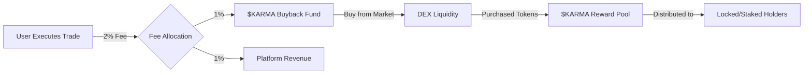

# $KARMA Token - Comprehensive Tokenomics Plan

## Executive Summary

$KARMA is a rewards token for the Dogepump Dogechain Memecoin Launcher platform. The token operates on a sustainable buyback-and-distribute model where platform trading fees are used to purchase $KARMA from the open market, which is then distributed to users who lock (stake) their tokens.

---

## 1. Token Specifications

| Parameter | Value |
|-----------|--------|
| **Token Name** | KARMA |
| **Token Symbol** | $KARMA |
| **Blockchain** | DogeChain (Chain ID: 2000) |
| **Token Standard** | ERC-20 |
| **Total Supply** | 1,000,000,000 (1 billion) |
| **Decimals** | 18 |
| **Initial Circulating Supply** | 0 (starts at 0, emitted via buyback) |

---

## 2. Fee Structure & Buyback Mechanism

### Platform Fees

The platform charges a **2% fee on all transactions** (buys, sells, and swaps):

| Fee Type | Percentage | Allocation |
|-----------|-------------|------------|
| **Platform Fee** | 2% | Total transaction fee |
| **$KARMA Buyback** | 1% | Used to buy $KARMA tokens |
| **Platform Revenue** | 1% | Platform operations & development |

### Buyback Mechanism Flow



### Buyback Execution

1. **Fee Collection**: 1% of every trade (buy/sell/swap) is collected in DC or wDOGE
2. **Conversion**: Collected fees are periodically converted to $KARMA tokens via DEX
3. **Purchase**: $KARMA tokens are bought from the open market using the converted funds
4. **Distribution**: Purchased tokens are added to the reward pool for stakers

### Buyback Frequency

- **Real-time**: Fees collected continuously
- **Buyback Execution**: Every 1 hour (configurable)
- **Distribution**: Every 24 hours to stakers

---

## 3. Token Distribution

### Initial Distribution

$KARMA follows a **fair launch model** with no pre-mine, no team allocation, and no private sale:

| Category | Allocation | Tokens | Percentage | Vesting |
|-----------|-----------|---------|------------|
| **Buyback & Rewards** | 1,000,000,000 | 100% | Emitted over time via fees |
| **Team** | 0 | 0% | N/A |
| **Advisors** | 0 | 0% | N/A |
| **Private Sale** | 0 | 0% | N/A |
| **Public Sale** | 0 | 0% | N/A |
| **Airdrop** | 0 | 0% | N/A |

### Emission Model

$KARMA uses a **gradual emission model** where tokens are only released into circulation through the buyback mechanism:

- **No initial supply**: Starts at 0 tokens in circulation
- **Emission source**: 100% from trading fee buybacks
- **Sustainable**: Supply grows with platform usage
- **Deflationary potential**: Can become deflationary if burning mechanisms are added

### Circulating Supply Over Time

```
Circulating Supply = Σ (All Buyback Purchases - All Burned Tokens)
```

---

## 4. Staking/Locking Mechanism

### Flexible Staking Model

Users can lock (stake) their $KARMA tokens at any time to earn rewards:

| Feature | Description |
|---------|-------------|
| **Lock Type** | Flexible (no fixed lock period) |
| **Unstake** | Anytime (no penalty) |
| **Rewards** | Proportional to: (Amount Locked × Time Locked) |
| **Minimum Stake** | 1 $KARMA |
| **Auto-Compound** | Optional (users can enable) |

### Reward Calculation

Rewards are distributed based on each user's share of the total "stake-seconds":

```
User Reward = (User Stake-Seconds / Total Stake-Seconds) × Reward Pool

Where:
- User Stake-Seconds = Σ (Amount × Time Locked)
- Total Stake-Seconds = Σ (All Users' Stake-Seconds)
- Reward Pool = $KARMA tokens from buyback
```

### Example Reward Scenario

| User | Amount Locked | Time Locked | Stake-Seconds | Pool Share | Reward |
|-------|---------------|--------------|---------------|------------|---------|
| User A | 10,000 $KARMA | 7 days | 6,048,000 | 40% | 40,000 $KARMA |
| User B | 5,000 $KARMA | 14 days | 6,048,000 | 40% | 40,000 $KARMA |
| User C | 1,000 $KARMA | 30 days | 2,592,000 | 17% | 17,000 $KARMA |
| **Total** | **16,000 $KARMA** | - | **14,688,000** | **100%** | **100,000 $KARMA** |

*Assuming reward pool of 100,000 $KARMA*

---

## 5. Emission Schedule

### Projected Emission (Estimates)

Based on platform trading volume projections:

| Month | Est. Daily Volume | Monthly Fees | Monthly Buyback | Cumulative Supply |
|--------|-------------------|----------------|------------------|-------------------|
| Month 1 | $50,000 | $30,000 | 15,000 $KARMA | 15,000 |
| Month 2 | $100,000 | $60,000 | 30,000 $KARMA | 45,000 |
| Month 3 | $200,000 | $120,000 | 60,000 $KARMA | 105,000 |
| Month 6 | $500,000 | $300,000 | 150,000 $KARMA | 525,000 |
| Month 12 | $1,000,000 | $600,000 | 300,000 $KARMA | 2,100,000 |

*Note: Actual emissions depend on trading volume and $KARMA market price*

### Supply Cap Considerations

- **Hard Cap**: 1 billion tokens
- **Time to Cap**: ~5.5 years at peak volume projections
- **After Cap**: Fees could be redirected to token burning or other mechanisms

---

## 6. Token Utility

### Primary Utility

| Use Case | Description |
|-----------|-------------|
| **Staking Rewards** | Lock tokens to earn a share of buyback rewards |
| **Platform Rewards** | Earn $KARMA through platform activity and engagement |

### Future Utility (Optional Extensions)

| Potential Feature | Description |
|-----------------|-------------|
| **Governance** | Vote on platform proposals and fee adjustments |
| **Fee Discounts** | Reduced trading fees for $KARMA holders |
| **Premium Features** | Access to advanced analytics, early token access, etc. |
| **Yield Farming** | Provide liquidity to earn additional $KARMA |
| **NFT Integration** | Mint/breed NFTs using $KARMA |

*Note: These are optional future enhancements. Current utility is pure rewards via staking.*

---

## 7. Economic Model Analysis

### Buyback Sustainability

The buyback model creates several positive feedback loops:

1. **Trading Volume → Fees → Buyback → Rewards → More Staking**
2. **More Staking → Reduced Supply → Higher Price → More Value per Reward**
3. **Higher Price → More Attractive → More Users → More Trading Volume**

### Key Metrics to Monitor

| Metric | Target | Description |
|---------|---------|-------------|
| **Staking Ratio** | >50% | Percentage of supply locked |
| **Daily Buyback** | Growing | $KARMA purchased daily |
| **Reward Yield** | Competitive | APY for stakers |
| **Price Stability** | Low volatility | Smooth price appreciation |

### Potential Risks & Mitigations

| Risk | Mitigation |
|-------|------------|
| **Low trading volume** | Diversify revenue streams, add more utility |
| **Price manipulation** | Implement TWAP for buybacks, anti-manipulation measures |
| **Reward dilution** | Adjust buyback frequency based on staking ratio |
| **Liquidity issues** | Maintain minimum liquidity on DEX |

---

## 8. Smart Contract Architecture

### Core Contracts

| Contract | Purpose |
|-----------|---------|
| **KARMA Token** | ERC-20 token with minting/burning capabilities |
| **Staking Contract** | Handle token locking, reward distribution |
| **Buyback Contract** | Execute buybacks from fee revenue |
| **Fee Collector** | Accumulate and route fees |

### Key Functions

```solidity
// KARMA Token
function mint(address to, uint256 amount) external onlyBuybackContract
function burn(uint256 amount) external

// Staking Contract
function stake(uint256 amount) external
function unstake(uint256 amount) external
function claimRewards() external
function distributeRewards(uint256 amount) external onlyBuybackContract

// Buyback Contract
function executeBuyback() external
function swapFeesForKARMA() internal
```

---

## 9. Implementation Roadmap

### Phase 1: Foundation (Weeks 1-4)

- [ ] Deploy $KARMA token contract on DogeChain
- [ ] Implement staking contract with flexible locking
- [ ] Create buyback mechanism
- [ ] Integrate fee collection (1% for buyback)
- [ ] Basic UI for staking/unstaking

### Phase 2: Integration (Weeks 5-8)

- [ ] Connect buyback to DEX for token purchases
- [ ] Implement reward distribution logic
- [ ] Add staking dashboard to frontend
- [ ] Real-time reward tracking
- [ ] Auto-compound option

### Phase 3: Optimization (Weeks 9-12)

- [ ] Optimize gas costs for staking operations
- [ ] Implement batch reward distributions
- [ ] Add analytics dashboard for token metrics
- [ ] Security audit of contracts

### Phase 4: Expansion (Weeks 13+)

- [ ] Additional utility features (governance, fee discounts)
- [ ] Cross-chain bridge (if applicable)
- [ ] Yield farming integration
- [ ] Partnership integrations

---

## 10. Constants & Configuration

### Token Constants

```typescript
export const KARMA_CONFIG = {
  // Token specs
  TOTAL_SUPPLY: 1_000_000_000, // 1 billion
  DECIMALS: 18,
  NAME: 'KARMA',
  SYMBOL: 'KARMA',
  
  // Fee structure
  PLATFORM_FEE: 0.02, // 2%
  BUYBACK_FEE: 0.01, // 1% of 2%
  REVENUE_FEE: 0.01, // 1% of 2%
  
  // Staking
  MIN_STAKE_AMOUNT: 1, // 1 KARMA
  REWARD_DISTRIBUTION_INTERVAL: 86400, // 24 hours in seconds
  
  // Buyback
  BUYBACK_INTERVAL: 3600, // 1 hour in seconds
  MIN_LIQUIDITY_THRESHOLD: 0.1, // Minimum liquidity for buyback
  
  // DEX
  DEX_ROUTER_ADDRESS: '0x...', // To be configured
  SLIPPAGE_TOLERANCE: 0.005, // 0.5%
};
```

---

## 11. Security Considerations

### Smart Contract Security

- [ ] **Reentrancy protection** on all external calls
- [ ] **Access control** for minting (only buyback contract)
- [ ] **Integer overflow protection** (Solidity 0.8+)
- [ ] **Emergency pause** functionality
- [ ] **Time-lock** on critical functions
- [ ] **Oracle manipulation protection** for price feeds

### Economic Security

- [ ] **Anti-whale measures** (max stake limits)
- [ ] **Minimum lock duration** to prevent gaming
- [ ] **Reward capping** for extreme scenarios
- [ ] **Circuit breakers** for abnormal market conditions

---

## 12. Marketing & Community

### Key Messages

1. **Fair Launch**: No team tokens, no pre-mine
2. **Sustainable**: Rewards from real platform revenue
3. **Flexible**: Stake anytime, unstake anytime
4. **Transparent**: On-chain reward distribution
5. **Community-First**: 100% of supply for the community

### Launch Strategy

| Phase | Activity |
|--------|----------|
| **Pre-launch** | Teaser campaign, community building |
| **Launch** | First buyback event, staking goes live |
| **Week 1** | Airdrop rewards to early stakers |
| **Month 1** | Influencer partnerships, AMAs |
| **Month 3** | Utility expansion announcements |

---

## 13. Success Metrics

### KPIs to Track

| Metric | Target | Timeline |
|---------|---------|----------|
| **Staking TVL** | $100,000 | Month 3 |
| **Staking Users** | 1,000 | Month 3 |
| **Daily Volume** | $500,000 | Month 6 |
| **$KARMA Price** | 10x launch price | Month 6 |
| **Buyback Volume** | 50,000 $KARMA/day | Month 6 |

---

## 14. Frequently Asked Questions

### Q: How are $KARMA tokens created?
A: Tokens are only created through the buyback mechanism. When 1% of trading fees is used to buy $KARMA from the market, those tokens are distributed to stakers.

### Q: Can I unstake anytime?
A: Yes! $KARMA uses flexible staking. You can unstake your tokens anytime without penalty.

### Q: How are rewards calculated?
A: Rewards are proportional to your share of total "stake-seconds" - meaning both the amount you stake and how long you stake it matter.

### Q: What happens to the other 1% fee?
A: The remaining 1% of the 2% platform fee goes to platform revenue for operations, development, and marketing.

### Q: Is there a max supply?
A: Yes, 1 billion $KARMA tokens. After this cap is reached, the buyback mechanism can be adjusted (e.g., burning tokens).

### Q: Do team members get free tokens?
A: No. $KARMA is a fair launch with 0% allocation to team, advisors, or private investors. Everyone must buy or earn tokens.

---

## 15. Appendix: Technical Specifications

### ERC-20 Interface Compliance

```solidity
interface IKARMA is IERC20 {
    // Standard ERC-20
    function totalSupply() external view returns (uint256);
    function balanceOf(address account) external view returns (uint256);
    function transfer(address to, uint256 amount) external returns (bool);
    function allowance(address owner, address spender) external view returns (uint256);
    function approve(address spender, uint256 amount) external returns (bool);
    function transferFrom(address from, address to, uint256 amount) external returns (bool);
    
    // Extended functions
    function mint(address to, uint256 amount) external;
    function burn(uint256 amount) external;
}
```

### Staking Interface

```solidity
interface IKARMAStaking {
    function stake(uint256 amount) external;
    function unstake(uint256 amount) external;
    function claimRewards() external;
    function getUserInfo(address user) external view returns (uint256 staked, uint256 rewards);
    function getRewardPool() external view returns (uint256);
}
```

---

## Conclusion

$KARMA tokenomics are designed to be:
- **Sustainable**: Powered by real platform revenue
- **Fair**: No team allocation, pure community distribution
- **Flexible**: User-friendly staking with no lock requirements
- **Scalable**: Grows with platform adoption
- **Transparent**: All on-chain, verifiable

This model aligns incentives between the platform, traders, and token holders, creating a virtuous cycle of growth and rewards.
