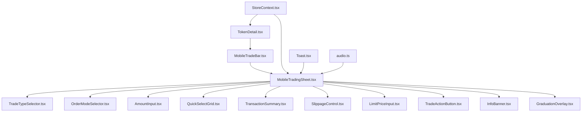
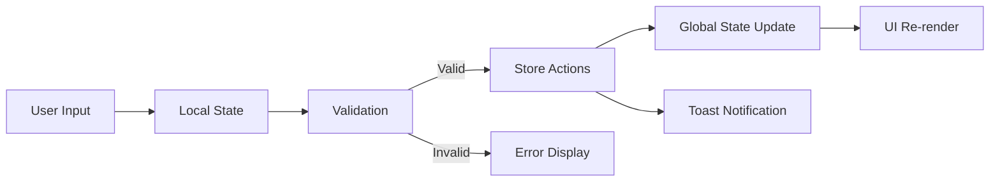
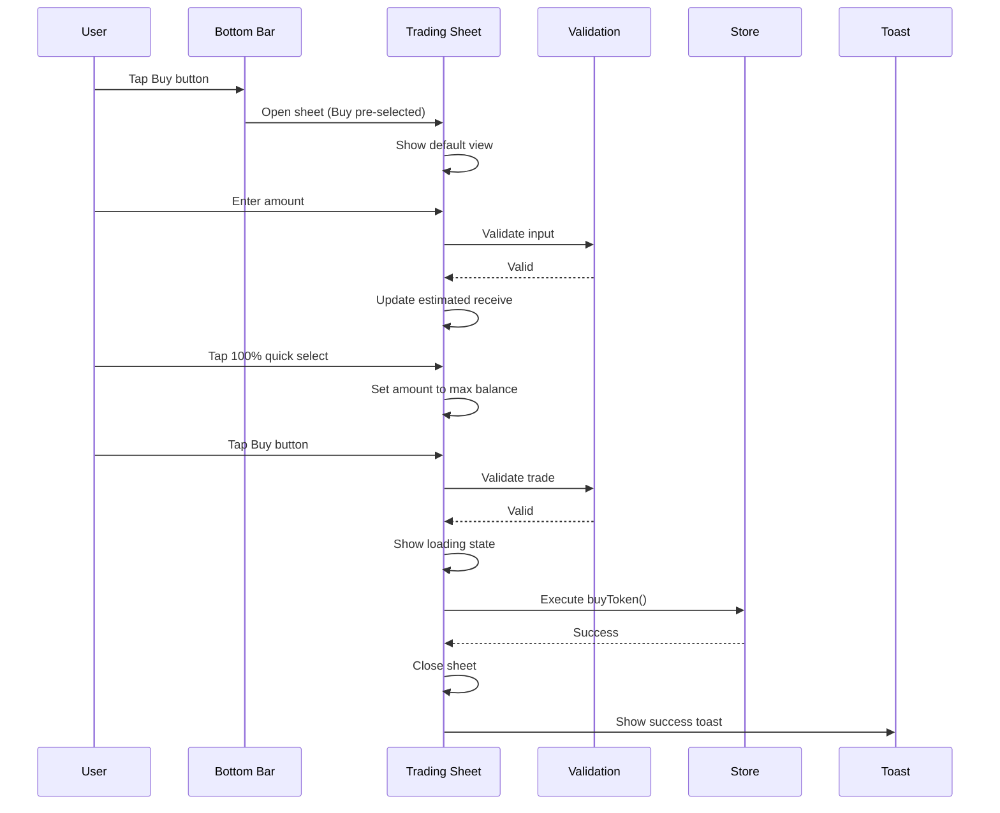
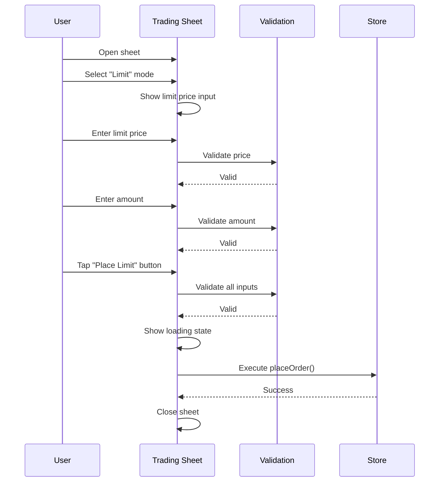
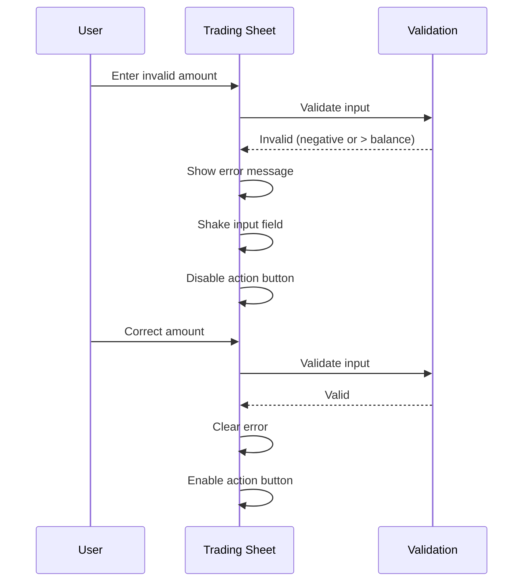
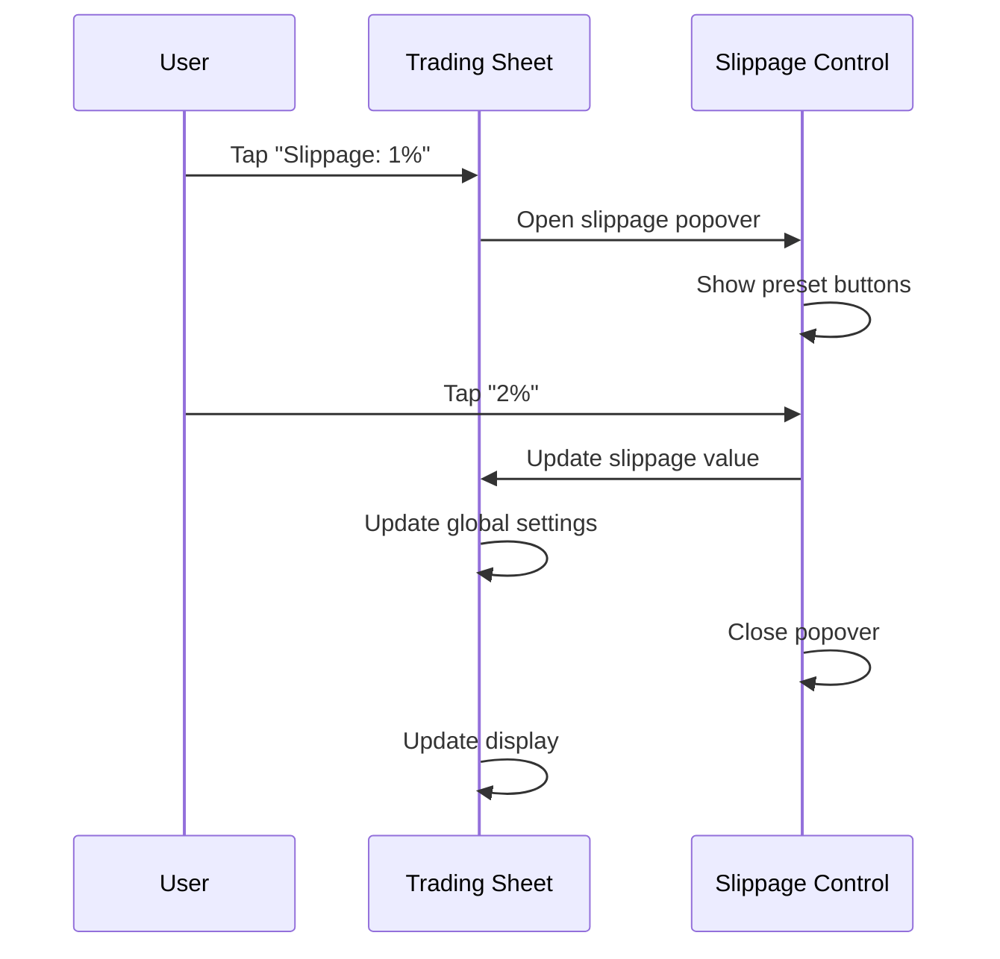
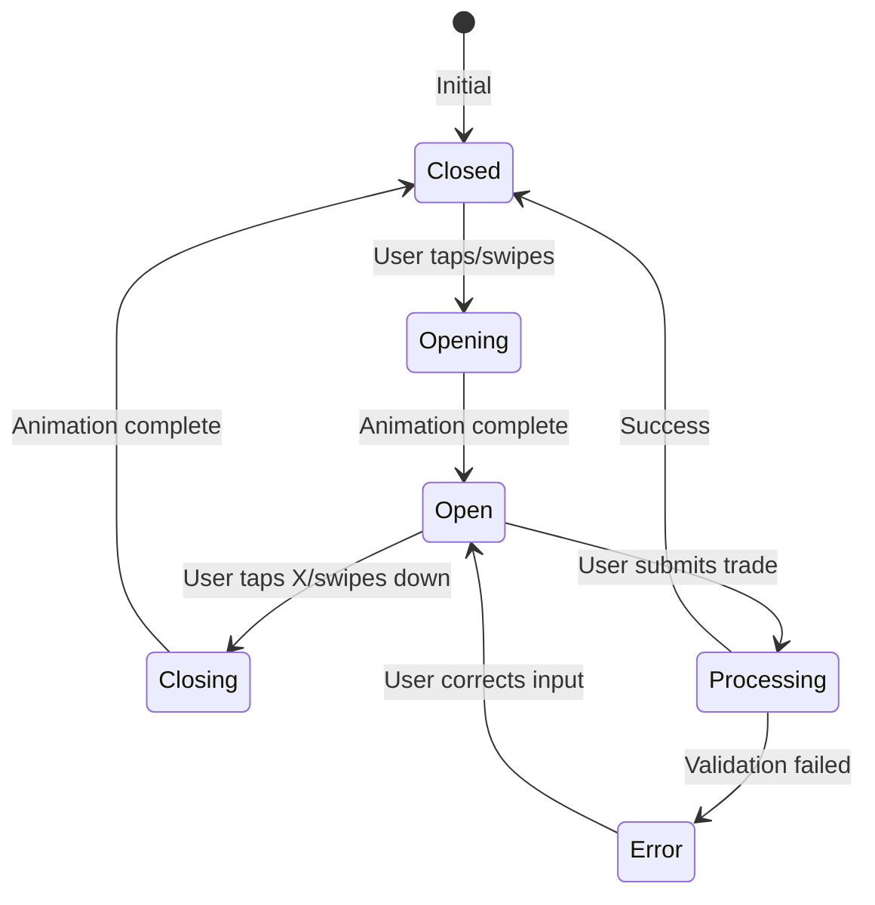

# Mobile Trading Interface Architecture
## DogePump Dogechain Memecoin Launcher

---

## Executive Summary

This document defines the architecture for a comprehensive mobile trading interface that achieves full feature parity with the desktop [`TradeForm.tsx`](../components/TradeForm.tsx) while optimizing for mobile constraints. The design uses a hybrid approach combining a compact bottom bar with an expandable slide-up bottom sheet, implementing progressive disclosure to manage complexity within limited screen space.

---

## 1. Responsive Pattern Selection

### Chosen Approach: **Hybrid Bottom Sheet**

**Decision:**
A hybrid approach combining a compact bottom bar with an expandable slide-up bottom sheet.

**Justification:**

| Pattern | Pros | Cons | Suitability |
|----------|------|------|-------------|
| **Full-screen Modal** | Immersive, maximum space | Disruptive, hides context, poor UX for quick actions | ❌ Low |
| **Slide-up Bottom Sheet** | Familiar UX, preserves context, accessible | Can feel cramped on small screens | ✅ **Selected** |
| **Expandable Drawer** | Progressive disclosure, flexible | Complex state management, animations can be janky | ⚠️ Medium |
| **Hybrid (Simple Bar + Advanced Drawer)** | Best of both worlds, quick access + full features | More components to maintain | ✅ **Selected** |

**Why Hybrid Bottom Sheet:**
1. **Familiar Mobile Pattern**: iOS and Android both use bottom sheets extensively
2. **Progressive Disclosure**: Shows essential info first, reveals complexity on demand
3. **Context Preservation**: User can see the page content behind the sheet
4. **Touch-Friendly**: Bottom placement is ergonomic for one-handed use
5. **Feature Parity**: Can accommodate all desktop features with proper organization

---

## 2. Component Architecture

### 2.1 Component Hierarchy



### 2.2 Component Specifications

#### **MobileTradeBar.tsx** (Enhanced)
**Purpose:** Compact bottom bar showing essential trading info and quick actions

**Props:**
```typescript
interface MobileTradeBarProps {
  token: Token;
  onOpen: () => void;
  onQuickTrade?: (type: 'buy' | 'sell') => void;
}
```

**Features:**
- Current token price (large, prominent)
- User DC balance
- Quick Buy/Sell buttons (primary actions)
- Swipe-up hint indicator
- Safe area padding for notched devices

**Key Changes from Current:**
- Add swipe gesture detection for opening sheet
- Add haptic feedback on interactions
- Improve touch targets (min 44x44px)
- Add price change indicator (+/- %)

---

#### **MobileTradingSheet.tsx** (New)
**Purpose:** Main trading interface container with slide-up animation

**Props:**
```typescript
interface MobileTradingSheetProps {
  token: Token;
  isOpen: boolean;
  onClose: () => void;
  initialTradeType?: 'buy' | 'sell' | 'burn' | 'karma';
  initialAmount?: string;
  onSuccess?: () => void;
}
```

**State:**
```typescript
interface MobileTradingSheetState {
  tradeType: 'buy' | 'sell' | 'burn' | 'karma';
  orderMode: 'market' | 'limit' | 'stop';
  amount: string;
  limitPrice: string;
  slippage: string;
  showSlippageSettings: boolean;
  isProcessing: boolean;
  errors: { amount?: string; price?: string };
  showGraduation: boolean;
}
```

**Features:**
- Animated slide-up from bottom (iOS-style spring physics)
- Backdrop blur overlay
- Drag handle for manual dismissal
- Scrollable content area (max-height: 85vh)
- Keyboard-aware (pushes up when keyboard opens)
- Safe area handling (notch, home indicator)

**Key Methods:**
- `handleTradeSubmit()`: Validates and executes trade
- `handleMaxClick()`: Sets amount to max balance
- `validateInputs()`: Client-side validation
- `calculateEstimatedReceive()`: Real-time calculations
- `handleDrag()`: Gesture-based sheet control

---

#### **TradeTypeSelector.tsx** (Extracted)
**Purpose:** Horizontal scrollable trade type selector

**Props:**
```typescript
interface TradeTypeSelectorProps {
  value: 'buy' | 'sell' | 'burn' | 'karma';
  onChange: (type: 'buy' | 'sell' | 'burn' | 'karma') => void;
  disabled?: boolean;
}
```

**Features:**
- 4 buttons: Buy, Sell, Burn, Karma
- Horizontal scroll on small screens
- Active state with color-coded backgrounds
- Icons for each type
- Haptic feedback on selection

---

#### **OrderModeSelector.tsx** (Extracted)
**Purpose:** Order mode selection (Market/Limit/Stop)

**Props:**
```typescript
interface OrderModeSelectorProps {
  value: 'market' | 'limit' | 'stop';
  onChange: (mode: 'market' | 'limit' | 'stop') => void;
  tradeType: 'buy' | 'sell' | 'burn' | 'karma';
  disabled?: boolean;
}
```

**Features:**
- 3 buttons in a segmented control
- Dynamic labels (e.g., "Stop Loss" vs "Stop Buy")
- Hidden for Burn/Karma modes
- Animated transitions

---

#### **AmountInput.tsx** (Extracted)
**Purpose:** Amount input with currency label and MAX button

**Props:**
```typescript
interface AmountInputProps {
  value: string;
  onChange: (value: string) => void;
  currency: string;
  onMaxClick: () => void;
  error?: string;
  disabled?: boolean;
  autoFocus?: boolean;
}
```

**Features:**
- Large, touch-friendly input (min 48px height)
- Currency label on right
- MAX button with haptic feedback
- Error state with shake animation
- Number formatting (commas for thousands)

---

#### **QuickSelectGrid.tsx** (Extracted)
**Purpose:** Quick percentage selection buttons

**Props:**
```typescript
interface QuickSelectGridProps {
  percentages: number[];
  onSelect: (percentage: number) => void;
  disabled?: boolean;
}
```

**Features:**
- Grid layout (2x2 or 4x1 depending on screen)
- Buttons: 25%, 50%, 75%, 100%
- Instant feedback
- Disabled state when processing

---

#### **TransactionSummary.tsx** (Extracted)
**Purpose:** Collapsible summary of transaction details

**Props:**
```typescript
interface TransactionSummaryProps {
  estimatedReceive: string;
  receiveCurrency: string;
  protocolFee: string;
  networkFee: string;
  slippage: string;
  onSlippageClick: () => void;
  tradeType: 'buy' | 'sell' | 'burn' | 'karma';
}
```

**Features:**
- Collapsible/expandable (tap to reveal)
- Shows: Estimated Receive, Protocol Fee, Network Fee
- Slippage display with edit button
- Hidden for Burn/Karma modes
- Animated chevron indicator

---

#### **SlippageControl.tsx** (Extracted)
**Purpose:** Slippage settings popover

**Props:**
```typescript
interface SlippageControlProps {
  value: string;
  onChange: (value: string) => void;
  onClose: () => void;
}
```

**Features:**
- 4 preset buttons: 0.5%, 1%, 2%, 5%
- Custom input option
- Warning for high slippage (>3%)
- Animated slide-up from bottom

---

#### **LimitPriceInput.tsx** (Extracted)
**Purpose:** Price input for Limit/Stop orders

**Props:**
```typescript
interface LimitPriceInputProps {
  value: string;
  onChange: (value: string) => void;
  mode: 'limit' | 'stop';
  currentPrice: number;
  error?: string;
}
```

**Features:**
- Label changes based on mode ("Limit Price" vs "Trigger Price")
- "Set to Market" quick action
- Tooltip for Stop Buy vs Stop Loss
- Error state with shake animation

---

#### **InfoBanner.tsx** (New)
**Purpose:** Informational banner for special trade types

**Props:**
```typescript
interface InfoBannerProps {
  type: 'burn' | 'karma';
  onClose?: () => void;
}
```

**Features:**
- Icon + text description
- Color-coded (orange for burn, purple for karma)
- Dismissible
- Animated slide-in

---

#### **TradeActionButton.tsx** (Extracted)
**Purpose:** Primary action button for executing trades

**Props:**
```typescript
interface TradeActionButtonProps {
  tradeType: 'buy' | 'sell' | 'burn' | 'karma';
  orderMode: 'market' | 'limit' | 'stop';
  limitPrice: string;
  isLoading: boolean;
  disabled: boolean;
  onPress: () => void;
}
```

**Features:**
- Dynamic button text based on state
- Color-coded by trade type
- Loading spinner
- Disabled state with opacity
- Haptic feedback on press
- Scale animation on active state

---

### 2.3 State Management Approach

#### **Local State (Component-Level)**
Used for transient UI state that doesn't need to persist:

```typescript
// MobileTradingSheet.tsx
const [tradeType, setTradeType] = useState<'buy' | 'sell' | 'burn' | 'karma'>('buy');
const [orderMode, setOrderMode] = useState<'market' | 'limit' | 'stop'>('market');
const [amount, setAmount] = useState('');
const [limitPrice, setLimitPrice] = useState('');
const [showSlippageSettings, setShowSlippageSettings] = useState(false);
const [isProcessing, setIsProcessing] = useState(false);
const [errors, setErrors] = useState<{ amount?: string; price?: string }>({});
```

#### **Global State (StoreContext)**
Used for persistent application state and business logic:

```typescript
// From StoreContext.tsx
const { 
  buyToken, 
  sellToken, 
  burnToken, 
  lockForKarma,
  placeOrder,
  userBalanceDC,
  myHoldings,
  settings,
  networkStats
} = useStore();
```

#### **State Flow Diagram**



#### **Synchronization with Global Settings**

```typescript
// Sync slippage with global settings
useEffect(() => {
  setSlippage(settings.slippage);
}, [settings.slippage]);

// Update global settings when changed
const handleSlippageChange = (value: string) => {
  setSlippage(value);
  updateSettings({ slippage: value });
};
```

---

## 3. UI Layout Specifications

### 3.1 Bottom Bar (Collapsed State)

```
┌─────────────────────────────────────────────────────┐
│  $0.000005          10,000 DC                   │
│  [████████] 42.0%    [BUY]   [SELL]           │
│                    ↑ Swipe up to trade          │
└─────────────────────────────────────────────────────┘
```

**Dimensions:**
- Height: 80px (safe-area-inset-bottom included)
- Padding: 16px horizontal, 12px vertical
- Touch targets: min 44x44px

**Elements:**
1. **Price Display** (left)
   - Font: 24px, font-mono, bold
   - Color: white
   - Change indicator: +42.0% (green) or -12.5% (red)

2. **Balance Display** (right of price)
   - Font: 12px, font-mono
   - Color: gray-500
   - Icon: Wallet (12px)

3. **Progress Bar** (below price)
   - Width: 60px
   - Height: 4px
   - Color: doge (gold) gradient
   - Background: white/10

4. **Action Buttons** (right)
   - Buy: green-500, black text
   - Sell: red-500, white text
   - Size: 48x48px
   - Shadow: glow effect

5. **Swipe Hint** (bottom center)
   - Icon: ChevronUp (16px)
   - Animation: bounce
   - Color: gray-500

---

### 3.2 Trading Sheet (Expanded State)

```
┌─────────────────────────────────────────────────────┐
│  ════════════════════════════════════════════  │ ← Drag Handle
│  Trade $TICKER                    [×]            │ ← Header
│  ────────────────────────────────────────────────  │
│                                                     │
│  [Buy] [Sell] [Burn] [Karma]                       │ ← Trade Type
│                                                     │
│  [Market] [Limit] [Stop]                            │ ← Order Mode
│                                                     │
│  ┌───────────────────────────────────────────────┐  │
│  │ Amount                        [MAX] $DC     │  │ ← Amount Input
│  └───────────────────────────────────────────────┘  │
│                                                     │
│  [25%] [50%] [75%] [100%]                         │ ← Quick Select
│                                                     │
│  ┌───────────────────────────────────────────────┐  │
│  │ Limit Price                  [Set to Market]│  │ ← Limit Input
│  └───────────────────────────────────────────────┘  │
│                                                     │
│  ┌───────────────────────────────────────────────┐  │
│  │ ▼ Transaction Summary                        │  │ ← Summary (collapsible)
│  │   Receive: ~1,000,000 $TICKER               │  │
│  │   Protocol Fee: 10 $DC                       │  │
│  │   Network Fee: ~0.000052 $DC                │  │
│  │   Slippage: 1% [Settings]                   │  │
│  └───────────────────────────────────────────────┘  │
│                                                     │
│  ┌───────────────────────────────────────────────┐  │
│  │           [BUY 10,000 DC]                   │  │ ← Action Button
│  └───────────────────────────────────────────────┘  │
│                                                     │
│  ════════════════════════════════════════════  │ ← Safe Area
└─────────────────────────────────────────────────────┘
```

**Dimensions:**
- Max-height: 85vh
- Min-height: 400px
- Border-radius: 24px (top corners)
- Padding: 16px

**Scroll Behavior:**
- Content area is scrollable when height exceeds viewport
- Header and action button remain fixed (sticky)
- Smooth scrolling with momentum

---

### 3.3 Progressive Disclosure Strategy

#### **Level 1: Always Visible (Bottom Bar)**
- Current price
- Price change percentage
- User balance
- Quick Buy/Sell buttons

#### **Level 2: Default Sheet View**
- Trade type selector (4 options)
- Order mode selector (3 options)
- Amount input with MAX
- Quick select percentages
- Action button

#### **Level 3: Context-Dependent (Revealed on Interaction)**
- Limit price input (when Limit/Stop selected)
- Info banner (when Burn/Karma selected)
- Transaction summary (tap to expand)
- Slippage settings (tap to open)

#### **Level 4: Advanced Features (Hidden by Default)**
- Custom slippage input
- Advanced order settings (future)
- Gas customization (future)

---

### 3.4 Touch-Friendly Interaction Patterns

#### **Touch Targets**
- Minimum size: 44x44px (iOS HIG)
- Recommended size: 48x48px
- Spacing: 8px between elements

#### **Gestures**
1. **Swipe Up** on bottom bar → Open sheet
2. **Swipe Down** on sheet → Close sheet
3. **Tap outside** sheet → Close sheet
4. **Drag handle** → Manually adjust sheet height
5. **Long press** on price → Copy to clipboard

#### **Haptic Feedback**
- Light: Button taps, toggle switches
- Medium: Sheet open/close, trade execution
- Heavy: Error states, success confirmation

#### **Keyboard Handling**
- Sheet pushes up when keyboard opens
- Amount input auto-focuses when sheet opens
- Done button on keyboard closes keyboard
- Prevent sheet dismissal while keyboard is open

---

## 4. Styling Approach

### 4.1 Tailwind CSS Patterns

#### **Color System**
```css
/* Trade Type Colors */
.buy { @apply bg-green-500 text-black; }
.sell { @apply bg-red-500 text-white; }
.burn { @apply bg-orange-500 text-white; }
.karma { @apply bg-purple-600 text-white; }

/* Backgrounds */
.sheet-bg { @apply bg-[#0A0A0A]; }
.bar-bg { @apply bg-[#0A0A0A]/90 backdrop-blur-xl; }

/* Borders */
.border-doge { @apply border-doge/20; }
.border-white { @apply border-white/10; }
```

#### **Typography**
```css
/* Prices */
.price-display { @apply font-mono text-2xl font-bold text-white; }
.price-change { @apply font-mono text-sm font-bold; }

/* Labels */
.label { @apply text-[10px] font-bold uppercase tracking-wider text-gray-500; }

/* Buttons */
.button-text { @apply text-xs font-bold uppercase tracking-widest; }
```

#### **Spacing**
```css
/* Mobile-specific */
.mobile-padding { @apply px-4 py-3; }
.mobile-gap { @apply gap-2; }

/* Touch-friendly */
.touch-target { @apply min-h-[44px] min-w-[44px]; }
```

#### **Effects**
```css
/* Glow Effects */
.glow-green { @apply shadow-[0_0_20px_rgba(34,197,94,0.3)]; }
.glow-red { @apply shadow-[0_0_20px_rgba(239,68,68,0.3)]; }
.glow-doge { @apply shadow-[0_0_20px_rgba(212,175,55,0.3)]; }

/* Backdrops */
.backdrop-blur { @apply backdrop-blur-xl bg-black/60; }
```

---

### 4.2 Responsive Breakpoints

```css
/* Mobile First Approach */
/* Default: Mobile styles */

/* Small Tablets */
@media (min-width: 640px) {
  .sheet-container {
    @apply max-w-md mx-auto;
  }
}

/* Large Tablets */
@media (min-width: 768px) {
  .sheet-container {
    @apply max-w-lg mx-auto;
  }
}

/* Desktop - Use TradeForm instead */
@media (min-width: 1024px) {
  .mobile-trading-sheet {
    @apply hidden;
  }
}
```

---

### 4.3 Animation Patterns

#### **Slide Up Animation**
```css
@keyframes slideUp {
  from {
    transform: translateY(100%);
  }
  to {
    transform: translateY(0);
  }
}

.animate-slide-up {
  animation: slideUp 0.3s cubic-bezier(0.32, 0.72, 0, 1);
}
```

#### **Fade In Animation**
```css
@keyframes fadeIn {
  from { opacity: 0; }
  to { opacity: 1; }
}

.animate-fade-in {
  animation: fadeIn 0.2s ease-out;
}
```

#### **Shake Animation (Errors)**
```css
@keyframes shake {
  0%, 100% { transform: translateX(0); }
  25% { transform: translateX(-4px); }
  75% { transform: translateX(4px); }
}

.animate-shake {
  animation: shake 0.3s ease-in-out;
}
```

#### **Pulse Animation (Loading)**
```css
@keyframes pulse {
  0%, 100% { opacity: 1; }
  50% { opacity: 0.5; }
}

.animate-pulse {
  animation: pulse 1.5s ease-in-out infinite;
}
```

---

### 4.4 Safe Area Handling

```css
/* iOS Notch */
.safe-area-top {
  padding-top: env(safe-area-inset-top);
}

/* iOS Home Indicator */
.safe-area-bottom {
  padding-bottom: env(safe-area-inset-bottom);
}

/* Combined */
.safe-area-inset {
  padding-top: env(safe-area-inset-top);
  padding-bottom: env(safe-area-inset-bottom);
}
```

---

## 5. User Interaction Flows

### 5.1 Primary Flow: Quick Buy



---

### 5.2 Flow: Limit Order



---

### 5.3 Flow: Error Handling



---

### 5.4 Flow: Slippage Settings



---

### 5.5 State Transitions



---

### 5.6 Success/Failure States

#### **Success State**
1. Show loading spinner on button
2. Disable all inputs
3. Execute trade
4. On success:
   - Play success sound (if enabled)
   - Show toast notification
   - Close sheet with slide-down animation
   - Clear form inputs
   - Update balances in bottom bar

#### **Failure State**
1. Show loading spinner on button
2. Execute trade
3. On failure:
   - Play error sound (if enabled)
   - Show error toast with details
   - Keep sheet open
   - Re-enable inputs
   - Highlight error field

---

## 6. Technical Considerations

### 6.1 Performance Optimization

#### **Rendering Optimization**
```typescript
// Use React.memo for expensive components
const TransactionSummary = React.memo(({ ... }) => {
  // Component implementation
});

// Use useMemo for expensive calculations
const estimatedReceive = useMemo(() => {
  if (!amount || executionPrice <= 0) return '0.00';
  return (parseFloat(amount) / (tradeType === 'buy' ? executionPrice : 1/executionPrice)).toFixed(2);
}, [amount, executionPrice, tradeType]);

// Use useCallback for event handlers
const handleTradeSubmit = useCallback(() => {
  // Trade logic
}, [amount, limitPrice, tradeType, orderMode]);
```

#### **Animation Performance**
```css
/* Use transform and opacity for animations (GPU accelerated) */
.slide-up {
  transform: translateY(100%);
  transition: transform 0.3s cubic-bezier(0.32, 0.72, 0, 1);
}

.slide-up.open {
  transform: translateY(0);
}

/* Avoid animating layout properties */
.bad {
  /* Don't animate these */
  width, height, margin, padding
}
```

#### **Lazy Loading**
```typescript
// Lazy load heavy components
const SlippageControl = React.lazy(() => import('./SlippageControl'));

// Use Suspense boundary
<Suspense fallback={<LoadingSpinner />}>
  {showSlippageSettings && <SlippageControl />}
</Suspense>
```

---

### 6.2 Accessibility

#### **Touch Targets**
- Minimum size: 44x44px (iOS) / 48x48dp (Android)
- Spacing: 8px between interactive elements
- Contrast ratio: 4.5:1 for text

#### **Screen Reader Support**
```typescript
// ARIA labels
<button
  aria-label="Buy tokens"
  aria-pressed={tradeType === 'buy'}
  onClick={() => setTradeType('buy')}
>
  Buy
</button>

// Live regions for dynamic content
<div aria-live="polite" aria-atomic="true">
  {errors.amount && <p role="alert">{errors.amount}</p>}
</div>

// Focus management
useEffect(() => {
  if (isOpen) {
    amountInputRef.current?.focus();
  }
}, [isOpen]);
```

#### **Keyboard Navigation**
```typescript
// Handle keyboard events
const handleKeyDown = (e: React.KeyboardEvent) => {
  if (e.key === 'Escape') {
    onClose();
  } else if (e.key === 'Enter' && !e.shiftKey) {
    e.preventDefault();
    handleTradeSubmit();
  }
};
```

---

### 6.3 Safe Area Handling

#### **Notch Devices (iPhone X+)**
```css
/* CSS */
.safe-area-inset-top {
  padding-top: env(safe-area-inset-top);
}

.safe-area-inset-bottom {
  padding-bottom: env(safe-area-inset-bottom);
}
```

```typescript
// JavaScript fallback
const getSafeAreaInset = () => {
  const div = document.createElement('div');
  div.style.paddingTop = 'env(safe-area-inset-top)';
  div.style.paddingBottom = 'env(safe-area-inset-bottom)';
  document.body.appendChild(div);
  const styles = window.getComputedStyle(div);
  const top = parseInt(styles.paddingTop) || 0;
  const bottom = parseInt(styles.paddingBottom) || 0;
  document.body.removeChild(div);
  return { top, bottom };
};
```

#### **Home Indicator**
```css
/* Prevent content from being hidden */
.bottom-sheet {
  padding-bottom: calc(16px + env(safe-area-inset-bottom));
}

/* Prevent sheet from being dragged behind home indicator */
.bottom-sheet-handle {
  margin-bottom: env(safe-area-inset-bottom);
}
```

---

### 6.4 Gesture Handling

#### **Swipe Detection**
```typescript
const useSwipe = (callback: () => void) => {
  const startY = useRef(0);
  const threshold = 50;

  const handleTouchStart = (e: React.TouchEvent) => {
    startY.current = e.touches[0].clientY;
  };

  const handleTouchMove = (e: React.TouchEvent) => {
    const currentY = e.touches[0].clientY;
    const diff = startY.current - currentY;

    if (diff > threshold) {
      callback();
    }
  };

  return { onTouchStart: handleTouchStart, onTouchMove: handleTouchMove };
};
```

#### **Drag to Dismiss**
```typescript
const useDragToDismiss = (onDismiss: () => void) => {
  const [dragOffset, setDragOffset] = useState(0);
  const startY = useRef(0);

  const handleTouchStart = (e: React.TouchEvent) => {
    startY.current = e.touches[0].clientY;
  };

  const handleTouchMove = (e: React.TouchEvent) => {
    const currentY = e.touches[0].clientY;
    const diff = currentY - startY.current;
    setDragOffset(Math.max(0, diff));
  };

  const handleTouchEnd = () => {
    if (dragOffset > 150) {
      onDismiss();
    }
    setDragOffset(0);
  };

  return {
    dragOffset,
    onTouchStart: handleTouchStart,
    onTouchMove: handleTouchMove,
    onTouchEnd: handleTouchEnd
  };
};
```

---

### 6.5 Keyboard Handling

#### **Keyboard-Aware Sheet**
```typescript
useEffect(() => {
  const handleKeyboardShow = (e: Event) => {
    // Adjust sheet position
    const keyboardHeight = (e as any).detail.keyboardHeight;
    setSheetOffset(keyboardHeight);
  };

  const handleKeyboardHide = () => {
    setSheetOffset(0);
  };

  window.addEventListener('keyboardWillShow', handleKeyboardShow);
  window.addEventListener('keyboardWillHide', handleKeyboardHide);

  return () => {
    window.removeEventListener('keyboardWillShow', handleKeyboardShow);
    window.removeEventListener('keyboardWillHide', handleKeyboardHide);
  };
}, []);
```

#### **Input Auto-Focus**
```typescript
useEffect(() => {
  if (isOpen && amountInputRef.current) {
    // Small delay to ensure sheet is rendered
    setTimeout(() => {
      amountInputRef.current?.focus();
    }, 100);
  }
}, [isOpen]);
```

---

### 6.6 Error Handling

#### **Validation Errors**
```typescript
const validateInputs = () => {
  const newErrors: { amount?: string; price?: string } = {};
  let isValid = true;

  if (!amount || isNaN(Number(amount)) || Number(amount) <= 0) {
    newErrors.amount = 'Required';
    isValid = false;
  }

  if (tradeType === 'buy' && Number(amount) > userBalanceDC) {
    newErrors.amount = 'Insufficient $DC';
    isValid = false;
  }

  if ((tradeType === 'sell' || tradeType === 'burn' || tradeType === 'karma') && 
      Number(amount) > userTokenBalance) {
    newErrors.amount = `Insufficient ${token.ticker}`;
    isValid = false;
  }

  if ((orderMode === 'limit' || orderMode === 'stop') && 
      (!limitPrice || isNaN(Number(limitPrice)) || Number(limitPrice) <= 0)) {
    newErrors.price = 'Required';
    isValid = false;
  }

  setErrors(newErrors);
  return isValid;
};
```

#### **Network Errors**
```typescript
const handleTrade = async () => {
  setIsProcessing(true);
  
  try {
    await executeTrade();
    addToast('success', 'Trade executed successfully!');
    onClose();
  } catch (error) {
    console.error('Trade failed:', error);
    addToast('error', 'Trade failed', error.message);
  } finally {
    setIsProcessing(false);
  }
};
```

---

### 6.7 Testing Considerations

#### **Unit Tests**
- Component rendering with different props
- State management and updates
- Validation logic
- Event handlers

#### **Integration Tests**
- User flows (buy, sell, limit order)
- Error handling
- Toast notifications
- Store integration

#### **E2E Tests**
- Complete trading workflows
- Cross-device compatibility
- Performance under load
- Accessibility compliance

---

## 7. Implementation Roadmap

### Phase 1: Core Components (Priority 1)
- [ ] Create [`MobileTradingSheet.tsx`](../components/MobileTradingSheet.tsx)
- [ ] Extract [`TradeTypeSelector.tsx`](../components/TradeTypeSelector.tsx)
- [ ] Extract [`OrderModeSelector.tsx`](../components/OrderModeSelector.tsx)
- [ ] Extract [`AmountInput.tsx`](../components/AmountInput.tsx)
- [ ] Extract [`QuickSelectGrid.tsx`](../components/QuickSelectGrid.tsx)
- [ ] Extract [`TradeActionButton.tsx`](../components/TradeActionButton.tsx)

### Phase 2: Advanced Features (Priority 2)
- [ ] Extract [`TransactionSummary.tsx`](../components/TransactionSummary.tsx)
- [ ] Extract [`SlippageControl.tsx`](../components/SlippageControl.tsx)
- [ ] Extract [`LimitPriceInput.tsx`](../components/LimitPriceInput.tsx)
- [ ] Create [`InfoBanner.tsx`](../components/InfoBanner.tsx)

### Phase 3: Enhancements (Priority 3)
- [ ] Add gesture handling (swipe, drag)
- [ ] Add haptic feedback
- [ ] Add keyboard awareness
- [ ] Add safe area handling
- [ ] Add animations and transitions

### Phase 4: Polish (Priority 4)
- [ ] Performance optimization
- [ ] Accessibility improvements
- [ ] Error handling refinement
- [ ] Testing and bug fixes
- [ ] Documentation

---

## 8. Integration Points

### 8.1 With TokenDetail.tsx

```typescript
// In TokenDetail.tsx
const [isTradeSheetOpen, setIsTradeSheetOpen] = useState(false);
const [initialTradeType, setInitialTradeType] = useState<'buy' | 'sell'>('buy');

return (
  <>
    {/* Existing content */}
    
    {/* Mobile Trading Sheet */}
    <MobileTradingSheet
      token={token}
      isOpen={isTradeSheetOpen}
      onClose={() => setIsTradeSheetOpen(false)}
      initialTradeType={initialTradeType}
      initialAmount={copyTradeAmount}
      onSuccess={() => {
        setIsTradeSheetOpen(false);
        setCopyTradeAmount('');
      }}
    />
    
    {/* Mobile Trade Bar (enhanced) */}
    <MobileTradeBar
      token={token}
      onOpen={() => setIsTradeSheetOpen(true)}
      onQuickTrade={(type) => {
        setInitialTradeType(type);
        setIsTradeSheetOpen(true);
      }}
    />
  </>
);
```

### 8.2 With StoreContext.tsx

```typescript
// In MobileTradingSheet.tsx
const {
  buyToken,
  sellToken,
  burnToken,
  lockForKarma,
  placeOrder,
  userBalanceDC,
  myHoldings,
  settings,
  networkStats,
  updateSettings
} = useStore();

// Sync slippage
useEffect(() => {
  setSlippage(settings.slippage);
}, [settings.slippage]);
```

### 8.3 With Layout.tsx

```typescript
// No changes needed - MobileTradingSheet is self-contained
// Only MobileTradeBar needs to be rendered in TokenDetail
```

---

## 9. Wireframes

### 9.1 Bottom Bar (Collapsed)

```
┌─────────────────────────────────────────────────────┐
│                                                     │
│  $0.000005          10,000 DC                   │
│  [████████] 42.0%    [BUY]   [SELL]           │
│                    ↑ Swipe up to trade          │
│                                                     │
└─────────────────────────────────────────────────────┘
```

### 9.2 Trading Sheet - Default View

```
┌─────────────────────────────────────────────────────┐
│  ════════════════════════════════════════════  │
│  Trade $TICKER                    [×]            │
│  ────────────────────────────────────────────────  │
│                                                     │
│  [Buy] [Sell] [Burn] [Karma]                       │
│                                                     │
│  [Market] [Limit] [Stop]                            │
│                                                     │
│  ┌───────────────────────────────────────────────┐  │
│  │ Amount                        [MAX] $DC     │  │
│  └───────────────────────────────────────────────┘  │
│                                                     │
│  [25%] [50%] [75%] [100%]                         │
│                                                     │
│  ┌───────────────────────────────────────────────┐  │
│  │           [BUY 10,000 DC]                   │  │
│  └───────────────────────────────────────────────┘  │
│                                                     │
│  ════════════════════════════════════════════  │
└─────────────────────────────────────────────────────┘
```

### 9.3 Trading Sheet - Limit Order

```
┌─────────────────────────────────────────────────────┐
│  ════════════════════════════════════════════  │
│  Trade $TICKER                    [×]            │
│  ────────────────────────────────────────────────  │
│                                                     │
│  [Buy] [Sell] [Burn] [Karma]                       │
│                                                     │
│  [Market] [Limit] [Stop]                            │
│                                                     │
│  ┌───────────────────────────────────────────────┐  │
│  │ Limit Price                  [Set to Market]│  │
│  └───────────────────────────────────────────────┘  │
│                                                     │
│  ┌───────────────────────────────────────────────┐  │
│  │ Amount                        [MAX] $DC     │  │
│  └───────────────────────────────────────────────┘  │
│                                                     │
│  [25%] [50%] [75%] [100%]                         │
│                                                     │
│  ┌───────────────────────────────────────────────┐  │
│  │         [PLACE LIMIT BUY]                     │  │
│  └───────────────────────────────────────────────┘  │
│                                                     │
│  ════════════════════════════════════════════  │
└─────────────────────────────────────────────────────┘
```

### 9.4 Trading Sheet - Burn Mode

```
┌─────────────────────────────────────────────────────┐
│  ════════════════════════════════════════════  │
│  Trade $TICKER                    [×]            │
│  ────────────────────────────────────────────────  │
│                                                     │
│  [Buy] [Sell] [Burn] [Karma]                       │
│                                                     │
│  ┌───────────────────────────────────────────────┐  │
│  │ 🔥 Burn for Status                          │  │
│  │   Permanently destroy tokens to reduce       │  │
│  │   supply.                                  │  │
│  └───────────────────────────────────────────────┘  │
│                                                     │
│  ┌───────────────────────────────────────────────┐  │
│  │ Amount                        [MAX] TICKER  │  │
│  └───────────────────────────────────────────────┘  │
│                                                     │
│  [25%] [50%] [75%] [100%]                         │
│                                                     │
│  ┌───────────────────────────────────────────────┐  │
│  │          [BURN TOKENS]                      │  │
│  └───────────────────────────────────────────────┘  │
│                                                     │
│  ════════════════════════════════════════════  │
└─────────────────────────────────────────────────────┘
```

### 9.5 Trading Sheet - Expanded Summary

```
┌─────────────────────────────────────────────────────┐
│  ════════════════════════════════════════════  │
│  Trade $TICKER                    [×]            │
│  ────────────────────────────────────────────────  │
│                                                     │
│  [Buy] [Sell] [Burn] [Karma]                       │
│                                                     │
│  [Market] [Limit] [Stop]                            │
│                                                     │
│  ┌───────────────────────────────────────────────┐  │
│  │ Amount                        [MAX] $DC     │  │
│  └───────────────────────────────────────────────┘  │
│                                                     │
│  [25%] [50%] [75%] [100%]                         │
│                                                     │
│  ┌───────────────────────────────────────────────┐  │
│  │ ▼ Transaction Summary                        │  │
│  │   Receive: ~1,000,000 $TICKER               │  │
│  │   Protocol Fee: 10 $DC                       │  │
│  │   Network Fee: ~0.000052 $DC                │  │
│  │   Slippage: 1% [Settings ⚙️]               │  │
│  └───────────────────────────────────────────────┘  │
│                                                     │
│  ┌───────────────────────────────────────────────┐  │
│  │           [BUY 10,000 DC]                   │  │
│  └───────────────────────────────────────────────┘  │
│                                                     │
│  ════════════════════════════════════════════  │
└─────────────────────────────────────────────────────┘
```

---

## 10. Conclusion

This architecture provides a comprehensive mobile trading interface that:

1. **Achieves Full Feature Parity** with the desktop [`TradeForm.tsx`](../components/TradeForm.tsx)
2. **Optimizes for Mobile Constraints** through progressive disclosure
3. **Uses Familiar Patterns** (bottom sheet, swipe gestures)
4. **Maintains Consistency** with the existing design system
5. **Provides Excellent UX** with touch-friendly interactions and haptic feedback
6. **Is Accessible** with proper touch targets and screen reader support
7. **Is Performant** with optimized rendering and animations
8. **Is Maintainable** with modular, reusable components

The hybrid bottom sheet approach strikes the right balance between quick access and full functionality, making it ideal for a trading interface where users need to make quick decisions but also have access to advanced features when needed.

---

## 11. Recent Mobile UI Improvements

### Creator Admin Component (December 2025)

**Responsive Layout Updates:**

The Creator Admin component has been optimized for mobile devices with the following improvements:

#### 11.1 Tab Navigation Layout

**Before:**
- Tabs appeared horizontally next to the header on all screen sizes
- cramped layout on small screens (iPhone SE, etc.)

**After:**
- **Mobile (< 768px)**: Tabs stack vertically below the "Creator Admin / Manage" header
- **Desktop (≥ 768px)**: Maintains original horizontal layout with tabs next to header

**Implementation:**
```tsx
<div className="flex flex-col items-stretch gap-4 mb-6 md:flex-row md:items-center md:justify-between">
  {/* Header */}
  <div className="flex items-center gap-2">
    {/* Icon and text */}
  </div>

  {/* Tabs */}
  <div className="flex bg-white/5 p-1 rounded-lg overflow-x-auto">
    {/* Tab buttons */}
  </div>
</div>
```

#### 11.2 Audio Toggle Controls

**Before:**
- Microphone and System Audio toggles displayed horizontally
- Toggle button cramped next to text on mobile
- Poor touch target sizing

**After:**
- **Mobile**: Icon and text on top line, toggle button below on separate line
- **Desktop**: Horizontal layout with toggle on the right
- Better spacing and touch targets (min 44x44px)

**Implementation:**
```tsx
<div className="flex flex-col gap-3 p-4 bg-gray-900/80 rounded-lg border border-gray-700 md:flex-row md:items-center md:justify-between">
  {/* Icon and text */}
  <div className="flex items-center gap-3">
    {/* Content */}
  </div>

  {/* Toggle button */}
  <button className="relative inline-flex flex-shrink-0 h-6 w-11...">
    {/* Toggle switch */}
  </button>
</div>
```

#### 11.3 Responsive Design Principles Applied

1. **Mobile-First Approach**: Default styles optimize for small screens
2. **Progressive Enhancement**: Desktop enhances with `md:` breakpoint classes
3. **Touch-Friendly**: Minimum 44x44px touch targets per iOS HIG
4. **Spacing**: Consistent gaps using `gap-3` (12px) and `gap-4` (16px)
5. **Flexible Layouts**: `flex-col` to `flex-row` transformation at breakpoints

#### 11.4 Testing

These changes were tested on:
- **iPhone SE** (375x667px) - Primary target for cramped layout fixes
- **iPhone 12/13/14** (390x844px) - Standard modern iPhone
- **Desktop** (1024px+) - Verified no regressions

#### 11.5 Files Modified

- `components/CreatorAdmin.tsx`:
  - Line 433: Header container responsive layout
  - Line 444: Tab container responsive classes
  - Line 697: Microphone toggle responsive layout
  - Line 731: System Audio toggle responsive layout

---

## Appendix A: Component Props Reference

### MobileTradingSheet.tsx
```typescript
interface MobileTradingSheetProps {
  token: Token;
  isOpen: boolean;
  onClose: () => void;
  initialTradeType?: 'buy' | 'sell' | 'burn' | 'karma';
  initialAmount?: string;
  onSuccess?: () => void;
}
```

### TradeTypeSelector.tsx
```typescript
interface TradeTypeSelectorProps {
  value: 'buy' | 'sell' | 'burn' | 'karma';
  onChange: (type: 'buy' | 'sell' | 'burn' | 'karma') => void;
  disabled?: boolean;
}
```

### OrderModeSelector.tsx
```typescript
interface OrderModeSelectorProps {
  value: 'market' | 'limit' | 'stop';
  onChange: (mode: 'market' | 'limit' | 'stop') => void;
  tradeType: 'buy' | 'sell' | 'burn' | 'karma';
  disabled?: boolean;
}
```

### AmountInput.tsx
```typescript
interface AmountInputProps {
  value: string;
  onChange: (value: string) => void;
  currency: string;
  onMaxClick: () => void;
  error?: string;
  disabled?: boolean;
  autoFocus?: boolean;
}
```

### QuickSelectGrid.tsx
```typescript
interface QuickSelectGridProps {
  percentages: number[];
  onSelect: (percentage: number) => void;
  disabled?: boolean;
}
```

### TransactionSummary.tsx
```typescript
interface TransactionSummaryProps {
  estimatedReceive: string;
  receiveCurrency: string;
  protocolFee: string;
  networkFee: string;
  slippage: string;
  onSlippageClick: () => void;
  tradeType: 'buy' | 'sell' | 'burn' | 'karma';
}
```

### SlippageControl.tsx
```typescript
interface SlippageControlProps {
  value: string;
  onChange: (value: string) => void;
  onClose: () => void;
}
```

### LimitPriceInput.tsx
```typescript
interface LimitPriceInputProps {
  value: string;
  onChange: (value: string) => void;
  mode: 'limit' | 'stop';
  currentPrice: number;
  error?: string;
}
```

### InfoBanner.tsx
```typescript
interface InfoBannerProps {
  type: 'burn' | 'karma';
  onClose?: () => void;
}
```

### TradeActionButton.tsx
```typescript
interface TradeActionButtonProps {
  tradeType: 'buy' | 'sell' | 'burn' | 'karma';
  orderMode: 'market' | 'limit' | 'stop';
  limitPrice: string;
  isLoading: boolean;
  disabled: boolean;
  onPress: () => void;
}
```

---

## Appendix B: Tailwind CSS Utility Classes

### Common Patterns
```css
/* Flexbox */
.flex-center { @apply flex items-center justify-center; }
.flex-between { @apply flex items-center justify-between; }

/* Spacing */
.p-mobile { @apply px-4 py-3; }
.gap-mobile { @apply gap-2; }

/* Typography */
.text-label { @apply text-[10px] font-bold uppercase tracking-wider text-gray-500; }
.text-value { @apply font-mono text-sm font-bold text-white; }

/* Borders */
.border-card { @apply border border-white/10 rounded-2xl; }
.border-input { @apply border border-white/10 rounded-xl; }

/* Backgrounds */
.bg-surface { @apply bg-[#0A0A0A]; }
.bg-overlay { @apply bg-black/60 backdrop-blur-xl; }

/* Effects */
.glow { @apply shadow-[0_0_20px_rgba(212,175,55,0.3)]; }
.backdrop { @apply backdrop-blur-xl; }
```

### Responsive
```css
/* Mobile first */
.sheet { @apply fixed bottom-0 left-0 right-0 z-50; }

/* Tablet */
@media (min-width: 640px) {
  .sheet { @apply max-w-md mx-auto; }
}

/* Desktop - hide mobile sheet */
@media (min-width: 1024px) {
  .sheet { @apply hidden; }
}
```

---

**Document Version:** 1.0  
**Last Updated:** 2025-12-26  
**Author:** Architect Mode  
**Status:** Ready for Implementation
