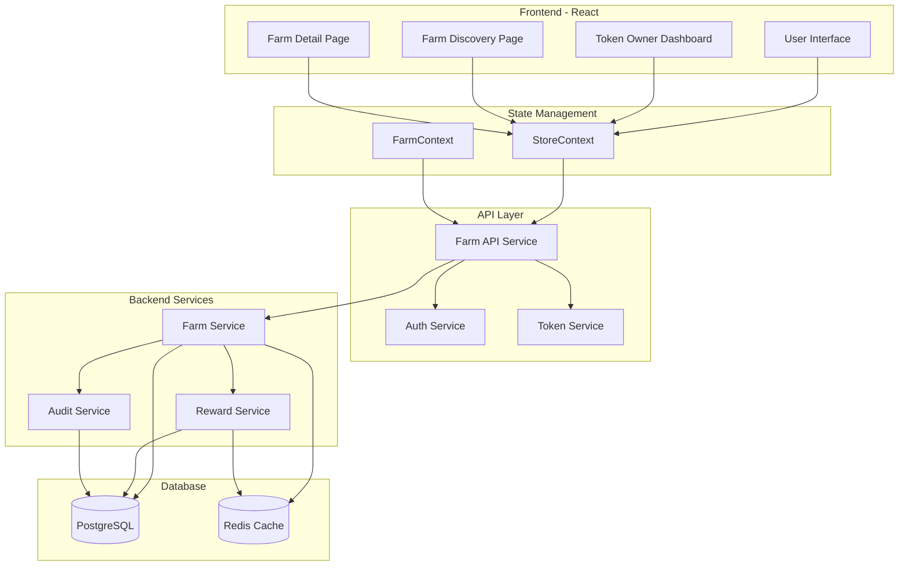
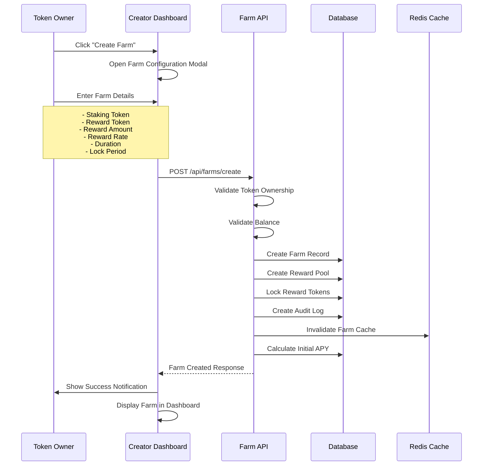
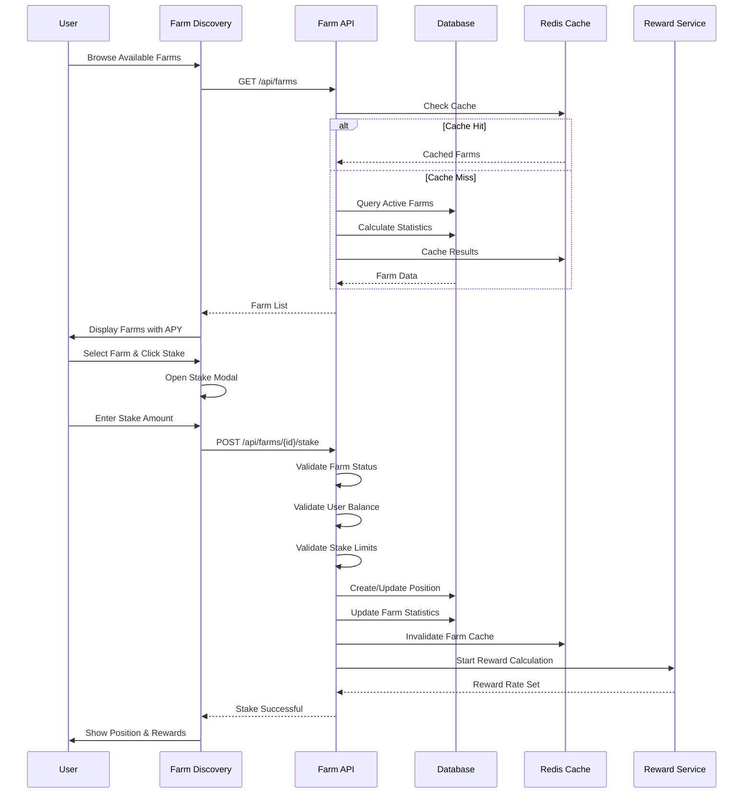
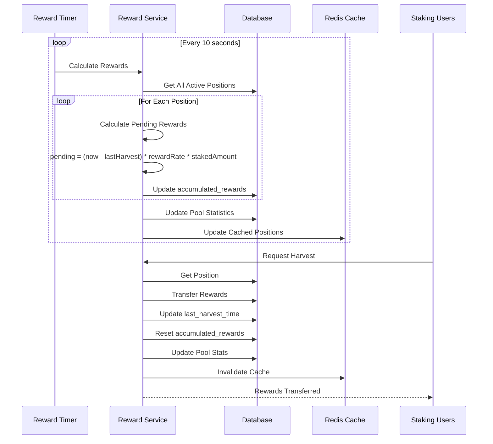

# Token Owner Farm System - Architecture Specification

## Executive Summary

This document outlines the comprehensive architecture for a **Token Owner Farm System** that enables token creators to create custom yield farms using their own tokens as rewards. The system extends the existing DC reward farms while maintaining backward compatibility and seamless integration with the current design and infrastructure.

---

## 1. Data Model Extensions

### 1.1 New TypeScript Interfaces

```typescript
// ============================================================================
// Token Owner Farm Types
// ============================================================================

/**
 * Configuration for a token owner's farm
 */
export interface FarmConfiguration {
  /** Reward distribution rate (tokens per second per staked unit) */
  rewardRate: number;
  
  /** Duration of the farm in seconds (0 = indefinite) */
  duration: number;
  
  /** Minimum lock period in seconds (0 = no lock) */
  lockPeriod: number;
  
  /** Maximum total staking capacity (0 = unlimited) */
  maxStakeAmount: number;
  
  /** Minimum staking amount per user */
  minStakeAmount: number;
  
  /** Whether new stakes are allowed */
  isPaused: boolean;
  
  /** Timestamp when farm was created */
  createdAt: number;
  
  /** Timestamp when farm was last modified */
  updatedAt: number;
  
  /** Timestamp when farm expires (if duration > 0) */
  expiresAt?: number;
}

/**
 * Reward pool tracking for a farm
 */
export interface RewardPool {
  /** Unique pool identifier */
  id: string;
  
  /** ID of the farm this pool belongs to */
  farmId: string;
  
  /** Token ID used as reward */
  rewardTokenId: string;
  
  /** Total rewards deposited by token owner */
  totalDeposited: number;
  
  /** Rewards currently available for distribution */
  availableRewards: number;
  
  /** Total rewards distributed to stakers */
  totalDistributed: number;
  
  /** Last timestamp when rewards were calculated */
  lastCalculatedAt: number;
}

/**
 * A farm created by a token owner
 */
export interface TokenOwnerFarm {
  /** Unique farm identifier */
  id: string;
  
  /** Token ID that owns this farm (creator's token) */
  ownerTokenId: string;
  
  /** Token ID that users stake to earn rewards */
  stakingTokenId: string;
  
  /** Token ID used as reward (can be same as owner token or different) */
  rewardTokenId: string;
  
  /** Farm configuration */
  config: FarmConfiguration;
  
  /** Reward pool information */
  pool: RewardPool;
  
  /** Farm statistics */
  stats: FarmStats;
  
  /** Farm status */
  status: 'active' | 'paused' | 'expired' | 'closed';
  
  /** Optional description for the farm */
  description?: string;
}

/**
 * Farm statistics and metrics
 */
export interface FarmStats {
  /** Total amount staked across all users */
  totalStaked: number;
  
  /** Number of unique stakers */
  uniqueStakers: number;
  
  /** Current APY (calculated dynamically) */
  currentAPY: number;
  
  /** Total rewards distributed */
  totalRewardsDistributed: number;
  
  /** Average stake duration (in seconds) */
  avgStakeDuration: number;
  
  /** Last updated timestamp */
  lastUpdated: number;
}

/**
 * User's position in a token owner farm
 */
export interface TokenOwnerFarmPosition {
  /** Unique position identifier */
  id: string;
  
  /** Farm ID */
  farmId: string;
  
  /** User address */
  userAddress: string;
  
  /** Amount of tokens staked */
  stakedAmount: number;
  
  /** Timestamp when position was created */
  stakedAt: number;
  
  /** Last timestamp when rewards were claimed */
  lastHarvestTime: number;
  
  /** Accumulated but unclaimed rewards */
  accumulatedRewards: number;
  
  /** Whether position is locked */
  isLocked: boolean;
  
  /** Timestamp when lock expires */
  lockExpiresAt?: number;
}

/**
 * Extension to existing Token interface
 */
export interface TokenFarmExtension {
  /** Whether this token has an active farm */
  hasFarm: boolean;
  
  /** ID of the farm (if exists) */
  farmId?: string;
  
  /** Total farms created by this token */
  farmsCreated: number;
}

// ============================================================================
// API Request/Response Types
// ============================================================================

/**
 * Request to create a new farm
 */
export interface CreateFarmRequest {
  ownerTokenId: string;
  stakingTokenId: string;
  rewardTokenId: string;
  rewardDepositAmount: number;
  config: Omit<FarmConfiguration, 'createdAt' | 'updatedAt' | 'expiresAt'>;
  description?: string;
}

/**
 * Request to deposit additional rewards
 */
export interface DepositRewardsRequest {
  farmId: string;
  amount: number;
}

/**
 * Request to update farm configuration
 */
export interface UpdateFarmConfigRequest {
  farmId: string;
  config: Partial<FarmConfiguration>;
}

/**
 * Request to stake in a farm
 */
export interface StakeInFarmRequest {
  farmId: string;
  amount: number;
}

/**
 * Request to unstake from a farm
 */
export interface UnstakeFromFarmRequest {
  farmId: string;
  amount: number;
}

/**
 * Request to harvest rewards
 */
export interface HarvestRewardsRequest {
  farmId: string;
}

/**
 * Farm list response
 */
export interface FarmListResponse {
  farms: TokenOwnerFarm[];
  total: number;
  page: number;
  pageSize: number;
}
```

### 1.2 Database Schema (PostgreSQL)

```sql
-- ============================================================================
-- Token Owner Farm Tables
-- ============================================================================

-- Token owner farms table
CREATE TABLE token_owner_farms (
  id UUID PRIMARY KEY DEFAULT gen_random_uuid(),
  owner_token_id VARCHAR(255) NOT NULL,
  staking_token_id VARCHAR(255) NOT NULL,
  reward_token_id VARCHAR(255) NOT NULL,
  description TEXT,
  
  -- Farm configuration
  reward_rate DECIMAL(20, 18) NOT NULL, -- tokens per second per staked unit
  duration BIGINT NOT NULL DEFAULT 0, -- seconds (0 = indefinite)
  lock_period BIGINT NOT NULL DEFAULT 0, -- seconds (0 = no lock)
  max_stake_amount DECIMAL(20, 18) NOT NULL DEFAULT 0, -- 0 = unlimited
  min_stake_amount DECIMAL(20, 18) NOT NULL DEFAULT 0,
  is_paused BOOLEAN NOT NULL DEFAULT false,
  
  -- Timestamps
  created_at TIMESTAMP WITH TIME ZONE NOT NULL DEFAULT NOW(),
  updated_at TIMESTAMP WITH TIME ZONE NOT NULL DEFAULT NOW(),
  expires_at TIMESTAMP WITH TIME ZONE,
  
  -- Status
  status VARCHAR(20) NOT NULL DEFAULT 'active' CHECK (status IN ('active', 'paused', 'expired', 'closed')),
  
  -- Indexes
  CONSTRAINT fk_owner_token FOREIGN KEY (owner_token_id) REFERENCES tokens(id),
  CONSTRAINT fk_staking_token FOREIGN KEY (staking_token_id) REFERENCES tokens(id),
  CONSTRAINT fk_reward_token FOREIGN KEY (reward_token_id) REFERENCES tokens(id)
);

-- Reward pools table
CREATE TABLE reward_pools (
  id UUID PRIMARY KEY DEFAULT gen_random_uuid(),
  farm_id UUID NOT NULL REFERENCES token_owner_farms(id) ON DELETE CASCADE,
  reward_token_id VARCHAR(255) NOT NULL,
  
  -- Reward tracking
  total_deposited DECIMAL(20, 18) NOT NULL DEFAULT 0,
  available_rewards DECIMAL(20, 18) NOT NULL DEFAULT 0,
  total_distributed DECIMAL(20, 18) NOT NULL DEFAULT 0,
  last_calculated_at TIMESTAMP WITH TIME ZONE NOT NULL DEFAULT NOW(),
  
  -- Indexes
  UNIQUE(farm_id),
  CONSTRAINT fk_reward_pool_token FOREIGN KEY (reward_token_id) REFERENCES tokens(id)
);

-- Farm positions table
CREATE TABLE token_owner_farm_positions (
  id UUID PRIMARY KEY DEFAULT gen_random_uuid(),
  farm_id UUID NOT NULL REFERENCES token_owner_farms(id) ON DELETE CASCADE,
  user_address VARCHAR(255) NOT NULL,
  
  -- Position data
  staked_amount DECIMAL(20, 18) NOT NULL DEFAULT 0,
  staked_at TIMESTAMP WITH TIME ZONE NOT NULL DEFAULT NOW(),
  last_harvest_time TIMESTAMP WITH TIME ZONE NOT NULL DEFAULT NOW(),
  accumulated_rewards DECIMAL(20, 18) NOT NULL DEFAULT 0,
  
  -- Lock data
  is_locked BOOLEAN NOT NULL DEFAULT false,
  lock_expires_at TIMESTAMP WITH TIME ZONE,
  
  -- Indexes
  UNIQUE(farm_id, user_address),
  INDEX idx_farm_user (farm_id, user_address),
  INDEX idx_user_farms (user_address, farm_id)
);

-- Farm statistics table (materialized view for performance)
CREATE TABLE farm_statistics (
  farm_id UUID PRIMARY KEY REFERENCES token_owner_farms(id) ON DELETE CASCADE,
  total_staked DECIMAL(20, 18) NOT NULL DEFAULT 0,
  unique_stakers BIGINT NOT NULL DEFAULT 0,
  total_rewards_distributed DECIMAL(20, 18) NOT NULL DEFAULT 0,
  avg_stake_duration BIGINT NOT NULL DEFAULT 0,
  current_apy DECIMAL(10, 2) NOT NULL DEFAULT 0,
  last_updated TIMESTAMP WITH TIME ZONE NOT NULL DEFAULT NOW()
);

-- Farm audit log table
CREATE TABLE farm_audit_log (
  id UUID PRIMARY KEY DEFAULT gen_random_uuid(),
  farm_id UUID NOT NULL REFERENCES token_owner_farms(id) ON DELETE CASCADE,
  action VARCHAR(50) NOT NULL,
  actor_address VARCHAR(255) NOT NULL,
  action_data JSONB,
  timestamp TIMESTAMP WITH TIME ZONE NOT NULL DEFAULT NOW(),
  
  INDEX idx_farm_audit (farm_id, timestamp)
);

-- Create indexes for performance
CREATE INDEX idx_farms_owner ON token_owner_farms(owner_token_id);
CREATE INDEX idx_farms_status ON token_owner_farms(status);
CREATE INDEX idx_farms_expires ON token_owner_farms(expires_at);
CREATE INDEX idx_positions_user ON token_owner_farm_positions(user_address);
```

---

## 2. System Architecture

### 2.1 High-Level Architecture Diagram



### 2.2 Token Owner Creates Farm Flow



### 2.3 User Stakes in Farm Flow



### 2.4 Reward Distribution Flow



### 2.5 API Endpoints

```typescript
// ============================================================================
// Farm API Endpoints
// ============================================================================

/**
 * GET /api/farms
 * List all available farms with pagination and filtering
 */
interface GetFarmsQuery {
  page?: number;
  pageSize?: number;
  status?: 'active' | 'paused' | 'expired' | 'closed';
  ownerTokenId?: string;
  stakingTokenId?: string;
  sortBy?: 'created_at' | 'apy' | 'total_staked' | 'expires_at';
  sortOrder?: 'asc' | 'desc';
}

/**
 * GET /api/farms/:id
 * Get detailed information about a specific farm
 */
interface GetFarmResponse {
  farm: TokenOwnerFarm;
  ownerToken: Token;
  stakingToken: Token;
  rewardToken: Token;
  userPosition?: TokenOwnerFarmPosition;
}

/**
 * POST /api/farms/create
 * Create a new farm (token owner only)
 */
interface CreateFarmResponse {
  farm: TokenOwnerFarm;
  transactionHash: string;
}

/**
 * POST /api/farms/:id/deposit
 * Deposit additional rewards into farm pool
 */
interface DepositRewardsResponse {
  pool: RewardPool;
  transactionHash: string;
}

/**
 * PUT /api/farms/:id/config
 * Update farm configuration (token owner only)
 */
interface UpdateFarmConfigResponse {
  farm: TokenOwnerFarm;
}

/**
 * POST /api/farms/:id/pause
 * Pause a farm (token owner only)
 */
interface PauseFarmResponse {
  farm: TokenOwnerFarm;
}

/**
 * POST /api/farms/:id/resume
 * Resume a paused farm (token owner only)
 */
interface ResumeFarmResponse {
  farm: TokenOwnerFarm;
}

/**
 * POST /api/farms/:id/close
 * Close a farm and return remaining rewards (token owner only)
 */
interface CloseFarmResponse {
  farm: TokenOwnerFarm;
  returnedRewards: number;
  transactionHash: string;
}

/**
 * POST /api/farms/:id/stake
 * Stake tokens in a farm
 */
interface StakeInFarmResponse {
  position: TokenOwnerFarmPosition;
  transactionHash: string;
}

/**
 * POST /api/farms/:id/unstake
 * Unstake tokens from a farm
 */
interface UnstakeFromFarmResponse {
  position: TokenOwnerFarmPosition;
  transactionHash: string;
}

/**
 * POST /api/farms/:id/harvest
 * Harvest accumulated rewards
 */
interface HarvestRewardsResponse {
  rewards: number;
  transactionHash: string;
}

/**
 * GET /api/farms/:id/positions
 * Get user's positions in a farm
 */
interface GetUserPositionsResponse {
  positions: TokenOwnerFarmPosition[];
  totalStaked: number;
  totalRewards: number;
}

/**
 * GET /api/farms/:id/stats
 * Get farm statistics
 */
interface GetFarmStatsResponse {
  stats: FarmStats;
  hourlyChart: { timestamp: number; totalStaked: number; apy: number }[];
  dailyChart: { timestamp: number; totalStaked: number; apy: number }[];
}

/**
 * GET /api/farms/my-farms
 * Get farms created by current user (token owner)
 */
interface GetMyFarmsResponse {
  farms: TokenOwnerFarm[];
  total: number;
}
```

### 2.6 State Management Extensions

```typescript
// ============================================================================
// StoreContext Extensions
// ============================================================================

interface StoreContextType {
  // ... existing fields ...
  
  // Token Owner Farm State
  tokenOwnerFarms: TokenOwnerFarm[];
  farmPositions: TokenOwnerFarmPosition[];
  
  // Farm Actions
  createFarm: (request: CreateFarmRequest) => Promise<string>;
  depositRewards: (farmId: string, amount: number) => Promise<void>;
  updateFarmConfig: (farmId: string, config: Partial<FarmConfiguration>) => Promise<void>;
  pauseFarm: (farmId: string) => Promise<void>;
  resumeFarm: (farmId: string) => Promise<void>;
  closeFarm: (farmId: string) => Promise<void>;
  
  // User Actions
  stakeInFarm: (farmId: string, amount: number) => Promise<void>;
  unstakeFromFarm: (farmId: string, amount: number) => Promise<void>;
  harvestFarmRewards: (farmId: string) => Promise<number>;
  
  // Query Actions
  getFarm: (farmId: string) => TokenOwnerFarm | undefined;
  getMyFarms: () => TokenOwnerFarm[];
  getFarmPositions: (farmId?: string) => TokenOwnerFarmPosition[];
  getFarmStats: (farmId: string) => FarmStats | undefined;
  
  // Real-time Updates
  subscribeToFarmUpdates: (farmId: string, callback: (farm: TokenOwnerFarm) => void) => () => void;
}

// ============================================================================
// FarmContext - Dedicated Context for Farm Operations
// ============================================================================

interface FarmContextType {
  // Farm data
  farms: TokenOwnerFarm[];
  myFarms: TokenOwnerFarm[];
  myPositions: TokenOwnerFarmPosition[];
  
  // Loading states
  isLoadingFarms: boolean;
  isLoadingPositions: boolean;
  
  // Error states
  farmError: string | null;
  
  // Actions
  loadFarms: (filters?: GetFarmsQuery) => Promise<void>;
  loadMyFarms: () => Promise<void>;
  loadMyPositions: () => Promise<void>;
  createFarm: (request: CreateFarmRequest) => Promise<string>;
  depositRewards: (farmId: string, amount: number) => Promise<void>;
  updateFarmConfig: (farmId: string, config: Partial<FarmConfiguration>) => Promise<void>;
  pauseFarm: (farmId: string) => Promise<void>;
  resumeFarm: (farmId: string) => Promise<void>;
  closeFarm: (farmId: string) => Promise<void>;
  stakeInFarm: (farmId: string, amount: number) => Promise<void>;
  unstakeFromFarm: (farmId: string, amount: number) => Promise<void>;
  harvestRewards: (farmId: string) => Promise<number>;
  
  // Real-time
  subscribeToFarm: (farmId: string) => () => void;
}
```

---

## 3. UI/UX Design

### 3.1 Token Owner Dashboard Layout

The token owner dashboard will be integrated into the existing [`CreatorAdmin`](components/CreatorAdmin.tsx) component with a new "Farms" tab.

```
┌─────────────────────────────────────────────────────────────────┐
│ Creator Admin - [Token Name]                                │
├─────────────────────────────────────────────────────────────────┤
│ [Security] [Info] [Stream] [Farms] [Airdrop]             │
├─────────────────────────────────────────────────────────────────┤
│                                                             │
│  ┌─────────────────────────────────────────────────────────┐   │
│  │ My Farms                                             │   │
│  ├─────────────────────────────────────────────────────────┤   │
│  │                                                     │   │
│  │  ┌─────────────────────────────────────────────────┐   │   │
│  │  │ [DOGE] Farm #1                             │   │   │
│  │  │ Status: Active | APY: 125% | TVL: 50K     │   │   │
│  │  │ Staked: 125 users | Rewards: 45K/100K      │   │   │
│  │  │ [Manage] [Deposit] [Pause]                  │   │   │
│  │  └─────────────────────────────────────────────────┘   │   │
│  │                                                     │   │
│  │  ┌─────────────────────────────────────────────────┐   │   │
│  │  │ [MOON] Farm #2                             │   │   │
│  │  │ Status: Paused | APY: 85% | TVL: 25K       │   │   │
│  │  │ Staked: 45 users | Rewards: 20K/50K        │   │   │
│  │  │ [Manage] [Deposit] [Resume]                 │   │   │
│  │  └─────────────────────────────────────────────────┘   │   │
│  │                                                     │   │
│  └─────────────────────────────────────────────────────────┘   │
│                                                             │
│  [+ Create New Farm]                                         │
│                                                             │
└─────────────────────────────────────────────────────────────────┘
```

### 3.2 Farm Configuration Interface

```tsx
// components/CreateFarmModal.tsx

interface CreateFarmModalProps {
  token: Token;
  onSuccess: (farmId: string) => void;
  onCancel: () => void;
}

const CreateFarmModal: React.FC<CreateFarmModalProps> = ({ token, onSuccess, onCancel }) => {
  const [config, setConfig] = useState<CreateFarmRequest>({
    ownerTokenId: token.id,
    stakingTokenId: '',
    rewardTokenId: token.id,
    rewardDepositAmount: 0,
    config: {
      rewardRate: 0.0001,
      duration: 0,
      lockPeriod: 0,
      maxStakeAmount: 0,
      minStakeAmount: 100,
      isPaused: false
    }
  });

  return (
    <ModalPortal>
      <div className="fixed inset-0 bg-black/80 backdrop-blur-sm flex items-center justify-center z-50">
        <div className="bg-[#0A0A0A] border border-doge/20 rounded-3xl p-8 max-w-2xl w-full mx-4 shadow-2xl">
          {/* Header */}
          <div className="flex items-center justify-between mb-8">
            <div className="flex items-center gap-3">
              <div className="bg-doge/20 p-3 rounded-xl">
                <Sprout size={24} className="text-doge" />
              </div>
              <div>
                <h2 className="text-2xl font-bold text-white">Create Farm</h2>
                <p className="text-gray-500 text-sm">Configure your yield farm</p>
              </div>
            </div>
            <button onClick={onCancel} className="text-gray-500 hover:text-white">
              <X size={24} />
            </button>
          </div>

          {/* Staking Token Selection */}
          <div className="space-y-4 mb-6">
            <label className="text-xs font-bold text-gray-400 uppercase tracking-wider">
              Staking Token (What users stake)
            </label>
            <TokenSelector
              tokens={tokens}
              selectedTokenId={config.stakingTokenId}
              onSelect={(tokenId) => setConfig({ ...config, stakingTokenId: tokenId })}
            />
          </div>

          {/* Reward Token Selection */}
          <div className="space-y-4 mb-6">
            <label className="text-xs font-bold text-gray-400 uppercase tracking-wider">
              Reward Token (What users earn)
            </label>
            <TokenSelector
              tokens={tokens}
              selectedTokenId={config.rewardTokenId}
              onSelect={(tokenId) => setConfig({ ...config, rewardTokenId: tokenId })}
            />
          </div>

          {/* Reward Deposit */}
          <div className="space-y-4 mb-6">
            <label className="text-xs font-bold text-gray-400 uppercase tracking-wider">
              Initial Reward Deposit
            </label>
            <div className="relative">
              <input
                type="number"
                value={config.rewardDepositAmount}
                onChange={(e) => setConfig({ ...config, rewardDepositAmount: Number(e.target.value) })}
                className="w-full bg-[#050505] border border-white/10 rounded-xl px-4 py-4 text-white font-mono text-lg focus:border-doge/50 outline-none"
                placeholder="0.00"
              />
              <button
                onClick={() => setConfig({ ...config, rewardDepositAmount: myBalance })}
                className="absolute right-3 top-1/2 -translate-y-1/2 text-xs font-bold bg-doge/20 text-doge px-3 py-1.5 rounded-lg hover:bg-doge/30"
              >
                MAX
              </button>
            </div>
            <div className="text-xs text-gray-500">
              Your balance: {formatNumber(myBalance)} {token.ticker}
            </div>
          </div>

          {/* Farm Configuration */}
          <div className="grid grid-cols-2 gap-4 mb-6">
            <div className="space-y-2">
              <label className="text-xs font-bold text-gray-400 uppercase tracking-wider">
                Reward Rate
              </label>
              <input
                type="number"
                step="0.00001"
                value={config.config.rewardRate}
                onChange={(e) => setConfig({ 
                  ...config, 
                  config: { ...config.config, rewardRate: Number(e.target.value) }
                })}
                className="w-full bg-[#050505] border border-white/10 rounded-xl px-4 py-3 text-white font-mono focus:border-doge/50 outline-none"
              />
              <div className="text-[10px] text-gray-500">
                Tokens per second per staked unit
              </div>
            </div>

            <div className="space-y-2">
              <label className="text-xs font-bold text-gray-400 uppercase tracking-wider">
                Duration
              </label>
              <select
                value={config.config.duration}
                onChange={(e) => setConfig({ 
                  ...config, 
                  config: { ...config.config, duration: Number(e.target.value) }
                })}
                className="w-full bg-[#050505] border border-white/10 rounded-xl px-4 py-3 text-white focus:border-doge/50 outline-none"
              >
                <option value="0">Indefinite</option>
                <option value="604800">7 Days</option>
                <option value="2592000">30 Days</option>
                <option value="7776000">90 Days</option>
                <option value="15552000">180 Days</option>
                <option value="31536000">365 Days</option>
              </select>
            </div>

            <div className="space-y-2">
              <label className="text-xs font-bold text-gray-400 uppercase tracking-wider">
                Lock Period
              </label>
              <select
                value={config.config.lockPeriod}
                onChange={(e) => setConfig({ 
                  ...config, 
                  config: { ...config.config, lockPeriod: Number(e.target.value) }
                })}
                className="w-full bg-[#050505] border border-white/10 rounded-xl px-4 py-3 text-white focus:border-doge/50 outline-none"
              >
                <option value="0">No Lock</option>
                <option value="86400">24 Hours</option>
                <option value="604800">7 Days</option>
                <option value="2592000">30 Days</option>
              </select>
            </div>

            <div className="space-y-2">
              <label className="text-xs font-bold text-gray-400 uppercase tracking-wider">
                Max Stake per User
              </label>
              <input
                type="number"
                value={config.config.maxStakeAmount}
                onChange={(e) => setConfig({ 
                  ...config, 
                  config: { ...config.config, maxStakeAmount: Number(e.target.value) }
                })}
                className="w-full bg-[#050505] border border-white/10 rounded-xl px-4 py-3 text-white font-mono focus:border-doge/50 outline-none"
                placeholder="0 = unlimited"
              />
            </div>
          </div>

          {/* APY Preview */}
          <div className="bg-gradient-to-r from-doge/10 to-green-500/10 border border-doge/20 rounded-2xl p-6 mb-6">
            <div className="flex items-center justify-between">
              <div>
                <div className="text-sm text-gray-400 mb-1">Estimated APY</div>
                <div className="text-3xl font-mono font-bold text-doge">
                  {calculateAPY(config.config.rewardRate)}%
                </div>
              </div>
              <div className="text-right">
                <div className="text-sm text-gray-400 mb-1">Daily Rewards</div>
                <div className="text-xl font-mono font-bold text-white">
                  {formatNumber(config.config.rewardRate * 86400)} per staked unit
                </div>
              </div>
            </div>
          </div>

          {/* Description */}
          <div className="space-y-2 mb-6">
            <label className="text-xs font-bold text-gray-400 uppercase tracking-wider">
              Farm Description (Optional)
            </label>
            <textarea
              value={config.description}
              onChange={(e) => setConfig({ ...config, description: e.target.value })}
              className="w-full bg-[#050505] border border-white/10 rounded-xl px-4 py-3 text-white text-sm focus:border-doge/50 outline-none resize-none"
              rows={3}
              placeholder="Describe your farm to attract stakers..."
            />
          </div>

          {/* Actions */}
          <div className="flex gap-3">
            <Button onClick={onCancel} variant="secondary" className="flex-1">
              Cancel
            </Button>
            <Button 
              onClick={handleCreate} 
              isLoading={isLoading}
              className="flex-1 bg-doge hover:bg-doge/80 text-white font-bold"
            >
              Create Farm
            </Button>
          </div>
        </div>
      </div>
    </ModalPortal>
  );
};
```

### 3.3 Farm Discovery Interface

The farm discovery page will extend the existing [`Earn`](pages/Earn.tsx) page to include both DC farms and token owner farms.

```tsx
// pages/Farms.tsx - New page for farm discovery

const Farms: React.FC = () => {
  const { tokenOwnerFarms, farmPositions, stakeInFarm, unstakeFromFarm, harvestFarmRewards } = useStore();
  const [activeTab, setActiveTab] = useState<'core' | 'community'>('core');
  const [filters, setFilters] = useState<{
    sortBy: 'apy' | 'tvl' | 'newest';
    stakingToken?: string;
    rewardToken?: string;
  }>({ sortBy: 'apy' });

  const coreFarms = tokens.filter(t => t.progress >= 100); // Existing DC farms
  const communityFarms = tokenOwnerFarms.filter(f => f.status === 'active');

  return (
    <>
      <Helmet>
        <title>Farms | DogePump Dogechain</title>
      </Helmet>
      
      <div className="space-y-12 pb-12">
        {/* Hero */}
        <div className="text-center relative py-8">
          <div className="absolute top-1/2 left-1/2 -translate-x-1/2 -translate-y-1/2 w-64 h-64 bg-doge/10 blur-[80px] rounded-full pointer-events-none"></div>
          <div className="inline-flex items-center justify-center w-20 h-20 bg-[#0A0A0A] border border-doge/20 rounded-3xl mb-6 shadow-[0_0_40px_rgba(139,92,246,0.2)] relative z-10 animate-float">
            <Sprout size={40} className="text-doge" />
          </div>
          <h1 className="text-5xl md:text-6xl font-comic font-bold text-white mb-4 relative z-10">
            Yield <span className="text-doge">Farms</span>
          </h1>
          <p className="text-gray-400 max-w-md mx-auto text-lg relative z-10">
            Stake tokens to earn rewards from community farms
          </p>
        </div>

        {/* Tabs */}
        <div className="flex justify-center mb-8">
          <div className="bg-white/5 p-1 rounded-xl inline-flex">
            <button
              onClick={() => setActiveTab('core')}
              className={`px-6 py-3 rounded-lg font-bold transition-all ${
                activeTab === 'core' 
                  ? 'bg-doge text-white' 
                  : 'text-gray-500 hover:text-white'
              }`}
            >
              Core Farms
            </button>
            <button
              onClick={() => setActiveTab('community')}
              className={`px-6 py-3 rounded-lg font-bold transition-all ${
                activeTab === 'community' 
                  ? 'bg-doge text-white' 
                  : 'text-gray-500 hover:text-white'
              }`}
            >
              Community Farms
            </button>
          </div>
        </div>

        {/* Filters */}
        {activeTab === 'community' && (
          <div className="max-w-4xl mx-auto mb-8">
            <FarmFilters 
              filters={filters}
              onFiltersChange={setFilters}
            />
          </div>
        )}

        {/* Farm Grid */}
        {activeTab === 'core' ? (
          <CoreFarmGrid farms={coreFarms} />
        ) : (
          <CommunityFarmGrid farms={communityFarms} />
        )}
      </div>
    </>
  );
};
```

### 3.4 Integration Points

| Component | Integration Point | Changes Required |
|-----------|-------------------|------------------|
| [`CreatorAdmin.tsx`](components/CreatorAdmin.tsx:18) | Add "Farms" tab | New tab section with farm list and create button |
| [`Earn.tsx`](pages/Earn.tsx:12) | Add community farms tab | New tab for token owner farms |
| [`TokenDetail.tsx`](pages/TokenDetail.tsx:16) | Show farm status | Display farm badge if token has active farm |
| [`StoreContext.tsx`](contexts/StoreContext.tsx:108) | Add farm state | New state fields and actions |
| Navigation | Add Farms route | New route `/farms` |

---

## 4. Security Considerations

### 4.1 Token Ownership Verification

```typescript
// services/farmSecurityService.ts

/**
 * Verify that the current user owns the token
 */
export async function verifyTokenOwnership(
  tokenId: string,
  userAddress: string
): Promise<boolean> {
  // Check token creator field
  const token = await getTokenById(tokenId);
  if (!token) return false;
  
  // Verify user is the token creator
  return token.creator.toLowerCase() === userAddress.toLowerCase();
}

/**
 * Verify user has sufficient balance for reward deposit
 */
export async function verifyRewardBalance(
  tokenId: string,
  userAddress: string,
  amount: number
): Promise<boolean> {
  const balance = await getTokenBalance(tokenId, userAddress);
  return balance >= amount;
}

/**
 * Verify farm configuration is valid
 */
export function validateFarmConfig(config: FarmConfiguration): { valid: boolean; errors: string[] } {
  const errors: string[] = [];
  
  // Reward rate must be positive
  if (config.rewardRate <= 0) {
    errors.push('Reward rate must be greater than 0');
  }
  
  // Reward rate must not exceed maximum (prevent runaway inflation)
  if (config.rewardRate > MAX_REWARD_RATE) {
    errors.push(`Reward rate cannot exceed ${MAX_REWARD_RATE}`);
  }
  
  // Duration must be valid
  if (config.duration < 0) {
    errors.push('Duration cannot be negative');
  }
  
  // Lock period must not exceed duration
  if (config.duration > 0 && config.lockPeriod > config.duration) {
    errors.push('Lock period cannot exceed farm duration');
  }
  
  // Max stake must be >= min stake
  if (config.maxStakeAmount > 0 && config.minStakeAmount > config.maxStakeAmount) {
    errors.push('Minimum stake cannot exceed maximum stake');
  }
  
  return {
    valid: errors.length === 0,
    errors
  };
}
```

### 4.2 Reward Pool Protection

```typescript
// services/rewardProtectionService.ts

const MAX_REWARD_RATE = 0.001; // Maximum tokens per second per staked unit
const MIN_FARM_DURATION = 86400; // Minimum 24 hours
const MAX_FARM_DURATION = 31536000; // Maximum 1 year
const MAX_TOTAL_REWARDS = 1000000000; // Maximum total rewards per farm

/**
 * Protect against reward pool manipulation
 */
export async function protectRewardPool(
  farmId: string,
  depositAmount: number
): Promise<{ allowed: boolean; reason?: string }> {
  const farm = await getFarmById(farmId);
  if (!farm) {
    return { allowed: false, reason: 'Farm not found' };
  }
  
  // Check total rewards cap
  const totalRewards = farm.pool.totalDeposited + depositAmount;
  if (totalRewards > MAX_TOTAL_REWARDS) {
    return { 
      allowed: false, 
      reason: `Total rewards cannot exceed ${MAX_TOTAL_REWARDS}` 
    };
  }
  
  // Check reward rate against APY limits
  const apy = calculateAPY(farm.config.rewardRate);
  if (apy > MAX_APY) {
    return { 
      allowed: false, 
      reason: `APY cannot exceed ${MAX_APY}%` 
    };
  }
  
  return { allowed: true };
}

/**
 * Detect suspicious reward rate changes
 */
export async function detectSuspiciousConfig(
  farmId: string,
  newConfig: Partial<FarmConfiguration>
): Promise<{ suspicious: boolean; reason?: string }> {
  const farm = await getFarmById(farmId);
  if (!farm) {
    return { suspicious: false };
  }
  
  // Check for drastic reward rate increase
  if (newConfig.rewardRate) {
    const oldRate = farm.config.rewardRate;
    const newRate = newConfig.rewardRate;
    
    if (newRate > oldRate * 10) {
      return { 
        suspicious: true, 
        reason: 'Reward rate increased by more than 10x' 
      };
    }
  }
  
  // Check for sudden pause after rewards deposited
  if (newConfig.isPaused === true && !farm.config.isPaused) {
    const recentDeposits = await getRecentDeposits(farmId, 3600); // Last hour
    if (recentDeposits.length > 0) {
      return { 
        suspicious: true, 
        reason: 'Farm paused shortly after reward deposit' 
      };
    }
  }
  
  return { suspicious: false };
}
```

### 4.3 Farm Closure and Refunds

```typescript
// services/farmClosureService.ts

/**
 * Close a farm and handle refunds
 */
export async function closeFarm(
  farmId: string,
  userAddress: string
): Promise<{ success: boolean; refundedAmount?: number; error?: string }> {
  // Verify ownership
  const isOwner = await verifyTokenOwnership(farmId, userAddress);
  if (!isOwner) {
    return { success: false, error: 'Not authorized to close this farm' };
  }
  
  const farm = await getFarmById(farmId);
  
  // Check if users are still staked
  const activePositions = await getActivePositions(farmId);
  if (activePositions.length > 0) {
    return { 
      success: false, 
      error: 'Cannot close farm with active stakers' 
    };
  }
  
  // Calculate refund amount
  const refundAmount = farm.pool.availableRewards;
  
  // Transfer refund to owner
  await transferTokens(
    farm.rewardTokenId,
    farm.ownerTokenId,
    refundAmount
  );
  
  // Update farm status
  await updateFarmStatus(farmId, 'closed');
  
  // Create audit log
  await createAuditLog({
    farmId,
    action: 'farm_closed',
    actorAddress: userAddress,
    actionData: { refundedAmount }
  });
  
  return { success: true, refundedAmount };
}

/**
 * Emergency close (with active stakers)
 */
export async function emergencyCloseFarm(
  farmId: string,
  userAddress: string,
  adminOverride: boolean = false
): Promise<{ success: boolean; error?: string }> {
  // Only allow emergency close if admin override or farm is expired
  const farm = await getFarmById(farmId);
  
  if (!adminOverride && farm.status !== 'expired') {
    return { 
      success: false, 
      error: 'Emergency close requires admin approval' 
    };
  }
  
  // Force unstake all positions
  const positions = await getActivePositions(farmId);
  for (const position of positions) {
    await forceUnstake(position.id);
  }
  
  // Return remaining rewards to owner
  const refundAmount = farm.pool.availableRewards;
  await transferTokens(
    farm.rewardTokenId,
    farm.ownerTokenId,
    refundAmount
  );
  
  // Update farm status
  await updateFarmStatus(farmId, 'closed');
  
  return { success: true };
}
```

### 4.4 Audit Logging

```typescript
// services/farmAuditService.ts

/**
 * Create audit log entry
 */
export async function createAuditLog(entry: {
  farmId: string;
  action: string;
  actorAddress: string;
  actionData?: any;
}): Promise<void> {
  await db.farm_audit_log.create({
    data: {
      farm_id: entry.farmId,
      action: entry.action,
      actor_address: entry.actorAddress,
      action_data: entry.actionData || {},
      timestamp: new Date()
    }
  });
}

/**
 * Get audit logs for a farm
 */
export async function getFarmAuditLogs(
  farmId: string,
  limit: number = 50
): Promise<FarmAuditLog[]> {
  return await db.farm_audit_log.findMany({
    where: { farm_id: farmId },
    orderBy: { timestamp: 'desc' },
    take: limit
  });
}

/**
 * Detect suspicious activity patterns
 */
export async function detectSuspiciousActivity(
  farmId: string
): Promise<{ suspicious: boolean; alerts: string[] }> {
  const logs = await getFarmAuditLogs(farmId, 100);
  const alerts: string[] = [];
  
  // Check for rapid config changes
  const configChanges = logs.filter(l => l.action === 'config_updated');
  if (configChanges.length > 5 && configChanges.length < 3600) {
    alerts.push('Multiple config changes detected');
  }
  
  // Check for pause/resume cycling
  const pauseActions = logs.filter(l => l.action === 'farm_paused');
  const resumeActions = logs.filter(l => l.action === 'farm_resumed');
  if (pauseActions.length >= 3 && resumeActions.length >= 3) {
    alerts.push('Suspicious pause/resume pattern detected');
  }
  
  return {
    suspicious: alerts.length > 0,
    alerts
  };
}
```

---

## 5. Implementation Roadmap

### Phase 1: Backend API and Data Structures (Week 1-2)

**Objectives:**
- Set up database schema
- Implement core API endpoints
- Create farm service logic

**Tasks:**
- [ ] Create database migrations for farm tables
- [ ] Implement FarmService with CRUD operations
- [ ] Implement RewardService for reward calculations
- [ ] Implement FarmAuditService for logging
- [ ] Create API endpoints for farm management
- [ ] Implement token ownership verification
- [ ] Implement reward pool protection
- [ ] Write unit tests for services
- [ ] Write integration tests for API endpoints

**Deliverables:**
- Database schema version 1.0
- Farm API with all endpoints
- Service layer with security validations
- Test suite with 80%+ coverage

### Phase 2: Token Owner UI (Week 3)

**Objectives:**
- Create farm management interface for token owners
- Integrate with existing CreatorAdmin component

**Tasks:**
- [ ] Create FarmContext for state management
- [ ] Create CreateFarmModal component
- [ ] Create FarmManagementTab component
- [ ] Create FarmCard component for farm list
- [ ] Create DepositRewardsModal component
- [ ] Create EditFarmConfigModal component
- [ ] Add "Farms" tab to CreatorAdmin
- [ ] Implement farm statistics display
- [ ] Implement farm action buttons (pause, resume, close)
- [ ] Write component tests

**Deliverables:**
- FarmContext with all actions
- CreateFarmModal component
- FarmManagementTab component
- Updated CreatorAdmin with Farms tab
- Component tests

### Phase 3: User UI - Farm Discovery (Week 4)

**Objectives:**
- Create farm discovery interface for users
- Implement staking and harvesting flows

**Tasks:**
- [ ] Create Farms page (/farms route)
- [ ] Create FarmFilters component
- [ ] Create CommunityFarmGrid component
- [ ] Create FarmDetailCard component
- [ ] Create StakeModal component
- [ ] Create UnstakeModal component
- [ ] Create HarvestRewardsModal component
- [ ] Add farm badge to TokenDetail
- [ ] Integrate with existing Earn page
- [ ] Implement real-time reward updates
- [ ] Write component tests

**Deliverables:**
- Farms page with discovery interface
- Stake/Unstake/Harvest modals
- Farm detail views
- Integration with Earn page
- Real-time reward updates

### Phase 4: Analytics and Monitoring (Week 5)

**Objectives:**
- Implement farm analytics dashboard
- Add monitoring and alerts

**Tasks:**
- [ ] Create FarmAnalytics component
- [ ] Implement APY calculation service
- [ ] Implement TVL tracking
- [ ] Create FarmStatisticsChart component
- [ ] Implement reward distribution tracking
- [ ] Create FarmAlerts component
- [ ] Set up monitoring dashboards
- [ ] Create admin farm overview page
- [ ] Implement farm performance metrics

**Deliverables:**
- FarmAnalytics component
- Statistics charts
- Monitoring dashboard
- Admin overview page

### Phase 5: Testing and Integration (Week 6)

**Objectives:**
- Comprehensive testing
- Performance optimization
- Documentation

**Tasks:**
- [ ] Write end-to-end tests for farm flows
- [ ] Perform security audit
- [ ] Load testing for reward calculations
- [ ] Performance optimization
- [ ] Write user documentation
- [ ] Write API documentation
- [ ] Create developer guide
- [ ] Create deployment checklist
- [ ] Prepare production release

**Deliverables:**
- E2E test suite
- Security audit report
- Performance benchmarks
- User documentation
- API documentation
- Deployment guide

---

## 6. Component Structure

```
components/
├── farms/
│   ├── CreateFarmModal.tsx
│   ├── FarmManagementTab.tsx
│   ├── FarmCard.tsx
│   ├── FarmFilters.tsx
│   ├── CommunityFarmGrid.tsx
│   ├── FarmDetailCard.tsx
│   ├── StakeModal.tsx
│   ├── UnstakeModal.tsx
│   ├── HarvestRewardsModal.tsx
│   ├── DepositRewardsModal.tsx
│   ├── EditFarmConfigModal.tsx
│   ├── FarmAnalytics.tsx
│   ├── FarmStatisticsChart.tsx
│   └── FarmAlerts.tsx
├── CreatorAdmin.tsx (modified)
├── TokenDetail.tsx (modified)
└── Earn.tsx (modified)

pages/
├── Farms.tsx (new)
└── Earn.tsx (modified)

contexts/
└── FarmContext.tsx (new)

services/
├── farmService.ts
├── rewardService.ts
├── farmSecurityService.ts
├── rewardProtectionService.ts
├── farmClosureService.ts
└── farmAuditService.ts

types.ts (modified)
```

---

## 7. Configuration Constants

```typescript
// constants/farmConstants.ts

export const FARM_CONSTANTS = {
  // Reward limits
  MAX_REWARD_RATE: 0.001, // tokens per second per staked unit
  MAX_APY: 50000, // 50,000% maximum APY
  MAX_TOTAL_REWARDS: 1000000000, // 1M tokens max per farm
  
  // Duration limits
  MIN_FARM_DURATION: 86400, // 24 hours
  MAX_FARM_DURATION: 31536000, // 1 year
  
  // Stake limits
  MIN_STAKE_AMOUNT: 1,
  MAX_STAKE_PER_USER: 10000000,
  
  // Calculation intervals
  REWARD_CALCULATION_INTERVAL: 10000, // 10 seconds
  STATS_UPDATE_INTERVAL: 60000, // 1 minute
  
  // Cache durations
  FARM_CACHE_TTL: 300, // 5 minutes
  POSITION_CACHE_TTL: 60, // 1 minute
  
  // Pagination
  DEFAULT_PAGE_SIZE: 20,
  MAX_PAGE_SIZE: 100,
  
  // Audit
  AUDIT_LOG_RETENTION_DAYS: 90,
  
  // Security
  MAX_CONFIG_CHANGES_PER_HOUR: 5,
  PAUSE_RESUME_CYCLE_THRESHOLD: 3,
};
```

---

## 8. Error Handling

```typescript
// services/farmErrorHandler.ts

export enum FarmError {
  INSUFFICIENT_BALANCE = 'INSUFFICIENT_BALANCE',
  FARM_NOT_FOUND = 'FARM_NOT_FOUND',
  FARM_PAUSED = 'FARM_PAUSED',
  FARM_EXPIRED = 'FARM_EXPIRED',
  FARM_CLOSED = 'FARM_CLOSED',
  INSUFFICIENT_REWARDS = 'INSUFFICIENT_REWARDS',
  LOCK_PERIOD_ACTIVE = 'LOCK_PERIOD_ACTIVE',
  MAX_STAKE_EXCEEDED = 'MAX_STAKE_EXCEEDED',
  MIN_STAKE_NOT_MET = 'MIN_STAKE_NOT_MET',
  UNAUTHORIZED = 'UNAUTHORIZED',
  INVALID_CONFIG = 'INVALID_CONFIG',
  REWARD_RATE_TOO_HIGH = 'REWARD_RATE_TOO_HIGH',
}

export function handleFarmError(error: FarmError): {
  message: string;
  userMessage: string;
  severity: 'error' | 'warning' | 'info';
} {
  const errorMessages: Record<FarmError, { message: string; userMessage: string; severity: any }> = {
    [FarmError.INSUFFICIENT_BALANCE]: {
      message: 'Insufficient token balance',
      userMessage: 'You do not have enough tokens to complete this action',
      severity: 'error'
    },
    [FarmError.FARM_NOT_FOUND]: {
      message: 'Farm not found',
      userMessage: 'The farm you are looking for does not exist',
      severity: 'error'
    },
    [FarmError.FARM_PAUSED]: {
      message: 'Farm is paused',
      userMessage: 'This farm is currently paused. Please try again later',
      severity: 'warning'
    },
    [FarmError.FARM_EXPIRED]: {
      message: 'Farm has expired',
      userMessage: 'This farm has expired and is no longer accepting stakes',
      severity: 'info'
    },
    [FarmError.FARM_CLOSED]: {
      message: 'Farm is closed',
      userMessage: 'This farm has been closed by the owner',
      severity: 'info'
    },
    [FarmError.INSUFFICIENT_REWARDS]: {
      message: 'Insufficient rewards in pool',
      userMessage: 'The reward pool is empty. The farm owner needs to deposit more rewards',
      severity: 'warning'
    },
    [FarmError.LOCK_PERIOD_ACTIVE]: {
      message: 'Lock period active',
      userMessage: `Your stake is still locked. Please wait for the lock period to expire`,
      severity: 'warning'
    },
    [FarmError.MAX_STAKE_EXCEEDED]: {
      message: 'Maximum stake exceeded',
      userMessage: 'You have reached the maximum stake amount for this farm',
      severity: 'error'
    },
    [FarmError.MIN_STAKE_NOT_MET]: {
      message: 'Minimum stake not met',
      userMessage: `The minimum stake amount for this farm is higher than your input`,
      severity: 'error'
    },
    [FarmError.UNAUTHORIZED]: {
      message: 'Unauthorized action',
      userMessage: 'You are not authorized to perform this action',
      severity: 'error'
    },
    [FarmError.INVALID_CONFIG]: {
      message: 'Invalid farm configuration',
      userMessage: 'The farm configuration is invalid. Please check your inputs',
      severity: 'error'
    },
    [FarmError.REWARD_RATE_TOO_HIGH]: {
      message: 'Reward rate too high',
      userMessage: 'The reward rate exceeds the maximum allowed APY',
      severity: 'error'
    },
  };
  
  return errorMessages[error];
}
```

---

## 9. Testing Strategy

### 9.1 Unit Tests

```typescript
// services/__tests__/farmService.test.ts

describe('FarmService', () => {
  describe('createFarm', () => {
    it('should create a farm with valid configuration', async () => {
      const request = createValidFarmRequest();
      const farm = await farmService.createFarm(request);
      
      expect(farm).toBeDefined();
      expect(farm.id).toBeDefined();
      expect(farm.status).toBe('active');
      expect(farm.pool.totalDeposited).toBe(request.rewardDepositAmount);
    });
    
    it('should reject farm with invalid reward rate', async () => {
      const request = createValidFarmRequest();
      request.config.rewardRate = 999999;
      
      await expect(
        farmService.createFarm(request)
      ).rejects.toThrow('Reward rate too high');
    });
    
    it('should verify token ownership before creating farm', async () => {
      const request = createValidFarmRequest();
      request.ownerTokenId = 'someone-elses-token';
      
      await expect(
        farmService.createFarm(request)
      ).rejects.toThrow('Unauthorized');
    });
  });
  
  describe('stakeInFarm', () => {
    it('should allow staking in active farm', async () => {
      const farm = await createTestFarm();
      const position = await farmService.stakeInFarm(farm.id, 'user1', 1000);
      
      expect(position).toBeDefined();
      expect(position.stakedAmount).toBe(1000);
      expect(position.userAddress).toBe('user1');
    });
    
    it('should reject staking in paused farm', async () => {
      const farm = await createTestFarm({ isPaused: true });
      
      await expect(
        farmService.stakeInFarm(farm.id, 'user1', 1000)
      ).rejects.toThrow('Farm is paused');
    });
  });
  
  describe('calculateRewards', () => {
    it('should calculate correct rewards over time', async () => {
      const farm = await createTestFarm({ rewardRate: 0.0001 });
      const position = await createTestPosition(farm.id, 1000);
      
      // Wait 10 seconds
      await sleep(10000);
      
      const rewards = await farmService.calculateRewards(position.id);
      const expected = 1000 * 0.0001 * 10; // staked * rate * seconds
      
      expect(rewards).toBeCloseTo(expected, 0.001);
    });
  });
});
```

### 9.2 Integration Tests

```typescript
// api/__tests__/farms.test.ts

describe('Farms API', () => {
  let authToken: string;
  let testFarm: TokenOwnerFarm;
  
  beforeAll(async () => {
    authToken = await authenticateTestUser();
  });
  
  describe('POST /api/farms/create', () => {
    it('should create a new farm', async () => {
      const response = await request(app)
        .post('/api/farms/create')
        .set('Authorization', `Bearer ${authToken}`)
        .send(createValidFarmRequest());
      
      expect(response.status).toBe(201);
      expect(response.body.farm).toBeDefined();
      testFarm = response.body.farm;
    });
    
    it('should reject unauthorized requests', async () => {
      const response = await request(app)
        .post('/api/farms/create')
        .send(createValidFarmRequest());
      
      expect(response.status).toBe(401);
    });
  });
  
  describe('GET /api/farms', () => {
    it('should return list of farms', async () => {
      const response = await request(app)
        .get('/api/farms')
        .set('Authorization', `Bearer ${authToken}`);
      
      expect(response.status).toBe(200);
      expect(Array.isArray(response.body.farms)).toBe(true);
      expect(response.body.farms.length).toBeGreaterThan(0);
    });
    
    it('should support pagination', async () => {
      const response = await request(app)
        .get('/api/farms?page=1&pageSize=10')
        .set('Authorization', `Bearer ${authToken}`);
      
      expect(response.status).toBe(200);
      expect(response.body.farms.length).toBeLessThanOrEqual(10);
      expect(response.body.page).toBe(1);
      expect(response.body.pageSize).toBe(10);
    });
  });
});
```

### 9.3 E2E Tests

```typescript
// e2e/farmFlows.spec.ts

describe('Farm Flows E2E', () => {
  beforeEach(async () => {
    await page.goto('http://localhost:3000');
    await login(page);
  });
  
  describe('Token Owner Creates Farm', () => {
    it('should complete farm creation flow', async () => {
      // Navigate to token detail
      await page.click('[data-testid="token-card"]');
      await page.click('[data-testid="creator-admin-tab"]');
      
      // Click create farm
      await page.click('[data-testid="create-farm-button"]');
      
      // Fill form
      await page.fill('[data-testid="staking-token-select"]', 'DC');
      await page.fill('[data-testid="reward-deposit-amount"]', '10000');
      await page.fill('[data-testid="reward-rate"]', '0.0001');
      
      // Submit
      await page.click('[data-testid="create-farm-submit"]');
      
      // Verify success
      await expect(page.locator('[data-testid="farm-created-success"]')).toBeVisible();
      await expect(page.locator('[data-testid="farm-card"]')).toBeVisible();
    });
  });
  
  describe('User Stakes in Farm', () => {
    it('should complete staking flow', async () => {
      // Navigate to farms
      await page.goto('http://localhost:3000/farms');
      
      // Select farm
      await page.click('[data-testid="farm-card"]');
      
      // Click stake
      await page.click('[data-testid="stake-button"]');
      
      // Enter amount
      await page.fill('[data-testid="stake-amount"]', '1000');
      await page.click('[data-testid="max-button"]');
      
      // Submit
      await page.click('[data-testid="stake-submit"]');
      
      // Verify position created
      await expect(page.locator('[data-testid="position-created"]')).toBeVisible();
      await expect(page.locator('[data-testid="staked-amount"]')).toHaveText('1000');
    });
  });
});
```

---

## 10. Deployment Checklist

- [ ] Database migrations applied
- [ ] API endpoints deployed
- [ ] Frontend components deployed
- [ ] Environment variables configured
- [ ] Redis cache configured
- [ ] Monitoring dashboards set up
- [ ] Alert notifications configured
- [ ] SSL certificates installed
- [ ] Load balancer configured
- [ ] CDN configured for static assets
- [ ] Backup strategy implemented
- [ ] Disaster recovery plan documented
- [ ] Security audit completed
- [ ] Performance benchmarks met
- [ ] User documentation published
- [ ] API documentation published
- [ ] Support team trained

---

## Appendix A: APY Calculation Formula

```typescript
/**
 * Calculate APY based on reward rate
 * 
 * Formula: APY = (rewardRate * 86400 * 365 / stakedAmount) * 100
 * 
 * Where:
 * - rewardRate: tokens per second per staked unit
 * - 86400: seconds per day
 * - 365: days per year
 * - stakedAmount: amount staked (for per-unit APY, this is 1)
 */
export function calculateAPY(rewardRate: number): number {
  const dailyRewards = rewardRate * 86400; // tokens per day per staked unit
  const yearlyRewards = dailyRewards * 365; // tokens per year per staked unit
  const apy = yearlyRewards * 100; // as percentage
  
  return Math.min(apy, MAX_APY); // Cap at maximum
}

/**
 * Calculate current APY for a farm based on TVL
 */
export function calculateCurrentAPY(
  rewardRate: number,
  totalStaked: number
): number {
  if (totalStaked === 0) return 0;
  
  const dailyRewards = rewardRate * totalStaked * 86400;
  const yearlyRewards = dailyRewards * 365;
  const apy = (yearlyRewards / totalStaked) * 100;
  
  return Math.min(apy, MAX_APY);
}
```

---

## Appendix B: Reward Calculation Algorithm

```typescript
/**
 * Calculate accumulated rewards for a position
 * 
 * Formula: rewards += (now - lastHarvestTime) * rewardRate * stakedAmount
 * 
 * This is called periodically (every 10 seconds) to update positions
 */
export function calculateAccumulatedRewards(
  position: TokenOwnerFarmPosition,
  rewardRate: number
): number {
  const now = Date.now();
  const timeSinceLastHarvest = (now - position.lastHarvestTime) / 1000; // convert to seconds
  
  const newRewards = timeSinceLastHarvest * rewardRate * position.stakedAmount;
  
  return position.accumulatedRewards + newRewards;
}

/**
 * Update all positions with new rewards
 * Called by background job every 10 seconds
 */
export async function updateAllPositions(): Promise<void> {
  const activeFarms = await getActiveFarms();
  
  for (const farm of activeFarms) {
    if (farm.config.isPaused) continue;
    if (farm.pool.availableRewards <= 0) continue;
    
    const positions = await getFarmPositions(farm.id);
    
    for (const position of positions) {
      const newRewards = calculateAccumulatedRewards(position, farm.config.rewardRate);
      
      // Check if pool has enough rewards
      const rewardsToDistribute = newRewards - position.accumulatedRewards;
      if (rewardsToDistribute > farm.pool.availableRewards) {
        // Pool exhausted - pause farm
        await pauseFarm(farm.id);
        break;
      }
      
      // Update position
      await updatePositionRewards(position.id, newRewards);
      
      // Update pool
      await updatePoolRewards(farm.id, rewardsToDistribute);
    }
  }
}
```

---

**Document Version:** 1.0  
**Last Updated:** 2025-12-29  
**Status:** Ready for Implementation
