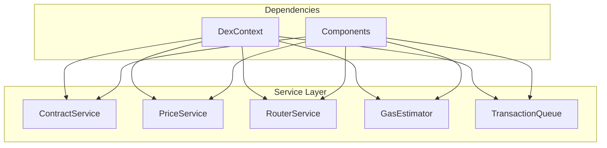

# Service Documentation

Complete documentation for DEX frontend services.

## Table of Contents

- [Overview](#overview)
- [ContractService](#contractservice)
- [PriceService](#priceservice)
- [RouterService](#routerservice)
- [GasEstimator](#gasestimator)
- [TransactionQueue](#transactionqueue)

---

## Overview

### Service Architecture

The DEX service layer follows a layered architecture:



### Design Principles

1. **Separation of Concerns**: Each service has a single responsibility
2. **Type Safety**: Full TypeScript coverage
3. **Error Handling**: Comprehensive error handling and user-friendly messages
4. **Caching**: Strategic caching for performance
5. **Event-Driven**: Event-based architecture for real-time updates
6. **Testability**: Easy to test with dependency injection

---

## ContractService

Service for interacting with smart contracts.

**File**: [`ContractService.ts`](ContractService.ts)

### Purpose

Handles all direct interactions with DEX smart contracts:
- Contract initialization and management
- Token operations (balance, approval, transfer)
- Pool operations (creation, information)
- Swap operations (execution, quotes)
- Liquidity operations (add, remove)
- Event listening and management

### Constructor

```typescript
constructor(provider: ethers.Provider, signer?: ethers.Signer | null)
```

**Parameters:**
- `provider`: Ethers provider for blockchain interaction
- `signer`: Optional signer for write operations

**Throws:** None

**Example:**
```typescript
const contractService = new ContractService(provider, signer);
await contractService.initialize(factoryAddress, routerAddress);
```

### Methods

#### initialize

Initializes the service with factory and router addresses.

```typescript
async initialize(factoryAddress: string, routerAddress: string): Promise<void>
```

**Parameters:**
- `factoryAddress`: Address of the factory contract
- `routerAddress`: Address of the router contract

**Returns:** `Promise<void>`

**Throws:**
- `Error`: If initialization fails

**Side Effects:**
- Creates factory contract instance
- Creates router contract instance
- Sets up contract caches

**Example:**
```typescript
await contractService.initialize(
  '0x...',
  '0x...'
);
```

#### setSigner

Sets the signer for write operations.

```typescript
setSigner(signer: ethers.Signer): void
```

**Parameters:**
- `signer`: Ethers signer for write operations

**Returns:** `void`

**Side Effects:**
- Updates factory contract with new signer
- Updates router contract with new signer
- Recreates all cached contracts with new signer

**Example:**
```typescript
const provider = new ethers.BrowserProvider(window.ethereum);
const signer = await provider.getSigner();
contractService.setSigner(signer);
```

#### getTokenInfo

Gets token information from the blockchain.

```typescript
async getTokenInfo(tokenAddress: string): Promise<Token>
```

**Parameters:**
- `tokenAddress`: Address of the token to query

**Returns:** `Promise<Token>` - Token information object

**Token Interface:**
```typescript
interface Token {
  address: string;
  name: string;
  symbol: string;
  decimals: number;
  totalSupply: string;
}
```

**Throws:**
- `Error`: If token address is invalid
- `Error`: If contract call fails

**Side Effects:**
- Caches token contract instance
- Caches token information

**Example:**
```typescript
const token = await contractService.getTokenInfo('0x...');
console.log('Token:', token.name, token.symbol);
```

#### getTokenBalance

Gets the balance of a token for an address.

```typescript
async getTokenBalance(tokenAddress: string, accountAddress: string): Promise<string>
```

**Parameters:**
- `tokenAddress`: Address of the token to query
- `accountAddress`: Address to check balance for

**Returns:** `Promise<string>` - Token balance as a string

**Throws:**
- `Error`: If addresses are invalid
- `Error`: If contract call fails

**Example:**
```typescript
const balance = await contractService.getTokenBalance(
  '0x...',
  userAddress
);
console.log('Balance:', balance);
```

#### approveToken

Approves a token for spending by a specific address.

```typescript
async approveToken(
  tokenAddress: string,
  spenderAddress: string,
  amount: string
): Promise<ethers.ContractTransactionReceipt>
```

**Parameters:**
- `tokenAddress`: Address of the token to approve
- `spenderAddress`: Address to approve for spending
- `amount`: Amount to approve (as a string)

**Returns:** `Promise<ContractTransactionReceipt>` - Transaction receipt

**Throws:**
- `Error`: If signer is not set
- `Error`: If approval fails

**Gas Estimate:** ~45,000 gas

**Side Effects:**
- Emits Approval event on token contract
- Updates allowance cache if implemented

**Example:**
```typescript
const receipt = await contractService.approveToken(
  '0x...',
  '0x...', // Router address
  '1000000000000000000000' // 100 tokens with 18 decimals
);
console.log('Approval hash:', receipt.hash);
```

#### getTokenAllowance

Checks the allowance of a token for a spender.

```typescript
async getTokenAllowance(
  tokenAddress: string,
  ownerAddress: string,
  spenderAddress: string
): Promise<string>
```

**Parameters:**
- `tokenAddress`: Address of the token
- `ownerAddress`: Address of the token owner
- `spenderAddress`: Address to check allowance for

**Returns:** `Promise<string>` - Current allowance as a string

**Throws:**
- `Error`: If addresses are invalid
- `Error`: If contract call fails

**Example:**
```typescript
const allowance = await contractService.getTokenAllowance(
  '0x...',
  userAddress,
  routerAddress
);
console.log('Allowance:', allowance);
```

#### createPool

Creates a new trading pool for two tokens.

```typescript
async createPool(
  tokenAAddress: string,
  tokenBAddress: string
): Promise<string>
```

**Parameters:**
- `tokenAAddress`: Address of the first token
- `tokenBAddress`: Address of the second token

**Returns:** `Promise<string>` - Address of the created pool

**Throws:**
- `Error`: If factory or signer is not initialized
- `Error`: If pool creation fails

**Gas Estimate:** ~150,000 gas

**Side Effects:**
- Emits PairCreated event
- Stores pool address in factory mapping

**Example:**
```typescript
const poolAddress = await contractService.createPool(
  '0x...', // Token A
  '0x...'  // Token B
);
console.log('Pool created:', poolAddress);
```

#### getPairAddress

Gets the address of a pool for two tokens.

```typescript
async getPairAddress(
  tokenAAddress: string,
  tokenBAddress: string
): Promise<string>
```

**Parameters:**
- `tokenAAddress`: Address of the first token
- `tokenBAddress`: Address of the second token

**Returns:** `Promise<string>` - Pool address, or zero address if not exists

**Throws:**
- `Error`: If factory is not initialized
- `Error`: If contract call fails

**Example:**
```typescript
const pairAddress = await contractService.getPairAddress(
  '0x...',
  '0x...'
);
if (pairAddress === ethers.ZeroAddress) {
  console.log('Pair does not exist');
}
```

#### calculatePairAddress

Calculates the expected pair address using CREATE2.

```typescript
async calculatePairAddress(
  factoryAddress: string,
  tokenAAddress: string,
  tokenBAddress: string
): Promise<string>
```

**Parameters:**
- `factoryAddress`: Address of the factory contract
- `tokenAAddress`: Address of the first token
- `tokenBAddress`: Address of the second token

**Returns:** `Promise<string>` - Calculated pair address

**Throws:**
- `Error`: If addresses are invalid

**Algorithm:**
1. Sort token addresses
2. Calculate salt using keccak256 of sorted addresses
3. Use ethers.getCreate2Address with factory address, salt, and init code hash

**Example:**
```typescript
const expectedAddress = await contractService.calculatePairAddress(
  factoryAddress,
  tokenA.address,
  tokenB.address
);
console.log('Expected pair address:', expectedAddress);
```

#### getPoolInfo

Gets detailed information about a pool.

```typescript
async getPoolInfo(pairAddress: string): Promise<Pool>
```

**Parameters:**
- `pairAddress`: Address of the pool

**Returns:** `Promise<Pool>` - Pool information object

**Pool Interface:**
```typescript
interface Pool {
  address: string;
  tokenA: Token;
  tokenB: Token;
  reserve0: string;
  reserve1: string;
  totalSupply: string;
  tvl: number;
  volume24h: number;
  apy: number;
  fee: number;
  price0: number;
  price1: number;
}
```

**Throws:**
- `Error`: If pair address is invalid
- `Error`: If contract calls fail

**Side Effects:**
- Fetches token information for both tokens
- Fetches pool reserves and total supply
- Calculates prices, TVL, and APY

**Example:**
```typescript
const pool = await contractService.getPoolInfo('0x...');
console.log('Pool:', pool.tokenA.symbol, '/', pool.tokenB.symbol);
console.log('TVL:', pool.tvl);
```

#### addLiquidity

Adds liquidity to a pool.

```typescript
async addLiquidity(
  tokenAAddress: string,
  tokenBAddress: string,
  amountA: string,
  amountB: string,
  amountAMin: string,
  amountBMin: string,
  to: string,
  deadline: number
): Promise<ethers.ContractTransactionReceipt>
```

**Parameters:**
- `tokenAAddress`: Address of the first token
- `tokenBAddress`: Address of the second token
- `amountA`: Amount of token A to add
- `amountB`: Amount of token B to add
- `amountAMin`: Minimum amount of token A to add
- `amountBMin`: Minimum amount of token B to add
- `to`: Address to receive LP tokens
- `deadline`: Transaction deadline (Unix timestamp)

**Returns:** `Promise<ContractTransactionReceipt>` - Transaction receipt

**Throws:**
- `Error`: If router or signer is not initialized
- `Error`: If add liquidity fails

**Gas Estimate:** ~200,000 - 250,000 gas

**Side Effects:**
- Transfers tokens to pair
- Mints LP tokens to recipient
- Emits Mint event

**Example:**
```typescript
const receipt = await contractService.addLiquidity(
  '0x...', // Token A
  '0x...', // Token B
  '1000000000000000000000', // 100 Token A
  '1000000000000000000000', // 100 Token B
  '950000000000000000000', // Min 95 Token A
  '950000000000000000000', // Min 95 Token B
  userAddress,
  Math.floor(Date.now() / 1000) + 1200 // 20 minutes
);
console.log('Liquidity added:', receipt.hash);
```

#### removeLiquidity

Removes liquidity from a pool.

```typescript
async removeLiquidity(
  tokenAAddress: string,
  tokenBAddress: string,
  liquidity: string,
  amountAMin: string,
  amountBMin: string,
  to: string,
  deadline: number
): Promise<ethers.ContractTransactionReceipt>
```

**Parameters:**
- `tokenAAddress`: Address of the first token
- `tokenBAddress`: Address of the second token
- `liquidity`: Amount of LP tokens to burn
- `amountAMin`: Minimum amount of token A to receive
- `amountBMin`: Minimum amount of token B to receive
- `to`: Address to receive underlying tokens
- `deadline`: Transaction deadline (Unix timestamp)

**Returns:** `Promise<ContractTransactionReceipt>` - Transaction receipt

**Throws:**
- `Error`: If router or signer is not initialized
- `Error`: If remove liquidity fails

**Gas Estimate:** ~150,000 - 200,000 gas

**Side Effects:**
- Burns LP tokens from sender
- Transfers underlying tokens to recipient
- Emits Burn event

**Example:**
```typescript
const receipt = await contractService.removeLiquidity(
  '0x...', // Token A
  '0x...', // Token B
  '1000000000000000000000', // 10 LP tokens
  '900000000000000000000', // Min 9 Token A
  '900000000000000000000', // Min 9 Token B
  userAddress,
  Math.floor(Date.now() / 1000) + 1200
);
console.log('Liquidity removed:', receipt.hash);
```

#### swapExactTokensForTokens

Swaps an exact amount of input tokens for as many output tokens as possible.

```typescript
async swapExactTokensForTokens(
  amountIn: string,
  amountOutMin: string,
  path: string[],
  to: string,
  deadline: number
): Promise<ethers.ContractTransactionReceipt>
```

**Parameters:**
- `amountIn`: Exact amount of input tokens to swap
- `amountOutMin`: Minimum amount of output tokens to receive
- `path`: Array of token addresses for the swap route
- `to`: Address to receive output tokens
- `deadline`: Transaction deadline (Unix timestamp)

**Returns:** `Promise<ContractTransactionReceipt>` - Transaction receipt

**Throws:**
- `Error`: If router or signer is not initialized
- `Error`: If swap fails

**Gas Estimate:** ~150,000 - 300,000 gas (depends on path length)

**Side Effects:**
- Executes swap through router
- Emits Swap events from pairs
- Transfers tokens to recipient

**Example:**
```typescript
const receipt = await contractService.swapExactTokensForTokens(
  '1000000000000000000000', // 100 Token A
  '950000000000000000000', // Min 95 Token B
  ['0x...', '0x...'], // Token A -> Token B
  userAddress,
  Math.floor(Date.now() / 1000) + 1200
);
console.log('Swap executed:', receipt.hash);
```

#### swapTokensForExactTokens

Swaps as few input tokens as possible for an exact amount of output tokens.

```typescript
async swapTokensForExactTokens(
  amountOut: string,
  amountInMax: string,
  path: string[],
  to: string,
  deadline: number
): Promise<ethers.ContractTransactionReceipt>
```

**Parameters:**
- `amountOut`: Exact amount of output tokens to receive
- `amountInMax`: Maximum amount of input tokens to spend
- `path`: Array of token addresses for the swap route
- `to`: Address to receive output tokens
- `deadline`: Transaction deadline (Unix timestamp)

**Returns:** `Promise<ContractTransactionReceipt>` - Transaction receipt

**Throws:**
- `Error`: If router or signer is not initialized
- `Error`: If swap fails

**Gas Estimate:** ~150,000 - 300,000 gas

**Example:**
```typescript
const receipt = await contractService.swapTokensForExactTokens(
  '1000000000000000000000', // 100 Token B
  '1050000000000000000000', // Max 105 Token A
  ['0x...', '0x...'], // Token A -> Token B
  userAddress,
  Math.floor(Date.now() / 1000) + 1200
);
console.log('Swap executed:', receipt.hash);
```

#### getAmountsOut

Calculates the output amounts for a given input amount and path.

```typescript
async getAmountsOut(amountIn: string, path: string[]): Promise<string[]>
```

**Parameters:**
- `amountIn`: Input amount
- `path`: Array of token addresses for the swap route

**Returns:** `Promise<string[]>` - Array of output amounts for each step

**Throws:**
- `Error`: If router is not initialized
- `Error`: If calculation fails

**Example:**
```typescript
const amounts = await contractService.getAmountsOut(
  '1000000000000000000000',
  ['0x...', '0x...']
);
console.log('Output:', amounts[amounts.length - 1]);
```

#### getAmountsIn

Calculates the input amounts for a given output amount and path.

```typescript
async getAmountsIn(amountOut: string, path: string[]): Promise<string[]>
```

**Parameters:**
- `amountOut`: Desired output amount
- `path`: Array of token addresses for the swap route

**Returns:** `Promise<string[]>` - Array of input amounts for each step

**Throws:**
- `Error`: If router is not initialized
- `Error`: If calculation fails

**Example:**
```typescript
const amounts = await contractService.getAmountsIn(
  '1000000000000000000000',
  ['0x...', '0x...']
);
console.log('Input:', amounts[0]);
```

#### listenToSwaps

Listens to swap events from a pair.

```typescript
listenToSwaps(pairAddress: string, callback: (event: any) => void): void
```

**Parameters:**
- `pairAddress`: Address of the pair to listen to
- `callback`: Function to call on swap events

**Returns:** `void`

**Side Effects:**
- Sets up event listener on pair contract
- Stores listener for cleanup

**Example:**
```typescript
contractService.listenToSwaps('0x...', (event) => {
  console.log('Swap occurred:', event);
});
```

#### listenToMints

Listens to mint events from a pair.

```typescript
listenToMints(pairAddress: string, callback: (event: any) => void): void
```

**Parameters:**
- `pairAddress`: Address of the pair to listen to
- `callback`: Function to call on mint events

**Returns:** `void`

**Side Effects:**
- Sets up event listener on pair contract
- Stores listener for cleanup

**Example:**
```typescript
contractService.listenToMints('0x...', (event) => {
  console.log('Liquidity added:', event);
});
```

#### listenToBurns

Listens to burn events from a pair.

```typescript
listenToBurns(pairAddress: string, callback: (event: any) => void): void
```

**Parameters:**
- `pairAddress`: Address of the pair to listen to
- `callback`: Function to call on burn events

**Returns:** `void`

**Side Effects:**
- Sets up event listener on pair contract
- Stores listener for cleanup

**Example:**
```typescript
contractService.listenToBurns('0x...', (event) => {
  console.log('Liquidity removed:', event);
});
```

#### removeListeners

Removes all event listeners for a specific pair.

```typescript
removeListeners(pairAddress: string): void
```

**Parameters:**
- `pairAddress`: Address of the pair to remove listeners for

**Returns:** `void`

**Side Effects:**
- Removes all event listeners for the pair
- Removes pair contract from cache

**Example:**
```typescript
contractService.removeListeners('0x...');
```

#### cleanup

Cleans up all listeners and contracts.

```typescript
cleanup(): void
```

**Returns:** `void`

**Side Effects:**
- Removes all event listeners from all pairs
- Clears all cached contracts
- Resets internal state

**Example:**
```typescript
contractService.cleanup();
```

---

## PriceService

Service for calculating prices and metrics.

**File**: [`PriceService.ts`](PriceService.ts)

### Purpose

Handles all price-related calculations:
- Pool price calculation from reserves
- TVL (Total Value Locked) calculation
- APY (Annual Percentage Yield) calculation
- Price impact calculation for swaps
- TWAP (Time-Weighted Average Price) calculation
- Price caching for performance

### Constructor

```typescript
constructor(provider: ethers.Provider)
```

**Parameters:**
- `provider`: Ethers provider for blockchain interaction

**Throws:** None

**Example:**
```typescript
const priceService = new PriceService(provider);
```

### Methods

#### calculatePoolPrice

Calculates the price of token0 in terms of token1 from pool reserves.

```typescript
calculatePoolPrice(
  reserve0: string,
  reserve1: string,
  decimals0: number,
  decimals1: number
): number
```

**Parameters:**
- `reserve0`: Reserve of token0 as a string
- `reserve1`: Reserve of token1 as a string
- `decimals0`: Number of decimals for token0
- `decimals1`: Number of decimals for token1

**Returns:** `number` - Price of token0 in terms of token1

**Formula:**
```
price = reserve1 / reserve0
```

**Example:**
```typescript
const price = priceService.calculatePoolPrice(
  '10000000000000000000000', // 100 Token0
  '20000000000000000000000', // 200 Token1
  18,
  18
);
// Returns: 2.0 (1 Token0 = 2 Token1)
```

#### calculateTVL

Calculates the Total Value Locked in a pool.

```typescript
calculateTVL(pool: Pool, tokenPrices: Map<string, number>): number
```

**Parameters:**
- `pool`: Pool information including reserves and token details
- `tokenPrices`: Map of token addresses to prices in USD

**Returns:** `number` - TVL in USD

**Formula:**
```
TVL = (amount0 * price0) + (amount1 * price1)
```

**Example:**
```typescript
const tokenPrices = new Map([
  ['0x...', 1.0], // Token A price
  ['0x...', 1.0], // Token B price
]);

const tvl = priceService.calculateTVL(pool, tokenPrices);
// Returns: 300 (100 * 1.0 + 200 * 1.0)
```

#### calculateAPY

Calculates the Annual Percentage Yield for a pool.

```typescript
calculateAPY(pool: Pool, tokenPrices: Map<string, number>): number
```

**Parameters:**
- `pool`: Pool information including volume and TVL
- `tokenPrices`: Map of token addresses to prices in USD

**Returns:** `number` - APY as a percentage

**Formula:**
```
dailyFees = volume24h * fee
yearlyFees = dailyFees * 365
APY = (yearlyFees / TVL) * 100
```

**Example:**
```typescript
const apy = priceService.calculateAPY(pool, tokenPrices);
// Returns: 15.5 (15.5% annual return)
```

#### calculatePriceImpact

Calculates the price impact of a swap.

```typescript
calculatePriceImpact(
  amountIn: string,
  amountOut: string,
  reserveIn: string,
  reserveOut: string,
  decimalsIn: number,
  decimalsOut: number
): number
```

**Parameters:**
- `amountIn`: Input amount
- `amountOut`: Output amount
- `reserveIn`: Reserve of input token
- `reserveOut`: Reserve of output token
- `decimalsIn`: Decimals of input token
- `decimalsOut`: Decimals of output token

**Returns:** `number` - Price impact as a percentage

**Formula:**
```
expectedOutput = (amountOut * reserveIn) / (reserveIn + amountIn)
priceImpact = ((amountOut - expectedOutput) / amountOut) * 100
```

**Example:**
```typescript
const priceImpact = priceService.calculatePriceImpact(
  '1000000000000000000000', // 100 in
  '1950000000000000000000', // 195 out
  '10000000000000000000000', // 1000 reserve in
  '20000000000000000000000', // 2000 reserve out
  18,
  18
);
// Returns: 2.5 (2.5% price impact)
```

#### calculateTWAP

Calculates the Time-Weighted Average Price.

```typescript
calculateTWAP(
  price0CumulativeLast: string,
  price1CumulativeLast: string,
  blockTimestampLast: number,
  currentTimestamp: number
): { price0: number; price1: number }
```

**Parameters:**
- `price0CumulativeLast`: Cumulative price of token0
- `price1CumulativeLast`: Cumulative price of token1
- `blockTimestampLast`: Timestamp of the last block
- `currentTimestamp`: Current timestamp

**Returns:** `{ price0: number; price1: number }` - TWAP prices

**Formula:**
```
timeElapsed = currentTimestamp - blockTimestampLast
price0 = price0CumulativeLast / timeElapsed
price1 = price1CumulativeLast / timeElapsed
```

**Example:**
```typescript
const twap = priceService.calculateTWAP(
  '1000000000000000000000000000000000000',
  '2000000000000000000000000000000000000',
  1700000000,
  1700000030
);
// Returns: { price0: 1.0, price1: 2.0 }
```

#### getPoolPrice

Gets the price, TVL, and APY for a pool with caching.

```typescript
async getPoolPrice(pool: Pool): Promise<{
  price0: number;
  price1: number;
  tvl: number;
  apy: number;
}>
```

**Parameters:**
- `pool`: Pool information

**Returns:** `Promise<{ price0: number; price1: number; tvl: number; apy: number }>` - Pool metrics

**Side Effects:**
- Caches result for 30 seconds
- Updates cache timestamp

**Example:**
```typescript
const { price0, price1, tvl, apy } = await priceService.getPoolPrice(pool);
console.log('Price0:', price0);
console.log('TVL:', tvl);
console.log('APY:', apy);
```

#### getTokenPrice

Gets the price of a token from a pool.

```typescript
async getTokenPrice(token: Token, pool: Pool): Promise<number>
```

**Parameters:**
- `token`: Token to get price for
- `pool`: Pool containing the token

**Returns:** `Promise<number>` - Token price

**Example:**
```typescript
const price = await priceService.getTokenPrice(token, pool);
console.log('Token price:', price);
```

#### getSwapPriceImpact

Gets the price impact for a swap.

```typescript
async getSwapPriceImpact(
  amountIn: string,
  tokenIn: Token,
  tokenOut: Token,
  pool: Pool
): Promise<number>
```

**Parameters:**
- `amountIn`: Input amount
- `tokenIn`: Input token
- `tokenOut`: Output token
- `pool`: Pool to use for calculation

**Returns:** `Promise<number>` - Price impact as a percentage

**Example:**
```typescript
const priceImpact = await priceService.getSwapPriceImpact(
  '1000000000000000000000',
  tokenA,
  tokenB,
  pool
);
console.log('Price impact:', priceImpact);
```

#### cacheTokenPrice

Caches a token price with a TTL.

```typescript
cacheTokenPrice(
  tokenAddress: string,
  price: number,
  ttl?: number
): void
```

**Parameters:**
- `tokenAddress`: Address of the token
- `price`: Price to cache
- `ttl`: Time to live in milliseconds (default: 30000)

**Returns:** `void`

**Side Effects:**
- Stores price in cache
- Sets cache timestamp

**Example:**
```typescript
priceService.cacheTokenPrice('0x...', 1.5, 60000); // Cache for 1 minute
```

#### getCachedTokenPrice

Gets a cached token price if available and not expired.

```typescript
getCachedTokenPrice(tokenAddress: string): number | null
```

**Parameters:**
- `tokenAddress`: Address of the token

**Returns:** `number | null` - Cached price or null if not found/expired

**Example:**
```typescript
const price = priceService.getCachedTokenPrice('0x...');
if (price !== null) {
  console.log('Cached price:', price);
}
```

#### clearTokenPriceCache

Clears the price cache for a specific token.

```typescript
clearTokenPriceCache(tokenAddress: string): void
```

**Parameters:**
- `tokenAddress`: Address of the token to clear cache for

**Returns:** `void`

**Example:**
```typescript
priceService.clearTokenPriceCache('0x...');
```

#### clearAllCaches

Clears all price caches.

```typescript
clearAllCaches(): void
```

**Returns:** `void`

**Example:**
```typescript
priceService.clearAllCaches();
```

#### formatPrice

Formats a price for display.

```typescript
formatPrice(price: number, decimals?: number): string
```

**Parameters:**
- `price`: Price to format
- `decimals`: Number of decimal places (default: 6)

**Returns:** `string` - Formatted price string

**Example:**
```typescript
const formatted = priceService.formatPrice(2.567890123, 6);
// Returns: "2.567890"
```

#### formatTVL

Formats TVL for display.

```typescript
formatTVL(tvl: number): string
```

**Parameters:**
- `tvl`: TVL to format

**Returns:** `string` - Formatted TVL string (e.g., "$1.5M")

**Example:**
```typescript
const formatted = priceService.formatTVL(1500000);
// Returns: "$1.50M"
```

#### formatAPY

Formats APY for display.

```typescript
formatAPY(apy: number): string
```

**Parameters:**
- `apy`: APY to format

**Returns:** `string` - Formatted APY string (e.g., "15.50%")

**Example:**
```typescript
const formatted = priceService.formatAPY(15.5);
// Returns: "15.50%"
```

---

## RouterService

Service for handling swap routing and quotes.

**File**: [`RouterService.ts`](RouterService.ts)

### Purpose

Handles all swap routing and liquidity operations:
- Swap quote calculation (direct and multi-hop)
- Swap execution
- Liquidity quote calculation
- Liquidity addition and removal quotes
- Parameter validation

### Constructor

```typescript
constructor(
  contractService: ContractService,
  priceService: PriceService,
  routerAddress: string,
  dcTokenAddress: string
)
```

**Parameters:**
- `contractService`: Contract service instance
- `priceService`: Price service instance
- `routerAddress`: Address of the router contract
- `dcTokenAddress`: Address of the DC token

**Throws:** None

**Example:**
```typescript
const routerService = new RouterService(
  contractService,
  priceService,
  '0x...', // Router address
  '0x...'  // DC token address
);
```

### Methods

#### getDirectSwapQuote

Gets a quote for a direct swap between two tokens.

```typescript
async getDirectSwapQuote(
  tokenIn: Token,
  tokenOut: Token,
  amountIn: string,
  pool: Pool
): Promise<SwapQuote>
```

**Parameters:**
- `tokenIn`: Input token
- `tokenOut`: Output token
- `amountIn`: Input amount
- `pool`: Pool to use for the swap

**Returns:** `Promise<SwapQuote>` - Swap quote information

**SwapQuote Interface:**
```typescript
interface SwapQuote {
  route: string[];
  amountIn: string;
  amountOut: string;
  priceImpact: number;
  gasEstimate: string;
  path: string[];
}
```

**Throws:**
- `Error`: If quote calculation fails

**Example:**
```typescript
const quote = await routerService.getDirectSwapQuote(
  tokenA,
  tokenB,
  '1000000000000000000000',
  pool
);
console.log('Quote:', quote);
```

#### getMultiHopSwapQuote

Gets a quote for a multi-hop swap through DC.

```typescript
async getMultiHopSwapQuote(
  tokenIn: Token,
  tokenOut: Token,
  amountIn: string,
  poolIn: Pool,
  poolOut: Pool
): Promise<SwapQuote>
```

**Parameters:**
- `tokenIn`: Input token
- `tokenOut`: Output token
- `amountIn`: Input amount
- `poolIn`: First pool in the route (tokenIn -> DC)
- `poolOut`: Second pool in the route (DC -> tokenOut)

**Returns:** `Promise<SwapQuote>` - Swap quote information

**Throws:**
- `Error`: If quote calculation fails

**Example:**
```typescript
const quote = await routerService.getMultiHopSwapQuote(
  tokenA,
  tokenC,
  '1000000000000000000000',
  poolAB,
  poolBC
);
console.log('Quote:', quote);
```

#### getBestSwapQuote

Gets the best swap quote (direct or multi-hop).

```typescript
async getBestSwapQuote(
  tokenIn: Token,
  tokenOut: Token,
  amountIn: string,
  pools: Pool[]
): Promise<SwapQuote>
```

**Parameters:**
- `tokenIn`: Input token
- `tokenOut`: Output token
- `amountIn`: Input amount
- `pools`: Available pools to find routes

**Returns:** `Promise<SwapQuote>` - Best swap quote

**Algorithm:**
1. Check if direct pool exists
2. If yes, use direct quote
3. If no, check if multi-hop through DC is possible
4. Return the quote with lowest price impact

**Throws:**
- `Error`: If no valid route is found

**Example:**
```typescript
const quote = await routerService.getBestSwapQuote(
  tokenA,
  tokenB,
  '1000000000000000000000',
  pools
);
console.log('Best quote:', quote);
```

#### executeSwap

Executes a swap.

```typescript
async executeSwap(
  tokenIn: Token,
  tokenOut: Token,
  amountIn: string,
  amountOutMin: string,
  slippage: number,
  deadline: number
): Promise<ethers.ContractTransactionReceipt>
```

**Parameters:**
- `tokenIn`: Input token
- `tokenOut`: Output token
- `amountIn`: Input amount
- `amountOutMin`: Minimum output amount (slippage protection)
- `slippage`: Slippage tolerance percentage
- `deadline`: Transaction deadline (Unix timestamp)

**Returns:** `Promise<ContractTransactionReceipt>` - Transaction receipt

**Throws:**
- `Error`: If swap execution fails

**Example:**
```typescript
const receipt = await routerService.executeSwap(
  tokenA,
  tokenB,
  '1000000000000000000000',
  '950000000000000000000', // 5% slippage
  0.5, // 0.5% slippage
  Math.floor(Date.now() / 1000) + 1200
);
console.log('Swap executed:', receipt.hash);
```

#### getOptimalLiquidityAmounts

Calculates optimal amounts for adding liquidity.

```typescript
async getOptimalLiquidityAmounts(
  tokenA: Token,
  tokenB: Token,
  amountA: string,
  pool: Pool
): Promise<{ amountA: string; amountB: string }>
```

**Parameters:**
- `tokenA`: First token
- `tokenB`: Second token
- `amountA`: Amount of token A
- `pool`: Pool to use for calculation

**Returns:** `Promise<{ amountA: string; amountB: string }>` - Optimal amounts

**Formula:**
```
amountB = (amountA * reserveB) / reserveA
```

**Example:**
```typescript
const { amountA, amountB } = await routerService.getOptimalLiquidityAmounts(
  tokenA,
  tokenB,
  '1000000000000000000000',
  pool
);
console.log('Optimal amounts:', { amountA, amountB });
```

#### getLiquidityQuote

Gets a quote for adding liquidity.

```typescript
async getLiquidityQuote(
  tokenA: Token,
  tokenB: Token,
  amountA: string,
  amountB: string,
  pool: Pool
): Promise<LiquidityQuote>
```

**Parameters:**
- `tokenA`: First token
- `tokenB`: Second token
- `amountA`: Amount of token A
- `amountB`: Amount of token B
- `pool`: Pool to use for calculation

**Returns:** `Promise<LiquidityQuote>` - Liquidity quote information

**LiquidityQuote Interface:**
```typescript
interface LiquidityQuote {
  amountA: string;
  amountB: string;
  liquidity: string;
  share: number;
}
```

**Example:**
```typescript
const quote = await routerService.getLiquidityQuote(
  tokenA,
  tokenB,
  '1000000000000000000000',
  '1000000000000000000000',
  pool
);
console.log('Liquidity quote:', quote);
```

#### getRemoveLiquidityQuote

Gets a quote for removing liquidity.

```typescript
async getRemoveLiquidityQuote(
  liquidityAmount: string,
  pool: Pool
): Promise<{ amountA: string; amountB: string }>
```

**Parameters:**
- `liquidityAmount`: Amount of LP tokens to burn
- `pool`: Pool to use for calculation

**Returns:** `Promise<{ amountA: string; amountB: string }>` - Token amounts to receive

**Formula:**
```
amountA = (liquidity * reserve0) / totalSupply
amountB = (liquidity * reserve1) / totalSupply
```

**Example:**
```typescript
const { amountA, amountB } = await routerService.getRemoveLiquidityQuote(
  '1000000000000000000000',
  pool
);
console.log('Receive amounts:', { amountA, amountB });
```

#### validateSwapParams

Validates swap parameters.

```typescript
validateSwapParams(
  tokenIn: Token,
  tokenOut: Token,
  amountIn: string,
  slippage: number,
  deadline: number
): { valid: boolean; error?: string }
```

**Parameters:**
- `tokenIn`: Input token
- `tokenOut`: Output token
- `amountIn`: Input amount
- `slippage`: Slippage tolerance
- `deadline`: Transaction deadline

**Returns:** `{ valid: boolean; error?: string }` - Validation result

**Validations:**
- Tokens are not the same
- Amount is valid and positive
- Slippage is within valid range (0-50%)
- Deadline is in the future

**Example:**
```typescript
const { valid, error } = routerService.validateSwapParams(
  tokenA,
  tokenB,
  '1000000000000000000000',
  0.5,
  Math.floor(Date.now() / 1000) + 1200
);
if (!valid) {
  console.error('Validation error:', error);
}
```

---

## GasEstimator

Service for estimating gas costs and fees.

**File**: [`GasEstimator.ts`](GasEstimator.ts)

### Purpose

Handles all gas-related operations:
- Gas price fetching with caching
- Gas estimation for different operations
- Gas cost calculation in ETH and USD
- Gas price formatting for display
- Confirmation time estimation

### Constructor

```typescript
constructor(provider: ethers.Provider)
```

**Parameters:**
- `provider`: Ethers provider for blockchain interaction

**Throws:** None

**Example:**
```typescript
const gasEstimator = new GasEstimator(provider);
```

### Methods

#### getGasPrice

Gets the current gas price with caching.

```typescript
async getGasPrice(): Promise<string>
```

**Returns:** `Promise<string>` - Current gas price in wei

**Cache TTL:** 60 seconds

**Throws:** None

**Example:**
```typescript
const gasPrice = await gasEstimator.getGasPrice();
console.log('Gas price:', gasPrice);
```

#### getGasPriceGwei

Gets the current gas price in gwei.

```typescript
async getGasPriceGwei(): Promise<number>
```

**Returns:** `Promise<number>` - Gas price in gwei

**Example:**
```typescript
const gasPriceGwei = await gasEstimator.getGasPriceGwei();
console.log('Gas price:', gasPriceGwei, 'gwei');
```

#### getGasPrices

Gets gas prices for different speeds.

```typescript
async getGasPrices(): Promise<{
  slow: string;
  average: string;
  fast: string;
}>
```

**Returns:** `Promise<{ slow: string; average: string; fast: string }>` - Gas prices

**Gas Price Levels:**
- **Slow**: 50% of current price
- **Average**: Current price
- **Fast**: 150% of current price

**Example:**
```typescript
const { slow, average, fast } = await gasEstimator.getGasPrices();
console.log('Gas prices:', { slow, average, fast });
```

#### estimateSwapGas

Estimates gas for a swap operation.

```typescript
async estimateSwapGas(multiHop?: boolean): Promise<GasEstimate>
```

**Parameters:**
- `multiHop`: Whether the swap is multi-hop (default: false)

**Returns:** `Promise<GasEstimate>` - Gas estimate information

**GasEstimate Interface:**
```typescript
interface GasEstimate {
  gasLimit: string;
  gasPrice: string;
  gasCost: string;
  gasCostUSD: number;
  estimatedTime: number;
}
```

**Gas Limits:**
- **Direct swap**: 150,000 gas
- **Multi-hop swap**: 300,000 gas

**Example:**
```typescript
const estimate = await gasEstimator.estimateSwapGas(true);
console.log('Gas estimate:', estimate);
```

#### estimateAddLiquidityGas

Estimates gas for adding liquidity.

```typescript
async estimateAddLiquidityGas(): Promise<GasEstimate>
```

**Returns:** `Promise<GasEstimate>` - Gas estimate information

**Gas Limit:** 250,000 gas

**Example:**
```typescript
const estimate = await gasEstimator.estimateAddLiquidityGas();
console.log('Gas estimate:', estimate);
```

#### estimateRemoveLiquidityGas

Estimates gas for removing liquidity.

```typescript
async estimateRemoveLiquidityGas(): Promise<GasEstimate>
```

**Returns:** `Promise<GasEstimate>` - Gas estimate information

**Gas Limit:** 200,000 gas

**Example:**
```typescript
const estimate = await gasEstimator.estimateRemoveLiquidityGas();
console.log('Gas estimate:', estimate);
```

#### formatGasEstimate

Formats a gas estimate for display.

```typescript
formatGasEstimate(estimate: GasEstimate): {
  gasLimit: string;
  gasPrice: string;
  gasCost: string;
  gasCostUSD: string;
  estimatedTime: string;
}
```

**Parameters:**
- `estimate`: Gas estimate to format

**Returns:** Formatted gas estimate object

**Example:**
```typescript
const formatted = gasEstimator.formatGasEstimate(estimate);
console.log('Formatted:', formatted);
// Returns: { gasLimit: "200K", gasPrice: "10.00 gwei", gasCost: "0.002 ETH", gasCostUSD: "$0.50", estimatedTime: "1m" }
```

---

## TransactionQueue

Service for managing transaction lifecycle.

**File**: [`TransactionQueue.ts`](TransactionQueue.ts)

### Purpose

Handles all transaction management:
- Transaction queuing and tracking
- Status updates (pending, confirmed, failed, cancelled)
- Speed up and cancel operations
- Persistence to localStorage
- Event notifications for transaction updates
- Transaction statistics

### Constructor

```typescript
constructor(provider: ethers.Provider, storageKey?: string)
```

**Parameters:**
- `provider`: Ethers provider for blockchain interaction
- `storageKey`: LocalStorage key (default: 'dex_transaction_queue')

**Throws:** None

**Example:**
```typescript
const transactionQueue = new TransactionQueue(provider);
```

### Methods

#### addTransaction

Adds a transaction to the queue.

```typescript
addTransaction(
  transaction: Omit<QueuedTransaction, 'id' | 'timestamp' | 'status'>
): QueuedTransaction
```

**Parameters:**
- `transaction`: Transaction to add (without id, timestamp, status)

**Returns:** `QueuedTransaction` - Added transaction with generated id and timestamp

**Side Effects:**
- Generates unique transaction ID
- Sets timestamp to current time
- Sets status to 'pending'
- Saves to localStorage
- Starts monitoring if not already running

**Example:**
```typescript
const tx = transactionQueue.addTransaction({
  type: 'swap',
  from: tokenA,
  to: tokenB,
  amountIn: '1000000000000000000000',
  amountOut: '1950000000000000000000',
  gasLimit: '200000',
  gasPrice: '10000000000'
});
console.log('Transaction added:', tx.id);
```

#### updateTransactionStatus

Updates the status of a transaction.

```typescript
updateTransactionStatus(
  txId: string,
  status: TransactionStatus,
  updates?: Partial<QueuedTransaction>
): QueuedTransaction | null
```

**Parameters:**
- `txId`: Transaction ID
- `status`: New transaction status
- `updates`: Optional additional updates

**Returns:** `QueuedTransaction | null` - Updated transaction or null if not found

**Side Effects:**
- Updates transaction status
- Applies additional updates
- Saves to localStorage
- Notifies listeners

**Example:**
```typescript
const updated = transactionQueue.updateTransactionStatus('tx_123', 'confirmed', {
  hash: '0x...',
  confirmations: 1
});
console.log('Transaction updated:', updated);
```

#### getTransaction

Gets a transaction by ID.

```typescript
getTransaction(txId: string): QueuedTransaction | null
```

**Parameters:**
- `txId`: Transaction ID

**Returns:** `QueuedTransaction | null` - Transaction or null if not found

**Example:**
```typescript
const tx = transactionQueue.getTransaction('tx_123');
if (tx) {
  console.log('Transaction:', tx);
}
```

#### getPendingTransactions

Gets all pending transactions.

```typescript
getPendingTransactions(): QueuedTransaction[]
```

**Returns:** `QueuedTransaction[]` - Array of pending transactions

**Example:**
```typescript
const pending = transactionQueue.getPendingTransactions();
console.log('Pending transactions:', pending.length);
```

#### speedUpTransaction

Speeds up a transaction by increasing gas price.

```typescript
async speedUpTransaction(txId: string): Promise<QueuedTransaction | null>
```

**Parameters:**
- `txId`: Transaction ID

**Returns:** `Promise<QueuedTransaction | null>` - Updated transaction or null if not found

**Side Effects:**
- Increases gas price by 10%
- Increments speed up attempts
- Updates status to 'speeding_up'

**Example:**
```typescript
const updated = await transactionQueue.speedUpTransaction('tx_123');
console.log('Transaction sped up:', updated);
```

#### cancelTransaction

Cancels a transaction.

```typescript
async cancelTransaction(txId: string): Promise<QueuedTransaction | null>
```

**Parameters:**
- `txId`: Transaction ID

**Returns:** `Promise<QueuedTransaction | null>` - Updated transaction or null if not found

**Side Effects:**
- Updates status to 'cancelled'
- Increments cancel attempts

**Example:**
```typescript
const cancelled = await transactionQueue.cancelTransaction('tx_123');
console.log('Transaction cancelled:', cancelled);
```

#### getStatistics

Gets transaction statistics.

```typescript
getStatistics(): TransactionStatistics
```

**Returns:** `TransactionStatistics` - Transaction statistics

**TransactionStatistics Interface:**
```typescript
interface TransactionStatistics {
  total: number;
  pending: number;
  confirmed: number;
  failed: number;
  cancelled: number;
  speedingUp: number;
  successRate: number;
  averageConfirmationTime: number;
}
```

**Example:**
```typescript
const stats = transactionQueue.getStatistics();
console.log('Statistics:', stats);
console.log('Success rate:', stats.successRate);
```

---

## Additional Resources

- [DEX API Reference](../../DEX_API_REFERENCE.md)
- [DEX Developer Guide](../../DEX_DEVELOPER_GUIDE.md)
- [Component Documentation](../../components/dex/COMPONENT_DOCUMENTATION.md)

---

**Last Updated:** December 30, 2025
